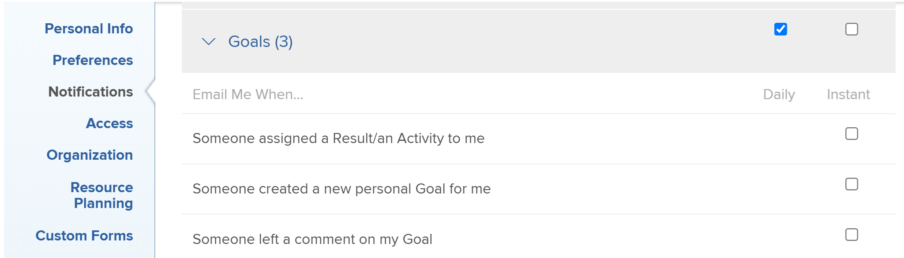

# Notifications: Goals

You can enable your email notifications for events occurring in [!DNL Adobe Workfront Goals] in your profile. A user with a [!UICONTROL Plan] license can also enable them for other users. For information, see [[!DNL Adobe Workfront] notifications](../../workfront-basics/using-notifications/wf-notifications.md).

## Access requirements

<!--

(NOTE: because there are conditions for who sees this, I added this from the How To articles/ template although this is not a How To. But I like the format, so I thought keeping it consistent might help users. We may decide to update this when we have access and prereq for overview-type articles)

-->

You must have the following:

<table style="table-layout:auto"> 
 <col> 
 <col> 
 <tbody> 
  <tr> 
   <td role="rowheader"><strong>[!DNL Adobe Workfront plan*]</strong></td> 
   <td> 
[!UICONTROL Pro] or higher
 </td> 
  </tr> 
  <tr> 
   <td role="rowheader"><strong>[!DNL Adobe Workfront] license*</strong></td> 
   <td> 
[!UICONTROL Request] or higher
 </td> 
  </tr> 
  <tr> 
   <td role="rowheader"><strong>Product</strong></td> 
   <td>[!DNL Workfront Goals] 
For information about [!DNL Workfront Goals], see <a href="../../workfront-goals/goal-management/wf-goals-overview.md" class="MCXref xref">[!DNL Adobe Workfront Goals] overview</a>.
 </td> 
  </tr> 
  <tr> 
   <td role="rowheader"><strong>Access level configurations*</strong></td> 
   <td> 
[!UICONTROL View] access to [!DNL Goals] or higher
 
Note: If you still don't have access, ask your [!DNL Workfront] administrator if they set additional restrictions in your access level. For information on how a [!DNL Workfront] administrator can change your access level, see <a href="../../administration-and-setup/add-users/configure-and-grant-access/create-modify-access-levels.md" class="MCXref xref">Create or modify custom access levels</a>.
 </td> 
  </tr> <!--
   <tr data-mc-conditions="QuicksilverOrClassic.Draft mode"> 
    <td role="rowheader">Object permissions</td> 
    <td> 
[Insert permissions needed]
 
For information on requesting additional access, see <a href="../../workfront-basics/grant-and-request-access-to-objects/request-access.md" class="MCXref xref">Request access to objects </a>.
 </td> 
   </tr>
  --> 
 </tbody> 
</table>

&#42;To find out what plan, license type, or access you have, contact your [!DNL Workfront] administrator.

## Prerequisites

The user whose [!DNL Goals] notifications are updated must have the following:

* A Layout Template that includes the [!DNL Goals] area in the [!UICONTROL Main Menu].
* Access to The new [!DNL Adobe Workfront] experience.

   <!--
  <MadCap:conditionalText data-mc-conditions="QuicksilverOrClassic.Draft mode">
  (NOTE: we need this here because you can see these notifications from Classic)
  </MadCap:conditionalText>
  -->

## [!DNL Goals] notifications in the [!UICONTROL user profile] area

The notifications listed in the following table alert you about events happening in [!DNL Workfront Goals], such as someone assigning you a goal, result, or activity or someone making an update on a goal, result, or activity that you own. For information about configuring which notifications you receive, see [Modify your own email notifications](../../workfront-basics/using-notifications/activate-or-deactivate-your-own-event-notifications.md).

>[!NOTE]
>
>Instant notifications for [!DNL Goals] are disabled by default. You cannot enable or disable daily notifications and you do not receive daily digest emails for the events in this category. You can enable or disable individual instant notifications for the [!DNL Goals] category.

See also [Event notifications](../../workfront-basics/using-notifications/event-notifications.md).

<table style="table-layout:auto"> 
 <col> 
 <col> 
 <tbody> 
  <tr> 
   <td><strong>Notification</strong></td> 
   <td> 
<strong>Fields included</strong> 
 
<strong>*Instant notifications only</strong>
 </td> 
  </tr> 
  <tr> 
   <td><strong>Someone assigned a Result/ an Activity to me</strong></td> 
   <td> 
The name of the person who assigned the result or activity to you
 
The Period of the goal for the result or activity
 
The name of the result or activity
 
The <strong>[!UICONTROL Open in web app]</strong> button which opens the [!UICONTROL Goal Details] panel
 
The <strong>[!UICONTROL Change Notifications Settings]</strong> button which allows you to manage your notifications.
 </td> 
  </tr> 
  <tr> 
   <td><strong>Someone created a new personal Goal for me</strong> </td> 
   <td> 
The name of the person who assigned the goal
 
The Period of the goal
 
The name of the goal
 
The <strong>[!UICONTROL Open in web app]</strong> button which opens the [!UICONTROL Goal Details] panel
 
The <strong>[!UICONTROL Change Notifications Settings]</strong> button which allows you to manage your notifications.
 </td> 
  </tr> 
  <tr> 
   <td><strong>Someone left a comment on my Goal</strong></td> 
   <td> 
The name of the person who left the comment
 
The Period of the goal 
 
The name of the goal
 
The text of the comment
 
The <strong>[!UICONTROL Open in web app]</strong> button which opens the [!UICONTROL Goal Details] panel
 
The <strong>[!UICONTROL Change Notifications Settings]</strong> button which allows you to manage your notifications.
 </td> 
  </tr> 
  <tr> 
   <td><strong>Someone liked my comment on a Goal</strong></td> 
   <td> 
The name of the person who liked the comment
 
The Period of the goal 
 
The name of the goal
 
The text of the comment 
 
The <strong>[!UICONTROL Open in web app]</strong> button which opens the [!UICONTROL Goal Details] panel
 
The <strong>[!UICONTROL Change Notifications Settings]</strong> button which allows you to manage your notifications.
 </td> 
  </tr> 
  <tr> 
   <td><strong>Someone liked an update on my Goal</strong></td> 
   <td> 
You receive an email when someone likes a comment you made on a goal or when you update the progress of your results or activities on the goal. 
 
The name of the person who liked the update
 
The Period of the goal 
 
The name of the goal
 
The <strong>[!UICONTROL Open in web app]</strong> button which opens the [!UICONTROL Goal Details] panel
 
The <strong>[!UICONTROL Change Notifications Settings]</strong> button which allows you to manage your notifications.
 </td> 
  </tr> 
 </tbody> 
</table>

<!--
NOTE FOR NAME OF GOAL IN LAST TABLE CELL: check this. Is this true? Didn't triggger when this was written; add anything else? Maybe the type of the update is mentioned?!
-->
