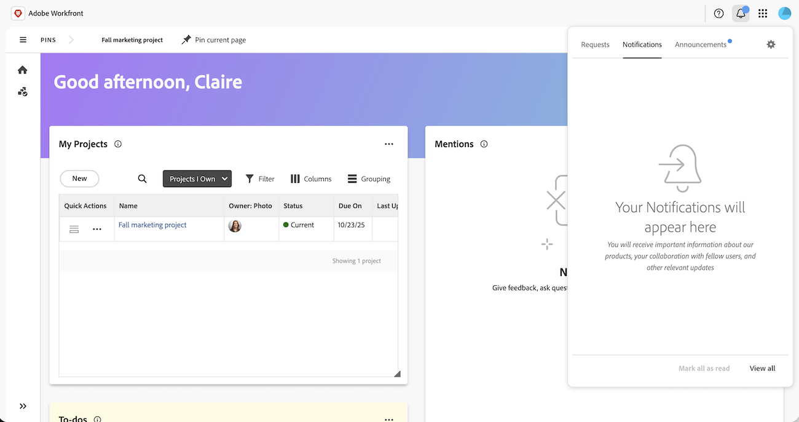

# Pulse Email Notification Overview

Adobe is unifying all digital experiences (DX) products under a single, consistent notification experience called Pulse. Starting in February 2026, existing Workfront customers will begin transitioning from legacy Workfront Notification service to Pulse, Adobe's centralized notification system. 

After migration, customers will see one bell icon for all notifications across Adobe Workfront and other Adobe DX applications - simplifying how they stay informed and manage their preferences.

## View new notificaions in Pulse

## Adjust personal notification settings

## admin controls

## What's Changing

A single bell icon (Pulse) replaces the Workfront notification jewel    

User notification settings are accessed through bell → gear icon   

Notifications are powered by Adobe Post Office (APO) and Adobe Notification System (ANS)   

New filtering and delivery options through Pulse    

*Note: User preferences appear in new locations, under new labels; documentation will help you map them. 

What's Staying the Same

You'll still receive both in-app and email notifications

Existing notification preferences will carry over automatically

Workfront continues to trigger notifications based on your work items

Workfront data and permissions remain unchanged

## FAQ

Q: Will my existing notifications be lost?

A: No. Your historical notifications will remain accessible in Workfront, but new notifications will be sent via Pulse once the transition completes.

Q: Will my users need to do anything?

A: Generally, no. Admins will verify setup; end users will simply notice a single bell icon after the transition to Pulse.

Q: What if my organization isn't ready?

A: Cohorts can be rescheduled in coordination with your account team. However, all customers are required to transition, so earlier adoption is recommended. 

Q: Will this affect Workfront integrations or automations?

A: No. All existing integrations and automations will continue to function as usual. 

## Why We're Making this Change

Workfront is part of Adobe's suite of digital experience products. Moving to Pulse brings several benefits: 

* Unified Notification Experience - One consistent interface across all Adobe DX solutions

* Less Cluttered UI - One bell icon reduces confusion and allows us to streamline more of the global header

* Email and In-App Support - Receive notifications wherever you work
* Filtering Options - Quickly find what matters
* Centralized Authentication - Manage users and entitlements through Workfront and eventually Adobe Admin Console
* Future-Ready Platform - Positions your organization for faster innovation across Adobe tools