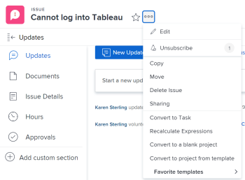
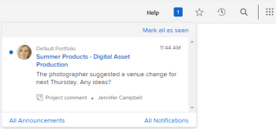
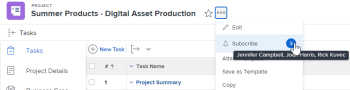

# Subscribe to items in [!DNL Adobe Workfront]

[!UICONTROL Adobe Workfront] sends notifications about items you are assigned to or that you own. If you want to follow the communication on items that are not assigned to you but might impact your work, you can subscribe to them.

You can also keep your manager and peers updated on your work by subscribing them to the Update Status of items to which you have [!UICONTROL Manage] and [!UICONTROL Share] permissions.

Currently, you can subscribe to the following items:

* Issues
* Tasks
* Projects

When you subscribe to issues, tasks, or projects, you receive in-app notifications when someone posts a comment to them. Depending on the features you have enabled, you may also receive email and mobile app push notifications for items you are subscribed to.

>[!NOTE]
>
>You will not be notified for any other events that happen on the item you subscribe to. You will only be notified when someone posts a comment to the item.

For more information about working with subscriptions, see [About working with subscriptions](#about-working-with-subscriptions).

## Access requirements

You must have the following access to perform the steps in this article:

<table style="table-layout:auto"> 
 <col> 
 </col> 
 <col> 
 </col> 
 <tbody> 
  <tr> 
   <td role="rowheader"><strong>[!UICONTROL Adobe Workfront] plan*</strong></td> 
   <td> 
Any
 </td> 
  </tr> 
  <tr> 
   <td role="rowheader"><strong>[!DNL Adobe Workfront] license*</strong></td> 
   <td> 
[!UICONTROL Request] or higher
 </td> 
  </tr> 
  <tr> 
   <td role="rowheader"><strong>Access level configurations*</strong></td> 
   <td> 
If your [!DNL Workfront] administrator has enabled <strong>[!UICONTROL View only updates in which they have been included in the conversation]</strong> in your access level, you cannot subscribe to items in [!DNL Workfront].
 
Note: If you still don't have access, ask your [!UICONTROL Workfront] administrator if they set additional restrictions in your access level. For information on how a [!UICONTROL Workfront] administrator can change your access level, see <a href="../../administration-and-setup/add-users/configure-and-grant-access/create-modify-access-levels.md" class="MCXref xref">Create or modify custom access levels</a>.
 </td> 
  </tr> 
  <tr> 
   <td role="rowheader"><strong>Object Permissions</strong></td> 
   <td> 
[!UICONTROL View] access or higher to the project, task, or issue (to subscribe)
 
[!UICONTROL Manage] access and [!UICONTROL Share] permissions to the project, task, or issue (to subscribe others)
 </td> 
  </tr> 
 </tbody> 
</table>

To find out what plan, license type, or access you have, contact your [!DNL Workfront] administrator.

## Subscribe to an item

The process for subscribing to an item is identical for all items.

For example, to subscribe to an issue:

1. Go to the issue you want to subscribe to.

   >[!TIP]
   >
   >To subscribe to projects, you can do one of the following:
   >
   >* Go to the project you want to subscribe to, click the **[!UICONTROL More]** icon  to the right of the project name, then **[!UICONTROL Subscribe]**.
   >* Go to a project list or report and select a project, click the **[!UICONTROL More]** icon  at the top of the list, then click **[!UICONTROL Subscribe]**. This is available only in a list of projects. 

1. Click **[!UICONTROL More]** , then click **[!UICONTROL Subscribe]**.

   

   A checkmark appears on the bell and the number next to it updates to add you to the count of subscribed users.

   You are now subscribed to the issue. The Update Status for the issue records that you have subscribed to the issue.

   Every time someone comments on the issue, you receive an in-app notification. Depending on the features you have enabled, you may also receive email notifications and mobile app push notifications.

   To learn more about subscription email, see [Modify your own email notifications](../../workfront-basics/using-notifications/activate-or-deactivate-your-own-event-notifications.md).

## Unsubscribe from an item

You can easily unsubscribe from an item in [!DNL Workfront]. The process for unsubscribing from an item in [!DNL Workfront] is identical for all items.

For example, to unsubscribe from an issue:

1. Go to the issue you want to unsubscribe from.

   >[!TIP]
   >
   >To unsubscribe to projects, you can do one of the following:
   >
   >* Go to the project you want to unsubscribe from, click the **[!UICONTROL More]** icon  to the right of the project name, then **[!UICONTROL Unsubscribe]**.
   >* Go to a project list or report and select a project, click the **[!UICONTROL More]** icon  at the top of the list, then click **[!UICONTROL Unsubscribe]**. This is available only in a list of projects. 

1. Click **[!UICONTROL More]** , then click **[!UICONTROL Unsubscribe]**.

   

1. You can also unsubscribe from an item you are subscribed to by clicking the [!UICONTROL Unsubscribe] link in the subscription email.

   Once you are unsubscribed to an item, you no longer receive notification when someone comments on the issue.

   The Update Status of the item records that you have unsubscribed to the issue.

## Manage subscribers

You can manage who subscribes to projects, tasks, and issues to which you have Manage and Share permissions.

* [Subscribe another user to an item](#subscribe-another-user-to-an-item) 
* [Unsubscribe another person from an item](#unsubscribe-another-person-from-an-item)

All subscribers are given [!UICONTROL View] permission to the subscribed item. If the new subscribers already have permissions to the item, their permissions remain intact.

### Subscribe another user to an item

1. Go to the item to which you want to subscribe another user.

   >[!TIP]
   >
   >To subscribe another user to projects, you can do one of the following:
   >
   >* Go to the project you want to subscribe others from, or  
   >   
   >* Go to a project list or report and select a project.

1. Click **[!UICONTROL More]** .
1. Click the number bubble next to the **[!UICONTROL Subscribe]** link.
1. In the box that appears, begin typing the name of the user in the **[!UICONTROL Subscribe others]** box, then select the user from the options displayed.

1. (Optional) To add more subscribers, repeat step 4.
1. Click **[!UICONTROL Save]**.

The subscriber is not notified of the subscription, but an entry about the subscription is added to the System Updates for the item.

When someone adds a comment to the [!UICONTROL Updates] tab of the item, the subscriber receives an in-app notification. Depending on the features your Workfront administrator has enabled, the subscriber may also receive email and mobile notifications for the item.

### Unsubscribe another person from an item 

1. Go to the item from which you want to unsubscribe another user.

   >[!TIP]
   >
   >To unsubscribe another user to projects, you can do one of the following:
   >
   >* Go to the project you want to unsubscribe others from, or
   >   
   >* Go to a project list or report and select a project. 

1. Click **[!UICONTROL More]** .
1. Click the number bubble next to the **[!UICONTROL Subscribe]** or **[!UICONTROL Unsubscribe]** link.
1. On the **[!UICONTROL Subscribers]** page that appears, click the "X" next to the name of the user you want to unsubscribe.

   Or

   Begin typing the name of the user in the **[!UICONTROL Search for people in the list]** box, then click the "X" to the right of the user's name.

1. Click **[!UICONTROL Save]**.

   The user is not notified of being unsubscribed from the item, but an entry about the subscription is added to the System Updates for the item.

## Receive an in-app notification

Immediately after someone posts a comment on an item to which you are subscribed, you receive an in-app notification.

For more information, see [View and manage in-app notifications](../../workfront-basics/using-notifications/view-and-manage-in-app-notifications.md).

## Receive the subscription email

Depending on the features your [!UICONTROL Workfront] administrator has enabled, you may receive subscription emails in addition to in-app notifications whenever someone comments on an item you subscribe to.

For more information about setting up or disabling email, see [Configure event notifications for everyone in the system](../../administration-and-setup/manage-workfront/emails/configure-event-notifications-for-everyone-in-the-system.md).

>[!NOTE]
>
>Even if you turn off subscription email, you will continue to receive in-app notifications whenever someone comments on an item to which you are subscribed.

## List users subscribed to an item

To see who is subscribing to an item:

1. Navigate to an item for which you want to see the subscribers.

   If there are any subscribers to the item, the number of subscribers displays next to the bell. You can hover over the number to display a list of users who subscribe to the item. The first 25 subscribers display in alphabetical order.

   

   You can also view a list of subscribers by adding a [!UICONTROL Subscriber] field as a column on a report or view for the subscribed item. For more information, see [Glossary of [!DNL Adobe Workfront] terminology](../../workfront-basics/navigate-workfront/workfront-navigation/workfront-terminology-glossary.md).

## About working with subscriptions 

Consider the following as you are working with subscriptions:

* The [!DNL Workfront] administrator cannot control what users can or cannot subscribe to.

  Anyone with [!UICONTROL View] or higher permissions to any task, issue, or project can subscribe to them.

* Subscriptions cannot be configured for a daily digest email.
* If you subscribe to a task, issue, or project and you are also the assignee, the Primary Contact, or the Project Owner, you will receive only the subscription email when someone comments on the item you subscribe to.

  For more information about email notifications that trigger when a comment is made on one of your items, see [Adobe Workfront notifications](../../workfront-basics/using-notifications/wf-notifications.md).

* If you subscribe to an item and you make a comment on it, you will not receive a subscription email about that comment, unless you include your name in the comment.
* If the user who comments on the item makes the comment private by locking the comment, and you are not part of the same company as that user, you will not receive a notification for that comment. For more information about making a comment private to your company, see the [Add an update to a work item](../../workfront-basics/updating-work-items-and-viewing-updates/update-work.md#add) section in [Update work](../../workfront-basics/updating-work-items-and-viewing-updates/update-work.md).

* You cannot build a report for subscriptions. An audit is recorded in the Update Status of every item when someone subscribes or unsubscribes to the item.
* Comments made on child objects do not trigger subscription notifications for parent objects. If you subscribe to a project, you will only receive notification of comments made on that project. You will not receive notification of comments made to child items associated with the project (i.e., tasks or issues), unless you subscribe to each child. For more information on object relationships, see the [Interdependency and hierarchy of objects](../../workfront-basics/navigate-workfront/workfront-navigation/understand-objects.md#understanding-interdependency-and-hierarchy-of-objects) section in [Understand objects in [!DNL Adobe Workfront]](../../workfront-basics/navigate-workfront/workfront-navigation/understand-objects.md).
