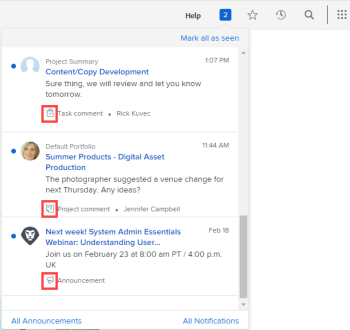

# View and manage in-app notifications

In-app notifications keep you informed about two types of information: announcement notifications and work item notifications. They are available from both the web application and the mobile application.

For a list of the work item and announcement notifications you can receive, see [In-app notifications overview](../../workfront-basics/using-notifications/in-app-notifications-overview.md).

>[!NOTE]
>
>* In-app notifications for work activities are not tied to email notifications in [!DNL Workfront]. For more information, see [[!DNL Adobe Workfront] notifications](../../workfront-basics/using-notifications/wf-notifications.md)
>* In-app notifications cannot be customized.
>

## Access requirements

+++ Expand to view access requirements for the functionality in this article. 

<table style="table-layout:auto"> 
 <col> 
 </col> 
 <col> 
 </col> 
 <tbody> 
  <tr> 
   <td role="rowheader"><strong>[!DNL Adobe Workfront] package</strong></td> 
   <td> 
Any
 </td> 
  </tr> 
  <tr> 
   <td role="rowheader"><strong>[!DNL Adobe Workfront] license</strong></td> 
   <td> 
   
Contributor or higher

   
Request or higher
 </td> 
  </tr> 
 </tbody> 
</table>

For information, see [Access requirements in Workfront documentation](/help/quicksilver/administration-and-setup/add-users/access-levels-and-object-permissions/access-level-requirements-in-documentation.md). 

+++

## View notifications

The numbered icon in the upper-right corner of [!DNL Workfront] displays the number of notifications that you have not yet acknowledged.

>[!NOTE]
>
>You can view all in-app notifications both from the web application and the mobile application. Only some of these notifications are sent as push notifications in the mobile application. For more information about notifications in the mobile app, see [[!DNL Adobe Workfront] for iOS](../../workfront-basics/mobile-apps/using-the-workfront-mobile-app/workfront-for-ios.md) or [[!DNL Adobe Workfront] for Android](../../workfront-basics/mobile-apps/using-the-workfront-mobile-app/workfront-for-android.md).

1. Click the numbered icon  in the upper-right corner of [!DNL Workfront] to open your list of notifications.

   Your most recent unread notifications appear below the numbered icon, with the most recent at the top.

   

   The number icon displays a scrollable list with up to 80 notifications. To see more, you can click **[!UICONTROL All notifications]** at the bottom of the list to view up to 500 notifications. Notifications are automatically deleted after 30 days.

   At the bottom of each notification, the [!UICONTROL notification type] and a corresponding identifying icon display. These help you identify what happened to the [!DNL Workfront] item mentioned and alert you if you have an action item:

   * Announcement notifications are indicated by the [!UICONTROL announcements] icon. 

   * All other notifications are indicated by icons that suggest the type of work item they are associated with.

      
   The icon to the right of the blue dot displays one of the following:

   * The profile photo of the person who typed the information, usually an update about a [!DNL Workfront] object you're working on.
   * The [!DNL Workfront] logo, if the notification is a system announcement.

1. (Optional) If you want to view the date when you received a notification, hover the mouse over the day or time indicator in the upper-right corner of the notification.

   

1. Click the notification that you want to view:

   * If the notification you click is about a work item, the associated [!DNL Workfront] object opens, showing the full message on the **[!UICONTROL Updates]** tab. You can **[!UICONTROL Start a new update area]** or **[!UICONTROL Type a reply]**.

      

   * If the notification you click is for an announcement , the **[!UICONTROL Announcements]** page appears, listing all of your announcements. The announcement you clicked is selected on the left and the message is displayed on the right.

      

1. (Optional) Download any attachments included in the notification message, or download all attachments as a ZIP file.

   

## Acknowledge notifications

After viewing notifications, you can acknowledge them to clear them from the [!UICONTROL Notifications] list or leave them to respond to later.

On the [!UICONTROL Notifications] page, you can view current and cleared notifications. You can also bring cleared notifications back to the [!UICONTROL Notifications] list.

* [Acknowledge notifications](#acknowledge-notifications)
* [View acknowledged notifications](#view-acknowledged-notifications)

### Acknowledge notifications

Clicking the numbered icon to open the Notifications list does not automatically acknowledge that you have read all notifications.

To acknowledge a notification and clear it from the Notifications list:

1. Click the numbered icon  in the upper-right corner of [!DNL Workfront] to open your list of notifications.
1. Do one of the following:

   * Click the blue dot in the upper-left corner of the notification.
   * If the notification is for a work item (rather than for an announcement), click the notification to go to the item.
   * If the notification is for an announcement, click the notification to open the **[!UICONTROL Announcements]** page.
   * Click **[!UICONTROL All Notifications]** in the lower-right corner of the list of notifications to display the **[!UICONTROL Notifications]** page, then click **[!UICONTROL Mark all as seen]** in the upper-right corner of Workfront.

### View acknowledged notifications 

To view notifications that you have already acknowledged:

1. Click the numbered icon  in the upper-right corner of [!DNL Workfront] to open your list of notifications.
1. Click **[!UICONTROL All Notifications]** in the lower-right corner of your list of notifications.
1. On the **[!UICONTROL Notifications]** page that appears, scroll down to view your past notifications.
1. (Optional) To bring an acknowledged notification back to your list of notifications, click the blue circle next to the notification.

## Delete an announcement notification

You cannot delete work item notifications. [!DNL Workfront] deletes all notifications (whether they are read or unread) after 30 days.

However, you can delete an announcement notifications. You can also access an announcement you have deleted within 30 days after deleting it. [!DNL Workfront] does not automatically delete announcements.

* [Delete an announcement](#delete-an-announcement)
* [Access and restore an announcement you deleted recently](#access-and-restore-an-announcement-you-deleted-recently)

### Delete an announcement

1. Click the numbered icon  in the upper-right corner of [!DNL Workfront] to open your list of notifications.
1. Click **[!UICONTROL Announcements]** or **[!UICONTROL View All Announcements]**.

1. On the **[!DNL Announcements]** page that appears, click the announcement you want to delete in the list on the left, then click **[!UICONTROL Delete]** in the upper-right corner of the page.

### Access and restore an announcement you deleted recently

You can access a notification that you deleted within the past 30 days.

1. Click the numbered icon  in the upper-right corner of [!DNL Workfront] to open your list of notifications.
1. Click **[!UICONTROL Announcements]** or **[!UICONTROL View All Announcements]**.

1. In the **[!UICONTROL Announcements]** page that displays, click **[!UICONTROL Deleted]**.

1. Click the message that you want to view.
1. (Optional) If you want to restore the announcement, click **[!UICONTROL Move to Inbox]** above and to the right of the body of the announcement.
