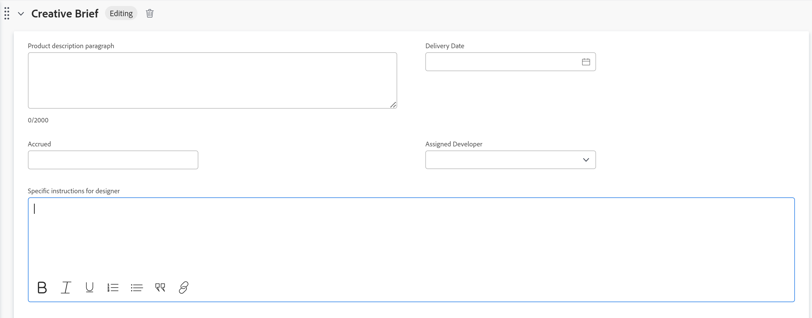
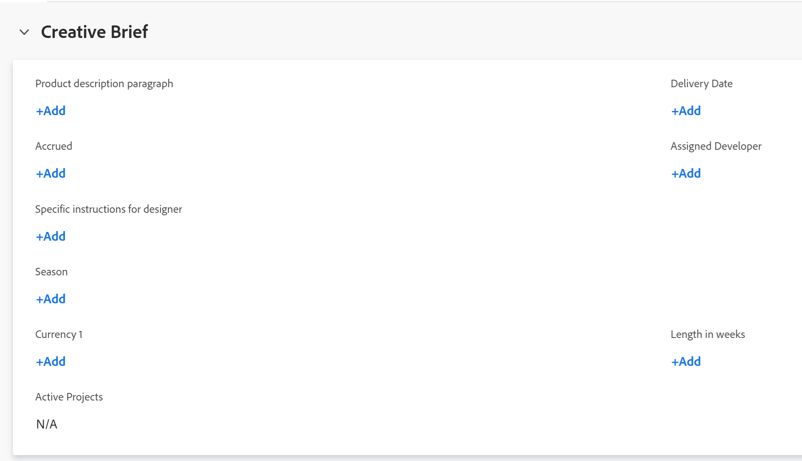

# Edit information in custom form fields

{{preview-and-fast-release}}

You can edit information on a custom form after the form is attached to an object. For information about adding custom forms to objects, see [Add a custom form to an object](../../workfront-basics/work-with-custom-forms/add-a-custom-form-to-an-object.md).

## Access requirements

You must have the following:

<table style="table-layout:auto"> 
 <col> 
 <col> 
 <tbody> 
  <tr> 
   <td role="rowheader"> 
Adobe Workfront plan*
 </td> 
   <td>Team or higher</td> 
  </tr> 
  <tr> 
   <td role="rowheader"> 
Adobe Workfront licenses*
 </td> 
   <td> 
Request or higher
 </td> 
  </tr> 
  <tr data-mc-conditions=""> 
   <td role="rowheader">Access level*</td> 
   <td> 
Edit access to the object for which you want to edit the custom form
 
Note: If you still don't have access, ask your Workfront administrator if they set additional restrictions in your access level. For information on how a Workfront administrator can change your access level, see <a href="../../administration-and-setup/add-users/configure-and-grant-access/create-modify-access-levels.md" class="MCXref xref">Create or modify custom access levels</a>.
 </td> 
  </tr> 
  <tr data-mc-conditions=""> 
   <td role="rowheader"> 
Object permissions
 </td> 
   <td> 
    <ul> 
     <li> 
Contribute or higher permissions on the object for which you want to edit the custom form
 </li> 
     <li>View permissions on the fields you want to edit.&nbsp;For information about sharing permissions for custom fields, see <a href="../../administration-and-setup/customize-workfront/create-manage-custom-forms/configure-sharing-for-a-custom-field.md" class="MCXref xref">Configure sharing for custom fields and widgets</a>.</li> 
     <li> 
Edit permissions for the sections on the form where the fields you want to edit are located
 </li> 
    </ul> 
For information on requesting additional access for objects, see <a href="../../workfront-basics/grant-and-request-access-to-objects/request-access.md" class="MCXref xref">Request access to objects </a>.
 </td> 
  </tr> 
 </tbody> 
</table>

&#42;To find out what plan, license type, or access you have, contact your Workfront administrator.

## Prerequisites

* Your Workfront administrator or a Plan user with administrative access to&nbsp;custom forms must create custom forms in your environment. For more information, see [Create or edit a custom form](../../administration-and-setup/customize-workfront/create-manage-custom-forms/create-or-edit-a-custom-form.md).
* You must have custom forms attached to an object.

  For information about how to apply custom forms to an object, see [Add a custom form to an object](../../workfront-basics/work-with-custom-forms/add-a-custom-form-to-an-object.md).

## Edit information on a custom form

Editing information on a custom form attached to an object is identical for all objects. For information about what objects can have a custom form, see [Custom forms overview](../../administration-and-setup/customize-workfront/create-manage-custom-forms/custom-forms-overview.md).

1. Go to an object for which you want to edit information on the custom form.
1. Click **`<Object type>` Details** in the left panel.

   For example, when editing information on a project custom form, click **Project Details**. 

1. Scroll to the custom form. When there is a custom form attached to the object, the name of the form displays as an area in the Details section.
1. If necessary, click the arrow  to the left of the name of the custom form to expand it.
1. Near the upper-right corner of the page, click the Edit icon .
1. Start entering information in any field that you have access to.

   

   Or

   If no information has been entered yet on the form, click **Add+** for any field you have access to and start entering information.

   

   If multiple custom forms are attached to the object, you can do this for every form.

   Depending on the type of field you are working in, consider the following:

   * You can select only one option for radio-button fields.
   * You can select one or multiple options in a checkbox field, depending on how the form creator configured the field.
   * You can select one or multiple options in a multi-select drop-down field, depending on how the form creator configured the field.
   * You can format text fields (bold, italicize, or underline) only if the user who created the form set them up as a Text Field with Formatting field type. Single Line Text Fields and Paragraph Text Fields cannot be formatted.
   * You can update the time of the day in a Date field type only if the user who created the form has included it when creating the field.

   For information about all of the field types, see [Create or edit a custom form](../../administration-and-setup/customize-workfront/create-manage-custom-forms/create-or-edit-a-custom-form.md).

1. Click **Save Changes**.

   >[!IMPORTANT]
   >
   >You must complete all required fields on the form before you can save the form. The name of a required field is followed by an asterisk.
   >
   >

   When someone changes data in another object that is referenced by calculated custom fields in your object, the changes are not reflected automatically in your object. For information about manually updating all calculated custom fields in your object, see [Recalculate all calculated custom fields for an object](#recalculate-all-calculated-custom-fields-for-an-object) in this article.

   When dependent fields on the page are modified, calculated fields on the custom form are dynamically re-calculated in real time. You can see the new calculated field value without saving the form, but it is not actually applied to the form and the object until you save the changes. This applies to calculated fields on default forms as well as custom forms.

   You can also manually update all calculated custom fields for an object when you bulk-edit the object along with other objects in a list. For instructions, see [Recalculate all calculated custom fields for multiple objects in a list when editing the objects](#recalculate-all-calculated-custom-fields-for-multiple-objects-in-a-list-when-editing-the-objects) in this article.

## Recalculate all calculated custom fields for an object  {#recalculate-all-calculated-custom-fields-for-an-object}

1. Go to the main page of the object whose custom fields you want to recalculate. 
1. Click the **More** menu  to the right of the object's name, then click **Recalculate Expressions**.

   This recalculates all custom fields on the object's form.

## Recalculate all calculated custom fields for multiple objects in a list when editing the objects {#recalculate-all-calculated-custom-fields-for-multiple-objects-in-a-list-when-editing-the-objects}

<!--

(NOTE: this will need to be edited when the bulk edit for objects update in NW)

-->

You can manually recalculate the custom fields of several objects by editing them in bulk from a list or report.

1. Go to a list of objects that contain custom forms with calculated fields.
1. Select the objects whose calculated custom fields you want to update.
1. Click  the **Edit icon**.
1. Click **Custom Forms** in the left menu, then select **Recalculate Custom Expressions**. 
1. Click **Save** **Changes**.

   Workfront calculates all custom fields for all the selected objects.

>[!TIP]
>
>Depending on the complexity of your projects, we recommend not to select a large number of projects when recalculating calculated custom fields in bulk to ensure optimum performance. Some things that could make a project too complex might be multiple dependencies or assignments or a large number of custom fields.
>
>To recalculate custom expressions in bulk from a list of projects:
>
>1. Go to a project list or report and select one or several projects.
>1. Click the **More** menu , then click **Recalculate Custom Expressions**. 
>
>
>
>Workfront calculates all custom fields for all the selected projects.
