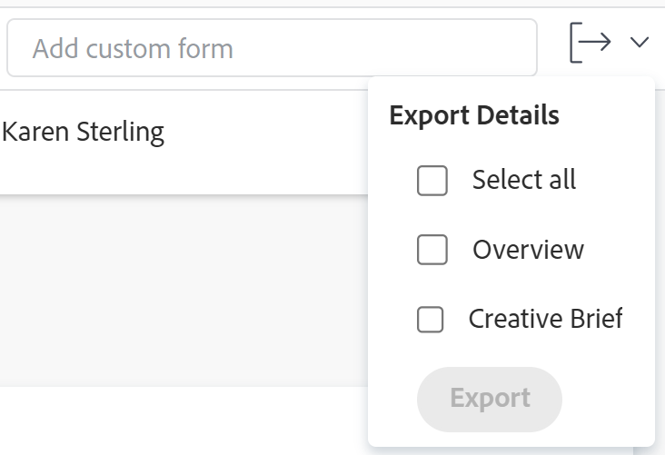

# Export custom forms and object details

You can export the Overview and the custom form information from the Details section of an object to a PDF file. You can then print or share the PDF with other users.

This functionality is supported for the following objects:

* Projects
* Tasks
* Issues
* Portfolio
* Programs

<!--
* Billing records
 
After you open a billing record on a project, you can use the Details area to attach a custom form to the record and fill it out. You can also export billing record information from the Details area.
 </li>
  -->

>[!NOTE]
>
>The fields in the Details section that your Workfront or group administrator removed using a layout template do not display.

## Access requirements

You must have the following:

<table style="table-layout:auto"> 
 <col> 
 <col> 
 <tbody> 
  <tr> 
   <td role="rowheader"> 
Adobe Workfront plan*
 </td> 
   <td>Any</td> 
  </tr> 
  <tr> 
   <td role="rowheader"> 
Adobe Workfront license*
 </td> 
   <td> 
Request or higher for issues
 
Review or higher for projects and tasks
 </td> 
  </tr> 
  <tr data-mc-conditions=""> 
   <td role="rowheader"><strong>Access level configurations*</strong> </td> 
   <td> 
View or higher for Projects, Tasks, and Issues
 
Note: If you still don't have access, ask your Workfront administrator if they set additional restrictions in your access level. For information on how a Workfront administrator can change your access level, see <a href="../../administration-and-setup/add-users/configure-and-grant-access/create-modify-access-levels.md" class="MCXref xref">Create or modify custom access levels</a>.
 </td> 
  </tr> 
  <tr data-mc-conditions=""> 
   <td role="rowheader"> 
Object permissions
 </td> 
   <td> 
View or higher permissions to the project, task, or issue whose form you want to export
 
For information on requesting additional access, see <a href="../../workfront-basics/grant-and-request-access-to-objects/request-access.md" class="MCXref xref">Request access to objects </a>.
 </td> 
  </tr> 
 </tbody> 
</table>

&#42;To find out what plan, license type, or access you have, contact your Workfront administrator.

## Prerequisites

Before you start, you must have all of the following:

1. Have a custom form created for a specific object where you want to export it from.
1. Have the custom form attached to the object

   Or

   Have the correct access to attach a custom form and edit the information on the form.

For information about creating custom forms, see [Design a form with the form designer](/help/quicksilver/administration-and-setup/customize-workfront/create-manage-custom-forms/form-designer/design-a-form/design-a-form.md).

For information about attaching forms to objects, see [Add a custom form to an object](../../workfront-basics/work-with-custom-forms/add-a-custom-form-to-an-object.md).

## Export information in the Details section

Exporting information from the Details section of an object is identical for all objects where it is suppoorted.

1. Go to a project, task, portfolio, program, or issue for which you have at least View permissions. 
1. Click the **"Details" item** on the left panel, such as **Task Details**.
1. (Optional) If there is no custom form attached to the object, start typing the name of a custom form in the **Add custom form field**, then click it when it appears in the list.

   You can add up to 10 forms.

1. (Optional) Update information in the Details section, then click **Save Changes**.
1. Click the **Export** drop-down menu in the upper-right corner, select **Overview**, or the forms you want to export, then click **Export**.

   You can also select **Select all** if you want to export the Overview area and all the custom forms.

   

   >[!TIP]
   >
   >The following scenarios may exist:
   >
   >   
   >   
   >   * When your group or Workfront administrator deselects all fields in the Overview area and the object has custom forms attached, the Overview section does not display.
   >   * When your group or Workfront administrator deselects all fields in the Overview area and the object has no custom forms attached, the Export drop-down menu is not visible.
   >   * When the object has no custom forms attached, you can export only the Overview area.
   >   * Custom fields that are behind logic and are not visible on the form do not export. For information about adding logic to a custom form, see [Add display logic and skip logic to a form](/help/quicksilver/administration-and-setup/customize-workfront/create-manage-custom-forms/form-designer/design-a-form/display-skip-logic-form-designer.md).
   >   
   >

   A PDF file is produced and downloaded to your computer. The PDF file contains the following information:

   * The name of the object the form is attached to
   * The name of the user who exported the PDF
   * The date and time when the PDF was produced
   * The name of the forms you exported
   * Information from the fields completed on the form
