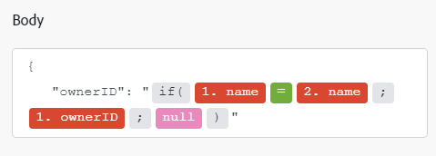

# [!DNL Adobe Firefly] modules

In an [!DNL Adobe Workfront Fusion] scenario, you can automate workflows that use [!DNL Adobe Firefly], as well as connect it to multiple third-party applications and services. 

If you need instructions on creating a scenario, see [Create a scenario](../../workfront-fusion/scenarios/create-a-scenario.md).

For information about modules, see [Modules in [!DNL Adobe Workfront Fusion]](../../workfront-fusion/modules/modules.md).

## Access requirements

You must have the following access to use the functionality in this article:

<table style="table-layout:auto">
 <col> 
 <col> 
 <tbody> 
  <tr> 
   <td role="rowheader">[!DNL Adobe Workfront] plan</td> 
   <td> 
Any
 </td> 
  </tr> 
  <tr data-mc-conditions=""> 
   <td role="rowheader">[!DNL Adobe Workfront] license</td> 
   <td> 
New: [!UICONTROL Standard]

Or

Current: [!UICONTROL Work] or higher
 </td> 
  </tr> 
  <tr> 
   <td role="rowheader">[!DNL Adobe Workfront Fusion] license**</td> 
   <td>
   
Current: No [!DNL Workfront Fusion] license requirement.

   
Or

   
Legacy: Any 

   </td> 
  </tr> 
  <tr> 
   <td role="rowheader">Product</td> 
   <td>
   
New:
 <ul><li>[!UICONTROL Select] or [!UICONTROL Prime] [!DNL Workfront] Plan: Your organization must purchase [!DNL Adobe Workfront Fusion].</li><li>[!UICONTROL Ultimate] [!DNL Workfront] Plan: [!DNL Workfront Fusion] is included.</li></ul>
   
Or

   
Current: Your organization must purchase [!DNL Adobe Workfront Fusion].

   </td> 
  </tr>
 </tbody> 
</table>

For more detail about the information in this table, see [Access requirements in Workfront documentation](/help/quicksilver/administration-and-setup/add-users/access-levels-and-object-permissions/access-level-requirements-in-documentation.md).

For information on [!DNL Adobe Workfront Fusion] licenses, see [[!DNL Adobe Workfront Fusion] licenses](../../workfront-fusion/get-started/license-automation-vs-integration.md).

## Prerequisites

Before you can use the [!DNL Adobe Firefly] connector, you must ensure that the following prerequisites are met:

* You must have an active [!DNL Adobe Firefly] account.

## Create a connection to [!DNL Adobe Firefly]

To create a connection for your [!DNL Adobe Firefly] modules:

1. Click **[!UICONTROL Add]** next to the Connection box.
    
1. Fill in the following fields:
    
    <table style="table-layout:auto"> 
      <col class="TableStyle-TableStyle-List-options-in-steps-Column-Column1">
      </col>
      <col class="TableStyle-TableStyle-List-options-in-steps-Column-Column2">
      </col>
      <tbody>
        <tr>
        <td role="rowheader">[!UICONTROL Connection name]</td>
        <td>
          
Enter a name for this connection.

        </td>
        </tr>
        <tr>
        <td role="rowheader">[!UICONTROL Environment]</td>
        <td>Select whether you are connecting to a production or non-production environment.</td>
        </tr>
        <tr>
        <td role="rowheader">[!UICONTROL Type]</td>
        <td>Select whether you are connecting to a service account or a personal account.</td>
        </tr>
        <tr>
        <td role="rowheader">[!UICONTROL Client ID]</td>
        <td>Enter your [!UICONTROL Adobe] [!UICONTROL Client ID]. This can be found in the [!UICONTROL Credentials] details section of the [!DNL Adobe Developer Console]</td>
        </tr>
        <tr>
        <td role="rowheader">[!UICONTROL Client Secret]</td>
        <td>Enter your [!DNL Adobe] [!UICONTROL Client Secret]. This can be found in the [!UICONTROL Credentials] details section of the [!DNL Adobe Developer Console]</td>
        </tr>
      </tbody>
    </table>
    
1. Click **[!UICONTROL Continue]** to save the connection and return to the module.
    
## [!DNL Adobe Firefly] modules and their fields

When you configure [!DNL Adobe Firefly] modules, [!DNL Workfront Fusion] displays the fields listed below. Along with these, additional [!DNL Adobe Firefly] fields might display, depending on factors such as your access level in the app or service. A bolded title in a module indicates a required field.

If you see the map button above a field or function, you can use it to set variables and functions for that field. For more information, see [Map information from one module to another in [!DNL Adobe Workfront Fusion]](../../workfront-fusion/mapping/map-information-between-modules.md).

### Make a custom API call

This action module makes a custom call to the Firefly API.

For specific available APIs, see [Adobe Firefly API](https://developer.adobe.com/firefly-services/docs/firefly-api/) in the Adobe Developer documentation.

<table style="table-layout:auto"> 
  <col/>
  <col/>
  <tbody>
    <tr>
      <td role="rowheader">[!UICONTROL Connection]</td>
      <td>For instructions on creating a connection to [!DNL Adobe Firefly], see <a href="#create-a-connection-to-adobe-firefly" class="MCXref xref" >Create a connection to [!DNL Adobe Firefly]</a> in this article.</td>
    </tr>
    <tr>
      <td role="rowheader">[!UICONTROL URL]</td>
      <td>
        
Enter a path relative to <code>https://firefly-api-enterprise-stage.adobe.io/</code>.

      </td>
    </tr>
    <tr>
      <td role="rowheader">
        
[!UICONTROL Method]

      </td>
   <td> 
Select the HTTP request method you need to configure the API call. For more information, see <a href="../../workfront-fusion/modules/http-request-methods.md" class="MCXref xref" data-mc-variable-override="">HTTP request methods in [!DNL Adobe Workfront Fusion]</a>.
 </td> 
    </tr>
    <tr>
      <td role="rowheader">[!UICONTROL Headers]</td>
      <td>
        
Add the headers of the request in the form of a standard JSON object.

        
For example, <code>{"Content-type":"application/json"}</code>

        
[!DNL Workfront Fusion] adds authorization headers automatically.

      </td>
    </tr>
    <tr>
      <td role="rowheader">[!UICONTROL Body]</td>
   <td> 
Add the body content for the API call in the form of a standard JSON object.
 
Note:  
When using conditional statements such as <code>if</code> in your JSON, put the quotation marks outside of the conditional statement.
 
     
Example: </b>"> 
      
  
 
     
 
 </td>     </tr>
  </tbody>
</table>

### Expand an image

This action module expands an image, optionally with content from a prompt you provide.

<table style="table-layout:auto"> 
 <col> 
 <col> 
 <tbody> 
  <tr> 
   <td role="rowheader">[!UICONTROL Connection]</td> 
   <td>For instructions on creating a connection to [!DNL Adobe Campaign], see <a href="#create-a-connection-to-adobe-firefly" class="MCXref xref" >Create a connection to [!DNL Adobe Firefly]</a> in this article.</td> 
  </tr> 
  <tr> 
   <td role="rowheader">[!UICONTROL Prompt]</td> 
   <td>Enter or map a prompt for the content with which you want to expand the image. If no prompt is provided, the image will be expanded with content matching the original image.</td> 
  </tr> 
  <tr> 
   <td role="rowheader">[!UICONTROL Expanded image format]</td> 
   <td>Select the file format that the expanded image will be saved as.</td> 
  </tr> 
  <tr> 
   <td role="rowheader">[!UICONTROL Source file]</td> 
   <td>  
Select a source file from a previous module, or map the source file's Image file name and Image file (data).
 </td> 
</td> 
  </tr> 
  <tr> 
   <td role="rowheader">[!UICONTROL Size]</td> 
   <td>Select the size that you want the expanded image to be.</td> 
  </tr> 
  <tr> 
   <td role="rowheader">[!UICONTROL Seed]</td> 
   <td>Enter or map an integer. You can use this same seed in another Expand an image module to generate a similar image with different styles. </td> 
  </tr> 
 </tbody> 
</table>

## Fill an image

This action module fills the masked area of an image, optionally with content from a prompt you provide.   

<table style="table-layout:auto"> 
 <col> 
 <col> 
 <tbody> 
  <tr> 
   <td role="rowheader">[!UICONTROL Connection]</td> 
   <td>For instructions on creating a connection to [!DNL Adobe Campaign], see <a href="#create-a-connection-to-adobe-firefly" class="MCXref xref" >Create a connection to [!DNL Adobe Firefly]</a> in this article.</td> 
  </tr> 
  <tr> 
   <td role="rowheader">[!UICONTROL Prompt]</td> 
   <td>Enter or map a prompt for the content with which you want to fill the image. If no prompt is provided, the image will be filled with content matching the original image.</td> 
  </tr> 
  <tr> 
   <td role="rowheader">[!UICONTROL Filled image format]</td> 
   <td>Select the file format that the filled image will be saved as.</td> 
  </tr> 
  <tr> 
   <td role="rowheader">[!UICONTROL Image]</td> 
   <td>  
 Click <b>Add an image</b>. Select a source file from a previous module, or map the source file's Image file name and Image data.
 </td> 
</td> 
  </tr> 
  <tr> 
   <td role="rowheader">[!UICONTROL Mask]</td> 
   <td>  
 Click <b>Add a mask</b>. Select a source file from a previous module, or map the source file's Mask file name and Mask data. The Mask file represents the custom mask that will be filled with generated content.
 </td> 
</td> 
  </tr> 
  <tr> 
   <td role="rowheader">[!UICONTROL Size]</td> 
   <td>Select the size that you want the filled image to be.</td> 
  </tr> 
  <tr> 
   <td role="rowheader">[!UICONTROL Seed]</td> 
   <td>Enter or map an integer. You can use this same seed in another Expand an image module to generate a similar image with different styles. </td> 
  </tr> 
 </tbody> 
</table>

## Generate an image

This action module generates and image based on a prompt you provide. You can also provide an optional reference image, and the generated image will match the style of the reference image.

<table style="table-layout:auto"> 
 <col> 
 <col> 
 <tbody> 
  <tr> 
   <td role="rowheader">[!UICONTROL Connection]</td> 
   <td>For instructions on creating a connection to [!DNL Adobe Campaign], see <a href="#create-a-connection-to-adobe-firefly" class="MCXref xref" >Create a connection to [!DNL Adobe Firefly]</a> in this article.</td> 
  </tr> 
  <tr> 
   <td role="rowheader">[!UICONTROL Prompt]</td> 
   <td>Enter or map a prompt for the image you want to create. More detail in the prompt will allow you more control over what appears in the image.</td> 
  </tr> 
  <tr> 
   <td role="rowheader">[!UICONTROL Generated image format]</td> 
   <td>Select the file format that the expanded image will be saved as. If you select default, the file format will be JPEG if no reference image is provided. If a reference image is provided, the file format of the generated image will be the same as the reference image.</td> 
  </tr> 
  <tr> 
   <td role="rowheader">[!UICONTROL Source file]</td> 
   <td>  
Select a source file from a previous module, or map the source file's Reference image file name and Reference image file (data). The generated image will be created to match the reference image's style.
 </td> 
</td> 
  </tr> 
  <tr> 
   <td role="rowheader">[!UICONTROL Presets]</td> 
   <td>If you want to use a preset style, click Add item and enter or map the style that you want to use.
For a list of preset styles, see <a href="https://developer.adobe.com/firefly-services/docs/firefly-api/guides/concepts/styles/" >Image Model Styles</a> in the Adobe developer documentation.</td> 
  </tr> 
  <tr> 
   <td role="rowheader">[!UICONTROL Negative prompt]</td> 
   <td>Enter or map the words that you want to avoid in the generated content. </td> 
  </tr> 
  <tr> 
   <td role="rowheader">[!UICONTROL Content class]</td> 
   <td>Select whether you want the generated image to be more like a photo, or more like created art. <ul><li><b>Photo</b>
Enter values for the Aperture, Shutter speed (in seconds), and field of view (in millimeters).</td> 
  </tr> 
  <tr> 
   <td role="rowheader">[!UICONTROL Seed]</td> 
   <td>Enter or map an integer. You can use this same seed in another Expand an image module to generate a similar image with different styles. </td> 
  </tr> 
  <tr> 
   <td role="rowheader">[!UICONTROL Size]</td> 
   <td>Select the size that you want the generated image to be.</td> 
  </tr> 
  <tr> 
   <td role="rowheader">[!UICONTROL Strength]</td> 
   <td>Enter or map an integer that represents the intensity with which the generated image will match the style of the preset style or reference image. </td> 
  </tr> 
  <tr> 
   <td role="rowheader">[!UICONTROL Visual intensity]</td> 
   <td>Enter or map an integer that represents the overall intensity of the photo's existing visual characteristics. </td> 
  </tr> 
  <tr> 
   <td role="rowheader">[!UICONTROL Locale]</td> 
   <td>If a locale is provided, the module generates content more relevant to the specified locale. 
Locale must be provided in ISO 639-1 language code and ISO 3166-1 region.

 Example: <code>en-US</code>
</td> 
  </tr> 
 </tbody> 
</table>
