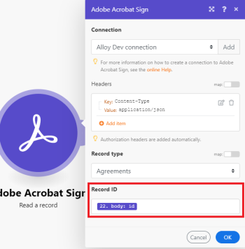

# [!DNL Adobe Acrobat Sign] modules

With the [!DNL Adobe Acrobat Sign] modules, you can start an [!DNL Adobe Workfront Fusion] scenario based on events in your [!DNL Adobe Acrobat Sign] account, create, read, or update agreements and other records, search for records using criteria you set, and upload documents.

## Access requirements

You must have the following access to use the functionality in this article:

<table style="table-layout:auto"> 
 <col> 
 <col> 
 <tbody> 
  <tr> 
   <td role="rowheader">[!DNL Adobe Workfront] plan*</td>
  <td> 
[!UICONTROL Pro] or higher
 </td>
  </tr> 
  <tr data-mc-conditions=""> 
   <td role="rowheader">[!DNL Adobe Workfront] license*</td>
   <td> 
[!UICONTROL Plan], [!UICONTROL Work]
 </td> 
  </tr> 
  <tr> 
   <td role="rowheader">[!DNL Adobe Workfront Fusion] license**</td> 
   <td>
   
Current license requirement: No [!DNL Workfront Fusion] license requirement.

   
Or

   
Legacy license requirement: [!UICONTROL [!DNL Workfront Fusion] for Work Automation and Integration] 

   </td>  
  </tr> 
  <tr> 
   <td role="rowheader">Product</td> 
   <td>
   
Current product requirement: If you have the [!UICONTROL Select] or [!UICONTROL Prime] [!DNL Adobe Workfront] Plan, your organization must purchase [!DNL Adobe Workfront Fusion] as well as [!DNL Adobe Workfront] to use functionality described in this article. [!DNL Workfront Fusion] is included in the [!UICONTROL Ultimate] [!DNL Workfront] plan.

   
Or

   
Legacy product requirement: Your organization must purchase [!DNL Adobe Workfront Fusion] as well as [!DNL Adobe Workfront] to use functionality described in this article.

   </td> 
  </tr> 
 </tbody> 
</table>

To find out what plan, license type, or access you have, contact your [!DNL Workfront] administrator.

For information on [!DNL Adobe Workfront Fusion] licenses, see [[!DNL Adobe Workfront Fusion] licenses](../../workfront-fusion/get-started/license-automation-vs-integration.md).

## [!DNL Adobe Acrobat Sign] connector usage recommendations

The [!DNL Adobe Sign ]app makes automating eSignature business processes in [!DNL Fusion] much easier and more powerful.

New users to [!DNL Adobe Sign] should pay close attention some of the constraints around updating agreements. Agreements are not typically changed once started. We recommend that new users of [!DNL Adobe Sign] focus on creating new agreements using the agreement creation module. This will make [!DNL Fusion] automations easier and work better with [!DNL Adobe Sign].

[!DNL Adobe Sign] agreements need a field to work with. There are some options for doing this but the easiest and most common is uploading a transient document and then mapping that document to your agreement.

## [!DNL Adobe Acrobat Sign] modules and their fields

When you configure [!DNL Adobe Acrobat Sign] modules, [!DNL Workfront Fusion] displays the fields listed below. Along with these, additional [!DNL Adobe Acrobat Sign] fields might display, depending on factors such as your access level in the app or service. A bolded title in a module indicates a required field.

If you see the map button above a field or function, you can use it to set variables and functions for that field. For more information, see [Map information from one module to another in [!DNL Adobe Workfront Fusion]](../../workfront-fusion/mapping/map-information-between-modules.md).

* [Triggers](#triggers)
* [Actions](#actions)
* [Searches](#searches)

### Triggers

<!--
* [Watch for agreements](#watch-for-agreements) 
* [Watch for events](#watch-for-events)
-->

+++ **[!UICONTROL Watch for agreements]**

This trigger module starts a scenario when an agreement is created or updated.

<table style="table-layout:auto"> 
 <col> 
 <col> 
 <tbody> 
  <tr> 
   <td role="rowheader">[!UICONTROL Connection]</td> 
<td>For instructions about connecting your [!DNL Adobe Acrobat Sign] account to [!DNL Workfront Fusion], see <a href="../../workfront-fusion/connections/connect-to-fusion-general.md" class="MCXref xref">Create a connection to [!DNL Adobe Workfront Fusion] - Basic instructions</a></td>  </tr> 
  <tr> 
   <td role="rowheader">[!UICONTROL Filter]</td> 
   <td>Select whether you want to watch for new records, updated records, or both.</td> 
  </tr> 
  <tr> 
   <td role="rowheader">[!UICONTROL Record type] </td> 
   <td>Select the type of record that you want the record to watch.</td> 
  </tr> 
  <tr> 
   <td role="rowheader">[!UICONTROL Find text]</td> 
   <td> 
Enter terms that you want to search for. The module returns records that include these terms as field values.
 
For more information on searching fields in [!DNL Adobe Acrobat Sign], see "How text searching works" in <a href="https://helpx.adobe.com/sign/using/adobesign-search-users-agreements.html#HowSearchWorks">Adobe Sign Search - How it works</a>.
 </td> 
  </tr> 
  <tr> 
   <td role="rowheader">[!UICONTROL Maximum number of returned agreements]</td> 
   <td> 
Enter or map the maximum number of records you want the module to return during each scenario execution cycle.
 </td> 
  </tr> 
 </tbody> 
</table>

+++

+++ **[!UICONTROL Watch for events]**

This trigger module starts a scenario when an event that you select occurs.

<table style="table-layout:auto"> 
 <col> 
 <col> 
 <tbody> 
  <tr> 
   <td role="rowheader">[!UICONTROL Webhook]</td> 
   <td>Select the webhook that you want to use, or click <b>[!UICONTROL Add]</b> and fill in the following fields.</td> 
  </tr> 
  <tr> 
   <td role="rowheader">[!UICONTROL Webhook name]</td> 
   <td> 
Enter a name for the webhook
 </td> 
  </tr> 
  <tr> 
   <td role="rowheader">[!UICONTROL Connection]</td> 
   <td> 
For instructions about connecting your [!DNL Adobe Acrobat Sign] account to [!DNL Workfront Fusion], see <a href="../../workfront-fusion/connections/connect-to-fusion-general.md" class="MCXref xref">Create a connection to [!DNL Adobe Workfront Fusion] - Basic instructions</a>
 </td> 
  </tr> 
  <tr> 
   <td role="rowheader">[!UICONTROL Scopes]</td> 
   <td> 
    <ul> 
     <li> 
[!UICONTROL Account]
 </li> 
     <li> 
[!UICONTROL Group]
 </li> 
     <li> 
[!UICONTROL User]
 </li> 
     <li> 
[!UICONTROL Resource]
 
If you select [!UICONTROL Resource], Enter the Resource ID and the Resource type.
 </li> 
    </ul> </td> 
  </tr> 
  <tr> 
   <td role="rowheader">[!UICONTROL Resource level]</td> 
   <td> 
Select the type of resource that you want to watch.
 
    <ul> 
     <li> 
[!UICONTROL Agreements]
 </li> 
     <li> 
[!UICONTROL Widgets]
 </li> 
     <li> 
[!UICONTROL Megasigns]
 </li> 
     <li> 
[!UICONTROL Library Documents]
 </li> 
    </ul> </td> 
  </tr> 
  <tr> 
   <td role="rowheader">[!UICONTROL Webhook subscription events]</td> 
   <td>Select the [!DNL Adobe Sign] events that you want the module to watch.</td> 
  </tr> 
  <tr> 
   <td role="rowheader">[!UICONTROL Application display name]</td> 
   <td>The display name of the application through which the webhook is created.</td> 
  </tr> 
  <tr> 
   <td role="rowheader">[!UICONTROL Application name]</td> 
   <td>The display name of the application through which the webhook is created.</td> 
  </tr> 
  <tr> 
   <td role="rowheader">[!UICONTROL Problem notification emails]</td> 
   <td> 
This setting works only for admin accounts
 
For each email address that you want to sent problem notification emails to, click <b>[!UICONTROL Add]</b> and enter the email address.
 </td> 
  </tr> 
  <tr> 
   <td role="rowheader">[!UICONTROL Agreement conditional parameters]</td> 
   <td>If you want to add any conditional parameters, select <b>[!UICONTROL Yes]</b> on the record type that you want to add parameters to, then select <b>[!UICONTROL Yes]</b> on any parameters you want to enable.</td> 
  </tr> 
 </tbody> 
</table>

+++

### Actions

<!--
* [Create a record](#create-a-record) 
* [Create an agreement](#create-an-agreement) 
* [Create related records](#create-related-records) 
* [Custom API Call](#custom-api-call) 
* [List records](#list-records) 
* [Read a record](#read-a-record) 
* [Read related records](#read-related-records) 
* [Update a record](#update-a-record) 
* [Update related record](#update-related-record) 
* [Upload document](#upload-document)
-->

+++ **[!UICONTROL Create a record]**

This action module creates a new record of the selected type.

<table style="table-layout:auto"> 
 <col> 
 <col> 
 <tbody> 
  <tr> 
   <td role="rowheader">[!UICONTROL Connection]</td> 
   <td>For instructions about connecting your [!DNL Adobe Acrobat Sign] account to [!DNL Workfront Fusion], see <a href="../../workfront-fusion/connections/connect-to-fusion-general.md" class="MCXref xref">Create a connection to [!DNL Adobe Workfront Fusion] - Basic instructions</a></td> 
  </tr> 
  <tr> 
   <td role="rowheader">[!UICONTROL Headers]</td> 
   <td>Add the headers of the request in the form of a standard JSON object.For example, <code>{"Content-type":"application/json"}</code></td> 
  </tr> 
  <tr> 
   <td role="rowheader">[!UICONTROL Record type]</td> 
   <td> 
Select the type of record you want to create.
 
    <ul> 
     <li> 
<b>[!UICONTROL Group]</b> 
 </li> 
     <li> 
<b>[!UICONTROL Library document]</b> 
 </li> 
     <li> 
<b>[!UICONTROL User]</b> 
 </li> 
     <li> 
<b>[!UICONTROL Web form] ([!UICONTROL Widget])</b> 
 </li> 
    </ul> </td> 
  </tr> 
  <tr> 
   <td role="rowheader">[!UICONTROL Group info]</td> 
   <td> 
Enter or map the group's [!UICONTROL Name] and [!UICONTROL ID], and indicate whether this group is the default group for the account.
 </td> 
  </tr> 
  <tr> 
   <td role="rowheader">[!UICONTROL Library document info]</td> 
   <td> 
Fill in the following fields:
 
    <ul> 
     <li> 
<b>[!UICONTROL Files to send]</b> 
 
For each file you want to add, click <b>[!UICONTROL Add item]</b> and fill in the fields.
 
      <ul> 
       <li><b>[!UICONTROL Transient document ID]</b> 
Enter the ID of the transient document
 </li> 
       <li> 
<b>[!UICONTROL URL file transfer]</b> 
 
Fill in the following fields:
 
        <ul> 
         <li> 
<b>[!UICONTROL Mime-Type]</b> 
 
Enter the mime type of the original file. Multipurpose Internet Mail Extension (MIME) types are labels that allow software to identify different types of data shared on the internet. Web servers and browsers use the MIME type to determine what should be done with a file. For example, a file with the MIME type <code>text/html</code> will be processed in a browser differently than a file with MIME type <code>image/jpeg</code>.
 </li> 
         <li> 
<b>[!UICONTROL Name]</b> 
 
Enter a name for the file.
 </li> 
         <li> 
<b>[!UICONTROL URL]</b> 
 
Enter the URL of the file that you want to send.
 </li> 
        </ul> </li> 
       <li> 
<b>[!UICONTROL Notarize]</b> 
 
Select whether this document needs to be notarized.
 </li> 
      </ul> </li> 
     <li> 
<b>[!UICONTROL Library template name]</b> 
 
Enter or map the name of the library template
 </li> 
     <li> 
<b>[!UICONTROL Sharing mode]</b> 
 
Specify who should have access to the library document.
 </li> 
     <li> 
<b>[!UICONTROL Library document state]</b> 
 
Select whether the document is in authoring state or active.
 </li> 
     <li> 
<b>[!UICONTROL Library template type]</b> 
 
For each library template type you want to use, click <b>[!UICONTROL Add item]</b> and select the template type.
 </li> 
     <li> 
<b>[!UICONTROL Last event date]</b> 
 
Enter the last date that an event occurred on the library document.
 
For a list of supported date and time formats, see <a href="../../workfront-fusion/mapping/type-coercion.md" class="MCXref xref">Type coercion in [!DNL Adobe Workfront Fusion]</a>.
 </li> 
     <li> 
<b>[!UICONTROL Library document status]</b> 
 
Select the status of the library document.
 </li> 
    </ul> </td> 
  </tr> 
  <tr> 
   <td role="rowheader">[!UICONTROL User info]</td> 
   <td> 
Fill in the following fields:
 
    <ul> 
     <li> 
<b>[!UICONTROL Email]</b> 
 
Enter the email address of the user.
 </li> 
     <li> 
<b>[!UICONTROL Is account admin]</b> 
 
Check this option if the created user is an account administator.
 </li> 
     <li> 
<b>[!UICONTROL User ID]</b> 
 
Enter the unique ID of the user
 </li> 
     <li> 
<b>[!UICONTROL Account ID]</b> 
 
Enter the unique ID of the [!DNL Adobe Acrobat Sign] account associated with this user.
 </li> 
     <li> 
<b>[!UICONTROL First name]</b> 
 
Enter the first name of the user.
 </li> 
     <li> 
<b>[!UICONTROL Last name]</b> 
 
Enter the last name of the user
 </li> 
     <li> 
<b>[!UICONTROL Company]</b> 
 
Enter the name of the user's company.
 </li> 
     <li> 
<b>[!UICONTROL Initials]</b> 
 
Enter the initials of the user.
 </li> 
     <li> 
<b>[!UICONTROL Locale]</b> 
 
Enter the locale of the user. This determines the language of the UI. 
 </li> 
     <li> 
<b>[!UICONTROL Phone]</b> 
 
Enter the phone number of the user
 </li> 
     <li> 
<b>Primary group ID</b> 
 
Enter the group to which the new user is added. If nothing is entered, the user will be added to the default group for the account.
 </li> 
     <li> 
<b>[!UICONTROL Job title]</b> 
 
Enter the job title of the user.
 </li> 
    </ul> </td> 
  </tr> 
  <tr> 
   <td role="rowheader">[!UICONTROL Web form info]</td> 
   <td> 
Fill in the following fields
 
    <ul> 
     <li> 
<b>[!UICONTROL File info]</b> 
 
For each file you want to add to the web form, click Add and fill in the following fields:
 
      <ul> 
       <li> 
[!UICONTROL File type]
 
[!UICONTROL Document]
 </li> 
       <li> 
[!UICONTROL Transient document]
 </li> 
       <li> 
[!UICONTROL URL file info]
 </li> 
      </ul> </li> 
     <li> 
<b>[!UICONTROL Web form name]</b> 
 
Enter a name for the web form. This name is used to identify the web form in places such as emails and websites.
 </li> 
     <li> 
<b>[!UICONTROL Web form state]</b> 
 
Select the state in which the new web form should be created.
 </li> 
     <li> 
<b>[!UICONTROL Web form participant set info]</b> 
 
      <ul> 
       <li> 
<b>[!UICONTROL Member info]</b> 
 
For each member that you want to add to the participant set, click <b>[!UICONTROL Add item]</b>. 
 
        <ul> 
         <li> 
<b>[!UICONTROL Email]</b> 
 
Leave this option blank.
 </li> 
         <li> 
<b>[!UICONTROL Security option]</b> 
 
If you want to add a security option for authenticating this user, select <b>[!UICONTROL Yes]</b>, then select the security option and fill in any fields it requires.
 </li> 
        </ul> </li> 
       <li> 
<b>[!UICONTROL Role]</b> 
 
Select the role. All members of this participant set share the role.
 </li> 
      </ul> </li> 
     <li> 
<b>[!UICONTROL Web form additional participant sets info]</b> 
 
      <ul> 
       <li> 
<b>[!UICONTROL Member info]</b> 
 
For each member that you want to add to the participant set, click <b>[!UICONTROL Add item]</b>.
 
        <ul> 
         <li> 
<b>[!UICONTROL Email]</b> 
 
Leave this option blank.
 </li> 
         <li> 
<b>[!UICONTROL Security option]</b> 
 
If you want to add a security option for authenticating this user, select <b>[!UICONTROL Yes]</b>, then select the security option and fill in any fields it requires.
 </li> 
        </ul> </li> 
       <li> 
<b>[!UICONTROL Role]</b> 
 </li> 
       <li> 
<b>[!UICONTROL Web form participant ID] </b> 
 
Enter the ID of the web form participant.
 </li> 
       <li> 
<b>[!UICONTROL Order]</b> 
 
Specify the order of when this participant set should interact with the web form. For example, the participant group that has the an order value of 1 must go first, 2 must go next, and so on. Order numbers must begin with one, and have no gaps in the series. 
 </li> 
       <li> 
<b>[!UICONTROL Provider participant set info]</b> 
 
If the participant is unknown, enter whether the provider must provide details for the participant, and enter a message with the details that you require for the unknown participant.
 </li> 
      </ul> </li> 
     <li> 
<b>[!UICONTROL Authentication failure info]</b> 
 
If you want to provide a failure or error page for your users, select <b>[!UICONTROL Yes]</b>, then fill in the following fields:
 
      <ul> 
       <li> 
<b>[!UICONTROL URL]</b> 
 
Enter the URL for the error page
 </li> 
       <li> 
<b>[!UICONTROL Deframe]</b> 
 
Enable this option if you want the error page to appear inside the web form
 </li> 
       <li> 
<b>[!UICONTROL Delay]</b> 
 
Enter the delay, in seconds, before the user is redirected to the error page.
 </li> 
      </ul> </li> 
     <li> 
<b>[!UICONTROL CC info]</b> 
 
For each email address that you want to receive an email when the final agreement on the web form is signed, click <b>[!UICONTROL Add item]</b> and enter the email address.
 </li> 
     <li> 
<b>[!UICONTROL Completion info]</b> 
 
If you want to provide a success page for your users, select <b>[!UICONTROL Yes]</b>, then fill in the following fields:
 
      <ul> 
       <li> 
<b>[!UICONTROL URL]</b> 
 
Enter the URL for the success page
 </li> 
       <li> 
<b>[!UICONTROL Deframe]</b> 
 
Enable this option if you want the success page to appear inside the web form
 </li> 
       <li> 
<b>[!UICONTROL Delay]</b> 
 
Enter the delay, in seconds, before the user is redirected to the success page.
 </li> 
      </ul> </li> 
     <li> 
<b>[!UICONTROL Group ID]</b> 
 
Enter the ID of the group to which the web form belongs. If nothing is entered, the web form belongs to the primary group of the account user.
 </li> 
     <li> 
<b>[!UICONTROL Last event date]</b> 
 
Enter the date that the last event occurred on the web form. Use the format <code>yyyy-MM-dd'T'HH:mm:ssZ</code>.
 </li> 
     <li> 
<b>[!UICONTROL Locale]</b> 
 
Enter the locale of the user. This determines the language of the UI. 
 </li> 
     <li> 
<b>[!UICONTROL Security optio]n</b> 
 
Enter the password used to secure the document. You must separately communicate this password to any relevant parties.
 </li> 
     <li> 
<b>[!UICONTROL Vaulting info]</b> 
 
If your account is set up for document vaulting and the option to enable per agreement, you can enable this option to vault this agreement.
 </li> 
    </ul> </td> 
  </tr> 
 </tbody> 
</table>

+++

+++ **[!UICONTROL Create an agreement]**

This action module creates an agreement, sends it out for signature, and returns the agreement ID.

>[!NOTE]
>
>We recommend uploading the document to sign as a transient document, then mapping it to the [!UICONTROL File to send] field in the [!UICONTROL Create an agreement] module. For an example, see "Upload document" in this article.

<table style="table-layout:auto"> 
 <col> 
 <col> 
 <tbody> 
  <tr> 
   <td role="rowheader">[!UICONTROL Connection]</td> 
<td>For instructions about connecting your [!DNL Adobe Acrobat Sign] account to [!DNL Workfront Fusion], see <a href="../../workfront-fusion/connections/connect-to-fusion-general.md" class="MCXref xref">Create a connection to [!DNL Adobe Workfront Fusion] - Basic instructions</a></td>  </tr> 
  <tr> 
   <td role="rowheader">[!UICONTROL Headers]</td> 
   <td>Add the headers of the request in the form of a standard JSON object.For example, <code>{"Content-type":"application/json"}</code></td> 
  </tr> 
  <tr> 
   <td role="rowheader">[!UICONTROL Files to send]</td> 
   <td> 
For each item you want to include in the agreement, click <b>[!UICONTROL Add Item]</b> and fill in the following fields:
 
    <ul> 
     <li> 
<b>[!UICONTROL File Type]</b> 
 
      <ul> 
       <li> 
<b>[!UICONTROL Document]</b> 
 
Fill in the following fields:
 
        <ul> 
         <li> 
<b>[!UICONTROL Created date]</b> 
 
Enter or map the date that the document was created in the format <code>yyyy-MM-dd'T'HH:mm:ssZ</code>. For example, <code>2016-02-25T18:46:19Z</code> represents UTC time.
 </li> 
         <li> 
<b>[!UICONTROL ID]</b> 
 
Enter or map the ID of the document.
 </li> 
         <li> 
<b>[!UICONTROL Label]</b> 
 
Enter or map a unique label for the file. In case of custom workflow this will map a file to corresponding file element in workflow definition. This must be specified in case of custom workflow agreement creation request.
 </li> 
         <li> 
<b>[!UICONTROL Number of pages]</b> 
 
Enter or map the number of pages in the document.
 </li> 
         <li> 
<b>[!UICONTROL Mime-Type]</b> 
 
Enter or map the mime type of the original file. Multipurpose Internet Mail Extension (MIME) types are labels that allow software to identify different types of data shared on the internet. Web servers and browsers use the MIME type to determine what should be done with a file. For example, a file with the MIME type <code>text/html</code> will be processed in a browser differently than a file with MIME type <code>image/jpeg</code>.
 </li> 
         <li> 
<b>[!UICONTROL Name]</b> 
 
Enter or map a name for the document. 
 </li> 
        </ul> </li> 
       <li> 
<b>[!UICONTROL Library document ID]</b> 
 
Enter the ID of the library document
 </li> 
       <li> 
<b>[!UICONTROL Transient document ID]</b> 
 
Enter the ID of the transient document
 </li> 
       <li> 
<b>[!UICONTROL URL file transfer]</b> 
 
Fill in the following fields:
 
        <ul> 
         <li> 
<b>[!UICONTROL Mime-Type]</b> 
 
Enter the mime type of the original file. Multipurpose Internet Mail Extension (MIME) types are labels that allow software to identify different types of data shared on the internet. Web servers and browsers use the MIME type to determine what should be done with a file. For example, a file with the MIME type <code>text/html</code> will be processed in a browser differently than a file with MIME type <code>image/jpeg</code>.
 </li> 
         <li> 
<b>[!UICONTROL Name]</b> 
 
Enter a name for the file.
 </li> 
         <li> 
<b>[!UICONTROL URL]</b> 
 
Enter the URL of the file that you want to send.
 </li> 
        </ul> </li> 
      </ul> </li> 
     <li> 
<b>[!UICONTROL Label]</b> 
 
Enter a label for the file.
 </li> 
     <li> 
<b>[!UICONTROL Notarize]</b> 
 
Enable this option to indicate that the file must be notarized.
 </li> 
    </ul> </td> 
  </tr> 
  <tr> 
   <td role="rowheader">[!UICONTROL Agreement name]</td> 
   <td>Enter a name for the new agreement. This name is used to identify the agreement in places such as emails and websites.</td> 
  </tr> 
  <tr> 
   <td role="rowheader">[!UICONTROL Participant sets info]</td> 
   <td> 
For each participant set you want to add, click <b>[!UICONTROL Add item]</b> and fill in the following fields.
 
    <ul> 
     <li> 
<b>[!UICONTROL Members]</b> 
 
For each person that you want to add to the participant set, click <b>[!UICONTROL Add item]</b> and enter the person's email address.
 </li> 
     <li> 
<b>[!UICONTROL Order]</b> 
 
Specify the order of when this participant set should sign the agreement. For example, the participant group that has the an order value of 1 must sign first, 2 must sign next, and so on. Order numbers must begin with one, and have no gaps in the series. 
 </li> 
     <li> 
<b>[!UICONTROL Role]</b> 
 
Select a role for this participant set. All participants in the set receive this role.
 </li> 
     <li> 
<b>[!UICONTROL ID]</b> 
 
Enter or map the ID of this participant set.
 </li> 
     <li> 
<b>[!UICONTROL Label]</b> 
 
Enter or map a unique label for the participant set. For custom workflows, label specified in the participation set should map it to the participation step in the custom workflow.
 </li> 
     <li> 
<b>[!UICONTROL Name]</b> 
 
Enter a name for the participant set. This name must be unique within the agreement.
 </li> 
     <li> 
<b>[!UICONTROL Private message]</b> 
 
Enter or map a message for this participant set. All participants in the set receive this message.
 </li> 
     <li> 
<b>[!UICONTROL Visible pages]</b> 
 
If limited document visibility is enabled for this agreement, specify which files are visible to this participant set. 
 </li> 
    </ul> </td> 
  </tr> 
  <tr> 
   <td role="rowheader">[!UICONTROL Signature type]</td> 
   <td> 
Select the type of signature that the agreement requires.
 
    <ul> 
     <li> 
<b>[!UICONTROL E-sign]</b> 
 
The agreement must be electronically signed.
 </li> 
     <li> 
<b>[!UICONTROL Written]</b> 
 
The agreement must be signed by hand, and the signed agreement must be scanned and uploaded.
 </li> 
    </ul> </td> 
  </tr> 
  <tr> 
   <td role="rowheader">[!UICONTROL State]</td> 
   <td> 
Select a state for this agreement.
 
    <ul> 
     <li> 
<b>[!UICONTROL Authoring]</b> 
 
You can still edit or add fields to this agreement.
 </li> 
     <li> 
<b>[!UICONTROL Draft]</b> 
 
You can incrementally build this agreement before sending it out.
 </li> 
     <li> 
<b>[!UICONTROL In Process]</b> 
 
This agreement will be sent immediately.
 </li> 
    </ul> </td> 
  </tr> 
  <tr> 
   <td role="rowheader">[!UICONTROL CCs]</td> 
   <td> 
You can send this agreement to interested parties that do not need to sign, such as stakeholders. They receive an email at the beginning of the signing process and another when the final signature is received. They also receive a PDF copy of the agreement. 
 
For each person that you want to CC on this agreement, click <b>[!UICONTROL Add item]</b> and fill in the following fields:
 
    <ul> 
     <li> 
<b>[!UICONTROL Email]</b> 
 
Enter or map the email address that you want to CC on the agreement.
 </li> 
     <li> 
<b>[!UICONTROL Label]</b> 
 
Enter or map a label for this email address, as seen in the workflow description
 </li> 
     <li> 
<b>[!UICONTROL Visible pages]</b> 
 </li> 
     <li> 
If limited document visibility is enabled for this agreement, specify which files are visible to this participant set. 
 </li> 
    </ul> </td> 
  </tr> 
  <tr> 
   <td role="rowheader">[!UICONTROL Email option]</td> 
   <td> 
For each type of email, select whether that type of email is sent to all participants or none.
 
    <ul> 
     <li> 
<b>[!UICONTROL Completion emails]</b> 
 
Send an email when this agreement is completed, cancelled, expired, or rejected.
 </li> 
     <li> 
<b>[!UICONTROL In-Flight emails]</b> 
 
Sent an email when this agreement is delegated or replaced.
 </li> 
     <li> 
<b>[!UICONTROL Agreement initiation emails]</b> 
 
Send an email when this agreement is created or when an action on it is requested.
 </li> 
    </ul> </td> 
  </tr> 
  <tr> 
   <td role="rowheader">[!UICONTROL External ID]</td> 
   <td> 
Enter or map an ID for this agreement. You can specify this when the agreement is created, and use it to locate the agreement in later modules or queries.
 
Note: The External ID value is visible to all participants through the API, so it should not be used to contain a sensitive token.
 </td> 
  </tr> 
  <tr> 
   <td role="rowheader">[!UICONTROL Merge field info]</td> 
   <td> 
For each field in the agreement that you want to put a default value for, click <b>[!UICONTROL Add item]</b> and enter the default value and the field name.
 
The values will be presented to the signers for editable fields For read-only fields the provided values will not be editable during the signing process.
 </td> 
  </tr> 
  <tr> 
   <td role="rowheader">[!UICONTROL Notary info]</td> 
   <td> 
Fill in the following fields:
 
    <ul> 
     <li> 
<b>[!UICONTROL Appointment]</b> 
 
Enter or map a proposed time and date for the appointment to notarize this agreement.
 </li> 
     <li> 
<b>[!UICONTROL Note]</b> 
 
Enter or map any notes that you want to include about the notary session.
 </li> 
     <li> 
<b>[!UICONTROL Payment]</b> 
 
Select whether the notary is paid by the signer or the sender of the agreement.
 </li> 
     <li> 
<b>[!UICONTROL Notary Type]</b> 
 
Select the type of notary
 
      <ul> 
       <li> 
[!UICONTROL Provider notary]
 
The notary is provided by the notary provider.
 </li> 
       <li> 
[!UICONTROL BYON notary]
 
The notary is provided by the customer.
 </li> 
      </ul> </li> 
    </ul> </td> 
  </tr> 
  <tr> 
   <td role="rowheader">[!UICONTROL Post sign option]</td> 
   <td> 
Select whether you want the signers to be directed to a success page after the agreement is signed. If you select <b>[!UICONTROL Yes]</b>, fill in the following fields:
 
    <ul> 
     <li> 
<b>[!UICONTROL Redirect delay]</b> 
 
Enter or map a number representing the number of seconds before the signer is redirected to the success page. If this value is greater than 0, the user will first see the standard [!DNL Adobe Sign] success message, and then after a delay will be redirected to your success page.
 </li> 
     <li> 
<b>[!UICONTROL Redirect URL]</b> 
 
Enter or map a publicly accessible URL to which the user will be sent after successfully completing the signing process.
 </li> 
    </ul> </td> 
  </tr> 
  <tr> 
   <td role="rowheader">[!UICONTROL Security option]</td> 
   <td> 
Enter or map the secondary password that will be used to secure the PDF document. 
 
Important: [!DNL Adobe Sign] will never share this password, so you must separately communicate it to any relevant parties.
 </td> 
  </tr> 
  <tr> 
   <td role="rowheader">[!UICONTROL Vaulting info]</td> 
   <td>If your account is set up for document vaulting and the option to enable per agreement, you can enable this option to vault this agreement.</td> 
  </tr> 
 </tbody> 
</table>

+++

+++ **[!UICONTROL Create related records]**

This action module creates records linked to a module you select.

<table style="table-layout:auto"> 
 <col> 
 <col> 
 <tbody> 
  <tr> 
   <td role="rowheader">[!UICONTROL Connection]</td> 
   <td> 
For instructions about connecting your [!DNL Adobe Acrobat Sign] account to [!DNL Workfront Fusion], see <a href="../../workfront-fusion/connections/connect-to-fusion-general.md" class="MCXref xref">Create a connection to [!DNL Adobe Workfront Fusion] - Basic instructions</a>
 </td> 
  </tr> 
  <tr> 
   <td role="rowheader">[!UICONTROL Headers]</td> 
   <td> 
Add the headers of the request in the form of a standard JSON object.
 
For example, <code>{"Content-type":"application/json"}</code>
 
[!DNL Workfront Fusion] adds authorization headers automatically.
 </td> 
  </tr> 
  <tr> 
   <td role="rowheader">[!UICONTROL Record type]</td> 
   <td>Select the record type of the original record that you want to associate the created records with.</td> 
  </tr> 
  <tr> 
   <td role="rowheader">[!UICONTROL Agreement]/[!UICONTROL Library document]/[!UICONTROL User]/[!UICONTROL Widget ID]</td> 
   <td>Enter or map the ID of the object that you want to associate the created record with.</td> 
  </tr> 
  <tr> 
   <td role="rowheader">[!UICONTROL Agreement related field]</td> 
   <td> 
Select the type of related field that you want to create
 
    <ul> 
     <li> 
<b>[!UICONTROL Form fields]</b> 
 
Enter the Template ID of the template that contains the fields you want to create
 </li> 
     <li> 
<b>[!UICONTROL Reminders]</b> 
 
Fill in the following fields:
 
      <ul> 
       <li> 
<b>[!UICONTROL Recipient participant ID]</b> 
 
For each participant that you want to receive a reminder, click [!UICONTROL Add item], and enter the ID of the participant.
 </li> 
       <li> 
<b>[!UICONTROL Status]</b> 
 
For new records, the status must be [!UICONTROL Active].
 </li> 
       <li> 
<b>[!UICONTROL First reminder delay]</b> 
 
Enter the delay in hours before sending the first reminder. The minimum value allowed is 1 hour and the maximum value can't be more than the difference of agreement creation and expiry time of the agreement in hours. If this delay is not set, the first reminder will be based on the frequency.
 </li> 
       <li> 
<b>[!UICONTROL Reminder frequency]</b> 
 
Set the frequency at which you want the reminder sent. If frequency is not provided, the reminder will be sent once.
 </li> 
       <li> 
<b>[!UICONTROL Last sent date]</b> 
 
This field is set by the system.
 </li> 
       <li> 
<b>[!UICONTROL Next sent date]</b> 
 
This field must be blank or set to [!UICONTROL ONCE].
 </li> 
       <li> 
<b>[!UICONTROL Note]</b> 
 
Enter a note to be included with the reminder. This is useful to tell the participant why their participation is required.
 </li> 
       <li> 
<b>[!UICONTROL Start reminder counter from]</b> 
 
Select whether the reminder is sent based on when the agreement is created on when it becomes available.
 </li> 
      </ul> </li> 
     <li> 
<b>[!UICONTROL Signer identity report]</b> 
 
Enter the password used to secure the PDF document.
 </li> 
     <li> 
<b>[!UICONTROL Views]</b> 
 
Enter the following fields
 
      <ul> 
       <li> 
<b>[!UICONTROL Name]</b> 
 
Select the name of the view you want to create.
 </li> 
       <li> 
<b>[!UICONTROL Auto login user]</b> 
 
Select <b>[!UICONTROL Yes]</b> to automatically login the user to the returned URL.
 </li> 
       <li> 
<b>[!UICONTROL Frame Parent]</b> 
 
Enter or map a comma-separated list of parent domain URLs where the returned URLs may be iframed. If left empty, the [!DNL Adobe Acrobat Sign] pages are not viewable in iframe.
 </li> 
       <li> 
<b>[!UICONTROL Locale]</b> 
 
Enter the language that you want to create the view in. 
 </li> 
       <li> 
<b>[!UICONTROL No chrome flag]</b> 
 
Select <b>[!UICONTROL Yes]</b> to show the embedded page without a navigation header or footer.
 </li> 
       <li> 
<b>[!UICONTROL Can edit files]</b> 
 
Select <b>[!UICONTROL Yes]</b> if you want the file upload section to be edited by adding or removing files. This is not an access control machanism. The default is [!UICONTROL Yes].
 </li> 
       <li> 
<b>[!UICONTROL Library document]</b> 
 
Select <b>[!UICONTROL Yes]</b> if you want library document links to be visible. The default is [!UICONTROL Yes].
 </li> 
       <li> 
<b>[!UICONTROL Local file]</b> 
 
Select <b>[!UICONTROL Yes]</b> if you want the local file upload button to appear. The default is [!UICONTROL Yes].
 </li> 
       <li> 
<b>[!UICONTROL Web connectors]</b> 
 
Select <b>[!UICONTROL Yes]</b> if you want the links to attach documents from web sources to appear. The default is Yes.
 </li> 
       <li> 
<b>[!UICONTROL Is preview selected]</b> 
 
Select <b>[!UICONTROL Yes]</b> to set the Compose page to Authoring mode.
 </li> 
      </ul> </li> 
     <li> 
<b>[!UICONTROL Member share]</b> 
 
For each member that you want to share the agreement with, Click <b>[!UICONTROL Add item]</b> and enter the member's email address and a message to that member.
 </li> 
     <li> 
[!UICONTROL Delegate participant set]
 
      <ul> 
       <li> 
<b>[!UICONTROL Participant set ID]</b> 
 
Enter the ID of the participant set
 </li> 
       <li> 
<b>[!UICONTROL Member info]</b> 
 
For each member you want to add, click [!UICONTROL Add item] and enter the email address and phone information for the member.
 </li> 
       <li> 
<b>[!UICONTROL Private message]</b> 
 
Enter a message. All members of the participant set receive this message.
 </li> 
      </ul> </li> 
    </ul> </td> 
  </tr> 
  <tr> 
   <td role="rowheader">[!UICONTROL Library view info]</td> 
   <td> 
Fill in the following fields:
 
    <ul> 
     <li> 
<b>[!UICONTROL Name]</b> 
 
Enter a name for the library template. This name is used in emails and websites.
 </li> 
     <li> 
<b>[!UICONTROL Auto login user]</b> 
 
Select <b>[!UICONTROL Yes]</b> to automatically login the user to the returned URL.
 </li> 
     <li> 
<b>[!UICONTROL Frame parent]</b> 
 
Enter or map a comma-separated list of parent domain URLs where the returned URLs may be iframed. If left empty, the [!DNL Adobe Acrobat Sign] pages are not viewable in iframe.
 </li> 
     <li> 
<b>[!UICONTROL Locale]</b> 
 
Enter the language that you want to create the view in. 
 </li> 
     <li> 
<b>[!UICONTROL No chrome flag]</b> 
 
Select <b>[!UICONTROL Yes]</b> to show the embedded page without a navigation header or footer.
 </li> 
     <li> 
<b>[!UICONTROL Send view configuration]</b> 
 
Select <b>[!UICONTROL Yes]</b> if you want to configure the [!UICONTROL Send] view, then fill in the following fields.
 
      <ul> 
       <li> 
<b>[!UICONTROL Agreement name]</b> 
 
Enter or map the agreement name for the library document on the compose page.
 </li> 
       <li> 
<b>[!UICONTROL Can edit files]</b> 
 
Select <b>[!UICONTROL Yes]</b> if you want the file upload section to be edited by adding or removing files. This is not an access control machanism. The default is [!UICONTROL Yes].
 </li> 
       <li> 
<b>[!UICONTROL Local file]</b> 
 
Select <b>[!UICONTROL Yes]</b> if you want library document links to be visible. The default is [!UICONTROL Yes].
 </li> 
       <li> 
<b>[!UICONTROL Web connectors]</b> 
 
Select <b>[!UICONTROL Yes]</b> if you want the links to attach documents from web sources to appear. The default is [!UICONTROL Yes].
 </li> 
       <li> 
<b>Is preview selected</b> 
 
Select <b>[!UICONTROL Yes]</b> to set the Compose page to Authoring mode.
 </li> 
      </ul> 
 
 </li> 
    </ul> </td> 
  </tr> 
  <tr> 
   <td role="rowheader">[!UICONTROL User view info]</td> 
   <td> 
Fill in the following fields
 
    <ul> 
     <li> 
<b>[!UICONTROL Name]</b> 
 
Select the name of the requested user view.
 </li> 
     <li> 
<b>[!UICONTROL Auto login user]</b> 
 
Select <b>[!UICONTROL Yes]</b> to automatically log the user in. Select <b>[!UICONTROL No]</b> to require credentials. The default is [!UICONTROL No].
 </li> 
     <li> 
<b>[!UICONTROL Frame parent]</b> 
 
Enter or map a comma-separated list of parent domain URLs where the returned URLs may be iframed. If left empty, the [!DNL Adobe Acrobat Sign] pages are not viewable in iframe.
 </li> 
     <li> 
<b>No chrome flag</b> 
 
Select <b>[!UICONTROL Yes]</b> to show the embedded page without a navigation header or footer.
 </li> 
    </ul> </td> 
  </tr> 
  <tr> 
   <td role="rowheader">[!UICONTROL Widget related fields]</td> 
   <td> 
Select the related record that you want to create.
 
    <ul> 
     <li> 
[!UICONTROL Views]
 
Fill in the following fields.
 
      <ul> 
       <li> 
<b>[!UICONTROL Name]</b> 
 
Select the name of the requested web form view
 </li> 
       <li> 
<b>[!UICONTROL Auto login user]</b> 
 
Select <b>[!UICONTROL Yes]</b> to automatically log the user in. Select <b>[!UICONTROL No]</b> to require credentials. The default is [!UICONTROL No].
 </li> 
       <li> 
<b>[!UICONTROL Frame parent]</b> 
 
Enter or map a comma-separated list of parent domain URLs where the returned URLs may be iframed. If left empty, the [!DNL Adobe Acrobat Sign] pages are not viewable in iframe.
 </li> 
       <li> 
<b>[!UICONTROL Locale]</b> 
 
Enter the language that you want to create the view in. 
 </li> 
       <li> 
<b>[!UICONTROL No chrome flag]</b> 
 
Select <b>[!UICONTROL Yes]</b> to show the embedded page without a navigation header or footer.
 </li> 
       <li> 
[!UICONTROL Personalized signing view configuration]
 
If you want to configure a personalized signing view, select <b>[!UICONTROL Yes]</b> and fill in the following fields:
 
        <ul> 
         <li> 
<b>[!UICONTROL Email]</b> 
 
Enter the email address of the person who receives the newly created web form
 </li> 
         <li> 
<b>[!UICONTROL Comment]</b> 
 
Enter a comment describing how the API caller established the signer's identity. This information appears in the [!DNL Adobe Acrobat Sign] audit trail.
 </li> 
         <li> 
<b>[!UICONTROL Expiration]</b> 
 
Enter an expiration date for the personalization of this web form. 
 
For a list of supported date and time formats, see <a href="../../workfront-fusion/mapping/type-coercion.md" class="MCXref xref" data-mc-variable-override="">Type coercion in [!DNL Adobe Workfront Fusion]</a>.
 </li> 
         <li> 
<b>[!UICONTROL Reusable]</b> 
 
Select <b>[!UICONTROL Yes]</b> if you want the intended signer to be able to sign the form more than once.
 </li> 
        </ul> </li> 
      </ul> </li> 
     <li> 
<b>[!UICONTROL Member share]</b> 
 
For each member that you want to share the agreement with, Click <b>[!UICONTROL Add item]</b> and enter the member's email address and a message to that member.
 </li> 
    </ul> </td> 
  </tr> 
 </tbody> 
</table>

+++

+++ **[!UICONTROL Custom API Call]**
This module allows you to perform a custom API call.

<table style="table-layout:auto"> 
 <col> 
 <col> 
 <tbody> 
  <tr> 
   <td role="rowheader">[!UICONTROL Connection]</td> 
   <td> 
For instructions about connecting your [!DNL Adobe Acrobat Sign] account to [!DNL Workfront Fusion], see <a href="../../workfront-fusion/connections/connect-to-fusion-general.md" class="MCXref xref">Create a connection to [!DNL Adobe Workfront Fusion] - Basic instructions</a>
 </td> 
  </tr> 
  <tr> 
   <td role="rowheader"> 
[!UICONTROL URL]
 </td> 
   <td> 
Enter a path relative to <code>https://api.[region].adobesign.com/api/rest/v6/</code>
 
Note: For the list of available endpoints, refer to the [!DNL Adobe Sign] API Reference.
 </td> 
  </tr> 
  <tr> 
   <td role="rowheader"> 
[!UICONTROL Method]
 </td> 
   <td> 
Select the HTTP request method you need to configure the API call. For more information, see <a href="../../workfront-fusion/modules/http-request-methods.md" class="MCXref xref" data-mc-variable-override="">HTTP request methods in [!DNL Adobe Workfront Fusion]</a>.
 </td> 
  </tr> 
  <tr> 
   <td role="rowheader">[!UICONTROL Headers]</td> 
   <td> 
Add the headers of the request in the form of a standard JSON object.
 
For example, <code>{"Content-type":"application/json"}</code>
 
[!DNL Workfront Fusion] adds authorization headers automatically.
 </td> 
  </tr> 
  <tr> 
   <td role="rowheader">[!UICONTROL Query String] </td> 
   <td> 
Enter the request query string.
 </td> 
  </tr> 
  <tr> 
   <td role="rowheader">[!UICONTROL Body]</td> 
   <td> 
Add the body content for the API call in the form of a standard JSON object.
 
Note:  
When using conditional statements such as <code>if</code> in your JSON, put the quotation marks outside of the conditional statement.
 
     
Example: </b>"> 
      
  
 
     
 
 </td> 
  </tr> 
  <tr> 
   <td role="rowheader">[!UICONTROL Upload a transient document]</td> 
   <td> 
If you want to upload a transient document, enter the source file for the document you want to upload.
 
Select a source file from a previous module, or map the source file's name and data.
 </td> 
  </tr> 
 </tbody> 
</table>

+++

+++ **[!UICONTROL List records]**

This action module lists all records of the selected type that the account has access to.

<table style="table-layout:auto"> 
 <col> 
 <col> 
 <tbody> 
  <tr> 
   <td role="rowheader">[!UICONTROL Connection]</td> 
   <td> 
For instructions about connecting your [!DNL Adobe Acrobat Sign] account to [!DNL Workfront Fusion], see <a href="../../workfront-fusion/connections/connect-to-fusion-general.md" class="MCXref xref">Create a connection to [!DNL Adobe Workfront Fusion] - Basic instructions</a>
 </td> 
  </tr> 
  <tr> 
   <td role="rowheader">[!UICONTROL Headers]</td> 
   <td> 
Add the headers of the request in the form of a standard JSON object.
 
For example, <code>{"Content-type":"application/json"}</code>
 
[!DNL Workfront Fusion] adds authorization headers automatically.
 </td> 
  </tr> 
  <tr> 
   <td role="rowheader">[!UICONTROL Record type]</td> 
   <td>Select the type of record that you want to retrieve related records for.</td> 
  </tr> 
  <tr> 
   <td role="rowheader">[!UICONTROL Locale]</td> 
   <td> 
Enter the locale of the user. This determines the language of the UI. 
 </td> 
  </tr> 
  <tr> 
   <td role="rowheader">[!UICONTROL External ID]</td> 
   <td>Enter or map the External ID (an ID assigned outside of [!DNL Adobe Acrobat Sign]) for the agreements you want to return.</td> 
  </tr> 
  <tr> 
   <td role="rowheader">[!UICONTROL Group ID]</td> 
   <td>Enter the ID of the group associated with the records you want to list.</td> 
  </tr> 
  <tr> 
   <td role="rowheader">[!UICONTROL Show hidden (records)]</td> 
   <td>Enable this option if you want to include hidden records in your results.</td> 
  </tr> 
  <tr> 
   <td role="rowheader">[!UICONTROL Cursor] / [!UICONTROL Start index]</td> 
   <td> 
Enter the number of the first record that the module should return. 
 
Note: This field is combined with the [!UICONTROL Maximum number of returned records] field for pagination. For example, if the [!UICONTROL Maximum number of returned events] is 100, and the [!UICONTROL Start index] is 101, the module returns records 101-200, or the second page of results.
 </td> 
  </tr> 
  <tr> 
   <td role="rowheader">[!UICONTROL Maximum number of returned records]</td> 
   <td> 
Enter or map the maximum number of records you want the module to [action] during each scenario execution cycle.
 
Note: This field is combined with the [!UICONTROL Cursor] or [!UICONTROL Start Index] field for pagination. For example, if the [!UICONTROL Maximum number of returned events] is 100, and the [!UICONTROL Start index] is 101, the module returns records 101-200, or the second page of results.
 </td> 
  </tr> 
  <tr> 
   <td role="rowheader">[!UICONTROL Parent domain URLs]</td> 
   <td> 
Enter or map a comma-separated list of parent domain URLs where the returned URLs may be iframed. If left empty, the [!DNL Adobe Acrobat Sign] pages are not viewable in iframe.
 </td> 
  </tr> 
 </tbody> 
</table>

+++

+++ **[!UICONTROL Read a record]**

This action module retrieves information from a single record.

<table style="table-layout:auto"> 
 <col> 
 <col> 
 <tbody> 
  <tr> 
   <td role="rowheader">[!UICONTROL Connection]</td> 
   <td> 
For instructions about connecting your [!DNL Adobe Acrobat Sign] account to [!DNL Workfront Fusion], see <a href="../../workfront-fusion/connections/connect-to-fusion-general.md" class="MCXref xref">Create a connection to [!DNL Adobe Workfront Fusion] - Basic instructions</a>
 </td> 
  </tr> 
  <tr> 
   <td role="rowheader">[!UICONTROL Headers]</td> 
   <td> 
Add the headers of the request in the form of a standard JSON object.
 
For example, <code>{"Content-type":"application/json"}</code>
 
[!DNL Workfront Fusion] adds authorization headers automatically.
 </td> 
  </tr> 
  <tr> 
   <td role="rowheader">[!UICONTROL Record type]</td> 
   <td>Select the type of record that you want to retrieve related records for.</td> 
  </tr> 
  <tr> 
   <td role="rowheader">[!UICONTROL Record ID]</td> 
   <td>Enter or map the ID of the record you want to retrieve.</td> 
  </tr> 
 </tbody> 
</table>

+++

+++ **[!UICONTROL Read related records]**

Read additional information related to a single record.

<table style="table-layout:auto"> 
 <col> 
 <col> 
 <tbody> 
  <tr> 
   <td role="rowheader">[!UICONTROL Connection]</td> 
   <td> 
For instructions about connecting your [!DNL Adobe Acrobat Sign] account to [!DNL Workfront Fusion], see <a href="../../workfront-fusion/connections/connect-to-fusion-general.md" class="MCXref xref">Create a connection to [!DNL Adobe Workfront Fusion] - Basic instructions</a>
 </td> 
  </tr> 
  <tr> 
   <td role="rowheader">[!UICONTROL Headers]</td> 
   <td> 
Add the headers of the request in the form of a standard JSON object.
 
For example, <code>{"Content-type":"application/json"}</code>
 
[!DNL Workfront Fusion] adds authorization headers automatically.
 </td> 
  </tr> 
  <tr> 
   <td role="rowheader">[!UICONTROL Record type]</td> 
   <td>Select the type of record that you want to retrieve related records for.</td> 
  </tr> 
  <tr> 
   <td role="rowheader">[!UICONTROL Record ID] (Example: [!UICONTROL Account ID])</td> 
   <td>Enter or map the ID of the record you want to retrieve related records for.</td> 
  </tr> 
  <tr> 
   <td role="rowheader">[!UICONTROL Other fields]</td> 
   <td>Enter information in specific fields based on record type and related fields.</td> 
  </tr> 
 </tbody> 
</table>

+++

+++ **[!UICONTROL Update a record]**

This action module updates a single record in [!DNL Adobe Acrobat Sign].

>[!IMPORTANT]
>
>* As a best practice, if you are anticipating substantial changes to an agreement, we recommend creating a new agreement rather than updating the existing agreement.
>* Some updates feature required fields. As you configure your update, be sure to fill out all required fields. Required fields are bold in [!DNL Workfront Fusion] modules.
>

<table style="table-layout:auto"> 
 <col> 
 <col> 
 <tbody> 
  <tr> 
   <td role="rowheader">[!UICONTROL Connection]</td> 
   <td> 
For instructions about connecting your [!DNL Adobe Acrobat Sign] account to [!DNL Workfront Fusion], see <a href="../../workfront-fusion/connections/connect-to-fusion-general.md" class="MCXref xref">Create a connection to [!DNL Adobe Workfront Fusion] - Basic instructions</a>
 </td> 
  </tr> 
  <tr> 
   <td role="rowheader">[!UICONTROL Headers]</td> 
   <td> 
Add the headers of the request in the form of a standard JSON object.
 
For example, <code>{"Content-type":"application/json"}</code>
 
[!DNL Workfront Fusion] adds authorization headers automatically.
 </td> 
  </tr> 
  <tr> 
   <td role="rowheader">[!UICONTROL Record ID] </td> 
   <td>Enter or map the ID of the record you want to update.</td> 
  </tr> 
  <tr> 
   <td role="rowheader">[!UICONTROL Record type]</td> 
   <td>Select the type of record that you want to update.</td> 
  </tr> 
  <tr> 
   <td role="rowheader">[!UICONTROL Other fields]</td> 
   <td> 
Enter information in specific fields based on record type and related fields.
 
    <ul> 
     <li> 
<b>[!UICONTROL Agreement]</b> 
 
As a best practice, if you are anticipating substantial changes to an agreement, we recommend creating a new agreement rather than updating the existing agreement.
 </li> 
     <li> 
<b>[!UICONTROL Library document]</b> 
 
Select the fields you want to update, then fill in the selected fields:
 
      <ul> 
       <li> 
<b>[!UICONTROL Status]</b> 
 
Select the new status for the library document.
 </li> 
       <li> 
<b>[!UICONTROL Name]</b> 
 
Enter or map the name of the library template
 </li> 
       <li> 
<b>[!UICONTROL Sharing mode]</b> 
 
Specify who should have access to the library document.
 </li> 
       <li> 
<b>[!UICONTROL Library template type]</b> 
 
For each library template type you want to use, click <b>[!UICONTROL Add item]</b> and select the template type.
 </li> 
      </ul> </li> 
     <li> 
<b>[!UICONTROL User]</b> 
 
Select the fields you want to update, then fill in the selected fields:
 
      <ul> 
       <li> 
<b>[!UICONTROL First name]</b> 
 
Enter the first name of the user.
 </li> 
       <li> 
<b>[!UICONTROL Last name]</b> 
 
Enter the last name of the user
 </li> 
       <li> 
<b>[!UICONTROL Company]</b> 
 
Enter the name of the user's company.
 </li> 
       <li> 
<b>[!UICONTROL Phone]</b> 
 
Enter the phone number of the user
 </li> 
       <li> 
<b>[!UICONTROL Primary group ID]</b> 
 
Enter the group to which the new user is added. If nothing is entered, the user will be added to the default group for the account.
 </li> 
       <li> 
<b>[!UICONTROL Job title]</b> 
 
Enter the job title of the user.
 </li> 
      </ul> </li> 
     <li> 
<b>[!UICONTROL Web form] ([!UICONTROL widget])</b> 
 
Enter information in specific fields based on record type and related fields.
 </li> 
    </ul> </td> 
  </tr> 
 </tbody> 
</table>

+++

+++ **[!UICONTROL Update related record]**

This action module updates records related to a specific object.

>[!IMPORTANT]
>
>* As a best practice, if you are anticipating substantial changes to an agreement, we recommend creating a new agreement rather than updating the existing agreement.
>* Some updates feature required fields. As you configure your update, be sure to fill out all required fields. Required fields are bold in [!DNL Workfront Fusion] modules.
>

<table style="table-layout:auto"> 
 <col> 
 <col> 
 <tbody> 
  <tr> 
   <td role="rowheader">[!UICONTROL Connection]</td> 
   <td> 
For instructions about connecting your [!DNL Adobe Acrobat Sign] account to [!DNL Workfront Fusion], see <a href="../../workfront-fusion/connections/connect-to-fusion-general.md" class="MCXref xref">Create a connection to [!DNL Adobe Workfront Fusion] - Basic instructions</a>
 </td> 
  </tr> 
  <tr> 
   <td role="rowheader">[!UICONTROL Headers]</td> 
   <td> 
Add the headers of the request in the form of a standard JSON object.
 
For example, <code>{"Content-type":"application/json"}</code>
 
[!DNL Workfront Fusion] adds authorization headers automatically.
 </td> 
  </tr> 
  <tr> 
   <td role="rowheader">[!UICONTROL Record type]</td> 
   <td>Select the record type of the record that the related fields are associated with.</td> 
  </tr> 
  <tr> 
   <td role="rowheader">[!UICONTROL Agreement]/[!UICONTROL Library document]/[!UICONTROL User]/[!UICONTROL Widget ID]</td> 
   <td>Enter or map the ID of the object that you want to associate the created record with.</td> 
  </tr> 
  <tr> 
   <td role="rowheader">[!UICONTROL Other fields]</td> 
   <td> 
Enter information in specific fields based on record type and related fields.
 
    <ul> 
     <li> 
<b>[!UICONTROL Agreement]</b> 
 
As a best practice, if you are anticipating substantial changes to an agreement, we recommend creating a new agreement rather than updating the existing agreement.
 </li> 
     <li> 
<b>[!UICONTROL Library document]</b> 
 
Select the fields you want to update, then fill in the selected fields:
 
      <ul> 
       <li> 
<b>[!UICONTROL State]</b> 
 
Select the new status for the library document.
 </li> 
       <li> 
<b>[!UICONTROL Note]</b> 
 
Enter or map the text of the note.
 </li> 
       <li> 
<b>[!UICONTROL Visibility]</b> 
 
Select whether the library document is shown or gidden.
 </li> 
      </ul> </li> 
     <li> 
<b>[!UICONTROL User]</b> 
 
Select the fields you want to update, then fill in the selected fields:
 
      <ul> 
       <li> 
<b>[!UICONTROL Group info list]</b> 
 
Fill in the following fields
 
        <ul> 
         <li> 
<b>[!UICONTROL Status]</b> 
 
Select the new status for the user.
 </li> 
         <li> 
<b>[!UICONTROL ID]</b> 
 
Enter the unique ID of the group
 </li> 
         <li> 
<b>[!UICONTROL Is group admin]</b> 
 
Select <b>[!UICONTROL Yes]</b> to make this user a group administrator.
 </li> 
         <li> 
<b>Is primary group</b> 
 
Select <b>[!UICONTROL Yes]</b> to update this group to the user's primary group.
 </li> 
         <li> 
<b>[!UICONTROL Created date]</b> 
 
Enter the date the group was created.
 
For a list of supported date and time formats, see <a href="../../workfront-fusion/mapping/type-coercion.md" class="MCXref xref" data-mc-variable-override="">Type coercion in [!UICONTROL Adobe Workfront Fusion]</a>.
 </li> 
         <li> 
<b>[!UICONTROL Name]</b> 
 
Enter or map the name of the group.
 </li> 
         <li> 
<b>[!UICONTROL Library document creation visible]</b> 
 
These settings determine whether the user can create library documents
 
          <ul> 
           <li> 
[!UICONTROL Value]
 
Allow
 </li> 
           <li> 
[!UICONTROL Inherited]
 
Inherit group setting from group or account
 </li> 
          </ul> </li> 
         <li> 
<b>[!UICONTROL Send restricted to workflows]</b> 
 
These settings determine whether the user can create agreements only using workflows.
 
          <ul> 
           <li> 
[!UICONTROL Value]
 
Allow
 </li> 
           <li> 
[!UICONTROL Inherited]
 
Inherit group setting from group or account
 </li> 
          </ul> </li> 
         <li> 
<b>[!UICONTROL User can send]</b> 
 
          <ul> 
           <li> 
[!UICONTROL Value]
 
Allow
 </li> 
           <li> 
[!UICONTROL Inherited]
 
Inherit group setting from group or account
 </li> 
          </ul> </li> 
        </ul> </li> 
      </ul> 
      <ul> 
       <li> 
<b>[!UICONTROL State]</b> 
 
Select the new state for the user, and enter a comment regarding why you want to activate or deactivate the user.
 </li> 
       <li> 
<b>[!UICONTROL Locale]</b> 
 
Enter the locale of the user. This determines the language of the UI. 
 </li> 
      </ul> </li> 
     <li> 
<b>[!UICONTROL Web form] ([!UICONTROL widget])</b> 
 
Enter information in specific fields based on record type and related fields.
 </li> 
    </ul> </td> 
  </tr> 
 </tbody> 
</table>

+++

+++ **[!UICONTROL Upload document]**

Upload a transient document. A transient document is available for 7 days after it is uploaded.

>[!NOTE]
>
>We recommend uploading the document to sign as a transient document, then mapping it to the File to send field in the Create an agreement module.

<table style="table-layout:auto"> 
 <col> 
 <col> 
 <tbody> 
  <tr> 
   <td role="rowheader">[!UICONTROL Connection]</td> 
   <td> 
For instructions about connecting your [!DNL Adobe Acrobat Sign] account to [!DNL Workfront Fusion], see <a href="../../workfront-fusion/connections/connect-to-fusion-general.md" class="MCXref xref">Create a connection to [!DNL Adobe Workfront Fusion] - Basic instructions</a>
 </td> 
  </tr> 
  <tr> 
   <td role="rowheader">[!UICONTROL Headers]</td> 
   <td> 
Add the headers of the request in the form of a standard JSON object.
 
For example, <code>{"Content-type":"application/json"}</code>
 
[!DNL Workfront Fusion] adds authorization headers automatically.
 </td> 
  </tr> 
  <tr> 
   <td role="rowheader">[!UICONTROL Record ID]</td> 
   <td>Enter or map the ID of the record you want to update</td> 
  </tr> 
  <tr> 
   <td role="rowheader">[!UICONTROL MIME type]</td> 
   <td>Enter the mime type of the original file. Multipurpose Internet Mail Extension (MIME) types are labels that allow software to identify different types of data shared on the internet. Web servers and browsers use the MIME type to determine what should be done with a file. For example, a file with the MIME type <code>text/html</code> will be processed in a browser differently than a file with MIME type <code>image/jpeg</code>.</td> 
  </tr> 
 </tbody> 
</table>

**Example:** In this workflow, the document to sign (previously downloaded from Workfront) is uploaded as a transient document.

The [!UICONTROL Upload document] module gives the document an [!DNL Adobe Acrobat Sign] ID that can be referenced in later modules. When the agreement is created, the uploaded document's ID is included in the [!UICONTROL Files to send] field.

+++

### Searches 

+++ **[!UICONTROL Search agreements]**

This search module searches for agreements based on criteria you provide.

<table style="table-layout:auto"> 
 <col> 
 <col> 
 <tbody> 
  <tr> 
   <td role="rowheader">[!UICONTROL Connection]</td> 
   <td> 
For instructions about connecting your [!DNL Adobe Acrobat Sign] account to [!DNL Workfront Fusion], see <a href="../../workfront-fusion/connections/connect-to-fusion-general.md" class="MCXref xref">Create a connection to [!DNL Adobe Workfront Fusion] - Basic instructions</a>
 </td> 
  </tr> 
  <tr> 
   <td role="rowheader">[!UICONTROL Headers]</td> 
   <td> 
Add the headers of the request in the form of a standard JSON object.
 
For example, <code>{"Content-type":"application/json"}</code>
 </td> 
  </tr> 
  <tr> 
   <td role="rowheader">[!UICONTROL Text filter]</td> 
   <td> 
Search for text in the agreement metadata. 
 
    <ul> 
     <li> 
<b>[!UICONTROL Find text]</b> 
 
Enter text that you want to find in agreement metadata. Each word is treated as a separate text item. 
 </li> 
     <li> 
<b>[!UICONTROL Find text in]</b> 
 
Select the metadata fields that you want to find text in. If you select nothing, the modules searches all metadata.
 </li> 
    </ul> 
The module returns any agreement that contains any of the entered text in any of the selected fields. Example: entering "spring campaign" and selecting the Title and Note options returns any agreements with the words "Spring" or "Campaign" in either Title or Note.
 
For more information on searching fields in [!DNL Adobe Acrobat Sign], see "How text searching works" in <a href="https://helpx.adobe.com/sign/using/adobesign-search-users-agreements.html#HowSearchWorks">[!DNL Adobe Sign] Search - How it works</a>.
 </td> 
  </tr> 
  <tr> 
   <td role="rowheader">[!UICONTROL Created date]</td> 
   <td>Select dates. The module returns only records where the created date matches this criteria.</td> 
  </tr> 
  <tr> 
   <td role="rowheader">[!UICONTROL Expiration date]</td> 
   <td>Select dates. The module returns only records where the expiration date matches this criteria.</td> 
  </tr> 
  <tr> 
   <td role="rowheader"> 
[!UICONTROL Modified date]
 </td> 
   <td>Select dates. The module returns only records where the modified date matches this criteria.</td> 
  </tr> 
  <tr> 
   <td role="rowheader">[!UICONTROL External ID]</td> 
   <td> 
 External ID is a sender-assigned ID to the agreement that can be of any form, but usually in form of "&lt;groupID>:&lt;ID>".
 
For each External ID you want to add, click <b>[!UICONTROL Add]</b> and enter or map the External ID.
 </td> 
  </tr> 
  <tr> 
   <td role="rowheader">[!UICONTROL Group ID]</td> 
   <td> 
Group ID is an identifier assigned when the group was created.
 
For each External ID you want to add, click <b>[!UICONTROL Add]</b> and enter or map the External ID.
 </td> 
  </tr> 
  <tr> 
   <td role="rowheader">[!UICONTROL Asset ID]</td> 
   <td> 
This is the ID assigned to the specific agreement. 
 
For each External ID you want to add, click <b>[!UICONTROL Add]</b> and enter or map the External ID.
 </td> 
  </tr> 
  <tr> 
   <td role="rowheader">[!UICONTROL Parent ID]</td> 
   <td> 
This is the ID assigned to the agreement's parent object. 
 
For each External ID you want to add, click <b>[!UICONTROL Add]</b> and enter or map the External ID.
 </td> 
  </tr> 
  <tr> 
   <td role="rowheader">[!UICONTROL Participant email]</td> 
   <td> 
The email address of a participant. 
 
For each External ID you want to add, click <b>[!UICONTROL Add]</b> and enter or map the External ID.
 </td> 
  </tr> 
  <tr> 
   <td role="rowheader">[!UICONTROL Role]</td> 
   <td>Select roles that you want the returned results to include.</td> 
  </tr> 
  <tr> 
   <td role="rowheader">[!UICONTROL Sort by]</td> 
   <td>If you want the module to sort the results, select the field that you want to sort results by.</td> 
  </tr> 
  <tr> 
   <td role="rowheader">[!UICONTROL Sort orde]r</td> 
   <td>If you want the module to sort the results, select whether you want to sort ascending or descending.</td> 
  </tr> 
  <tr> 
   <td role="rowheader">[!UICONTROL Status]</td> 
   <td>Select the statuses that you want the returned results to include.</td> 
  </tr> 
  <tr> 
   <td role="rowheader">[!UICONTROL Type]</td> 
   <td>Select the agreement types that you want the returned results to include.</td> 
  </tr> 
  <tr> 
   <td role="rowheader">[!UICONTROL Subtypes]</td> 
   <td>Select the agreement subtypes that you want the returned results to include. Only Library template agreements feature subtypes.</td> 
  </tr> 
  <tr> 
   <td role="rowheader">[!UICONTROL User ID]</td> 
   <td> 
The User ID of the user that the agreement is shared with.
 
For each User ID you want to add, click <b>[!UICONTROL Add]</b> and enter or map the User ID.
 </td> 
  </tr> 
  <tr> 
   <td role="rowheader">[!UICONTROL Visibility]</td> 
   <td>Select the visibility level that you want the returned results to include.</td> 
  </tr> 
  <tr> 
   <td role="rowheader">[!UICONTROL Start index]</td> 
   <td> 
Enter the position of the first result that you want to return. Combine this with the [!UICONTROL maximum returned results] to paginate results
 
Example: if you return 100 results at a time, enter 100 to return results 100-200.
 </td> 
  </tr> 
  <tr> 
   <td role="rowheader">[!UICONTROL Maximum number of returned results]</td> 
   <td> 
Enter or map the maximum number of records you want the module to [action] during each scenario execution cycle.
 </td> 
  </tr> 
 </tbody> 
</table>

+++
