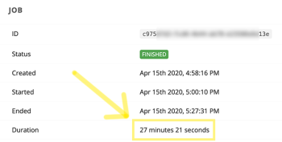

# [!DNL CloudConvert] modules

In an Adobe Workfront Fusion scenario, you can automate workflows that use CloudConvert, as well as connect it to multiple third-party applications and services. The [!DNL CloudConvert] modules allow you to monitor and manage jobs, tasks, and import and export files in your [!DNL CloudConvert] account.

<table style="table-layout:auto">
 <col> 
 <col> 
 <tbody> 
  <tr> 
   <td role="rowheader">[!DNL Adobe Workfront] plan*</td>
  <td> 
[!UICONTROL Pro] or higher
 </td>
  </tr> 
  <tr data-mc-conditions=""> 
   <td role="rowheader">[!DNL Adobe Workfront] license*</td>
   <td> 
[!UICONTROL Plan], [!UICONTROL Work]
 </td> 
  </tr> 
  <tr> 
   <td role="rowheader">[!DNL Adobe Workfront Fusion] license**</td> 
   <td>
   
Current license requirement: No [!DNL Workfront Fusion] license requirement.

   
Or

   
Legacy license requirement: [!UICONTROL [!DNL Workfront Fusion] for Work Automation and Integration] 

   </td> 
  </tr> 
  <tr> 
   <td role="rowheader">Product</td> 
   <td>
   
Current product requirement: If you have the [!UICONTROL Select] or [!UICONTROL Prime] [!DNL Adobe Workfront] Plan, your organization must purchase [!DNL Adobe Workfront Fusion] as well as [!DNL Adobe Workfront] to use functionality described in this article. [!DNL Workfront Fusion] is included in the [!UICONTROL Ultimate] [!DNL Workfront] plan.

   
Or

   
Legacy product requirement: Your organization must purchase [!DNL Adobe Workfront Fusion] as well as [!DNL Adobe Workfront] to use functionality described in this article.

   </td> 
  </tr> 
 </tbody> 
</table>

## Connect [!DNL CloudConvert] to [!DNL Workfront Fusion] {#connect-cloudconvert-to-workfront-fusion}

To connect your [!DNL CloudConvert] account to [!DNL Workfront Fusion], you need to obtain the API Key from your [!DNL CloudConvert] account.

1. Log in to your [!DNL CloudConvert] account and open your [!UICONTROL Dashboard].
1. Open the **[!UICONTROL Authorization] > [!UICONTROL API Keys]** section.
1. Click **[!UICONTROL Create New API key]**.
1. Enter the name for the API key, enable the scopes you want to use, then click **[!UICONTROL Create]**.
1. Copy the provided token and store it in a safe place.
1. In [!DNL Workfront Fusion], start creating a scenario and open the [!DNL CloudConvert] module's **[!UICONTROL Create a connection]** dialog.

   For instructions, see [Create a scenario in [!DNL Adobe Workfront Fusion]](../../workfront-fusion/scenarios/create-a-scenario.md).

1. Enter the token you saved in step 5, then click **[!UICONTROL Continue]** to establish the connection.

## [!DNL CloudConvert] modules and their fields {#cloudconvert-modules-and-their-fields}

When you configure [!DNL CloudConvert] modules, [!DNL Workfront Fusion] displays the fields listed below. Along with these, additional [!DNL CloudConvert] fields might display, depending on factors such as your access level in the app or service. A bolded title in a module indicates a required field.

If you see the map button above a field or function, you can use it to set variables and functions for that field. For more information, see [Map information from one module to another in [!DNL Adobe Workfront Fusion]](../../workfront-fusion/mapping/map-information-between-modules.md).

* [Common tasks](#common-tasks) 
* [Jobs](#jobs) 
* [Tasks](#tasks) 
* [Other](#other)

### Common tasks 

* [Capture a Website](#capture-a-website) 
* [[!UICONTROL Convert a file]](#convert-a-file) 
* [Create an Archive](#create-an-archive) 
* [Merge Files](#merge-files) 
* [Optimize a File](#optimize-a-file)

#### [!UICONTROL Capture a Website] 

This action module captures a specified website and saves it in PDF, JPG, or PNG format.

You specify the URL of the website and other information, such as where you want the information stored.

The module returns the ID of the file and any associated fields, along with any custom fields and values that the connection accesses. You can map this information in subsequent modules in the scenario.

<table style="table-layout:auto">
 <col> 
 <col> 
 <tbody> 
  <tr> 
   <td role="rowheader">[!UICONTROL Connection]</td> 
   <td> 
For instructions about connecting your [!DNL CloudConvert] account to [!DNL Workfront Fusion], see <a href="#connect-cloudconvert-to-workfront-fusion" class="MCXref xref">Connect [!DNL CloudConvert] to [!DNL Workfront Fusion]</a> in this article.
 </td> 
  </tr> 
  <tr> 
   <td role="rowheader">[!UICONTROL URL]</td> 
   <td>Enter the URL of the website you want to capture. </td> 
  </tr> 
  <tr> 
   <td role="rowheader">[!UICONTROL Output Format] </td> 
   <td>Select whether you want to save the captured website in PNG, JPG, or PDF format. </td> 
  </tr> 
  <tr> 
   <td role="rowheader">[!UICONTROL File Name] </td> 
   <td>Enter a file name (including extension) for the target output file.</td> 
  </tr> 
  <tr> 
   <td role="rowheader">[!UICONTROL Headers] </td> 
   <td> 
(Optional) Define request headers. 
 
This is useful, for example, when the specified URL requires authorization. 
 </td> 
  </tr> 
  <tr> 
   <td role="rowheader"> 
[!UICONTROL Conversion and engine specific options] 
 </td> 
   <td>Specify conversion and engine specific options. To view available options, see the <a href="https://cloudconvert.com/api/v2/convert#convert-tasks">[!DNL CloudConvert] API</a> documentation for <code>input_format</code> and <code>output_format</code>.</td> 
  </tr> 
  <tr> 
   <td role="rowheader">[!UICONTROL Download a file] </td> 
   <td> 
Enable this option if you also want to include file data in the module's output.
 </td> 
  </tr> 
 </tbody> 
</table>

#### [!UICONTROL Convert a file]

Converts a file into a selected output format.

<table style="table-layout:auto">
 <col> 
 <col> 
 <tbody> 
  <tr> 
   <td role="rowheader">[!UICONTROL Connection]</td> 
   <td> 
For instructions about connecting your [!DNL CloudConvert] account to [!DNL Workfront Fusion], see <a href="#connect-cloudconvert-to-workfront-fusion" class="MCXref xref">Connect [!DNL CloudConvert] to [!DNL Workfront Fusion]</a> in this article.
 </td> 
  </tr> 
  <tr> 
   <td role="rowheader">[!UICONTROL Input file]</td> 
   <td>Select whether you want to upload a file using [!DNL Workfront Fusion] or provide the URL the file will be uploaded from.</td> 
  </tr> 
  <tr> 
   <td role="rowheader">[!UICONTROL Upload a file]</td> 
   <td> 
Select a source file from a previous module, or map the source file's name and data.
 </td> 
  </tr> 
  <tr> 
   <td role="rowheader">[!UICONTROL Import a File from URL]</td> 
   <td> 
    <ul> 
     <li> 
<strong>[!UICONTROL URL]</strong> 
 
Enter the URL of the file you want to convert.
 </li> 
     <li> 
<strong>[!UICONTROL Headers]</strong>
 
Define request headers (optional). This is useful, for example, when the specified URL requires the authorization.
 </li> 
    </ul> </td> 
  </tr> 
  <tr> 
   <td role="rowheader">[!UICONTROL Format]</td> 
   <td>Select whether you want to specify the input format of the file you want to convert. If not specified, the extension of the input file is used as the input format.</td> 
  </tr> 
  <tr data-mc-conditions=""> 
   <td role="rowheader">[!DNL Input Format]</td> 
   <td>Select the current format of the file.</td> 
  </tr> 
  <tr data-mc-conditions=""> 
   <td role="rowheader">[!UICONTROL Output Format]</td> 
   <td>Select the target file format you want to convert the file to.</td> 
  </tr> 
  <tr data-mc-conditions=""> 
   <td role="rowheader">[!UICONTROL File Name]</td> 
   <td>Choose a filename (including extension) for the target output file.</td> 
  </tr> 
  <tr data-mc-conditions=""> 
   <td role="rowheader"> 
[!UICONTROL Conversion and engine specific options] 
 </td> 
   <td>Specify conversion and engine specific options. To view available options, see the <a href="https://cloudconvert.com/api/v2/convert#convert-tasks">[!DNL CloudConvert] API</a> documentation for <code>input_format</code> and <code>output_format</code>.</td> 
  </tr> 
  <tr data-mc-conditions=""> 
   <td role="rowheader">[!UICONTROL Download a file] </td> 
   <td> 
Enable this option if you also want to include file data in the module's output.
 </td> 
  </tr> 
 </tbody> 
</table>

#### [!UICONTROL Create an Archive]

Enables you to add one or multiple files to the ZIP, RAR, 7Z, TAR, TAR.GZ or TAR.BZ2 archive.

<table style="table-layout:auto"> 
 <col> 
 <col> 
 <tbody> 
  <tr> 
   <td role="rowheader">[!UICONTROL Connection]</td> 
   <td> 
For instructions about connecting your [!DNL CloudConvert] account to [!DNL Workfront Fusion], see <a href="#connect-cloudconvert-to-workfront-fusion" class="MCXref xref">Connect [!DNL CloudConvert] to [!DNL Workfront Fusion]</a> in this article.
 </td> 
  </tr> 
  <tr> 
   <td role="rowheader"> 
[!UICONTROL Input Files]
 </td> 
   <td> 
Specify files you want to add to the archive.
 </td> 
  </tr> 
  <tr> 
   <td role="rowheader">[!UICONTROL Upload a File]</td> 
   <td> 
Select a source file from a previous module, or map the source file's name and data.
 </td> 
  </tr> 
  <tr> 
   <td role="rowheader"> 
[!UICONTROL Import a file from URL]
 </td> 
   <td> 
<strong>[!UICONTROL URL]</strong> 
 
Enter the URL of the file you want to archive.
 
<strong>[!UICONTROL Headers]</strong> 
 
Define request headers (optional). This is useful, for example, when the specified URL requires the authorization.
 </td> 
  </tr> 
  <tr> 
   <td role="rowheader">[!UICONTROL Output Format]</td> 
   <td> 
 Select the target format of the archived file.
 </td> 
  </tr> 
  <tr> 
   <td role="rowheader">[!UICONTROL File name]</td> 
   <td> 
 Enter the file name (including extension) for the target output file.
 </td> 
  </tr> 
  <tr> 
   <td role="rowheader">[!UICONTROL Conversion and engine specific options] </td> 
   <td> 
Specify conversion and engine specific options. To view available options, see the <a href="https://cloudconvert.com/api/v2/convert#convert-tasks">[!DNL CloudConvert] API</a> documentation for <code>input_format</code> and <code>output_format</code>.
 </td> 
  </tr> 
  <tr> 
   <td role="rowheader">[!UICONTROL Download a File]</td> 
   <td> 
Enable this option if you also want to include file data in the module's output.
 </td> 
  </tr> 
 </tbody> 
</table>

#### [!UICONTROL Merge Files]

Merges at least two files into one PDF. If input files are not PDFs, they are automatically converted to PDF.

<table style="table-layout:auto">
 <col> 
 <col> 
 <tbody> 
  <tr> 
   <td role="rowheader">[!UICONTROL Connection]</td> 
   <td> 
For instructions about connecting your [!DNL CloudConvert] account to [!DNL Workfront Fusion], see <a href="#connect-cloudconvert-to-workfront-fusion" class="MCXref xref">Connect [!DNL CloudConvert] to [!DNL Workfront Fusion]</a> in this article.
 </td> 
  </tr> 
  <tr> 
   <td role="rowheader"> 
[!UICONTROL Input Files]
 </td> 
   <td> 
Specify files you want to merge.
 </td> 
  </tr> 
  <tr> 
   <td role="rowheader">[!UICONTROL Upload a File]</td> 
   <td> 
Select a source file from a previous module, or map the source file's name and data.
 </td> 
  </tr> 
  <tr> 
   <td role="rowheader"> 
[!UICONTROL Import a file from URL]
 </td> 
   <td> 
<strong>[!UICONTROL URL]</strong> 
 
Enter the URL of the file you want to archive.
 
<strong>[!UICONTROL Headers]</strong> 
 
Define request headers (optional). This is useful, for example, when the specified URL requires the authorization.
 </td> 
  </tr> 
  <tr> 
   <td role="rowheader">[!UICONTROL Output Format]</td> 
   <td> 
 Select the target format of the merged file.
 </td> 
  </tr> 
  <tr> 
   <td role="rowheader">[!UICONTROL File name]</td> 
   <td> 
 Enter the file name (including extension) for the target output file.
 </td> 
  </tr> 
  <tr> 
   <td role="rowheader">[!UICONTROL Conversion and engine specific options] </td> 
   <td> 
Specify conversion and engine specific options. To view available options, see the <a href="https://cloudconvert.com/api/v2/convert#convert-tasks">[!DNL CloudConvert] API</a> documentation for <code>input_format</code> and <code>output_format</code>.
 </td> 
  </tr> 
  <tr> 
   <td role="rowheader">[!UICONTROL Download a File]</td> 
   <td> 
Enable this option if you also want to include file data in the module's output.
 </td> 
  </tr> 
 </tbody> 
</table>

#### [!UICONTROL Optimize a File]

This action module optimizes and compresses a file in PDF, PNG, or JPG format.

You specify the file and the parameters for optimizing and storing it.

The module returns the ID of the  file and any associated fields, along with any custom fields and values that the connection accesses. You can map this information in subsequent modules in the scenario.

When you are configuring this module, the following fields display.

<table style="table-layout:auto">
 <col> 
 <col> 
 <tbody> 
  <tr> 
   <td role="rowheader">[!UICONTROL Connection]</td> 
   <td> 
For instructions about connecting your [!DNL CloudConvert] account to [!DNL Workfront Fusion], see <a href="#connect-cloudconvert-to-workfront-fusion" class="MCXref xref">Connect [!DNL CloudConvert] to [!DNL Workfront Fusion]</a> in this article.
 </td> 
  </tr> 
  <tr> 
   <td role="rowheader">[!UICONTROL Input File]</td> 
   <td>Select whether you want to upload a file using Workfront Fusion or provide the URL from which the file will be uploaded.</td> 
  </tr> 
  <tr> 
   <td role="rowheader"> 
[!UICONTROL Upload a File]
 </td> 
   <td> 
Select a source file from a previous module, or map the source file's name and data.
 </td> 
  </tr> 
  <tr> 
   <td role="rowheader">[!UICONTROL Import a file from URL] </td> 
   <td> 
    <ul> 
     <li><strong>[!UICONTROL URL]</strong>: Enter the URL of the file you want to convert.</li> 
     <li><strong>[!UICONTROL Headers]</strong>: (Optional) Define request headers. This is useful, for example, when the specified URL requires authorization.</li> 
    </ul> </td> 
  </tr> 
  <tr> 
   <td role="rowheader">[!UICONTROL Optimization for] </td> 
   <td> 
Select the optimization profile for specific target needs.
 
    <ul> 
     <li> 
<strong>[!UICONTROL Web]</strong>: Optimization for the web (Default)
 
      <ul> 
       <li>Remove redundant and unnecessary data for the web</li> 
       <li>Down-sample, clip, and intelligently compress images</li> 
       <li>Merge and subset fonts</li> 
       <li>Convert colors to RGB</li> 
      </ul> </li> 
    </ul> 
    <ul> 
     <li> 
<strong>[!UICONTROL Print]</strong>: Optimization for print
 
      <ul> 
       <li> 
Remove redundant and unnecessary data for printing
 </li> 
       <li> 
Down-sample, clip, and intelligently compress images
 </li> 
       <li> 
Merge and subset fonts
 </li> 
       <li> 
Convert colors to CMYK
 </li> 
      </ul> </li> 
     <li> 
<strong>[!UICONTROL Archive]</strong>: Optimization for archiving purposes
 
      <ul> 
       <li> 
Remove redundant and unnecessary data for archiving
 </li> 
       <li> 
Intelligently compress images
 </li> 
       <li> 
Merge and subset fonts
 </li> 
      </ul> </li> 
     <li> 
<strong>[!UICONTROL Scanned images]</strong>: Optimization for scanned images
 
      <ul> 
       <li> 
Profile optimized for PDFs that mainly consist of raster images
 </li> 
       <li> 
Compress the images without significantly reducing the visual quality
 </li> 
      </ul> </li> 
     <li> 
<strong>[!UICONTROL maximal size reduction]</strong>: Optimization for maximal size reduction
 
      <ul> 
       <li> 
Use the maximal possible compression
 </li> 
       <li> 
Might reduce the visual quality
 </li> 
      </ul> </li> 
    </ul> </td> 
  </tr> 
  <tr> 
   <td role="rowheader">[!UICONTROL Input format] </td> 
   <td>Select the format of the input file you want to optimize. </td> 
  </tr> 
  <tr> 
   <td role="rowheader">[!UICONTROL File name]</td> 
   <td> 
Enter a file name (including extension) for the target output file.
 </td> 
  </tr> 
  <tr> 
   <td role="rowheader">[!UICONTROL Conversion and engine specific options]</td> 
   <td> 
Specify conversion and engine specific options. To view available options, see the <a href="https://cloudconvert.com/api/v2/convert#convert-tasks">[!DNL CloudConvert] API</a> documentation for <code>input_format</code> and <code>output_format</code>.
 </td> 
  </tr> 
  <tr> 
   <td role="rowheader">[!UICONTROL Download a file]</td> 
   <td> 
Enable this option if you also want to include file data in the module's output.
 </td> 
  </tr> 
 </tbody> 
</table>

### Jobs 

* [[!UICONTROL Create a Job (advanced)]](#create-a-job-advanced) 
* [[!UICONTROL New Job Event]](#new-job-event) 
* [[!UICONTROL List Jobs]](#list-jobs) 
* [[!UICONTROL Get a Job]](#get-a-job) 
* [[!UICONTROL Delete a Job]](#delete-a-job)

#### [!UICONTROL Create a Job (advanced)]

This module creates a job. A job can be one or multiple tasks that are identified in the [!UICONTROL Name] field and linked between each other using the [!UICONTROL Input] field.

<table style="table-layout:auto">
 <col> 
 <col> 
 <tbody> 
  <tr> 
   <td role="rowheader">[!UICONTROL Connection]</td> 
   <td> 
For instructions about connecting your [!DNL CloudConvert] account to [!DNL Workfront Fusion], see <a href="#connect-cloudconvert-to-workfront-fusion" class="MCXref xref">Connect [!DNL CloudConvert] to [!DNL Workfront Fusion]</a> in this article.
 </td> 
  </tr> 
  <tr> 
   <td role="rowheader">[!UICONTROL Input Files]</td> 
   <td> 
Select whether you want to upload a file using [!DNL Workfront Fusion], or provide the URL from which the file will be uploaded.
 </td> 
  </tr> 
  <tr> 
   <td role="rowheader">[!UICONTROL Upload a File]</td> 
   <td> 
Select a source file from a previous module, or map the source file's name and data.
 </td> 
  </tr> 
  <tr> 
   <td role="rowheader"> 
[!UICONTROL Import a File from URL]
 </td> 
   <td> 
    <ul> 
     <li><strong>[!UICONTROL URL]</strong>: Enter the URL of the file you want to process.</li> 
     <li><strong>[!UICONTROL Headers]</strong>: (Optional) Define request headers. This is useful, for example, when the specified URL requires authorization.</li> 
    </ul> </td> 
  </tr> 
  <tr> 
   <td role="rowheader"> 
[!UICONTROL Tasks]
 </td> 
   <td> 
Add tasks that will be performed within the job.
 
Please find the descriptions of the operations' fields in the corresponding section.
 
    <ul> 
     <li><a href="#convert-a-file" class="MCXref xref">[!UICONTROL Convert a file]</a> </li> 
     <li><a href="#capture-a-website" class="MCXref xref">[!UICONTROL Capture a Websit]e</a> </li> 
     <li><a href="#optimize-a-file" class="MCXref xref">[!UICONTROL Optimize a File]</a> </li> 
     <li><a href="#create-an-archive" class="MCXref xref">[!UICONTROL Create an Archive]</a> </li> 
     <li><a href="#merge-files" class="MCXref xref">[!UICONTROL Merge Files]</a> </li> 
    </ul> 
    <ul> 
     <li> 
<strong>[!UICONTROL Execute a Command]</strong> 
 
For more information on executing a command, see the <a href="https://cloudconvert.com/api/v2/command#command-tasks">[!DNL CloudConvert] API documentation</a>.
 </li> 
     <li> 
<strong>[!UICONTROL Export a File to Temporary URL]</strong> 
 
 Specify the task name and input task name (e.g. Conversion).
 </li> 
    </ul> </td> 
  </tr> 
  <tr> 
   <td role="rowheader">[!UICONTROL Tag] </td> 
   <td> 
Enter a tag. Tags are arbitrary strings to identify the job. They do not have any effect and can be used to associate the job with an ID.
 </td> 
  </tr> 
 </tbody> 
</table>

#### [!UICONTROL Delete a Job]

This module deletes a job, including all tasks and data.

>[!NOTE]
>
>Jobs are deleted automatically 24 hours after they have ended.

<table style="table-layout:auto">
 <col> 
 <col> 
 <tbody> 
  <tr> 
   <td role="rowheader">[!UICONTROL Connection]</td> 
   <td> 
For instructions about connecting your [!DNL CloudConvert] account to [!DNL Workfront Fusion], see <a href="#connect-cloudconvert-to-workfront-fusion" class="MCXref xref">Connect [!DNL CloudConvert] to [!DNL Workfront Fusion]</a> in this article.
 </td> 
  </tr> 
  <tr> 
   <td role="rowheader">[!UICONTROL Job ID]</td> 
   <td> 
Enter or map the ID of the job you want to delete.
 </td> 
  </tr> 
 </tbody> 
</table>

#### [!UICONTROL Get a Job]

This module retrieves job details.

<table style="table-layout:auto">
 <col> 
 <col> 
 <tbody> 
  <tr> 
   <td role="rowheader">[!UICONTROL Connection]</td> 
   <td> 
For instructions about connecting your [!DNL CloudConvert] account to [!DNL Workfront Fusion], see <a href="#connect-cloudconvert-to-workfront-fusion" class="MCXref xref">Connect [!DNL CloudConvert] to [!DNL Workfront Fusion]</a> in this article.
 </td> 
  </tr> 
  <tr> 
   <td role="rowheader">[!UICONTROL Job ID]</td> 
   <td> 
Enter or map the ID of the job you want to retrieve details about.
 </td> 
  </tr> 
 </tbody> 
</table>

#### [!UICONTROL List Jobs]

This module retrieves all jobs that have been run in your account.

<table style="table-layout:auto">
 <col> 
 <col> 
 <tbody> 
  <tr> 
   <td role="rowheader">[!UICONTROL Connection]</td> 
   <td> 
For instructions about connecting your [!DNL CloudConvert] account to [!DNL Workfront Fusion], see <a href="#connect-cloudconvert-to-workfront-fusion" class="MCXref xref">Connect [!DNL CloudConvert] to [!DNL Workfront Fusion]</a> in this article.
 </td> 
  </tr> 
  <tr> 
   <td role="rowheader">[!UICONTROL Status] </td> 
   <td> 
Select the job status to filter returned jobs by.
 </td> 
  </tr> 
  <tr> 
   <td role="rowheader">[!UICONTROL Limit] </td> 
   <td> 
Set the number of jobs Workfront Fusion 2.0 will return during one execution cycle.
 </td> 
  </tr> 
 </tbody> 
</table>

#### [!UICONTROL New Job Event]

Triggers when a job in your account or task is created, finishes, or fails.

>[!NOTE]
>
>* The job created by the [!UICONTROL Create a Job (advanced)] module consists of *several* tasks.
>* The [!UICONTROL New Job Event] trigger is also triggered when an *individual* task is created, has finished, or has failed.
>

<table style="table-layout:auto">
 <col> 
 <col> 
 <tbody> 
  <tr> 
   <td role="rowheader">[!UICONTROL Webhhook name]</td> 
   <td>Enter the webhook name. </td> 
  </tr> 
  <tr> 
   <td role="rowheader">[!UICONTROL Connection]</td> 
   <td> 
For instructions about connecting your [!DNL CloudConvert] account to [!DNL Workfront Fusion], see <a href="#connect-cloudconvert-to-workfront-fusion" class="MCXref xref">Connect [!DNL CloudConvert] to [!DNL Workfront Fusion]</a> in this article.
 </td> 
  </tr> 
  <tr> 
   <td role="rowheader">[!UICONTROL Output Format] </td> 
   <td>Select whether you want to save the captured website in PNG, JPG, or PDF format. </td> 
  </tr> 
  <tr> 
   <td role="rowheader">[!UICONTROL Event]</td> 
   <td>Select whether the module is triggered when the job or task is created, finishes, or fails.</td> 
  </tr> 
 </tbody> 
</table>

>[!NOTE]
>
>* If working with the Array Aggregator (e.g. you have many files in different formats to convert), use the **[!UICONTROL I don't know the input format]** option in the [!UICONTROL Add a task] dialog. Otherwise the error is returned.
>* Linking tasks within the job (name > input, name > input,...):
>
>  >

### Tasks 

* [[!UICONTROL Get a Task]](#get-a-task) 
* [[!UICONTROL Download a File]](#download-a-file) 
* [[!UICONTROL List Tasks]](#list-tasks) 
* [[!UICONTROL Retry a Task]](#retry-a-task) 
* [[!UICONTROL Cancel a Task]](#cancel-a-task) 
* [[!UICONTROL Delete a Task]](#delete-a-task)

#### [!UICONTROL Cancel a Task]

This module cancels a task that has a status of waiting or processing.

<table style="table-layout:auto">
 <col> 
 <col> 
 <tbody> 
  <tr> 
   <td role="rowheader">[!UICONTROL Connection]</td> 
   <td> 
For instructions about connecting your [!DNL CloudConvert] account to [!DNL Workfront Fusion], see <a href="#connect-cloudconvert-to-workfront-fusion" class="MCXref xref">Connect [!DNL CloudConvert] to [!DNL Workfront Fusion]</a> in this article.
 </td> 
  </tr> 
  <tr> 
   <td role="rowheader">[!UICONTROL Task ID]</td> 
   <td> 
 Enter or map the ID of the task you want to cancel.
 </td> 
  </tr> 
 </tbody> 
</table>

#### [!UICONTROL Delete a Task]

Delete a task, including all data.

>[!NOTE]
>
>Tasks are deleted automatically 24 hours after they have ended.

<table style="table-layout:auto"> 
 <col> 
 <col> 
 <tbody> 
  <tr> 
   <td role="rowheader">[!UICONTROL Connection]</td> 
   <td> 
For instructions about connecting your [!DNL CloudConvert] account to [!DNL Workfront Fusion], see <a href="#connect-cloudconvert-to-workfront-fusion" class="MCXref xref">Connect [!DNL CloudConvert] to [!DNL Workfront Fusion]</a> in this article.
 </td> 
  </tr> 
  <tr> 
   <td role="rowheader">[!UICONTROL Task ID]</td> 
   <td> 
 Enter (map) the ID of the task you want to delete.
 </td> 
  </tr> 
 </tbody> 
</table>

#### [!UICONTROL Download a File]

This module retrieves file name and file data from the specified task.

<table style="table-layout:auto">
 <col> 
 <col> 
 <tbody> 
  <tr> 
   <td role="rowheader">[!UICONTROL Connection]</td> 
   <td> 
For instructions about connecting your [!DNL CloudConvert] account to [!DNL Workfront Fusion], see <a href="#connect-cloudconvert-to-workfront-fusion" class="MCXref xref">Connect [!DNL CloudConvert] to [!DNL Workfront Fusion]</a> in this article.
 </td> 
  </tr> 
  <tr> 
   <td role="rowheader">[!UICONTROL Task ID]</td> 
   <td> 
 Enter or map the ID of the task you want to download the file from.
 </td> 
  </tr> 
 </tbody> 
</table>

#### [!UICONTROL Get a Task]

This module retrieves task details.

<table style="table-layout:auto">
 <col> 
 <col> 
 <tbody> 
  <tr> 
   <td role="rowheader">[!UICONTROL Connection]</td> 
   <td> 
For instructions about connecting your [!DNL CloudConvert] account to [!DNL Workfront Fusion], see <a href="#connect-cloudconvert-to-workfront-fusion" class="MCXref xref">Connect [!DNL CloudConvert] to [!DNL Workfront Fusion]</a> in this article.
 </td> 
  </tr> 
  <tr> 
   <td role="rowheader">[!UICONTROL Task ID]</td> 
   <td> 
Enter or map the ID of the task you want to retrieve details about.
 </td> 
  </tr> 
 </tbody> 
</table>

#### [!UICONTROL List Tasks]

This module retrieves all tasks in your account based on filter settings.

<table style="table-layout:auto">
 <col> 
 <col> 
 <tbody> 
  <tr> 
   <td role="rowheader">[!UICONTROL Connection]</td> 
   <td> 
For instructions about connecting your [!DNL CloudConvert] account to [!DNL Workfront Fusion], see <a href="#connect-cloudconvert-to-workfront-fusion" class="MCXref xref">Connect [!DNL CloudConvert] to [!DNL Workfront Fusion]</a> in this article.
 </td> 
  </tr> 
  <tr> 
   <td role="rowheader">[!UICONTROL Status] </td> 
   <td> 
Select the task status to filter returned tasks by.
 </td> 
  </tr> 
  <tr> 
   <td role="rowheader">[!UICONTROL Job ID] </td> 
   <td> 
Enter or map the Job ID to return only tasks within the specified job.
 </td> 
  </tr> 
  <tr> 
   <td role="rowheader">[!UICONTROL Operation] </td> 
   <td> 
Enter the operation type to return only tasks with the specified operation. 
 
Note: Use the [!UICONTROL List Possible Operations] module to retrieve operations.
 </td> 
  </tr> 
  <tr> 
   <td role="rowheader">[!UICONTROL Limit] </td> 
   <td> 
Enter or map the maximum number of records you want the module to return during each scenario execution cycle.
 </td> 
  </tr> 
 </tbody> 
</table>

#### [!UICONTROL Retry a Task]

This module creates a new task, based on the settings (payload) of another task.

<table style="table-layout:auto">
 <col> 
 <col> 
 <tbody> 
  <tr> 
   <td role="rowheader">[!UICONTROL Connection]</td> 
   <td> 
For instructions about connecting your [!DNL CloudConvert] account to [!DNL Workfront Fusion], see <a href="#connect-cloudconvert-to-workfront-fusion" class="MCXref xref">Connect [!DNL CloudConvert] to [!DNL Workfront Fusion]</a> in this article.
 </td> 
  </tr> 
  <tr> 
   <td role="rowheader">[!UICONTROL Task ID]</td> 
   <td> 
 Enter or map the ID of the task you want to create a new task from.
 </td> 
  </tr> 
 </tbody> 
</table>

### Other 

* [[!UICONTROL Get My Info]](#get-my-info) 
* [[!UICONTROL Make an API Call]](#make-an-api-call)

#### [!UICONTROL Get My Info]

Retrieves authenticated account details about the current user.

<table style="table-layout:auto">
 <col> 
 <col> 
 <tbody> 
  <tr> 
   <td role="rowheader">[!UICONTROL Connection]</td> 
   <td> 
For instructions about connecting your [!DNL CloudConvert] account to [!DNL Workfront Fusion], see <a href="#connect-cloudconvert-to-workfront-fusion" class="MCXref xref">Connect [!DNL CloudConvert] to [!DNL Workfront Fusion]</a> in this article.
 </td> 
  </tr> 
 </tbody> 
</table>

#### [!UICONTROL Make an API Call]

Allows you to perform a custom API call.

<table style="table-layout:auto"> 
 <col> 
 <col> 
 <tbody> 
  <tr> 
   <td role="rowheader">[!UICONTROL Connection]</td> 
   <td> 
For instructions about connecting your [Fusion App] account to Workfront Fusion, see <a href="../../workfront-fusion/connections/connect-to-fusion-general.md" class="MCXref xref" data-mc-variable-override="">Create a connection to Adobe Workfront Fusion - Basic instructions</a>
 </td> 
  </tr> 
  <tr> 
   <td role="rowheader">[!UICONTROL URL]</td> 
   <td> 
Enter a path relative to <code>https://api.cloudconvert.com/</code>. For example: <code>/v2/tasks</code>
 
For the list of available endpoints, see the <a href="https://cloudconvert.com/api/v2">[!DNL CloudConvert] API v2 Documentation</a>.
 </td> 
  </tr> 
  <tr> 
   <td role="rowheader">[!UICONTROL Method]</td> 
   td> 
Select the HTTP request method you need to configure the API call. For more information, see <a href="../../workfront-fusion/modules/http-request-methods.md" class="MCXref xref" data-mc-variable-override="">HTTP request methods in [!DNL Adobe Workfront Fusion]</a>.
 </td> 
  </tr> 
  <tr> 
   <td role="rowheader">[!UICONTROL Headers]</td> 
   <td> 
Add the headers of the request in the form of a standard JSON object.
 
For example, <code>{"Content-type":"application/json"}</code>
 
Workfront Fusion 2.0 adds the authorization headers for you.
 </td> 
  </tr> 
  <tr> 
   <td role="rowheader">[!UICONTROL Query String]</td> 
   <td> 
Add the query for the API call in the form of a standard JSON object.
 
For example: <code>{"name":"something-urgent"}</code>
 </td> 
  </tr> 
  <tr> 
   <td role="rowheader">[!UICONTROL Body]</td> 
   <td> 
Add the body content for the API call in the form of a standard JSON object.When using conditional statements such as <code>if</code> in your JSON, put the quotation marks outside of the conditional statement.
 </td> 
  </tr> 
 </tbody> 
</table>

**Example:** List Tasks

The following API call returns all tasks from your CloudFront account:

URL: `/v2/tasks`

Method: `GET` 

Matches of the search can be found in the module's Output under [!UICONTROL Bundle] > [!UICONTROL Body] > [!UICONTROL data].

In our example, 6 tasks were returned:

## Troubleshooting {#troubleshooting}

See the following table for possible errors and their solutions:

<table style="table-layout:auto">
 <col> 
 <col> 
 <thead> 
  <tr> 
   <th> 
Error
 </th> 
   <th>Next steps</th> 
  </tr> 
 </thead> 
 <tbody> 
  <tr> 
   <td role="rowheader"> 
[!UICONTROL The output file size exceeds the limit allowed for your scenario.] 
 </td> 
   <td> 
Please refer to file size limits.
 </td> 
  </tr> 
  <tr> 
   <td role="rowheader"> 
[!UICONTROL You have exceeded the maximum conversion time.] 
 </td> 
   <td> 
The free [!DNL CloudConvert] plan offers 25 conversion minutes daily. If your usage exceeds the limit of the free plan, you may switch to a (prepaid) package or subscription.
 </td> 
  </tr> 
  <tr> 
   <td role="rowheader"> 
[!UICONTROL Failed to read frame size: Could not seek to 1508. �/output/JLIADSA00137P0.mp3: Invalid argument.] 
 </td> 
   <td> 
This error is thrown e.g. when converting files from MP3 to WAV. Make sure that you have selected the correct region because it will find references to files but not only just the correct file.
 </td> 
  </tr> 
  <tr> 
   <td role="rowheader"> 
[!UICONTROL RuntimeError:] 
 
[!UICONTROL Maximum number of repeats exceeded.] 
 </td> 
   <td> 
Locate the corresponding [!DNL CloudConvert] job in your [!DNL CloudConvert] dashboard's list of jobs and check the job's duration:
 
  
 
The [!DNL CloudConvert] &gt; [!UICONTROL Convert a File] module's timeout is set to 3 minutes. If the job's duration exceeds 3 minutes (possibly due to a temporary overload of the [!DNL CloudConvert] service), the module throws the above mentioned error.
 
In this case consider one of these options:
 
    <ul> 
     <li>Enable the <strong>[!UICONTROL Allow storing of Incomplete Executions]</strong> option in the scenario settings to store the incomplete executions for later manual resolution. Optionally you may attach an error handling route to the [!DNL CloudConvert] module with the [!UICONTROL Break] directive to resolve the incomplete executions automatically.</li> 
     <li>Disable the <strong>[!UICONTROL Download a file] option</strong> in the [!DNL CloudConvert] &gt; [!UICONTROL Convert a file] module. In this case the module will not wait for the conversion result. To obtain the conversion result, create a new scenario and use the [!DNL CloudConvert] &gt; [!UICONTROL New Job Event] trigger.</li> 
    </ul> </td> 
  </tr> 
 </tbody> 
</table>

## Example workflow for [!DNL CloudConvert] connector

>[!INFO]
>
>**Example:** Converting a video from MOV to MP4 format
>
>1. Visit [https://cloudconvert.com/video-converter](https://>cloudconvert.com/video-converter)
>1. Click **[!UICONTROL Select File]** and choose your sample MOV file.
>1. Click the dropdown, next to **[!UICONTROL Convert to]** and choose **[!UICONTROL MP4]**.
>
>1. Click the **[!UICONTROL wrench]** icon.
>1. Configure the MP4 compression settings as you see fit.
>1. Click **[!UICONTROL Convert]**.
>1. Once the conversion is complete, click **[!UICONTROL Download]**.
>1. Review the converted video.
>1. Repeat steps 1 to 8 until you have found the optimal conversion settings for step 5.
>1. Visit [https://cloudconvert.com/api/v2/convert#convert-tasks](https://cloudconvert.com/api/v2/convert#convert-tasks)
>1. Choose **[!UICONTROL mov]** for the **[!UICONTROL input_format]** field.
>
>1. Choose **[!UICONTROL mp4]** for the **[!UICONTROL output_format]** field.
>
>1. A list of all possible parameters like video_codec, crf, etc. will appear.
>1. In Workfront Fusion 2.0, insert the **[!UICONTROL CloudConvert]** > **[!UICONTROL Convert a File]** module in your scenario.
>
>1. Open the module's settings.
>1. Configure the module as shown below:
>
>   
>
>1. Make sure to include all the settings in the Conversion and engine specific options field: for each setting from step 5, locate the corresponding parameter from step 13 and its corresponding value.
