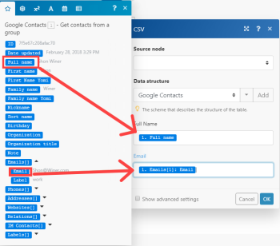

# CSV

The [!DNL Adobe Workfront Fusion] [!UICONTROL CSV] modules let you create CSV files and parse CSV text from a received text value or a file.

## Access requirements

You must have the following access to use the functionality in this article:

<table style="table-layout:auto">
 <col> 
 <col> 
 <tbody> 
  <tr> 
   <td role="rowheader">[!DNL Adobe Workfront] plan*</td>
  <td> 
[!UICONTROL Pro] or higher
 </td>
  </tr> 
  <tr data-mc-conditions=""> 
   <td role="rowheader">[!DNL Adobe Workfront] license*</td>
   <td> 
[!UICONTROL Plan], [!UICONTROL Work]
 </td> 
  </tr> 
  <tr> 
   <td role="rowheader">[!DNL Adobe Workfront Fusion] license**</td> 
   <td>
   
Current license requirement: No [!DNL Workfront Fusion] license requirement.

   
Or

   
Legacy license requirement: [!UICONTROL [!DNL Workfront Fusion] for Work Automation and Integration],  [!UICONTROL [!DNL Workfront Fusion] for Work Automation]

   </td> 
  </tr> 
  <tr> 
   <td role="rowheader">Product</td> 
   <td>
   
Current product requirement: If you have the [!UICONTROL Select] or [!UICONTROL Prime] [!DNL Adobe Workfront] Plan, your organization must purchase [!DNL Adobe Workfront Fusion] as well as [!DNL Adobe Workfront] to use functionality described in this article. [!DNL Workfront Fusion] is included in the [!UICONTROL Ultimate] [!DNL Workfront] plan.

   
Or

   
Legacy product requirement: Your organization must purchase [!DNL Adobe Workfront Fusion] as well as [!DNL Adobe Workfront] to use functionality described in this article.

   </td> 
  </tr> 
 </tbody> 
</table>

To find out what plan, license type, or access you have, contact your [!DNL Workfront] administrator.

For information on [!DNL Adobe Workfront Fusion] licenses, see [[!DNL Adobe Workfront Fusion] licenses](../../workfront-fusion/get-started/license-automation-vs-integration.md).

## [!UICONTROL Create CSV]

The [!UICONTROL Create CSV] Aggregator lets you create a csv text from received text values.

For more information on aggregators, see [Aggregator module in [!DNL Adobe Workfront Fusion]](../../workfront-fusion/modules/aggregator-module.md).

<table style="table-layout:auto">
    <tr>
        <td>[!UICONTROL Source Module]</td>
        <td>Select the module you are using to aggregate the fields you need.</td>
    </tr>
    <tr>
        <td>[!UICONTROL Aggregated Fields]</td>
        <td>Select the fields you want to aggregate from the list of available fields.</td>
    </tr>
    <tr>
        <td>[!UICONTROL Include headers in the first row]</td>
        <td>Select this option to include the headers in the result.</td>
    </tr>
    <tr>
        <td>[!UICONTROL Group by]</td>
        <td>Enter the filter to group the results. For example, enter a date.</td>
    </tr>
    <tr>
        <td>[!UICONTROL Stop processing after an empty aggregation]</td>
        <td>Select this option to stop the scenario when there are no results.</td>
    </tr>
</table>

## [!UICONTROL Create CSV (advanced)]

The [!UICONTROL Create CSV (advanced)] Aggregator lets you create a CSV text from received text values. It employs a data structure that defines the CSV columns in the resulting CSV file. Once defined, the columns appear as fields in the CSV module setup, and can be mapped to later module in the scenario.

For more information on aggregators, see [Aggregator module in [!DNL Adobe Workfront Fusion]](../../workfront-fusion/modules/aggregator-module.md).

<table style="table-layout:auto">
 <col> 
 <col> 
 <tbody> 
  <tr> 
   <td role="rowheader">[!UICONTROL Source Module]</td> 
   <td>Select the app module you are using to aggregate the fields you need.</td> 
  </tr> 
  <tr> 
   <td role="rowheader">[!UICONTROL Data Structure]</td> 
   <td> 
Select the data structure to aggregate the fields in the way you want. After defining the data structure, you can map the items to the corresponding fields.
 
For more information, see <a href="../../workfront-fusion/modules/data-structures.md" class="MCXref xref">Data structures in [!DNL Adobe Workfront Fusion]</a>.
 </td> 
  </tr> 
  <tr> 
   <td role="rowheader">[!UICONTROL Include headers in the first row] </td> 
   <td>Select this option to include the headers in the result. </td> 
  </tr> 
  <tr> 
   <td role="rowheader">[!UICONTROL Group by] </td> 
   <td>Enter the filter to group the results. For example, enter a date. </td> 
  </tr> 
  <tr> 
   <td role="rowheader">[!UICONTROL Stop processing after an empty aggregation] </td> 
   <td>Select this option to stop the scenario when there are no results. </td> 
  </tr> 
 </tbody> 
</table>

Let us assume you would like to export your Google contacts to a CSV file with two columns "Full Name" and "Email". The output bundle from the [!UICONTROL Google Contacts] >[!UICONTROL Get contacts from a group] module has the following structure. The email addresses are stored inside the <code>[!UICONTROL Emails[]]</code> item, which is an array of collections, each collection containing two items: <code>Label</code> and <code>Email</code>.

  

If you employ the simple [!DNL Create CSV] module, you are offered a list of checkboxes corresponding to a bundle's top-level items. If you attempt to tick <code>Full name</code> and <code>Emails</code> items, the [!UICONTROL Create CSV] module produces the following output, which is probably not what you want:

"emails","fullName"

"[object Object]","Shon Winer"

"[object Object]","Lizeth Fulmore"

"[object Object]","Hilario Gullatt"

"[object Object]","Abby Eisenbarth"

Since the item <code>Full Name</code> is of simple type Text, it is exported just fine. But the item <code>Emails</code>, which is of a complex type Array of Collections, is exported as [object Object], which is how Collections and Arrays are transformed to text by default. For more information, see <a href="../../workfront-fusion/mapping/item-data-types.md" class="MCXref xref">Item data types in Adobe Workfront Fusion</a>.

To export content of the <code>Email </code>item of the first collection of the <code>Emails[]</code> array instead, it is necessary to employ the [!UICONTROL Create CSV (advanced)] module. The module enables you to define individual columns of your CSV file and map items to them, including the nested ones.

<ol>
<li value="1">Insert the module [!UICONTROL Create CSV (advanced)] in a scenario and open its configuration.</li>
<li value="2">Click the <strong>[!UICONTROL Add]</strong> button next to the [!UICONTROL Data structure] field to create a new Data structure.</li>
<li value="3"> 
Write in a name for the Data structure and click the <strong>[!UICONTROL Add item]</strong> button to add the individual columns. If you want to export two columns: "Full Name" and "Email", the resulting Data structure would look like this:
 
  
 </li>
<li value="4"> 
Once you have successfully defined the Data structure, fields corresponding to each individual column should appear in the configuration of the [!UICONTROL Create CSV (advanced)] module so you can map the items. Take the first item from the <code>[!UICONTROL Emails[]]</code> array and map its item <code>Email </code>to the field/column Email:
 
  
 </li>
<li value="5"> 
Execute the scenario. Since the item <code>Emails[1]: Email</code> mapped to column "Email" is of simple type Text, it exports correctly now:
 
"Full Name","Email"
 
"Shon Winer","Shon@Winer.com"
 
"Lizeth Fulmore","Lizeth@Fulmore.com"
 
"Hilario Gullatt","Hilario@Gullatt.com"
 
"Abby Eisenbarth","Abby@Eisenbarth.com"
 </li>
</ol>

## [!UICONTROL Parse CSV]

The [!UICONTROL Parse CSV] transformer lets you parse CSV text from a received text value or a file.

<table style="table-layout:auto">
 <col> 
 <col> 
 <tbody> 
  <tr> 
   <td role="rowheader">[!UICONTROL Number of columns]</td> 
   <td>Specify the number of columns in the CSV file.</td> 
  </tr> 
  <tr> 
   <td role="rowheader">[!UICONTROL CSV contains headers]</td> 
   <td> 
Select this option if the first row of the CSV text contains headers.
 
Note: The module does not use these headers to label the columns in the output. Instead, this field ensures that the headers are not included in the output data.
 </td> 
  </tr> 
  <tr> 
   <td role="rowheader">[!UICONTROL delimiterType]</td> 
   <td> 
Select the delimiter for the CSV file. The delimiter is the text character that indicates the boundary between separate values or fields.
 
    <ul> 
     <li>[!UICONTROL Comma]</li> 
     <li>[!UICONTROL Tab]</li> 
     <li> 
[!UICONTROL Other]
 
If you select [!UICONTROL Other], enter the delimiter character that the CSV file is using to separate values. You must enter exactly one character. 
 </li> 
    </ul> </td> 
  </tr> 
  <tr> 
   <td role="rowheader">[!UICONTROL Preserve quotes inside unquoted field]</td> 
   <td>Enable this option to preserve quotes.</td> 
  </tr> 
  <tr> 
   <td role="rowheader">[!UICONTROL CSV]</td> 
   <td>Enter or map the CSV file that you want to parse.
Note: 
If your data comes in binary form (typically from a file), you must use the `toString()` function to convert the binary data to [!UICONTROL String]:

</td> 
  </tr> 
 </tbody> 
</table>
