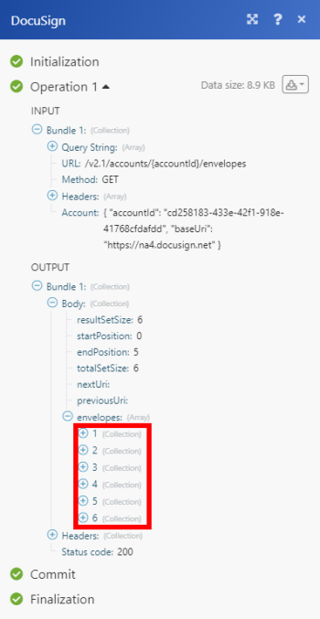

# DocuSign modules

The [!DNL Adobe Workfront Fusion] [!DNL DocuSign] modules enable you to monitor and retrieve envelope status, search and retrieve envelopes, or download and send a document to sign in your [!DNL DocuSign] account.

If you need instructions on creating a scenario, see [Create a scenario in [!DNL Adobe Workfront Fusion]](../../workfront-fusion/scenarios/create-a-scenario.md).

For information about modules, see [Modules in [!DNL Adobe Workfront Fusion]](../../workfront-fusion/modules/modules.md).

## Access requirements

You must have the following access to use the functionality in this article:

<table style="table-layout:auto">
 <col> 
 <col> 
 <tbody> 
  <tr> 
   <td role="rowheader">[!DNL Adobe Workfront] plan*</td>
  <td> 
[!UICONTROL Pro] or higher
 </td>
  </tr> 
  <tr data-mc-conditions=""> 
   <td role="rowheader">[!DNL Adobe Workfront] license*</td>
   <td> 
[!UICONTROL Plan], [!UICONTROL Work]
 </td> 
  </tr> 
  <tr> 
   <td role="rowheader">[!DNL Adobe Workfront Fusion] license**</td> 
   <td> 
[!UICONTROL [!DNL Workfront Fusion] for Work Automation and Integration] 
 </td> 
  </tr> 
  <tr> 
   <td role="rowheader">Product</td> 
   <td>Your organization must purchase [!DNL Adobe Workfront Fusion] as well as [!DNL Adobe Workfront] to use functionality described in this article.</td> 
  </tr> 
 </tbody> 
</table>

To find out what plan, license type, or access you have, contact your [!DNL Workfront] administrator.

For information on [!DNL Adobe Workfront Fusion] licenses, see [[!DNL Adobe Workfront Fusion] licenses](../../workfront-fusion/get-started/license-automation-vs-integration.md).

## Prerequisites

To use [!DNL DocuSign] modules, you must have a [!DNL DocuSign] account.

## Connect [!DNL DocuSign] to [!DNL Workfront Fusion] {#connect-docusign-to-workfront-fusion}

To create a connection for your [!DNL DocuSign] modules:

1. Click **[!UICONTROL Add]** next to the [!UICONTROL Connection] box when you begin configuring the first [!DNL DocuSign] module.
1. Enter the following:

<table style="table-layout:auto">
    <col> 
    <col> 
    <tbody> 
     <tr> 
      <td role="rowheader"> 
[!UICONTROL Connection name]
 </td> 
      <td>Enter a name for the new [!DNL DocuSign] connection</td> 
     </tr> 
     <tr> 
      <td role="rowheader">[!UICONTROL Account type]</td> 
      <td>Select whether you the account you want to connect to is a production account or a demo account.</td> 
     </tr> 
    </tbody> 
   </table>

1. Continue as described in [Create a connection to [!DNL Adobe Workfront Fusion] - Basic instructions](../../workfront-fusion/connections/connect-to-fusion-general.md#connect).

## [!DNL DocuSign] modules and their fields

When you configure [!DNL DocuSign] modules, [!DNL Workfront Fusion] displays the fields listed below. Along with these, additional [!DNL DocuSign] fields might display, depending on factors such as your access level in the app or service. A bolded title in a module indicates a required field.

If you see the map button above a field or function, you can use it to set variables and functions for that field. For more information, see [Map information from one module to another in [!DNL Adobe Workfront Fusion]](../../workfront-fusion/mapping/map-information-between-modules.md).

* [Triggers](#triggers)
* [Actions](#actions)

### Triggers

#### [!UICONTROL Watch envelopes]

This trigger module starts a scenario when an envelope is sent, delivered, signed, completed, or declined.

<table style="table-layout:auto">
 <col data-mc-conditions=""> 
 <col data-mc-conditions=""> 
 <tbody> 
  <tr> 
   <td role="rowheader">[!UICONTROL Connection] </td> 
   <td> 
For instructions about connecting your [!DNL DocuSign] account to [!DNL Workfront Fusion], see <a href="../../workfront-fusion/scenarios/create-a-scenario.md#connect" class="MCXref xref">Connect the module's app or web service to [!DNL Workfront Fusion]</a> in the article <a href="../../workfront-fusion/scenarios/create-a-scenario.md" class="MCXref xref">Create a scenario in [!DNL Adobe Workfront Fusion]</a>.
 </td> 
  </tr> 
  <tr> 
   <td role="rowheader">[!UICONTROL Account] </td> 
   <td> 
Select the account that contains the records you want to watch.
 </td> 
  </tr> 
  <tr> 
   <td role="rowheader">[!UICONTROL Event type]</td> 
   <td> 
 Select the type of event that you want to watch.
 
    <ul> 
     <li>[!UICONTROL Document completed]</li> 
     <li>[!UICONTROL Document declined]</li> 
     <li>[!UICONTROL Document sent]</li> 
     <li>[!UICONTROL Document signed]</li> 
     <li>[!UICONTROL New document in Inbox]</li> 
    </ul> </td> 
  </tr> 
  <tr> 
   <td role="rowheader"> 
[!UICONTROL Output fields]
 </td> 
   <td> 
Select the fields that you want to include in the module output.
 </td> 
  </tr> 
  <tr> 
   <td role="rowheader">[!UICONTROL Limit]</td> 
   <td>Enter or map the maximum number of records you want the module to work with during each scenario execution cycle.</td> 
  </tr> 
 </tbody> 
</table>

### Actions 

* [[!UICONTROL Custom API Call]](#custom-api-call)
* [[!UICONTROL Download a document]](#download-a-document)
* [[!UICONTROL Read an envelope]](#read-an-envelope)
* [[!UICONTROL Upload a file to an envelope]](#upload-a-file-to-an-envelope)
* [[!UICONTROL Create a new envelope]](#create-a-new-envelope)
* [[!UICONTROL Add Recipient to Envelope]](#add-recipient-to-envelope)
* [[!UICONTROL Add custom field]](#add-custom-field)
* [[!UICONTROL Modify custom field]](#modify-custom-field)
* [[!UICONTROL Send envelope]](#send-envelope)

#### [!UICONTROL Custom API Call] 

This action module allows you to perform a custom API call.

<table style="table-layout:auto">
 <col> 
 <col> 
 <tbody> 
  <tr> 
   <td>[!UICONTROL Connection]</td> 
   <td> 
For instructions about connecting your [!DNL DocuSign] account to [!DNL Workfront Fusion], see <a href="#connect-docusign-to-workfront-fusion" class="MCXref xref">Connect [!DNL DocuSign] to [!DNL Workfront Fusion]</a> in this article.
 </td> 
  </tr> 
  <tr> 
   <td>[!UICONTROL Account]</td> 
   <td>Enter or map the account that you want to use to access the [!DNL DocuSign] API.</td> 
  </tr> 
  <tr> 
   <td>[!UICONTROL URL]</td> 
   <td> 
Type the address on the web server that you want the module to interact with.
 
You can type a relative URL, which means that you don't have to include the protocol (such as <code>http://</code>) at the beginning. This suggests to the web server that the interaction is occurring on the server.
 
For example: <code>[!DNL /api/conversations].create</code>
  </td> 
  </tr> 
  <tr> 
   <td>[!UICONTROL Method]</td> 
   <td> 
Select the HTTP request method you need to configure the API call. For more information, see <a href="../../workfront-fusion/modules/http-request-methods.md" class="MCXref xref" data-mc-variable-override="">HTTP request methods in [!DNL Adobe Workfront Fusion]</a>.
 </td> 
  </tr> 
  <tr> 
   <td>[!UICONTROL Headers]</td> 
   <td> 
Add the headers of the request in the form of a standard JSON object. This determines the content type of the request.
 
For example,<code> {"Content-type":"application/json"}</code>
 
Note: If you're getting errors and it's difficult to determine their origin, consider modifying headers based on the [!DNL Workfront] documentation. If your Custom API Call returns a 422 HTTP Request Error, try using a "Content-Type":"text/plain" header.
 </td> 
  </tr> 
  <tr> 
   <td>[!UICONTROL Query String]</td> 
   <td> 
Add the query for the API call in the form of a standard JSON object.
 
For example: <code>{"name":"something-urgent"}</code>
 </td> 
  </tr> 
  <tr> 
   <td>[!UICONTROL Body]</td> 
   <td> 
Add the body content for the API call in the form of a standard JSON object.
 
Note:  
When using conditional statements such as <code>if</code> in your JSON, put the quotation marks outside of the conditional statement.
 
     
Example: </b>"> 
      
  
 
     
 
 </td> 
  </tr> 
  <tr> 
   <td>[!UICONTROL Limit]</td> 
   <td>Enter or map the maximum number of results to be worked with during one execution cycle.</td> 
  </tr> 
 </tbody> 
</table>

>[!INFO]
>
>**Example:** List Envelopes
>
>The following API call returns envelopes from the specified date in your [!DNL DocuSign] account:
>
>**URL**: `/v2.1/accounts/{accountId}/envelopes/`
>
>**Method**: `GET`
>
>**Query String**:
>
>* **Key**: `from_date`
>
>* **Value**: `YYYY-MM-DD`
>
>Specifies when the request begins checking for status changes for envelopes in the account.
>
>
>
>The result can be found in the module's Output under Bundle > Body > envelopes.
>
>In our example, 6 envelopes were returned:
>
>

#### [!UICONTROL Download a document]

This action module downloads a single document.

<table style="table-layout:auto">
 <col> 
 <col> 
 <tbody> 
  <tr> 
   <td role="rowheader">[!UICONTROL Connection]</td> 
   <td> 
For instructions about connecting your [!DNL DocuSign] account to [!DNL Workfront Fusion], see <a href="#connect-docusign-to-workfront-fusion" class="MCXref xref">Connect [!DNL DocuSign] to [!DNL Workfront Fusion]</a> in this article.
 </td>
  </tr> 
  <tr> 
   <td role="rowheader">[!UICONTROL Account] </td> 
   <td> 
Select the account that contains the document you want to download.
 </td> 
  </tr> 
  <tr> 
   <td role="rowheader">[!UICONTROL Envelope ID]</td> 
   <td> 
 Enter or map the ID of the envelope you want to download.
 </td> 
  </tr> 
  <tr> 
   <td role="rowheader"> 
[!UICONTROL Document ID]
 </td> 
   <td> 
Enter or map the ID of the document you want to download.
 </td> 
  </tr> 
  <tr> 
   <td role="rowheader">[!UICONTROL Certificate]</td> 
   <td>Select <strong>[!UICONTROL Yes]</strong> if you want to include the envelope signing certificate in the download.</td> 
  </tr> 
  <tr> 
   <td role="rowheader">[!UICONTROL Documents by User ID]</td> 
   <td>Select <strong>[!UICONTROL Yes]</strong> if you want to allow recipients to retrieve documents by User ID. For example, if a user is included in two different routing orders with different visibilities, using this option returns all of the documents from both routings.</td> 
  </tr> 
  <tr> 
   <td role="rowheader">[!UICONTROL Encrypt]</td> 
   <td>Select <strong>[!UICONTROL Yes]</strong> if you want the PDF bytes returned in the response to be encrypted for all the key managers configured on your [!DNL DocuSign] account.</td> 
  </tr> 
  <tr> 
   <td role="rowheader">[!UICONTROL Language]</td> 
   <td>Select the language.</td> 
  </tr> 
  <tr> 
   <td role="rowheader">[!UICONTROL Show Changes]</td> 
   <td>When set to <strong>[!UICONTROL Yes]</strong>, any changed fields for the returned PDF are highlighted in yellow and optional signatures or initials are outlined in red.</td> 
  </tr> 
  <tr> 
   <td role="rowheader">[!UICONTROL Watermark]</td> 
   <td> 
Select <strong>[!UICONTROL No]</strong> to remove the watermark from the PDF documents.
 </td> 
  </tr> 
 </tbody> 
</table>

#### [!UICONTROL Read an envelope]

This action module reads information about an envelope in [!DNL DocuSign] using the envelope ID.

<table style="table-layout:auto">
 <col> 
 <col> 
 <tbody> 
  <tr> 
   <td role="rowheader">[!UICONTROL Connection]</td> 
   <td> 
For instructions about connecting your [!DNL DocuSign] account to [!DNL Workfront Fusion], see <a href="#connect-docusign-to-workfront-fusion" class="MCXref xref">Connect [!DNL DocuSign] to [!DNL Workfront Fusion]</a> in this article.
 </td>
  </tr> 
  <tr> 
   <td role="rowheader">[!UICONTROL Account] </td> 
   <td> 
Select the account that contains the document you want to read information from.
 </td> 
  </tr> 
  <tr> 
   <td role="rowheader">[!UICONTROL Envelope ID]</td> 
   <td> 
 Enter or map the ID contains the document you want to read information from.
 </td> 
  </tr> 
  <tr> 
   <td role="rowheader">[!UICONTROL Outputs]</td> 
   <td>Select the properties that you want to appear in the module's output. </td> 
  </tr> 
 </tbody> 
</table>

#### [!UICONTROL Upload a file to an envelope]

This module uploads a specified file to an existing envelope in DocuSign.

<table style="table-layout:auto">
 <col> 
 <col> 
 <tbody> 
  <tr> 
   <td role="rowheader">[!UICONTROL Connection]</td> 
   <td> 
For instructions about connecting your [!DNL DocuSign] account to [!DNL Workfront Fusion], see <a href="#connect-docusign-to-workfront-fusion" class="MCXref xref">Connect [!DNL DocuSign] to [!DNL Workfront Fusion]</a> in this article.
 </td>
  </tr> 
  <tr> 
   <td role="rowheader">[!UICONTROL Account] </td> 
   <td> 
Select the account that contains the envelope where you want to upload a file.
 </td> 
  </tr> 
  <tr> 
   <td role="rowheader">[!UICONTROL Envelope ID]</td> 
   <td> 
 Enter or map the ID of the envelope where you want to upload a file.
 </td> 
  </tr> 
  <tr> 
   <td role="rowheader">[!UICONTROL Source file]</td> 
   <td>Select a source file from a previous module, or enter the source file's name and data.</td> 
  </tr> 
 </tbody> 
</table>

#### [!UICONTROL Create a new envelope]

This action module creates a new envelope from a template. It returns the new envelope's ID, as well as the status of the new envelope.

<table style="table-layout:auto">
 <col data-mc-conditions=""> 
 <col data-mc-conditions=""> 
 <tbody> 
  <tr> 
    <td role="rowheader">[!UICONTROL Connection] </td>

<td> 
For instructions about connecting your DocuSign account to Workfront Fusion, see <a href="../../workfront-fusion/scenarios/create-a-scenario.md#connect" class="MCXref xref">Connect the module's app or web service to Workfront Fusion</a> in the article <a href="../../workfront-fusion/scenarios/create-a-scenario.md" class="MCXref xref">Create a scenario in Adobe Workfront Fusion</a>.
 </td> 
  </tr> 
  <tr> 
    <td role="rowheader">[!UICONTROL Account] </td>
   <td> 
Select the account that contains the envelope where you want to upload a file.
 </td> 
  </tr> 
  <tr> 
    <td role="rowheader" >[!UICONTROL Template]</td>
   <td> 
 Select the template that you want to create the new envelope from. Templates are available based on the [!UICONTROL Account] you selected.
 </td> 
  </tr> 
  <tr> 
   <td role="rowheader">
     [!UICONTROL After creation]
   </td> 
   <td> 
Select whether you want to save the envelope as a draft or send it for signing.
 </td> 
  </tr> 
  <tr> 
    <td role="rowheader" >[!UICONTROL Template recipients]</td>
    <td>Select the recipient of this envelope</td>
  </tr> 
 </tbody> 
</table>

#### [!UICONTROL Add Recipient to Envelope]

This action module adds one or more recipients to an existing envelope. If the envelope has already been sent, the recipient is sent an email. This module is not valid for envelopes that have already been completed.

<table style="table-layout:auto">
 <col data-mc-conditions=""> 
 <col data-mc-conditions=""> 
 <tbody> 
  <tr data-mc-conditions=""> 
    <td>[!UICONTROL Connection] </td>
   <td> 
For instructions about connecting your DocuSign account to Workfront Fusion, see <a href="../../workfront-fusion/scenarios/create-a-scenario.md#connect" class="MCXref xref">Connect the module's app or web service to Workfront Fusion</a> in the article <a href="../../workfront-fusion/scenarios/create-a-scenario.md" class="MCXref xref">Create a scenario in Adobe Workfront Fusion</a>.
 </td> 
  </tr> 
  <tr data-mc-conditions="">
    <td>[!UICONTROL Account] </td>
   <td> 
Select the account that contains the envelope where you want add recipients.
 </td> 
  </tr> 
  <tr> 
    <td>[!UICONTROL Envelope ID]</td>
    <td>Select the or map the ID of the envelope where you want to add the recipient.</td>
  </tr> 
  <tr data-mc-conditions="">
    <td role="rowheader">[!UICONTROL Recipient type]</td>
   <td> 
 Select the type of recipient that you want to add to the envelope.
 
    <ul> 
     <li> 
[!UICONTROL Agent]
 </li> 
     <li> 
[!UICONTROL Carbon copy]
 </li> 
     <li> 
[!UICONTROL Certified delivery]
 </li> 
     <li> 
[!UICONTROL In-person signer]
 </li> 
     <li> 
[!UICONTROL Intermediary]
 </li> 
     <li> 
[!UICONTROL Signer]
 </li> 
    </ul> </td> 
  </tr> 
  <tr> 
    <td>[!UICONTROL Email]</td>
   <td> 
Enter or map the email address of the recipient you want to add to the envelope.
 </td> 
  </tr> 
  <tr> 
    <td>[!UICONTROL Name]</td>
   <td>Enter or map the name of the recipient you want to add to the envelope.</td> 
  </tr> 
  <tr>
    <td>[!UICONTROL Routing order]</td>
   <td> 
Enter or map the routing number for the recipient. Routing number determines the order in which recipients receive and sign your documents.
 </td> 
  </tr> 
  <tr> 
    <td role="rowheader">[!UICONTROL Email body]</td>
   <td>Enter or map the body (content) of the email is sent to the recipent.</td> 
  </tr> 
  <tr>
    <td role="rowheader">[!UICONTROL Email subject]</td>
   <td>Enter or map the subject of the email that is sent to the recipient.</td> 
  </tr> 
    <td role="rowheader">[!UICONTROL Private message]</td>
   <td> <li> 
Only the selected recipient sees the private message, as well as the general message. The private message is limited to 1000 characters.
 </li> </td> 
  </tr> 
  <tr> 
   <td role="rowheader">[!UICONTROL Authentication]</td> 
   <td> 
Select the authentication method that you want to use to confirm the recipient's identity.
 
    <ul> 
     <li> 
<strong>[!UICONTROL None]</strong> 
 </li> 
     <li> 
<strong>[!UICONTROL Access code]</strong> 
 
Enter or map the access code.
 </li> 
     <li> 
<strong>[!UICONTROL Phone]</strong> 
 
Enter or map the phone number
 </li> 
     <li> 
<strong>[!UICONTROL SMS]</strong> 
 
Enter or map the phone number
 </li> 
    </ul> </td> 
  </tr> 
 </tbody> 
</table>

#### [!UICONTROL Add custom field]

This action module adds a custom field to the document

<table style="table-layout:auto">
 <col> 
 <col> 
 <tbody> 
  <tr> 
   <td role="rowheader">[!UICONTROL Connection]</td> 
   <td> 
For instructions about connecting your [!DNL DocuSign] account to [!DNL Workfront Fusion], see <a href="#connect-docusign-to-workfront-fusion" class="MCXref xref">Connect [!DNL DocuSign] to [!DNL Workfront Fusion]</a> in this article.
 </td>
  </tr> 
  <tr> 
   <td role="rowheader">[!UICONTROL Account] </td> 
   <td> 
Select the account that contains the document where you want to add a custom field.
 </td> 
  </tr> 
  <tr> 
   <td role="rowheader">[!UICONTROL Envelope ID]</td> 
   <td> 
 Enter or map the ID of the envelope that contains the document where you want to add a custom field.
 </td> 
  </tr> 
  <tr> 
   <td role="rowheader">[!UICONTROL Field name]</td> 
   <td>Enter or map a name for the new field that you want to add.</td> 
  </tr> 
  <tr> 
   <td role="rowheader">[!UICONTROL Required]</td> 
   <td>Enable this option if you want the added field to be a required field.</td> 
  </tr> 
  <tr> 
   <td role="rowheader">[!UICONTROL Show field]</td> 
   <td>Enable this option if you want the field to be visible.</td> 
  </tr> 
  <tr> 
   <td role="rowheader">[!UICONTROL Value]</td> 
   <td>Enter or map the value (contents) of the added field. </td> 
  </tr> 
 </tbody> 
</table>

#### [!UICONTROL Modify custom field]

This action module modifies a custom field using the field name.

<table style="table-layout:auto">
 <col> 
 <col> 
 <tbody> 
  <tr> 
   <td role="rowheader">[!UICONTROL Connection]</td> 
   <td> 
For instructions about connecting your [!DNL DocuSign] account to [!DNL Workfront Fusion], see <a href="#connect-docusign-to-workfront-fusion" class="MCXref xref">Connect [!DNL DocuSign] to [!DNL Workfront Fusion]</a> in this article.
 </td>
  </tr> 
  <tr> 
   <td role="rowheader">[!UICONTROL Account] </td> 
   <td> 
Select the account that contains the document where you want to modify a custom field.
 </td> 
  </tr> 
  <tr> 
   <td role="rowheader">[!UICONTROL Envelope ID]</td> 
   <td> 
 Enter or map the ID of the envelope that contains the document where you want to modify a custom field.
 </td> 
  </tr> 
  <tr> 
   <td role="rowheader">[!UICONTROL Field ID]</td> 
   <td>Enter or map the ID of the field you want to modify.</td> 
  </tr> 
  <tr> 
   <td role="rowheader">[!UICONTROL Field name]</td> 
   <td>Enter or map the name of the field you want to modify.</td> 
  </tr> 
  <tr> 
   <td role="rowheader">[!UICONTROL Required]</td> 
   <td>Enable this option if you want the modified field to be a required field.</td> 
  </tr> 
  <tr> 
   <td role="rowheader">[!UICONTROL Show field]</td> 
   <td>Enable this option if you want the field to be visible.</td> 
  </tr> 
  <tr> 
   <td role="rowheader">[!UICONTROL Value]</td> 
   <td>Enter or map the value (contents) of the modified field. </td> 
  </tr> 
 </tbody> 
</table>

#### [!UICONTROL Send envelope]

This action module sends a draft envelope to its recipients.

<table style="table-layout:auto">
 <col> 
 <col> 
 <tbody> 
  <tr> 
   <td role="rowheader">[!UICONTROL Connection]</td> 
   <td> 
For instructions about connecting your [!DNL DocuSign] account to [!DNL Workfront Fusion], see <a href="#connect-docusign-to-workfront-fusion" class="MCXref xref">Connect [!DNL DocuSign] to [!DNL Workfront Fusion]</a> in this article.
 </td>
  </tr> 
  <tr> 
   <td role="rowheader">[!UICONTROL Account] </td> 
   <td> 
Select the account that contains the draft envelope that you want to send to its recipients.
 </td> 
  </tr> 
  <tr> 
   <td role="rowheader">[!UICONTROL Envelope ID]</td> 
   <td> 
 Enter or map the ID of the draft envelope that you want to send to its recipients.
 </td> 
  </tr> 
 </tbody> 
</table>
