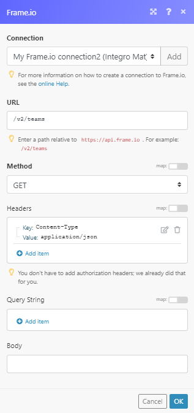

# [!DNL Frame.io] modules

The [!DNL Adobe Workfront Fusion] [!DNL Frame.io] modules enable you to monitor, create, update, retrieve, or delete assets and comments in your [!DNL Frame.io] account.

## Access requirements

You must have the following access to use the functionality in this article:

<table style="table-layout:auto"> 
 <col> 
 <col> 
 <tbody> 
  <tr> 
   <td role="rowheader">[!DNL Adobe Workfront] plan*</td>
  <td> 
[!UICONTROL Pro] or higher
 </td>
  </tr> 
  <tr data-mc-conditions=""> 
   <td role="rowheader">[!DNL Adobe Workfront] license*</td>
   <td> 
[!UICONTROL Plan], [!UICONTROL Work]
 </td> 
  </tr> 
  <tr> 
   <td role="rowheader">[!DNL Adobe Workfront Fusion] license**</td> 
   <td>
   
Current license requirement: No [!DNL Workfront Fusion] license requirement.

   
Or

   
Legacy license requirement: [!UICONTROL [!DNL Workfront Fusion] for Work Automation and Integration] 

   </td> 
  </tr> 
  <tr> 
   <td role="rowheader">Product</td> 
   <td>
   
Current product requirement: If you have the [!UICONTROL Select] or [!UICONTROL Prime] [!DNL Adobe Workfront] Plan, your organization must purchase [!DNL Adobe Workfront Fusion] as well as [!DNL Adobe Workfront] to use functionality described in this article. [!DNL Workfront Fusion] is included in the [!UICONTROL Ultimate] [!DNL Workfront] plan.

   
Or

   
Legacy product requirement: Your organization must purchase [!DNL Adobe Workfront Fusion] as well as [!DNL Adobe Workfront] to use functionality described in this article.

   </td> 
  </tr> 
 </tbody> 
</table>

To find out what plan, license type, or access you have, contact your [!DNL Workfront] administrator.

For information on [!DNL Adobe Workfront Fusion] licenses, see [[!DNL Adobe Workfront Fusion] licenses](../../workfront-fusion/get-started/license-automation-vs-integration.md).

## Prerequisites

To use [!DNL Frame.io] modules, you must have a [!DNL Frame.io] account

## Connect [!DNL Frame.io] to [!UICONTROL Adobe Workfront Fusion] 

You can connect to [!DNL Frame.io] using an API token, or by using OAuth 2.0.

[Connect to [!DNL Frame.io] using an API token](#connect-to-frameio-using-an-api-token)

[Connect to [!DNL Frame.io] using OAuth 2.0 PKCE](#connect-to-frameio-using-oauth-20-pkce)

### Connect to [!DNL Frame.io] using an API token

To connect your [!DNL Frame.io] account to [!DNL Workfront Fusion] using an API token, you must create the API token in your [!DNL Frame.io] account and insert it to the [!DNL Workfront Fusion] [!DNL Frame.io] [!UICONTROL Create a connection] dialog.

1. Log in to your [!DNL Frame.io] account.
1. Go to the **[!UICONTROL Tokens]** page in the [!DNL Frame.io] Developer.
1. Click **[!UICONTROL New]**.
1. Enter the name of the token, select the scopes you want to use, and click **[!UICONTROL Create]**.
1. Copy the provided token.
1. Go to [!DNL Workfront Fusion] and open the [!DNL Frame.io] module's **[!UICONTROL Create a connection]** dialog.
1. In the **[!UICONTROL Connection type]** field, select **[!DNL Frame.io]**.
1. Enter the token you have copied in step 5 to the **[!UICONTROL Your [!DNL Frame.io] API Key]** field and click **[!UICONTROL Continue]** to establish the connection.

The connection has been established. You can proceed with setting up the module.

### Connect to [!DNL Frame.io] using OAuth 2.0 PKCE 

You can create an connection to [!DNL Frame.io] using OAuth 2.0 PKCE with an optional Client ID. If you want to include a Client ID in your connection, you must create an OAuth 2.0 app in your [!DNL Frame.io] account.

* [Connect to [!DNL Frame.io] using using OAuth 2.0 PKCE (without Client ID)](#connect-to-frameio-using-using-oauth-20-pkce-without-client-id)
* [Connect to [!DNL Frame.io] using using OAuth 2.0 PKCE (with Client ID)](#connect-to-frameio-using-using-oauth-20-pkce-with-client-id)

#### Connect to [!DNL Frame.io] using using OAuth 2.0 PKCE (without Client ID) 

1. Go to [!DNL Workfront Fusion] and open the [!DNL Frame.io] module's **[!UICONTROL Create a connection]** dialog.
1. In the **[!UICONTROL Connection type]** field, select **[!UICONTROL [!DNL Frame.io] OAuth 2.0 PKCE]**.
1. Enter a name for the new connection in the **[!UICONTROL Connection name]** field.
1. Click **[!UICONTROL Continue]** to establish the connection.

The connection has been established. You can proceed with setting up the module.

#### Connect to [!DNL Frame.io] using using OAuth 2.0 PKCE (with Client ID) 

1. Create an OAuth 2.0 app in [!DNL Frame.io]. For instructions, see the [!DNL Frame.io] documentation on [!UICONTROL OAuth 2.0 Code Authorization Flow].

   >[!IMPORTANT]
   >
   >When creating the OAuth 2.0 app in [!DNL Frame.io]:
   >
   >* Enter the following as the redirect URI:
   >   
   >  Americas / APAC `https://app.workfrontfusion.com/oauth/cb/frame-io5`
   >
   >  EMEA `https://app-eu.workfrontfusion.com/oauth/cb/frame-io5`
   >
   >* Enable the PCKE option.

1. Copy the provided `client_id`.
1. Go to [!DNL Workfront Fusion] and open the [!DNL Frame.io] module's **[!UICONTROL Create a connection]** dialog.
1. In the **[!UICONTROL Connection type]** field, select **[!UICONTROL [!DNL Frame.io] OAuth 2.0 PKCE]**.
1. Enter a name for the new connection in the **[!UICONTROL Connection name]** field.
1. Click **[!UICONTROL Show advanced settings]**.
1. Enter the `client_id` you copied in step 2 to the **[!UICONTROL Client ID]** field.
1. Click **[!UICONTROL Continue]** to establish the connection.

The connection has been established. You can proceed with setting up the module.

## [!DNL Frame.io] modules and their fields

When you configure [!DNL Frame.io] modules, [!DNL Workfront Fusion] displays the fields listed below. Along with these, additional [!DNL Frame.io] fields might display, depending on factors such as your access level in the app or service. A bolded title in a module indicates a required field.

If you see the map button above a field or function, you can use it to set variables and functions for that field. For more information, see [Map information from one module to another in [!DNL Adobe Workfront Fusion]](../../workfront-fusion/mapping/map-information-between-modules.md).

* [Assets](#assets)
* [Comments](#comments)
* [Projects](#projects)
* [Other](#other)

### Assets 

* [[!UICONTROL Create an Asset]](#create-an-asset)
* [[!UICONTROL Delete an Asset]](#delete-an-asset)
* [[!UICONTROL Get an Asset]](#get-an-asset)
* [[!UICONTROL List Assets]](#list-assets)
* [[!UICONTROL Update an Asset]](#update-an-asset)
* [[!UICONTROL Watch Asset Deleted]](#watch-asset-deleted)
* [[!UICONTROL Watch Asset Label Updated]](#watch-asset-label-updated)
* [[!UICONTROL Watch New Asset]](#watch-new-asset)

#### [!UICONTROL Create an Asset]

This action module creates a new asset.

<table style="table-layout:auto"> 
 <col> 
 <col> 
 <tbody> 
  <tr> 
   <td role="rowheader">[!UICONTROL Connection] </td> 
   <td>For instructions on creating a connection to [!DNL Frame.io], see <a href="#connect-frame-io-to-adobe-workfront-fusion" class="MCXref xref">Connect [!DNL Frame.io] to [!DNL Adobe Workfront Fusion]</a> in this article.</td> 
  </tr> 
  <tr> 
   <td role="rowheader">[!UICONTROL Team ID] </td> 
   <td> 
Select or map the team that owns the project that you want to create an asset for.
 </td> 
  </tr> 
  <tr> 
   <td role="rowheader">[!UICONTROL Project ID] </td> 
   <td> 
Select the project or map the ID of the project that you want to create an asset for.
 </td> 
  </tr> 
  <tr> 
   <td role="rowheader">[!UICONTROL Folder ID] </td> 
   <td> 
Select the folder or map the ID of the folder you want to create an asset in.
 </td> 
  </tr> 
  <tr> 
   <td role="rowheader">[!UICONTROL Type] </td> 
   <td> 
Select whether to create a folder or file.
 </td> 
  </tr> 
  <tr> 
   <td role="rowheader">[!UICONTROL Name] </td> 
   <td> 
Enter the name of the new file or folder.
 </td> 
  </tr> <!--
   <tr data-mc-conditions="QuicksilverOrClassic.Draft mode"> 
    <td role="rowheader">File Type </td> 
    <td> 
Select the type of file you want to upload.
 </td> 
   </tr>
  --> <!--
   <tr data-mc-conditions="QuicksilverOrClassic.Draft mode"> 
    <td role="rowheader">File Size </td> 
    <td> 
The file size in bytes.
 </td> 
   </tr>
  --> 
  <tr> 
   <td role="rowheader">[!UICONTROL Source URL] </td> 
   <td> 
Enter the URL of the file you want to upload.
 </td> 
  </tr> 
  <tr> 
   <td role="rowheader">[!UICONTROL Description] </td> 
   <td> 
Enter a brief description of the asset.
 </td> 
  </tr> 
 </tbody> 
</table>

#### [!UICONTROL Delete an Asset]

This action module deletes a specified asset.

<table style="table-layout:auto"> 
 <col> 
 <col> 
 <tbody> 
  <tr> 
    <td role="rowheader">[!UICONTROL Connection] </td> 
   <td>For instructions on creating a connection to [!DNL Frame.io], see <a href="#connect-frame-io-to-adobe-workfront-fusion" class="MCXref xref">Connect [!DNL Frame.io] to [!DNL Adobe Workfront Fusion]</a> in this article.</td> 
  </tr> 
  <tr> 
   <td role="rowheader">[!UICONTROL Team ID] </td> 
   <td> 
Select or map the team that owns the project that contains the asset you want to delete.
 </td> 
  </tr> 
  <tr> 
   <td role="rowheader">[!UICONTROL Project ID]</td> 
   <td> 
 Select the project or that contains the asset you want to delete.
 </td> 
  </tr> 
  <tr> 
   <td role="rowheader">[!UICONTROL Folder ID] </td> 
   <td> 
Select the folder that contains the asset you want to delete
 </td> 
  </tr> 
  <tr> 
   <td role="rowheader">[!UICONTROL Asset ID] </td> 
   <td> 
Select or map the asset you want to delete.
 </td> 
  </tr> 
 </tbody> 
</table>

#### [!UICONTROL Get an Asset]

This action module retrieves asset details.

<table style="table-layout:auto"> 
 <col> 
 <col> 
 <tbody> 
  <tr> 
    <td role="rowheader">[!UICONTROL Connection] </td> 
   <td>For instructions on creating a connection to [!DNL Frame.io], see <a href="#connect-frame-io-to-adobe-workfront-fusion" class="MCXref xref">Connect [!DNL Frame.io] to [!DNL Adobe Workfront Fusion]</a> in this article.</td> 
  </tr> 
  <tr> 
   <td role="rowheader">[!UICONTROL Team ID] </td> 
   <td> 
Select or map the team that owns the project that contains the asset you want to retrieve details about.
 </td> 
  </tr> 
  <tr> 
   <td role="rowheader">[!UICONTROL Project ID]</td> 
   <td> 
 Select the project that contains the asset you want to retrieve details about.
 </td> 
  </tr> 
  <tr> 
   <td role="rowheader">[!UICONTROL Folder ID] </td> 
   <td> 
Select the folder that contains the asset you want to retrieve details about.
 </td> 
  </tr> 
  <tr> 
   <td role="rowheader">[!UICONTROL Asset ID] </td> 
   <td> 
Select the asset or map the ID of the asset you want to retrieve details about.
 </td> 
  </tr> 
 </tbody> 
</table>

#### [!UICONTROL List Assets]

This search module retrieves all assets in the specified project's folder.

<table style="table-layout:auto"> 
 <col> 
 </col> 
 <col> 
 </col> 
 <tbody> 
  <tr> 
    <td role="rowheader">[!UICONTROL Connection] </td> 
   <td>For instructions on creating a connection to [!DNL Frame.io], see <a href="#connect-frame-io-to-adobe-workfront-fusion" class="MCXref xref">Connect [!DNL Frame.io] to [!DNL Adobe Workfront Fusion]</a> in this article.</td> 
  </tr> 
  <tr> 
   <td role="rowheader">[!UICONTROL Team ID] </td> 
   <td> 
Select or map the team that owns the project that contains the folder you want to retrieve assets from.
 </td> 
  </tr> 
  <tr> 
   <td role="rowheader">[!UICONTROL Project ID]</td> 
   <td> 
 Select the project that contains the folder you want to retrieve assets from.
 </td> 
  </tr> 
  <tr> 
   <td role="rowheader">[!UICONTROL Folder ID] </td> 
   <td> 
Select the folder you want to list assets from.
 </td> 
  </tr> 
  <tr> 
   <td role="rowheader">[!UICONTROL Limit] </td> 
   <td> 
Set the maximum number of assets [!DNL Workfront Fusion] will return during one execution cycle.
 </td> 
  </tr> 
 </tbody> 
</table>

#### `[!UICONTROL Update an Asset]`

This action module allows you to update an existing asset's name, description, or custom fields.

<table style="table-layout:auto"> 
 <col> 
 <col> 
 <tbody> 
  <tr> 
    <td role="rowheader">[!UICONTROL Connection] </td> 
   <td>For instructions on creating a connection to [!DNL Frame.io], see <a href="#connect-frame-io-to-adobe-workfront-fusion" class="MCXref xref">Connect [!DNL Frame.io] to [!DNL Adobe Workfront Fusion]</a> in this article.</td> 
  </tr> 
  <tr> 
   <td role="rowheader">[!UICONTROL Team ID] </td> 
   <td> 
Select or map the team that owns the project that you want to update an asset for.
 </td> 
  </tr> 
  <tr> 
   <td role="rowheader">[!UICONTROL Project ID] </td> 
   <td> 
Select the project or map the ID of the project that you want to update an asset for.
 </td> 
  </tr> 
  <tr> 
   <td role="rowheader">[!UICONTROL Folder ID] </td> 
   <td> 
Select the folder or map the ID of the folder you want to update an asset in.
 </td> 
  </tr> 
  <tr> 
   <td role="rowheader">[!UICONTROL Name] </td> 
   <td> 
Enter the name of the updated file.
 </td> 
  </tr> 
  <tr> 
   <td role="rowheader">[!UICONTROL Description] </td> 
   <td> 
Enter a brief description of the updated asset.
 </td> 
  </tr> 
 </tbody> 
</table>

#### [!UICONTROL Watch Asset Deleted]

This trigger module starts a scenario when an asset is deleted.

<table style="table-layout:auto"> 
 <col> 
 <col> 
 <tbody> 
  <tr> 
   <td role="rowheader">[!UICONTROL Webhook name]</td> 
   <td> 
 Enter the name of the webhook, e.g. Asset deleted.
 </td> 
  </tr> 
  <tr> 
    <td role="rowheader">[!UICONTROL Connection] </td> 
   <td>For instructions on creating a connection to [!DNL Frame.io], see <a href="#connect-frame-io-to-adobe-workfront-fusion" class="MCXref xref">Connect [!DNL Frame.io] to [!DNL Adobe Workfront Fusion]</a> in this article.</td> 
  </tr> 
  <tr> 
   <td role="rowheader">[!UICONTROL Team ID] </td> 
   <td> 
Select the team this webhook is created for.
 </td> 
  </tr> 
 </tbody> 
</table>

#### [!UICONTROL Watch Asset Label Updated]

This trigger module starts a scenario when an asset's status is set, changed, or removed.

<table style="table-layout:auto"> 
 <col> 
 <col> 
 <tbody> 
  <tr> 
   <td role="rowheader">[!UICONTROL Webhook name]</td> 
   <td> 
 Enter the name of the webhook, e.g. Asset status updated.
 </td> 
  </tr> 
  <tr> 
    <td role="rowheader">[!UICONTROL Connection] </td> 
   <td>For instructions on creating a connection to [!DNL Frame.io], see <a href="#connect-frame-io-to-adobe-workfront-fusion" class="MCXref xref">Connect [!DNL Frame.io] to [!DNL Adobe Workfront Fusion]</a> in this article.</td> 
  </tr> 
  <tr> 
   <td role="rowheader">[!UICONTROL Team ID] </td> 
   <td> 
Select the team this webhook is created for.
 </td> 
  </tr> 
 </tbody> 
</table>

#### [!UICONTROL Watch New Asset]

This trigger module starts a scenario when a new asset is created.

<table style="table-layout:auto"> 
 <col> 
 <col> 
 <tbody> 
  <tr> 
   <td role="rowheader">[!UICONTROL Webhook name]</td> 
   <td> 
 Enter the name of the webhook, e.g. Asset created.
 </td> 
  </tr> 
  <tr> 
    <td role="rowheader">[!UICONTROL Connection] </td> 
   <td>For instructions on creating a connection to [!DNL Frame.io], see <a href="#connect-frame-io-to-adobe-workfront-fusion" class="MCXref xref">Connect [!DNL Frame.io] to [!DNL Adobe Workfront Fusion]</a> in this article.</td> 
  </tr> 
  <tr> 
   <td role="rowheader">[!UICONTROL Team ID] </td> 
   <td> 
Select the team this webhook is created for.
 </td> 
  </tr> 
 </tbody> 
</table>

### Comments 

* [[!UICONTROL Create a Comment]](#create-a-comment)
* [[!UICONTROL Delete a Comment]](#delete-a-comment)
* [[!UICONTROL Get a Comment]](#get-a-comment)
* [[!UICONTROL List Comments]](#list-comments)
* [[!UICONTROL Update a Comment]](#update-a-comment)
* [[!UICONTROL Watch Comment Updated]](#watch-comment-updated)
* [[!UICONTROL Watch New Comment]](#watch-new-comment)

#### [!UICONTROL Create a Comment]

This action module adds a new comment or reply to the asset.

<table style="table-layout:auto"> 
 <col> 
 <col> 
 <tbody> 
  <tr> 
    <td role="rowheader">[!UICONTROL Connection] </td> 
   <td>For instructions on creating a connection to [!DNL Frame.io], see <a href="#connect-frame-io-to-adobe-workfront-fusion" class="MCXref xref">Connect [!DNL Frame.io] to [!DNL Adobe Workfront Fusion]</a> in this article.</td> 
  </tr> 
  <tr> 
   <td role="rowheader">[!UICONTROL Type] </td> 
   <td> 
Select whether you want to create a comment or reply to a comment.
 </td> 
  </tr> 
  <tr> 
   <td role="rowheader">[!UICONTROL Team ID] </td> 
   <td> 
Select or map the team that owns the project that contains the asset you want to add a comment to.
 </td> 
  </tr> 
  <tr> 
   <td role="rowheader">[!UICONTROL Project ID] </td> 
   <td> 
Select the project or map the ID of the project that contains the asset you want to add a comment to.
 </td> 
  </tr> 
  <tr> 
   <td role="rowheader">[!UICONTROL Folder ID] </td> 
   <td> 
Select the folder or map the ID of the folder that contains the asset you want to add a comment to.
 </td> 
  </tr> 
  <tr> 
   <td role="rowheader">[!UICONTROL Asset ID] </td> 
   <td> 
Select or map the asset you want to add a comment to.
 </td> 
  </tr> 
  <tr> 
   <td role="rowheader">[!UICONTROL Comment ID] </td> 
   <td> 
Select or map the comment you want to add a reply to.
 </td> 
  </tr> 
  <tr> 
   <td role="rowheader">[!UICONTROL Text]</td> 
   <td> 
 Enter the text content of the comment or reply.
 </td> 
  </tr> 
  <tr> 
   <td role="rowheader">[!UICONTROL Timestamp] </td> 
   <td> 
Enter the frame number in the video the comment should be linked to.
 </td> 
  </tr> 
 </tbody> 
</table>

#### [!UICONTROL Delete a Comment]

This action module deletes an existing comment.

<table style="table-layout:auto"> 
 <col> 
 <col> 
 <tbody> 
  <tr> 
    <td role="rowheader">[!UICONTROL Connection] </td> 
   <td>For instructions on creating a connection to [!DNL Frame.io], see <a href="#connect-frame-io-to-adobe-workfront-fusion" class="MCXref xref">Connect [!DNL Frame.io] to [!DNL Adobe Workfront Fusion]</a> in this article.</td> 
  </tr> 
  <tr> 
   <td role="rowheader">[!UICONTROL Team ID]</td> 
   <td> 
 Select or map the team that owns the project that contains the asset you want to delete a comment from.
 </td> 
  </tr> 
  <tr> 
   <td role="rowheader">[!UICONTROL Project ID]</td> 
   <td> 
 Select the project or map the ID of the project that contains the asset you want to delete a comment from.
 </td> 
  </tr> 
  <tr> 
   <td role="rowheader">[!UICONTROL Folder ID]</td> 
   <td> 
 Select the folder that contains the asset you want to delete a comment from.
 </td> 
  </tr> 
  <tr> 
   <td role="rowheader">[!UICONTROL Asset ID] </td> 
   <td> 
Select the asset that contains the comment you want to delete.
 </td> 
  </tr> 
  <tr> 
   <td role="rowheader">[!UICONTROL Comment ID] </td> 
   <td> 
Select the comment you want to delete.
 </td> 
  </tr> 
 </tbody> 
</table>

#### [!UICONTROL Get a Comment]

This action module retrieves details of the specified comment.

<table style="table-layout:auto"> 
 <col> 
 <col> 
 <tbody> 
  <tr> 
    <td role="rowheader">[!UICONTROL Connection] </td> 
   <td>For instructions on creating a connection to [!DNL Frame.io], see <a href="#connect-frame-io-to-adobe-workfront-fusion" class="MCXref xref">Connect [!DNL Frame.io] to [!DNL Adobe Workfront Fusion]</a> in this article.</td> 
  </tr> 
  <tr> 
   <td role="rowheader">[!UICONTROL Team ID] </td> 
   <td> 
Select or map the team that owns the project that contains the folder you want to retrieve assets from..
 </td> 
  </tr> 
  <tr> 
   <td role="rowheader">[!UICONTROL Project ID] </td> 
   <td> 
Select the project that contains the folder you want to retrieve assets from.
 </td> 
  </tr> 
  <tr> 
   <td role="rowheader">[!UICONTROL Folder ID] </td> 
   <td> 
Select the folder you want to list assets from.
 </td> 
  </tr> 
  <tr> 
   <td role="rowheader">[!UICONTROL Asset ID] </td> 
   <td> 
Select the asset that contains the comment you want to retrieve.
 </td> 
  </tr> 
  <tr> 
   <td role="rowheader">[!UICONTROL Comment ID] </td> 
   <td> 
Select the comment you want to retrieve details about.
 </td> 
  </tr> 
 </tbody> 
</table>

#### [!UICONTROL List Comments]

This search module retrieves all comments of the specified asset.

<table style="table-layout:auto"> 
 <col> 
 <col> 
 <tbody> 
  <tr> 
    <td role="rowheader">[!UICONTROL Connection] </td> 
   <td>For instructions on creating a connection to [!DNL Frame.io], see <a href="#connect-frame-io-to-adobe-workfront-fusion" class="MCXref xref">Connect [!DNL Frame.io] to [!DNL Adobe Workfront Fusion]</a> in this article.</td> 
  </tr> 
  <tr> 
   <td role="rowheader">[!UICONTROL Team ID] </td> 
   <td> 
Select or map the team that owns the project that contains the folder you want to retrieve comments from.
 </td> 
  </tr> 
  <tr> 
   <td role="rowheader">[!UICONTROL Project ID] </td> 
   <td> 
Select the project that contains the folder you want to retrieve comments from.
 </td> 
  </tr> 
  <tr> 
   <td role="rowheader">[!UICONTROL Folder ID] </td> 
   <td> 
Select the folder that contains the asset you want to list comments from.
 </td> 
  </tr> 
  <tr> 
   <td role="rowheader">[!UICONTROL Asset ID] </td> 
   <td> 
Select the asset you want to list comments for.
 </td> 
  </tr> 
  <tr> 
   <td role="rowheader">[!UICONTROL Limit] </td> 
   <td> 
Set the maximum number of comments [!DNL Workfront Fusion] will return during one execution cycle.
 </td> 
  </tr> 
 </tbody> 
</table>

#### [!UICONTROL Update a Comment]

This action module edits an existing comment.

<table style="table-layout:auto"> 
 <col> 
 <col> 
 <tbody> 
  <tr> 
    <td role="rowheader">[!UICONTROL Connection] </td> 
   <td>For instructions on creating a connection to [!DNL Frame.io], see <a href="#connect-frame-io-to-adobe-workfront-fusion" class="MCXref xref">Connect [!DNL Frame.io] to [!DNL Adobe Workfront Fusion]</a> in this article.</td> 
  </tr> 
  <tr> 
   <td role="rowheader">[!UICONTROL Team ID] </td> 
   <td> 
Select or map the team that owns the project that contains the asset you want to update a comment on.
 </td> 
  </tr> 
  <tr> 
   <td role="rowheader">[!UICONTROL Project ID] </td> 
   <td> 
Select the project \ that contains the asset you want to update a comment on.
 </td> 
  </tr> 
  <tr> 
   <td role="rowheader">[!UICONTROL Folder ID] </td> 
   <td> 
Select the folder that contains the asset you want to update a comment on.
 </td> 
  </tr> 
  <tr> 
   <td role="rowheader">[!UICONTROL Asset ID] </td> 
   <td> 
Select the asset you want to update a comment on.
 </td> 
  </tr> 
  <tr> 
   <td role="rowheader">[!UICONTROL Comment ID] </td> 
   <td> 
Select the comment you want to update.
 </td> 
  </tr> 
  <tr> 
   <td role="rowheader">[!UICONTROL Text]</td> 
   <td> 
 Enter the text content of the comment.
 </td> 
  </tr> 
  <tr> 
   <td role="rowheader">[!UICONTROL Timestamp] </td> 
   <td> 
Enter the frame number in the video the comment is linked to.
 </td> 
  </tr> 
 </tbody> 
</table>

#### [!UICONTROL Watch Comment Updated]

This trigger module starts a scenario when a comment is edited.

<table style="table-layout:auto"> 
 <col> 
 <col> 
 <tbody> 
  <tr> 
   <td role="rowheader">[!UICONTROL Webhook name] </td> 
   <td> 
Enter the name of the webhook, e.g. Comment Edited.
 </td> 
  </tr> 
  <tr> 
    <td role="rowheader">[!UICONTROL Connection] </td> 
   <td>For instructions on creating a connection to [!DNL Frame.io], see <a href="#connect-frame-io-to-adobe-workfront-fusion" class="MCXref xref">Connect [!DNL Frame.io] to [!DNL Adobe Workfront Fusion]</a> in this article.</td> 
  </tr> 
  <tr> 
   <td role="rowheader">[!UICONTROL Team ID] </td> 
   <td> 
Select the team this webhook is created for.
 </td> 
  </tr> 
 </tbody> 
</table>

#### [!UICONTROL Watch New Comment]

This trigger module starts a scenario when a new comment or reply is created.

<table style="table-layout:auto"> 
 <col> 
 <col> 
 <tbody> 
  <tr> 
   <td role="rowheader">[!UICONTROL Webhook name] </td> 
   <td> 
Enter the name of the webhook, e.g. New Comment.
 </td> 
  </tr> 
  <tr> 
    <td role="rowheader">[!UICONTROL Connection] </td> 
   <td>For instructions on creating a connection to [!DNL Frame.io], see <a href="#connect-frame-io-to-adobe-workfront-fusion" class="MCXref xref">Connect [!DNL Frame.io] to [!DNL Adobe Workfront Fusion]</a> in this article.</td> 
  </tr> 
  <tr> 
   <td role="rowheader">[!UICONTROL Team ID] </td> 
   <td> 
Select the team this webhook is created for.
 </td> 
  </tr> 
 </tbody> 
</table>

### Projects

#### [!UICONTROL List Projects]

This search module retrieves all projects for the specified team.

<table style="table-layout:auto"> 
 <col> 
 <col> 
 <tbody> 
  <tr> 
    <td role="rowheader">[!UICONTROL Connection] </td> 
   <td>For instructions on creating a connection to [!DNL Frame.io], see <a href="#connect-frame-io-to-adobe-workfront-fusion" class="MCXref xref">Connect [!DNL Frame.io] to [!DNL Adobe Workfront Fusion]</a> in this article.</td> 
  </tr> 
  <tr> 
   <td role="rowheader">[!UICONTROL Team ID] </td> 
   <td> 
Select or map the team you want to retrieve projects for.
 </td> 
  </tr> 
  <tr> 
   <td role="rowheader">[!UICONTROL Limit] </td> 
   <td> 
Set the maximum number of projects [!DNL Workfront Fusion] will return during one execution cycle.
 </td> 
  </tr> 
 </tbody> 
</table>

### Other

#### [!UICONTROL Make an API Call]

This module allows you to perform a custom API call.

<table style="table-layout:auto"> 
 <col> 
 <col> 
 <tbody> 
  <tr> 
    <td role="rowheader">[!UICONTROL Connection] </td> 
   <td>For instructions on creating a connection to [!DNL Frame.io], see <a href="#connect-frame-io-to-adobe-workfront-fusion" class="MCXref xref">Connect [!DNL Frame.io] to [!DNL Adobe Workfront Fusion]</a> in this article.</td> 
  </tr> 
  <tr> 
   <td role="rowheader"> 
[!UICONTROL URL]
 </td> 
   <td> 
Enter a path relative to <code>https://api.frame.io</code>. Example: <code> /v2/teams</code>
 
Note: For the list of available endpoints, refer to the [!DNL Frame.io] API Reference.
 </td> 
  </tr> 
  <tr> 
   <td role="rowheader"> 
[!UICONTROL Method]
 </td> 
   <td> 
Select the HTTP request method you need to configure the API call. For more information, see <a href="../../workfront-fusion/modules/http-request-methods.md" class="MCXref xref">HTTP request methods in [!DNL Adobe Workfront Fusion]</a>.
 </td> 
  </tr> 
  <tr> 
   <td role="rowheader">[!UICONTROL Headers]</td> 
   <td> 
Add the headers of the request in the form of a standard JSON object.
 
For example, <code>{"Content-type":"application/json"}</code>
 
[!DNL Workfront Fusion] adds authorization headers automatically.
 </td> 
  </tr> 
  <tr> 
   <td role="rowheader">[!UICONTROL Query String] </td> 
   <td> 
Enter the request query string. For each parameter that you want to include in the query string, click <b>[!UICONTROL Add item]</b> and enter the field's name and the desired value.
 </td> 
  </tr> 
  <tr> 
   <td role="rowheader">[!UICONTROL Body]</td> 
   <td> 
Add the body content for the API call in the form of a standard JSON object.
 
Note:  
When using conditional statements such as <code>if</code> in your JSON, put the quotation marks outside of the conditional statement.
 
     
Example: </b>"> 
      
  
 
     
 
 </td> 
  </tr> 
 </tbody> 
</table>

**Example:** The following API call returns all teams and its details in your [!DNL Frame.io] account:

URL: `/v2/teams`

Method: `GET`

The result can be found in the module's Output under Bundle > Body.

In our example, the details of 1 team were returned:

