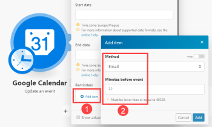
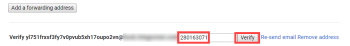

# Google Calendar modules

In an Adobe Workfront Fusion scenario, you can automate workflows that use Google Calendar, as well as connect it to to multiple third-party applications and services.

If you need instructions on creating a scenario, see [Create a scenario in Adobe Workfront Fusion](../../workfront-fusion/scenarios/create-a-scenario.md).

For information about modules, see [Modules in Adobe Workfront Fusion](../../workfront-fusion/modules/modules.md).

## Access requirements

You must have the following access to use the functionality in this article:

<table style="table-layout:auto"> 
 <col> 
 <col> 
 <tbody> 
  <tr> 
   <td role="rowheader">Adobe Workfront plan*</td> 
   <td> <p>Pro or higher</p> </td> 
  </tr> 
  <tr data-mc-conditions=""> 
   <td role="rowheader">Adobe Workfront license*</td> 
   <td> <p>Plan, Work</p> </td> 
  </tr> 
  <tr> 
   <td role="rowheader">Adobe Workfront Fusion license**</td> 
   <td> <p>Workfront Fusion for Work Automation and Integration </p> </td> 
  </tr> 
  <tr> 
   <td role="rowheader">Product</td> 
   <td>Your organization must purchase Adobe Workfront Fusion as well as Adobe Workfront to use functionality described in this article.</td> 
  </tr> <!--
   <tr data-mc-conditions="QuicksilverOrClassic.Draft mode"> 
    <td role="rowheader">Access level configurations*</td> 
    <td> <!--
      <p data-mc-conditions="QuicksilverOrClassic.Draft mode">You must be a Workfront Fusion administrator for your organization.</p>
     --> <!--
      <p data-mc-conditions="QuicksilverOrClassic.Draft mode">You must be a Workfront Fusion administrator for your team.</p>
     --> </td> 
   </tr>
  --> 
 </tbody> 
</table>

&#42;To find out what plan, license type, or access you have, contact your Workfront administrator.

&#42;&#42;For information on Adobe Workfront Fusion licenses, see [Adobe Workfront Fusion licenses](../../workfront-fusion/get-started/license-automation-vs-integration.md)

## Prerequisites

To use Google Calendar modules, you must have a Google account.

## Google Calendar modules and their fields

When you configure Google Calendar modules, Workfront Fusion displays the fields listed below. Along with these, additional Google Calendar fields might display, depending on factors such as your access level in the app or service. A bolded title in a module indicates a required field.

If you see the map button above a field or function, you can use it to set variables and functions for that field. For more information, see [Map information from one module to another in Adobe Workfront Fusion](../../workfront-fusion/mapping/map-information-between-modules.md).


* [Events](#events) 
* [Calendars](#calendars) 
* [Access control rules](#access-control-rules) 
* [Iterators (deprecated)](#iterators-deprecated) 
* [Other](#other)

### Events {#events}

* [Watch events](#watch-events) 
* [Search events](#search-events)

  <!--
  <li data-mc-conditions="QuicksilverOrClassic.Draft mode"><a href="#Watch2" class="MCXref xref">Google Calendar modules</a> </li>
  -->

* [Get an event](#get-an-event) 
* [Create an event](#create-an-event) 
* [Update an event](#update-an-event) 
* [Delete an event](#delete-an-event)

  <!--
  <li data-mc-conditions="QuicksilverOrClassic.Draft mode"><a href="#get-an-event" class="MCXref xref">Get an event</a> </li>
  -->

#### Watch events {#watch-events}

This trigger module executes a scenario when a new event is added, updated, deleted, started, or ended in the calendar you specify. The module returns all standard fields associated with the record or records, along with any custom fields and values that the connection accesses. You can map this information in subsequent modules in the scenario.

When you are configuring this module, the following fields display.

<table style="table-layout:auto"> 
 <col> 
 <col> 
 <tbody> 
  <tr> 
   <td>Connection </td> 
   <td> <p>For instructions about connecting your Google Calendar account to Workfront Fusion, see <a href="../../workfront-fusion/connections/connect-to-fusion-general.md" class="MCXref xref" data-mc-variable-override="">Create a connection to Adobe Workfront Fusion - Basic instructions</a></p> </td> 
  </tr> 
  <tr> 
   <td>Calendar </td> 
   <td> <p>Select the calendar you want the module to work with.</p> </td> 
  </tr> 
  <tr> 
   <td>Watch Events</td> 
   <td> <p>Choose whether you want to watch events by Created Date, Updated Date, Starting Date, or Ending Date.</p> </td> 
  </tr> 
  <tr> 
   <td>Show deleted events</td> 
   <td> <p>Enable this option to include events that were deleted.</p> </td> 
  </tr> 
  <tr> 
   <td>Query </td> 
   <td> <p>Enter text that you want to search for.</p> </td> 
  </tr> 
  <tr> 
   <td>Limit</td> 
   <td> <p> Set the maximum number of events that Workfront Fusion works with during one cycle (the number of repetitions per scenario run). If the value is set too high, the connection may be interrupted on the side of the given third-party service (timeout). Workfront Fusion has no influence on this. We recommend that you set a lower value and either define a higher value for the maximum number of cycles or run the scenario more frequently.</p> </td> 
  </tr> 
 </tbody> 
</table>

#### Search events {#search-events}

This action module searches for an event in the selected calendar.

You specify the calendar and the parameters of the search.

The module returns the ID of the  event and any associated fields, along with any custom fields and values that the connection accesses. You can map this information in subsequent modules in the scenario.

When you are configuring this module, the following fields display.

<table style="table-layout:auto"> 
 <col> 
 <col> 
 <tbody> 
  <tr> 
   <td>Connection </td> 
   <td>For instructions about connecting your Google Calendar account to Workfront Fusion, see <a href="../../workfront-fusion/connections/connect-to-fusion-general.md" class="MCXref xref" data-mc-variable-override="">Create a connection to Adobe Workfront Fusion - Basic instructions</a></td> 
  </tr> 
  <tr> 
   <td>Calendar ID</td> 
   <td> <p>Select the calendar you want to search.</p> </td> 
  </tr> 
  <tr> 
   <td>Start date</td> 
   <td> <p> Enter or map the date when the event starts. This module also retrieves events starting before this date, that are still occurring on the entered start date. </p> <p>For a list of supported date and time formats, see <a href="../../workfront-fusion/mapping/type-coercion.md" class="MCXref xref">Type coercion in Adobe Workfront Fusion</a>.</p> </td> 
  </tr> 
  <tr> 
   <td>End date</td> 
   <td> <p> Enter or map the date when the event ends. </p> <p> For a list of supported date and time formats, see <a href="../../workfront-fusion/mapping/type-coercion.md" class="MCXref xref">Type coercion in Adobe Workfront Fusion</a>.</p> </td> 
  </tr> 
  <tr> 
   <td>Single events</td> 
   <td> <p> Enable this option to treat recurring events as single instances. For example, if you have a weekly meeting and this option is enabled, the module returns each week's meeting as a separate event.</p> </td> 
  </tr> 
  <tr> 
   <td>Query</td> 
   <td> <p>Enter or map the search term that you want to search by. <!--
      <MadCap:conditionalText data-mc-conditions="QuicksilverOrClassic.Draft mode">
        The module does not search extended properies. 
      </MadCap:conditionalText>
     --></p> </td> 
  </tr> 
  <tr> 
   <td>Order by</td> 
   <td> <p>Select the order of the events returned in the result.</p> 
    <ul> 
     <li><strong>Start Time</strong>: Order by the start date and time (ascending). This is only available when querying single events.</li> 
     <li><strong>Updated Time</strong>: Order by last modification time (ascending).</li> 
    </ul> </td> 
  </tr> 
  <tr> 
   <td>Limit</td> 
   <td> <p>Set the maximum number of events Workfront Fusion returns during one execution cycle.</p> </td> 
  </tr> 
 </tbody> 
</table>

#### Get an event {#get-an-event}

This action module returns the metadata for a single event in the specified calendar.

You specify the calendar and event.

The module returns the ID of the event and all associated fields, along with any custom fields and values that the connection accesses. You can map this information in subsequent modules in the scenario.

When you are configuring this module, the following fields display.

<table style="table-layout:auto"> 
 <col> 
 <col> 
 <tbody> 
  <tr> 
   <td>Connection </td> 
   <td> <p>For instructions about connecting your Google Calendar account to Workfront Fusion, see <a href="../../workfront-fusion/connections/connect-to-fusion-general.md" class="MCXref xref" data-mc-variable-override="">Create a connection to Adobe Workfront Fusion - Basic instructions</a></p> </td> 
  </tr> 
  <tr> 
   <td>Calendar ID</td> 
   <td> <p>Enter or map the ID of the calendar that contains the event you want to get.</p> </td> 
  </tr> 
  <tr> 
   <td>Event ID </td> 
   <td> <p>Enter the event ID of the existing Google Calendar event that you want to get.</p> </td> 
  </tr> 
 </tbody> 
</table>

#### Create an event {#create-an-event}

This action module creates an event.

You specify the calendar and the parameters for the event.

The module returns the ID of the  event and any associated fields, along with any custom fields and values that the connection accesses. You can map this information in subsequent modules in the scenario.

When you are configuring this module, the following fields display.

<table style="table-layout:auto"> 
 <col> 
 <col> 
 <tbody> 
  <tr> 
   <td>Connection </td> 
   <td>For instructions about connecting your Google Calendar account to Workfront Fusion, see <a href="../../workfront-fusion/connections/connect-to-fusion-general.md" class="MCXref xref" data-mc-variable-override="">Create a connection to Adobe Workfront Fusion - Basic instructions</a></td> 
  </tr> 
  <tr> 
   <td>Create an Event</td> 
   <td> <p>Select whether you would like to create the event.</p> 
    <ul> 
     <li>In Detail<p>This option allows you to put in more detail about the event.<br></p></li> 
     <li>Quickly<p>You only need to select the calendar and enter a name for the event. You can include time and place details in the name, and Google Calendar will schedule the event for that place and time.</p></li> 
    </ul> </td> 
  </tr> 
  <tr> 
   <td>Calendar ID</td> 
   <td> <p>Select the calendar where you want the event to appear.</p> </td> 
  </tr> 
  <tr> 
   <td>Color</td> 
   <td>Select the color that the event shows on the calendar.</td> 
  </tr> 
  <tr> 
   <td>Event name</td> 
   <td> <p> Enter or map a name for the event. </p> <p>Note: If you have selected Quick add in the Create an event field, you can include the date and time of the event, and Workfront Fusion creates the event for that date and time. Example: <code>Appointment at Capitol Hill on June 3rd 10am-10:25am</code>. If you selected Quick add but do not include a date and time in the event name, the event is created from the current time and lasts an hour.</p> </td> 
  </tr> 
  <tr> 
   <td>All day event</td> 
   <td>Enable this option if the event is an all-day event (does not require start and end times).</td> 
  </tr> 
  <tr> 
   <td>Start date</td> 
   <td> <p>If this is an all-day event, enter the start date of the event. </p> <p>For a list of supported date formats, see <a href="../../workfront-fusion/mapping/type-coercion.md" class="MCXref xref">Type coercion in Adobe Workfront Fusion</a>.</p> </td> 
  </tr> 
  <tr> 
   <td>End date</td> 
   <td> <p> If this is an all-day event, enter the end date of the event. </p> <p>For a list of supported date formats, see <a href="../../workfront-fusion/mapping/type-coercion.md" class="MCXref xref">Type coercion in Adobe Workfront Fusion</a>.</p> </td> 
  </tr> 
  <tr> 
   <td>Description</td> 
   <td>Enter or map a description for the event. This field supports HTML.</td> 
  </tr> 
  <tr> 
   <td>Location</td> 
   <td>Enter a location for the event in text form.</td> 
  </tr> 
  <tr> 
   <td>Use the default reminder settings for this event</td> 
   <td>Enable this option to use default reminder settings. If you set a custom reminder in the Reminder field, this value is set to No.</td> 
  </tr> 
  <tr> 
   <td>Reminder </td> 
   <td> <p>Add reminder for the event. For each reminder, select the method you want to be reminded with and define how long (in minutes) before the event you want to be reminded.</p> </td> 
  </tr> 
  <tr> 
   <td>Attendees</td> 
   <td>Add the attendees to the event. For each attendee, enter or map their name and email address.</td> 
  </tr> 
  <tr> 
   <td>Show me as</td> 
   <td>Select whether you want people who view your calendar to see you as Busy or Available during this event.</td> 
  </tr> 
  <tr> 
   <td>Visibility </td> 
   <td> <p>Select the visibility of this event. </p> 
    <ul> 
     <li> <p>Default</p> <p>The event has the visibility that you have set in your calendar settings.</p> </li> 
     <li> <p>Public</p> <p>Anyone the calendar is shared with can see this event.</p> </li> 
     <li> <p>Private</p> <p>Only attendees can see this event.</p> </li> 
    </ul> </td> 
  </tr> 
  <tr> 
   <td>Send notification about the event creation</td> 
   <td> <p>Select whether to send notifications about the creation of a new event to all guests, to non-Google Calendar guests, or to no one.</p> <p>Tip: We recommend using the None option only for migration use cases.</p> </td> 
  </tr> 
  <tr> 
   <td>Guests can modify the event</td> 
   <td> <p>Enable this option if you want to guests to be able to modify this event.</p> </td> 
  </tr> 
  <tr> 
   <td>Recurrence</td> 
   <td>Add any recurrence rules that you want to apply to this event. Each rule requires a list of RRULE, EXRULE, RDATE, and EXDATE lines for a recurring event. Note that DTSTART and DTEND lines are not allowed in this field; event start and end times are specified in the start and end fields. This field is omitted for single events or instances of recurring events. For more information, see <a href="https://tools.ietf.org/html/rfc5545#section-3.8.5">RFC5545</a>.</td> 
  </tr> 
 </tbody> 
</table>

#### Update an event {#update-an-event}

This action module changes an existing event.

You specify the calendar and event ID.

The module returns the ID of the  event and any associated fields, along with any custom fields and values that the connection accesses. You can map this information in subsequent modules in the scenario.

When you are configuring this module, the following fields display.

<table style="table-layout:auto"> 
 <col> 
 <col> 
 <tbody> 
  <tr> 
   <td>Connection </td> 
   <td> <p>For instructions about connecting your Google Calendar account to Workfront Fusion, see <a href="../../workfront-fusion/connections/connect-to-fusion-general.md" class="MCXref xref" data-mc-variable-override="">Create a connection to Adobe Workfront Fusion - Basic instructions</a></p> </td> 
  </tr> 
  <tr> 
   <td>Calendar </td> 
   <td> <p>Select the calendar you want to work with.</p> </td> 
  </tr> 
  <tr> 
   <td>Event ID </td> 
   <td> <p>Enter the event ID from the previously created Google Calendar event that you want to update.</p> </td> 
  </tr> 
 </tbody> 
</table>

You can update the event information by entering new values to the desired field. For details about the individual fields, see [Create an event](#create-an-event).

#### Delete an event {#delete-an-event}

This action module deletes an event.

You specify the calendar and event ID.

The module returns the ID of the  event and any associated fields, along with any custom fields and values that the connection accesses. You can map this information in subsequent modules in the scenario.

When you are configuring this module, the following fields display.

<table style="table-layout:auto"> 
 <col> 
 <col> 
 <tbody> 
  <tr> 
   <td>Connection </td> 
   <td> <p>For instructions about connecting your Google Calendar account to Workfront Fusion, see <a href="../../workfront-fusion/connections/connect-to-fusion-general.md" class="MCXref xref" data-mc-variable-override="">Create a connection to Adobe Workfront Fusion - Basic instructions</a></p> </td> 
  </tr> 
  <tr> 
   <td>Calendar ID</td> 
   <td> <p>Select the calendar that contains the event you want to delete.</p> </td> 
  </tr> 
  <tr> 
   <td>Event ID</td> 
   <td> <p> Enter the event ID from a previously created Google Calendar event you want to delete.</p> </td> 
  </tr> 
  <tr> 
   <td>Send notification about the event deletion</td> 
   <td>Select whether you want to send notifications about the event deletion to all guests, guests that do not use Google Calendar, or no one.</td> 
  </tr> 
 </tbody> 
</table>

### Calendars {#calendars}

* [List calendars](#list-calendars) 
* [Get a calendar](#get-a-calendar) 
* [Create a calendar](#create-a-calendar) 
* [Update a calendar](#update-a-calendar) 
* [Delete a calendar](#delete-a-calendar) 
* [Clear a calendar](#clear-a-calendar)

#### List calendars {#list-calendars}

This action module returns the calendars on a user's calendar list.

The module returns the ID of the  calendar and any associated fields, along with any custom fields and values that the connection accesses. You can map this information in subsequent modules in the scenario.

When you are configuring this module, the following fields display.

<table style="table-layout:auto"> 
 <col> 
 <col> 
 <tbody> 
  <tr> 
   <td role="rowheader">Connection </td> 
   <td> <p>For instructions about connecting your Google Calendar account to Workfront Fusion, see <a href="../../workfront-fusion/connections/connect-to-fusion-general.md" class="MCXref xref" data-mc-variable-override="">Create a connection to Adobe Workfront Fusion - Basic instructions</a></p> </td> 
  </tr> 
  <tr> 
   <td role="rowheader">Minimum access role</td> 
   <td> <p>Select the minimum access role for the user. The module returns calendars based on this minimum access role.</p> 
    <ul> 
     <li><strong>Free Busy Reader</strong>: The user can read free/busy information. </li> 
     <li><strong>Owner</strong>: The user can read and modify events and can access control lists. </li> 
     <li><strong>Reader</strong>: The user can read events that are not private. </li> 
     <li><strong>Writer</strong>: The user can read and modify events.</li> 
    </ul> </td> 
  </tr> 
  <tr> 
   <td role="rowheader">Show hidden calendars</td> 
   <td>Enable this option to include hidden calendars in the list that the module returns.</td> 
  </tr> 
  <tr> 
   <td role="rowheader">Limit</td> 
   <td>Set the maximum number of calendars Workfront Fusion returns during one execution cycle.</td> 
  </tr> 
 </tbody> 
</table>

#### Get a calendar {#get-a-calendar}

This action module retrieves a calendar.

You specify the ID of the calendar you want to retrieve.

The module returns the ID of the record and any associated fields, along with any custom fields and values that the connection accesses. You can map this information in subsequent modules in the scenario.

When you are configuring this module, the following fields display.

<table style="table-layout:auto"> 
 <col> 
 <col> 
 <tbody> 
  <tr> 
   <td role="rowheader">Connection </td> 
   <td> <p>For instructions about connecting your Google Calendar account to Workfront Fusion, see <a href="../../workfront-fusion/connections/connect-to-fusion-general.md" class="MCXref xref" data-mc-variable-override="">Create a connection to Adobe Workfront Fusion - Basic instructions</a></p> </td> 
  </tr> 
  <tr> 
   <td role="rowheader">Calendar ID</td> 
   <td> <p>Select the calendar you want to retrieve.</p> </td> 
  </tr> 
 </tbody> 
</table>

#### Create a calendar {#create-a-calendar}

This action module creates a new calendar.

You specify a name for the calendar.

The module returns the ID of the  calendar and any associated fields, along with any custom fields and values that the connection accesses. You can map this information in subsequent modules in the scenario.

When you are configuring this module, the following fields display.

<table style="table-layout:auto"> 
 <col> 
 <col> 
 <tbody> 
  <tr> 
   <td>Connection </td> 
   <td> <p>For instructions about connecting your Google Calendar account to Workfront Fusion, see <a href="../../workfront-fusion/connections/connect-to-fusion-general.md" class="MCXref xref" data-mc-variable-override="">Create a connection to Adobe Workfront Fusion - Basic instructions</a></p> </td> 
  </tr> 
  <tr> 
   <td>Calendar name</td> 
   <td> <p> Enter a name for the new calendar.</p> </td> 
  </tr> 
 </tbody> 
</table>

#### Update a calendar {#update-a-calendar}

This action module updates a calendar.

You specify the ID of the calendar you want to update.

The module returns the ID of the  calendar and any associated fields, along with any custom fields and values that the connection accesses. You can map this information in subsequent modules in the scenario.

When you are configuring this module, the following fields display.

<table style="table-layout:auto"> 
 <col> 
 <col> 
 <tbody> 
  <tr> 
   <td>Connection </td> 
   <td> <p>For instructions about connecting your Google Calendar account to Workfront Fusion, see <a href="../../workfront-fusion/connections/connect-to-fusion-general.md" class="MCXref xref" data-mc-variable-override="">Create a connection to Adobe Workfront Fusion - Basic instructions</a></p> </td> 
  </tr> 
  <tr> 
   <td>Calendar ID</td> 
   <td> <p>Select the calendar you want to update.</p> </td> 
  </tr> 
  <tr> 
   <td>Calendar name</td> 
   <td> <p> Enter a new name for the calendar.</p> </td> 
  </tr> 
 </tbody> 
</table>

#### Delete a calendar {#delete-a-calendar}

This action module deletes a calendar.

You specify the ID of the calendar you want to delete.

The module returns the ID of the  calendar and any associated fields, along with any custom fields and values that the connection accesses. You can map this information in subsequent modules in the scenario.

When you are configuring this module, the following fields display.

<table style="table-layout:auto"> 
 <col> 
 <col> 
 <tbody> 
  <tr> 
   <td role="rowheader">Connection </td> 
   <td> <p>For instructions about connecting your Google Calendar account to Workfront Fusion, see <a href="../../workfront-fusion/connections/connect-to-fusion-general.md" class="MCXref xref" data-mc-variable-override="">Create a connection to Adobe Workfront Fusion - Basic instructions</a></p> </td> 
  </tr> 
  <tr> 
   <td role="rowheader">Calendar ID</td> 
   <td> <p>Enter or map the ID&nbsp;of the calendar you want to delete.</p> </td> 
  </tr> 
 </tbody> 
</table>

#### Clear a calendar {#clear-a-calendar}

This action module removes all events from an account's primary calendar.

You specify the connection that connects to the account that contains the calendar you want to clear.

The module returns the ID of the  calendar and any associated fields, along with any custom fields and values that the connection accesses. You can map this information in subsequent modules in the scenario.

When you are configuring this module, the following fields display.

<table style="table-layout:auto"> 
 <col> 
 <col> 
 <tbody> 
  <tr> 
   <td role="rowheader">Connection </td> 
   <td> <p>For instructions about connecting your Google Calendar account to Workfront Fusion, see <a href="../../workfront-fusion/connections/connect-to-fusion-general.md" class="MCXref xref" data-mc-variable-override="">Create a connection to Adobe Workfront Fusion - Basic instructions</a></p> </td> 
  </tr> 
 </tbody> 
</table>

### Access control rules {#access-control-rules}

* [List access control rules](#list-access-control-rules) 
* [Get an access control rule](#get-an-access-control-rule) 
* [Create an access control rule](#create-an-access-control-rule) 
* [Update an access control rule](#update-an-access-control-rule) 
* [Delete an access control rule](#delete-an-access-control-rule)

#### List access control rules {#list-access-control-rules}

This action module returns the rules in the access control list on a calendar.

When you are configuring this module, the following fields display.

<table style="table-layout:auto"> 
 <col> 
 <col> 
 <tbody> 
  <tr> 
   <td role="rowheader">Connection </td> 
   <td> <p>For instructions about connecting your Google Calendar account to Workfront Fusion, see <a href="../../workfront-fusion/connections/connect-to-fusion-general.md" class="MCXref xref" data-mc-variable-override="">Create a connection to Adobe Workfront Fusion - Basic instructions</a></p> </td> 
  </tr> 
  <tr> 
   <td role="rowheader">Calendar ID</td> 
   <td> <p>Select the calendar that contains the access control rules that you want to retrieve.</p> </td> 
  </tr> 
  <tr> 
   <td role="rowheader">Limit</td> 
   <td>Set the maximum number of results Workfront Fusion returns during one execution cycle.</td> 
  </tr> 
 </tbody> 
</table>

#### Get an access control rule {#get-an-access-control-rule}

This action module returns the metadata of an access control rule.

When you are configuring this module, the following fields display.

<table style="table-layout:auto"> 
 <col> 
 <col> 
 <tbody> 
  <tr> 
   <td role="rowheader">Connection </td> 
   <td> <p>For instructions about connecting your Google Calendar account to Workfront Fusion, see <a href="../../workfront-fusion/connections/connect-to-fusion-general.md" class="MCXref xref" data-mc-variable-override="">Create a connection to Adobe Workfront Fusion - Basic instructions</a></p> </td> 
  </tr> 
  <tr> 
   <td role="rowheader">Calendar ID</td> 
   <td> <p>Select the calendar that contains the access control rule that you want to retrieve.</p> </td> 
  </tr> 
  <tr> 
   <td role="rowheader">Access control rule ID</td> 
   <td>Select the access control rule you want to retrieve.</td> 
  </tr> 
 </tbody> 
</table>

#### Create an access control rule {#create-an-access-control-rule}

This action module creates a new access control rule.

You specify a name for the calendar.

The module returns the ID of the  access control rule and any associated fields, along with any custom fields and values that the connection accesses. You can map this information in subsequent modules in the scenario.

When you are configuring this module, the following fields display.

<table style="table-layout:auto"> 
 <col> 
 <col> 
 <tbody> 
  <tr> 
   <td>Connection </td> 
   <td> <p>For instructions about connecting your Google Calendar account to Workfront Fusion, see <a href="../../workfront-fusion/connections/connect-to-fusion-general.md" class="MCXref xref" data-mc-variable-override="">Create a connection to Adobe Workfront Fusion - Basic instructions</a></p> </td> 
  </tr> 
  <tr> 
   <td>Calendar ID</td> 
   <td> <p>Select the calendar where you want to create an access control rule.</p> </td> 
  </tr> 
  <tr> 
   <td>Role</td> 
   <td> <p>Select the role to assign to the access rule. </p> 
    <ul> 
     <li><strong>Free Busy Reader</strong>: The user can read free/busy information. </li> 
     <li><strong>Owner</strong>: The user can read and modify events and can access control lists. </li> 
     <li><strong>Reader</strong>: The user can read events that are not private. </li> 
     <li><strong>Writer</strong>: The user can read and modify events.</li> 
    </ul> </td> 
  </tr> 
  <tr> 
   <td>Type</td> 
   <td> <p>Select the type of scope. </p> 
    <ul> 
     <li><strong>Default</strong>: The public scope. This is the default value. </li> 
     <li><strong>User</strong>: Limits the scope to a single user. </li> 
     <li><strong>Group</strong>: Limits the scope to a group. </li> 
     <li><strong>Domain</strong>: Limits the scope to a domain. </li> 
    </ul> <p>Note: The permissions granted to the Default, or the public, scope apply to any user, authenticated or not.</p> </td> 
  </tr> 
  <tr> 
   <td>Value</td> 
   <td>Enter the email address of a user or a group, or the name of a domain, depending on the scope type.</td> 
  </tr> 
  <tr> 
   <td>Send notifications</td> 
   <td> <p>Enable this option to send notifications about the access change. </p> <p>Note: There are no notifications on access removal. </p> </td> 
  </tr> 
 </tbody> 
</table>

#### Update an access control rule {#update-an-access-control-rule}

This action module updates an access control rule.

You specify a name for the calendar.

The module returns the ID of the  access control rule and any associated fields, along with any custom fields and values that the connection accesses. You can map this information in subsequent modules in the scenario.

When you are configuring this module, the following fields display.

<table style="table-layout:auto"> 
 <col> 
 <col> 
 <tbody> 
  <tr> 
   <td>Connection </td> 
   <td> <p>For instructions about connecting your Google Calendar account to Workfront Fusion, see <a href="../../workfront-fusion/connections/connect-to-fusion-general.md" class="MCXref xref" data-mc-variable-override="">Create a connection to Adobe Workfront Fusion - Basic instructions</a></p> </td> 
  </tr> 
  <tr> 
   <td>Calendar ID</td> 
   <td> <p>Select the calendar that contains the access control rule you want to update.</p> </td> 
  </tr> 
  <tr> 
   <td>Access control rule ID</td> 
   <td>Select the access control rule you want to update.</td> 
  </tr> 
  <tr> 
   <td>Role</td> 
   <td> <p>Select the role to assign to the access rule. </p> 
    <ul> 
     <li><strong>None</strong>: This role provides no access.</li> 
     <li><strong>Free Busy Reader</strong>: The user can read free/busy information. </li> 
     <li><strong>Owner</strong>: The user can read and modify events and can access control lists. </li> 
     <li><strong>Reader</strong>: The user can read events that are not private. </li> 
     <li><strong>Writer</strong>: The user can read and modify events.</li> 
    </ul> </td> 
  </tr> 
  <tr> 
   <td>Send notifications</td> 
   <td> <p>Enable this option to send notifications about the access change. </p> <p>Note: There are no notifications on access removal. </p> </td> 
  </tr> 
 </tbody> 
</table>

#### Delete an access control rule {#delete-an-access-control-rule}

This action module deletes an access control rule.

You specify a name for the calendar.

The module returns the ID of the  access control rule and any associated fields, along with any custom fields and values that the connection accesses. You can map this information in subsequent modules in the scenario.

When you are configuring this module, the following fields display.

<table style="table-layout:auto"> 
 <col> 
 <col> 
 <tbody> 
  <tr> 
   <td>Connection </td> 
   <td> <p>For instructions about connecting your Google Calendar account to Workfront Fusion, see <a href="../../workfront-fusion/connections/connect-to-fusion-general.md" class="MCXref xref" data-mc-variable-override="">Create a connection to Adobe Workfront Fusion - Basic instructions</a></p> </td> 
  </tr> 
  <tr> 
   <td>Calendar ID</td> 
   <td> <p>Select or map the ID&nbsp;of the calendar that contains the access control rule you want to delete.</p> </td> 
  </tr> 
  <tr> 
   <td>Access control rule ID</td> 
   <td>Select or map the ID of the access control rule you want to delete.</td> 
  </tr> 
 </tbody> 
</table>

### Iterators (deprecated) {#iterators-deprecated}

The iterate attachments and iterate attendees modules have been deprecated. To iterate attachments or attendees, use the Flow Control > Iterator module. For more information, see [Iterator module in Adobe Workfront Fusion](../../workfront-fusion/modules/iterator-module.md)

### Other {#other}

* [Make an API Call](#make-an-api-call) 
* [Get Free/Busy Information](#get-free-busy-information)

#### Make an API&nbsp;Call {#make-an-api-call}

This module allows you to perform a custom API call.

<table style="table-layout:auto"> 
 <col> 
 <col> 
 <tbody> 
  <tr> 
   <td role="rowheader">Connection</td> 
   <td> <p>For instructions about connecting your Google Calendar account to Workfront Fusion, see <a href="../../workfront-fusion/connections/connect-to-fusion-general.md" class="MCXref xref" data-mc-variable-override="">Create a connection to Adobe Workfront Fusion - Basic instructions</a></p> </td> 
  </tr> 
  <tr> 
   <td role="rowheader"> <p>URL</p> </td> 
   <td>Enter a path relative to <code>https://www.googleapis.com/calendar</code>. Example: <code>/v3/users/me/calendarList</code></td> 
  </tr> 
  <tr> 
   <td role="rowheader"> <p>Method</p> </td> 
   <td> <p>Select the HTTP request method you need to configure the API call. For more information, see <a href="../../workfront-fusion/modules/http-request-methods.md" class="MCXref xref" data-mc-variable-override="">HTTP request methods in Adobe Workfront Fusion</a>.</p> </td> 
  </tr> 
  <tr> 
   <td role="rowheader">Headers</td> 
   <td> <p>Add the headers of the request in the form of a standard JSON object.For example, <code>{"Content-type":"application/json"}</code>. Workfront Fusion adds the authorization headers for you.</p> </td> 
  </tr> 
  <tr> 
   <td role="rowheader">Query String</td> 
   <td> <p> Add the query for the API call in the form of a standard JSON object.</p> </td> 
  </tr> 
  <tr> 
   <td role="rowheader">Body</td> 
   <td> <p>Add the body content for the API call in the form of a standard JSON object.</p> <p>Note:   <p>When using conditional statements such as <code>if</code> in your JSON, put the quotation marks outside of the conditional statement.</p> 
     <div class="example" data-mc-autonum="<b>Example: </b>">  
      <p>  </p> 
     </div> </p> </td> 
  </tr> 
 </tbody> 
</table>

#### Get Free/Busy Information {#get-free-busy-information}

This action module returns free and busy information for a set of calendars.

The module returns the ID of the  calendar and any associated fields, along with any custom fields and values that the connection accesses. You can map this information in subsequent modules in the scenario.

When you are configuring this module, the following fields display.

<table style="table-layout:auto"> 
 <col> 
 <col> 
 <tbody> 
  <tr> 
   <td>Connection </td> 
   <td>For instructions about connecting your Google Calendar account to Workfront Fusion, see <a href="../../workfront-fusion/connections/connect-to-fusion-general.md" class="MCXref xref" data-mc-variable-override="">Create a connection to Adobe Workfront Fusion - Basic instructions</a></td> 
  </tr> 
  <tr> 
   <td>Minimum time</td> 
   <td> <p> Enter the start of the interval that you want to retrieve information for.</p> <p> For a list of supported date and time formats, see <a href="../../workfront-fusion/mapping/type-coercion.md" class="MCXref xref">Type coercion in Adobe Workfront Fusion</a>.</p> </td> 
  </tr> 
  <tr> 
   <td>Maximum time</td> 
   <td> <p> Enter the end of the interval that you want to retrieve information for. </p> <p>For a list of supported date and time formats, see <a href="../../workfront-fusion/mapping/type-coercion.md" class="MCXref xref">Type coercion in Adobe Workfront Fusion</a>.</p> </td> 
  </tr> 
  <tr> 
   <td>Calendars</td> 
   <td> <p>For each calendar that you want to retrieve information from, click <strong>Add</strong> and enter or map the Calendar ID.</p> </td> 
  </tr> 
 </tbody> 
</table>

## Trigger a scenario before an event

You can trigger a scenario a specified time before an event with the help of standard Google Calendar email reminders and the Webhooks > Custom mailhook module.

1. Use the Google Calendar > Update an event module to add an email reminder to your event:

   

1. Create a new scenario starting with the Webhooks > Custom mailhook module.

   1. Copy the mailhook's email address.
   1. Save the scenario and execute it.

1. In Gmail, redirect the Google Calendar email reminders to the mailhook's email address:

   1. Open your **Gmail settings**.
   1. Open the **Forwarding and POP/IMAP** tab.
   1. Click **Add a forwarding address.**
   1. Paste the copied mailhooks's email address, click**Next**, confirm by pressing **Proceed** in the popup window, then click **OK**.
   
   1. In Workfront Fusion, switch to the new scenario that should finish its execution by receiving the confirmation email.
   1. Click the bubble above the module to inspect the module's output.
   1. Expand the    
   
      ```   
      Text
      ```   
   
      item and copy the Confirmation code:

      

   1. In Gmail, paste the Confirmation code in the edit box and click**Verify**:

      

   1. Open the **Filters and Blocked Addresses** tab.
   1. Click **Create a new filter**.
   1. Setup a filter for all emails coming from    
   
      ```   
      calendar-notification@google.com
      ```   
   
      and click**Create a filter**:
   1. Select **Forward it to** and choose the mailhooks's email address from the list.
   1. Click **Create filter** to create the filter.

1. (Optional) In Workfront Fusion, add the Text parser > Match pattern module after the Webhooks > Custom mailhook module to parse the email's HTML code to obtain any information you need.

   For example, you could configure the module as follows to obtain the event's ID:

   *Pattern*:

   ```
   <meta itemprop="eventId/googleCalendar" content="(?<evenitID>.*?)"/>
   ```

   *Text*: The 

   ```
   HTML content
   ```

   item outputted from the Webhooks > Custom mailhook module:

