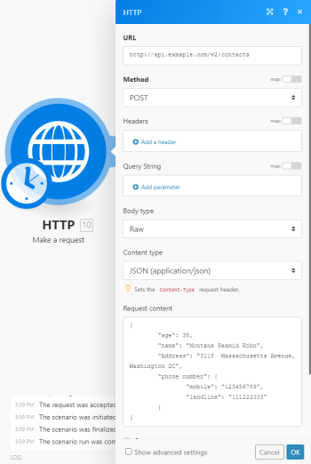

# [!UICONTROL HTTP] >[!UICONTROL Make a request] module

>[!NOTE]
>
>Adobe Workfront Fusion requires an [!DNL Adobe Workfront Fusion] license in addition to an [!DNL Adobe Workfront] license.

The [!DNL Adobe Workfront Fusion] [!UICONTROL HTTP] > [!UICONTROL Make a request module] is a universal module that enables you to configure an HTTP request and submit it to a server. The received HTTP response is then contained in the output bundle.

## Access requirements

You must have the following access to use the functionality in this article:

<table style="table-layout:auto"> 
 <col> 
 <col> 
 <tbody> 
  <tr> 
    <td role="rowheader">[!DNL Adobe Workfront] plan*</td> 
   <td> 
[!UICONTROL Pro] or higher
 </td>
  </tr> 
  <tr data-mc-conditions=""> 
   <td role="rowheader">[!DNL Adobe Workfront] license*</td> 
   <td> 
[!UICONTROL Plan], [!UICONTROL Work]
 </td> 
  </tr> 
  <tr> 
   <td role="rowheader">[!DNL Adobe Workfront Fusion] license**</td> 
   <td>
   
Current license requirement: No [!DNL Workfront Fusion] license requirement.

   
Or

   
Legacy license requirement: [!UICONTROL [!DNL Workfront Fusion] for Work Automation and Integration] 

   </td> 
  </tr> 
  <tr> 
   <td role="rowheader">Product</td> 
   <td>
   
Current product requirement: If you have the [!UICONTROL Select] or [!UICONTROL Prime] [!DNL Adobe Workfront] Plan, your organization must purchase [!DNL Adobe Workfront Fusion] as well as [!DNL Adobe Workfront] to use functionality described in this article. [!DNL Workfront Fusion] is included in the [!UICONTROL Ultimate] [!DNL Workfront] plan.

   
Or

   
Legacy product requirement: Your organization must purchase [!DNL Adobe Workfront Fusion] as well as [!DNL Adobe Workfront] to use functionality described in this article.

   </td> 
  </tr> 
 </tbody> 
</table>

To find out what plan, license type, or access you have, contact your [!DNL Workfront] administrator.

For information on [!DNL Adobe Workfront Fusion] licenses, see [Adobe Workfront Fusion licenses](../../../workfront-fusion/get-started/license-automation-vs-integration.md)

## [!UICONTROL HTTP] >[!UICONTROL Make a request] module configuration

When you configure the [!UICONTROL HTTP] >[!UICONTROL Make a request] module, [!DNL Adobe Workfront Fusion] displays the fields listed below. A bolded title in a module indicates a required field.

If you see the map button above a field or function, you can use it to set variables and functions for that field. For more information, see [Map information from one module to another in [!DNL Adobe Workfront Fusion]](../../../workfront-fusion/mapping/map-information-between-modules.md).

<table style="table-layout:auto"> 
 <col> 
 <col> 
 <tbody> 
  <tr> 
   <td role="rowheader">[!UICONTROL Evaluate all states as errors (except for 2xx and 3xx)] </td> 
   <td> 
Use this option to set up error handling.
 
For more information, see <a href="../../../workfront-fusion/errors/error-handling.md" class="MCXref xref">Error handling in [!DNL Adobe Workfront Fusion]</a>.
 </td> 
  </tr> 
  <tr> 
   <td role="rowheader">[!UICONTROL URL] </td> 
   <td> 
Enter the URL you want to send a request to, such as an API endpoint, website, etc.
 </td> 
  </tr> 
  <tr> 
   <td role="rowheader"> 
[!UICONTROL Method]
 </td> 
   <td> 
Select the HTTP request method you need to configure the API call. For more information, see <a href="../../../workfront-fusion/modules/http-request-methods.md" class="MCXref xref">HTTP request methods in [!DNL Adobe Workfront Fusion]</a>.
 </td> 
  </tr> 
  <tr> 
   <td role="rowheader">[!UICONTROL Headers] </td> 
   <td> 
Add the headers of the request in the form of a standard JSON object.For example, <code>{"Content-type":"application/json"}</code>
 </td> 
  </tr> 
  <tr> 
   <td role="rowheader">[!UICONTROL Query String]</td> 
   <td> 
 Enter the desired query key-value pairs.
 </td> 
  </tr> 
  <tr> 
   <td role="rowheader"> 
[!UICONTROL Body type]
 </td> 
   <td> 
The HTTP Body is the data bytes transmitted in an HTTP transaction message immediately following the headers if there are any to be used.
 
    <ul> 
     <li> 
<strong>[!UICONTROL Raw]</strong> 
 
The Raw body type is generally suitable for most HTTP body requests even in situations where developer documentation does not specify data to send.
 
Specify a form of parsing the data in the [!UICONTROL Content type] field.
 
Despite the content type selected, data is entered in any format that is stipulated or required by the developer documentation.
 </li> 
     <li> 
<strong>[!UICONTROL Application/x-www-form-urlencoded]</strong> 
 
This body type is to [!UICONTROL POST] data using <code>[!UICONTROL application/x-www-form-urlencoded]</code>.
 
For <code>application/x-www-form-urlencoded</code>, the body of the HTTP message sent to the server is essentially one query string. The keys and values are encoded in key-value pairs separated by <code>&amp;</code> and with a <code>=</code> between the key and the value. 
 
For binary data, use <code>[!UICONTROL multipart/form-data]</code> instead.
 
      
Example: </b>">
       <b>Example: </b> 
       
Example of the resulting HTTP request format:
 
       
<code>field1=value1&amp;field2=value2</code> 
 
      
 </li> 
     <li> 
<strong>[!UICONTROL Multipart/form-data]</strong> 
 
The[!UICONTROL  Multipart/form-data] is an HTTP multipart request used to send files and data. It is commonly used to upload files to the server.
 
Add fields to be sent in the request. Each field must contain Key-Value pair.
 
      <ul> 
       <li> 
<strong>[!UICONTROL Text]</strong> 
 
Enter the key and value to be sent within the request body.
 </li> 
       <li> 
<strong>[!UICONTROL File]</strong> 
 
Enter the key and specify the source file you want to send in the request body.
 
Map the file you want to upload from the previous module (such as [!UICONTROL HTTP] >[!UICONTROL Get a File] or [!UICONTROL Google Drive] >[!UICONTROL Download a File)], or enter the file name and file data manually.
 </li> 
      </ul> </li> 
    </ul> </td> 
  </tr> 
  <tr> 
   <td role="rowheader"> 
[!UICONTROL Parse response]
 </td> 
   <td> 
Enable this option to automatically parse responses and convert JSON and XML responses so you don't need to use [!UICONTROL JSON] > [!UICONTROL Parse JSON] or [!UICONTROL XML] > [!UICONTROL Parse XML] modules.
 
Before you can use parsed JSON or XML content, run the module once manually so that the module can recognize the response content and allow you to map it in subsequent modules.
 </td> 
  </tr> 
  <tr> 
   <td role="rowheader"> 
[!UICONTROL User name]
 </td> 
   <td> 
 Enter the user name if you want to send a request using basic authorization.
 </td> 
  </tr> 
  <tr> 
   <td role="rowheader">[!UICONTROL Password] </td> 
   <td> 
Enter the password if you want to send a request using basic authorization.
 </td> 
  </tr> 
  <tr> 
   <td role="rowheader">[!UICONTROL Timeout] </td> 
   <td> 
Specify the request timeout in seconds (1-300). The default is 40 seconds.
 </td> 
  </tr> 
  <tr> 
   <td role="rowheader">[!UICONTROL Share cookies with other HTTP modules]</td> 
   <td> 
 Enable this option to share cookies from the server with all HTTP modules in your scenario.
 </td> 
  </tr> 
  <tr> 
   <td role="rowheader">[!UICONTROL Self-signed certificate]</td> 
   <td> 
 Upload your certificate if you want to use TLS using your self-signed certificate.
 </td> 
  </tr> 
  <tr> 
   <td role="rowheader">[!UICONTROL Reject connections that are using unverified (self-signed) certificates] </td> 
   <td> 
Enable this option to reject connections that are using unverified TLS certificates.
 </td> 
  </tr> 
  <tr> 
   <td role="rowheader">[!UICONTROL Follow redirect]</td> 
   <td> 
 Enable this option to follow the URL redirects with 3xx responses.
 </td> 
  </tr> 
  <tr> 
   <td role="rowheader">[!UICONTROL Follow all redirects] </td> 
   <td> 
Enable this option to follow the URL redirects with all response codes.
 </td> 
  </tr> 
  <tr> 
   <td role="rowheader"> 
[!UICONTROL Disable serialization of multiple same query string keys as arrays]
 </td> 
   <td> 
By default, [!DNL Workfront Fusion] handles multiple values for the same URL query string parameter key as arrays. For example, <code>www.test.com?foo=bar&amp;foo=baz</code> will be converted to <code>www.test.com?foo[0]=bar&amp;foo[1]=baz</code>. Activate this option to disable this feature. 
 </td> 
  </tr> 
  <tr> 
   <td role="rowheader">[!UICONTROL Request compressed content]</td> 
   <td> 
 Enable this option to request a compressed version of the website.
 
Adds an <code>[!UICONTROL Accept-Encoding]</code> header to request compressed content.
 </td> 
  </tr> 
  <tr> 
   <td role="rowheader">[!UICONTROL Use Mutual TLS]</td> 
   <td> 
Enable this option to use Mutual TLS in the HTTP request.
 
For more information on Mutual TLS, see <a href="../../../workfront-fusion/apps-and-their-modules/http-modules/use-mtls-in-http-modules.md" class="MCXref xref">Use Mutual TLS in HTTP modules in [!DNL Adobe Workfront Fusion]</a>.
 </td> 
  </tr> 
 </tbody> 
</table>

>[!INFO]
>
>**Example:** This example shows how to set up the module to submit a [!UICONTROL POST] request with JSON payload:
>
>

>[!NOTE]
>
>To make sure your [!UICONTROL JSON] is valid, you can use one of the available online services such as [https://jsonlint.com/](https://jsonlint.com/). You can also use [!UICONTROL JSON] >[!UICONTROL Create JSON module] to create the JSON dynamically and take care of all the necessary escaping.
>
>Mixing JSON pieces with expressions and items directly in the [!UICONTROL Request content] field is not recommended as it can result in invalid JSON.
