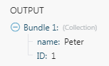

# JSON modules

The Adobe Workfront Fusion JSON app provides modules to process data in JSON format so that Adobe Workfront Fusion can further work with the data content, or create new JSON content.

## Access requirements

You must have the following access to use the functionality in this article:

<table style="table-layout:auto"> 
 <col> 
 <col> 
 <tbody> 
  <tr> 
   <td role="rowheader">[!DNL Adobe Workfront] plan*</td>
  <td> <p>[!UICONTROL Pro] or higher</p> </td>
  </tr> 
  <tr data-mc-conditions=""> 
   <td role="rowheader">[!DNL Adobe Workfront] license*</td>
   <td> <p>[!UICONTROL Plan], [!UICONTROL Work]</p> </td> 
  </tr> 
  <tr> 
   <td role="rowheader">[!DNL Adobe Workfront Fusion] license**</td> 
   <td> <p>[!UICONTROL Workfront Fusion for Work Automation and Integration] </p> <p>Workfront Fusion for Work Automation </p> </td> 
  </tr> 
  <tr> 
   <td role="rowheader">Product</td> 
   <td>Your organization must purchase [!DNL Adobe Workfront Fusion] as well as [!DNL Adobe Workfront] to use functionality described in this article.</td> 
  </tr> 
 </tbody> 
</table>

To find out what plan, license type, or access you have, contact your [!DNL Workfront] administrator.

For information on [!DNL Adobe Workfront Fusion] licenses, see [[!DNL Adobe Workfront Fusion] licenses](../../workfront-fusion/get-started/license-automation-vs-integration.md)

## Parse JSON

* [Data structure](#data-structure) 
* [Collection vs. Array](#collection-vs-array)

### Data structure {#data-structure}

The Data structure describes how the JSON data is organized and enables the mapping of individual JSON items to other modules in your scenario. If you don't provide the Data structure, you may manually execute the module and Workfront Fusion will build the structure from the provided JSON:

1. Add the Parse JSON&nbsp;module to a scenario.
1. In the **JSON String** field, enter the JSON from which you want to build a data structure.
1. Do not connect other modules to the Parse JSON module yet. Because Workfront Fusion does not yet know the structure of the JSON data, it is not yet possible to map data from the Parse JSON module to other modules in your scenario.
1. Manually run the scenario. This allows the Parse JSON module to identify the JSON structure from the JSON you have provided.
1. You can now connect following modules. The items from the Parse JSON module are now available for mapping.

For more information, see [Data structures in Adobe Workfront Fusion](../../workfront-fusion/modules/data-structures.md).

### Collection vs. Array {#collection-vs-array}

If the JSON string field contains a collection `{ ... }`, The output is a single bundle containing the items of the collection.

>[!INFO]
>
>**Example:**
>
>```
>{
>    "name" : "Peter",
>
>    "ID" : 1
>}
>```
>
>

If the JSON string field contains an array `[ ... ]`, the output is a series of bundles. each bundle contains one element of the array.

>[!INFO]
>
>**Example:** 
>
>```
>[
>  {
>    "name" : "Peter",
>    "ID" : 1
>  },
>
>  {
>    "name" : "Mike",
>    "ID" : 2
>  }
>]
>```
>
>

## JSON modules and their fields

When you configure JSON modules, Workfront Fusion displays the fields listed below. Along with these, additional JSON fields might display, depending on factors such as your access level in the app or service. A bolded title in a module indicates a required field.

If you see the map button above a field or function, you can use it to set variables and functions for that field. For more information, see [Map information from one module to another in [!DNL Adobe Workfront Fusion]](../../workfront-fusion/mapping/map-information-between-modules.md).


* [Aggregate to JSON](#aggregate-to-json) 
* [Convert JSON to XML](#convert-json-to-xml) 
* [Parse JSON](#parse-json) 
* [Create JSON](#create-json) 
* [Transform JSON](#transform-json)

### Aggregate to JSON {#aggregate-to-json}

This aggregator module aggregates output from a previous module into JSON. 

<table style="table-layout:auto"> 
 <col data-mc-conditions=""> 
 <col data-mc-conditions=""> 
 <tbody> 
  <tr> 
   <td role="rowheader">Source module </td> 
   <td> <p>Select the module that outputs the data that you want to aggregate to JSON.</p> </td> 
  </tr> 
  <tr> 
   <td role="rowheader">Data structure</td> 
   <td> <p>Select the data structure that you want to use to create JSON. The data structure determines what other fields are available in this module. For more information, see <a href="#data-structure" class="MCXref xref">Data structure</a> in this article.</p> </td> 
  </tr> 
  <tr> 
   <td role="rowheader">Indentation</td> 
   <td> <p> Select whether you want to indent the JSON using tabs, two spaces, or four spaces.</p> </td> 
  </tr> 
  <tr> 
   <td role="rowheader">Group by</td> 
   <td>Define an expression that you want to group the aggregated output by. This expression can contain one or more mapped items. The aggregated data is then separated into groups using this expression's value. Each group outputs as a separate bundle with a key (the evaluated expression) and a value (the aggregated text). You can use the key as a filter in subsequent modules.</td> 
  </tr> 
  <tr> 
   <td role="rowheader">Stop processing after an empty aggregation</td> 
   <td>Enable this option to stop the scenario when there are no results.</td> 
  </tr> 
 </tbody> 
</table>

### Convert JSON to XML {#convert-json-to-xml}

This action module converts a JSON string to XML.

<table style="table-layout:auto"> 
 <col data-mc-conditions=""> 
 <col data-mc-conditions=""> 
 <tbody> 
  <tr> 
   <td role="rowheader">JSON&nbsp;string </td> 
   <td> <p>Enter or map the JSON that you want to convert into XML.</p> </td> 
  </tr> 
 </tbody> 
</table>

### Parse JSON

This action module parses a JSON string into a data structure, which allows you to access the data inside the JSON&nbsp;string.

<table style="table-layout:auto"> 
 <col data-mc-conditions=""> 
 <col data-mc-conditions=""> 
 <tbody> 
  <tr> 
   <td role="rowheader">Data structure</td> 
   <td> <p>Select the data structure that you want to use to create JSON. For more information, see <a href="#data-structure" class="MCXref xref">Data structure</a> in this article.</p> </td> 
  </tr> 
  <tr> 
   <td role="rowheader">JSON&nbsp;string </td> 
   <td> <p>Enter or map the JSON that you want to parse.</p> </td> 
  </tr> 
 </tbody> 
</table>

### Create JSON {#create-json}

This action module creates JSON from a data structure.

<table style="table-layout:auto"> 
 <col data-mc-conditions=""> 
 <col data-mc-conditions=""> 
 <tbody> 
  <tr> 
   <td role="rowheader">Data structure</td> 
   <td> <p>Select the data structure that you want to use to create JSON. For more information, see <a href="#data-structure" class="MCXref xref">Data structure</a> in this article.</p> </td> 
  </tr> 
 </tbody> 
</table>

### Transform JSON {#transform-json}

This action module transforms an object into a json string.

<table style="table-layout:auto"> 
 <col data-mc-conditions=""> 
 <col data-mc-conditions=""> 
 <tbody> 
  <tr> 
   <td role="rowheader">Object</td> 
   <td> <p>Enter or map the object that you want to transform into JSON.</p> </td> 
  </tr> 
 </tbody> 
</table>

## Transforming data records to JSON {#transforming-data-records-to-json}

>[!INFO]
>
>**Example:** The following example shows how to transform data records from Google Sheets to JSON format:
>
>1. Place the Google Sheets > Select rows module in your scenario to fetch the data. Set up the module to retrieve rows from your Google spreadsheet. Set the&#x200B;**Maximum number of returned rows** to a small number, but larger than one for testing purposes (Example, three). Execute the Google Sheets module by right-clicking it and choosing "**Run this module only**." Verify the output of the module.
>
>1. Connect the Array Aggregator module after the Google Sheets module. In the module's setup choose the Google Sheets module in the **Source node** field. Leave the other fields as they are for the moment.
>
>1. Connect JSON > Create JSON module after the Array Aggregator module. The module's setup requires a Data structure that describes the JSON format. Click **Add** to open the Data structure setup. The easiest way to create this Data structure is to generate it automatically from a JSON sample. Click **Generator** and paste your JSON sample to the **Sample data** field:
>
>     **Example:** 
>   
>     ```
>     {
>
>     "books": [
>
>     {
>
>     "id": "ID",
>
>     "title": "Title",
>
>     "author": "Author"
>
>     }
>
>     ]
>
>     }
>
>     ```
>
>1. Click **Save**. The Specification field in the Data structure now contains the generated structure.
>1. Change the name of your Data structure to something more specific and click **Save**. A field corresponding to the root array attribute appears as a mappable field in the JSON module's setup.
>
>1. Click the **Map** button next to the field and map the `Array[]` item from the Array aggregator output to it.
>
>1. Click **OK** to close the JSON module's setup.
>
>1. Open the setup of the Array Aggregator module. Change the **Target structure** from Custom to the JSON module's field corresponding to the root array attribute. Map items from the Google Sheets module to the appropriate fields.
>
>1. Click **OK** to close the Array Aggregator module's setup.
>
>1. Run the scenario.
>
>     The JSON module outputs the correct JSON format. 
>
>1. Open the setup of the Google Sheets module and increase the Maximum number of returned rows number to be larger than the number of rows in your spreadsheet to process all the data.

## Troubleshooting

### Cannot map data from the Parse JSON module

Make sure that the JSON content is properly mapped into the Parse JSON module and that the data structure is correctly defined. For more information, see [Transforming data records to JSON](#transforming-data-records-to-json) in this article.

### Module fails when using conditional statements in JSON

When using conditional statements such as `if` in your JSON, put the quotation marks outside of the conditional statement.

>[!INFO]
>
>**Example:**  
>
>
