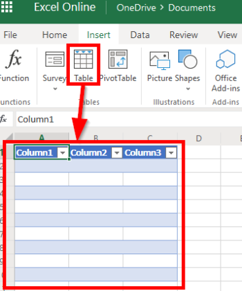

# [!DNL Microsoft Office 365 Excel] modules

In an [!DNL Adobe Workfront Fusion] scenario, you can automate workflows that use [!DNL Microsoft 365 Excel], as well as connect it to multiple third-party applications and services.

If you need instructions on creating a scenario, see [Create a scenario in [!DNL Adobe Workfront Fusion]](../../workfront-fusion/scenarios/create-a-scenario.md).

For information about modules, see [Modules in [!DNL Adobe Workfront Fusion]](../../workfront-fusion/modules/modules.md).

## Access requirements

You must have the following access to use the functionality in this article:

<table style="table-layout:auto"> 
 <col> 
 <col> 
 <tbody> 
  <tr> 
   <td role="rowheader">[!DNL Adobe Workfront] plan*</td>
  <td> 
[!UICONTROL Pro] or higher
 </td>
  </tr> 
  <tr data-mc-conditions=""> 
   <td role="rowheader">[!DNL Adobe Workfront] license*</td>
   <td> 
[!UICONTROL Plan], [!UICONTROL Work]
 </td> 
  </tr> 
  <tr> 
   <td role="rowheader">[!DNL Adobe Workfront Fusion] license**</td> 
   <td>
   
Current license requirement: No [!DNL Workfront Fusion] license requirement.

   
Or

   
Legacy license requirement: [!UICONTROL [!DNL Workfront Fusion] for Work Automation and Integration] 

   </td>  
  </tr> 
  <tr> 
   <td role="rowheader">Product</td> 
   <td>
   
Current product requirement: If you have the [!UICONTROL Select] or [!UICONTROL Prime] [!DNL Adobe Workfront] Plan, your organization must purchase [!DNL Adobe Workfront Fusion] as well as [!DNL Adobe Workfront] to use functionality described in this article. [!DNL Workfront Fusion] is included in the [!UICONTROL Ultimate] [!DNL Workfront] plan.

   
Or

   
Legacy product requirement: Your organization must purchase [!DNL Adobe Workfront Fusion] as well as [!DNL Adobe Workfront] to use functionality described in this article.

   </td> 
  </tr> 
 </tbody> 
</table>

To find out what plan, license type, or access you have, contact your [!DNL Workfront] administrator.

For information on [!DNL Adobe Workfront Fusion] licenses, see [[!DNL Adobe Workfront Fusion] licenses](../../workfront-fusion/get-started/license-automation-vs-integration.md).

## Prerequisites

To use [!DNL Microsoft office 365 Excel], you must have a Microsoft account.

## Microsoft Office 365 Excel API information

The Microsoft Office 365 Excel connector uses the following:

<table style="table-layout:auto"> 
 <col> 
 <col> 
 <tbody> 
  <tr> 
   <td role="rowheader">Base URL</td> 
   <td> https://graph.microsoft.com/v1.0</td> 
  </tr> 
  <tr> 
   <td role="rowheader">API version</td> 
   <td> v1.0 </td> 
  </tr> 
  <tr> 
   <td role="rowheader">API tag</td> 
   <td>v2.0.16</td> 
  </tr>
 </tbody> 
 </table>

## Connecting the [!DNL Office 365 Excel] service to [!DNL Workfront Fusion]

For instructions about connecting your [!DNL Office 365 Excel] account to [!UICONTROL Workfront Fusion], see [Create a connection to [!UICONTROL Adobe Workfront Fusion] - Basic instructions](../../workfront-fusion/connections/connect-to-fusion-general.md)

>[!NOTE]
>
>Some Microsoft apps use the same connection, which is tied to individual user permissions. Therefore, when creating a connection, the permissions consent screen displays any permissions that were previously granted to this user's connection, in addition to any new permissions needed for the current application. 
>
>For example, if a user has "Read table" permissions granted via the Excel connector and then creates a connection in the Outlook connector to read emails, the permissions consent screen will show both the already granted "Read table" permission and the newly required "Write email" permission.

## [!DNL Microsoft Office 365 Excel] modules and their fields

When you configure [!DNL Microsoft 365 Excel] modules, [!DNL Workfront Fusion] displays the fields listed below. Along with these, additional [!DNL Microsoft 365 Excel] fields might display, depending on factors such as your access level in the app or service. A bolded title in a module indicates a required field.

If you see the map button above a field or function, you can use it to set variables and functions for that field. For more information, see [Map information from one module to another in [!DNL Adobe Workfront Fusion]](../../workfront-fusion/mapping/map-information-between-modules.md).

* [Workbook](#workbook)
* [Worksheet](#worksheet)
* [Table](#table)
* [Other](#other)

### Workbook 

* [Watch Workbooks](#watch-workbooks)
* [Search Workbooks](#search-workbooks)
* [Download a Workbook](#download-a-workbook)

#### [!UICONTROL Watch Workbooks]

This trigger module starts a scenario when a workbook is created.

<table style="table-layout:auto"> 
 <col data-mc-conditions=""> 
 <col data-mc-conditions=""> 
 <tbody> 
  <tr> 
   <td role="rowheader"> 
[!UICONTROL Connection]
 </td> 
   <td> 
For instructions about connecting your [!DNL Office 365] account to [!DNL Workfront Fusion], see <a href="../../workfront-fusion/scenarios/create-a-scenario.md#connect" class="MCXref xref">Connect the module's app or web service to [!DNL Workfront Fusion]</a> in the article <a href="../../workfront-fusion/scenarios/create-a-scenario.md" class="MCXref xref">Create a scenario in [!DNL Adobe Workfront Fusion]</a>.
 </td> 
  </tr> 
  <tr> 
   <td role="rowheader">[!UICONTROL Folder]</td> 
   <td> 
Select the folder that you want to watch for new workbooks.
 </td> 
  </tr> 
  <tr> 
   <td role="rowheader"> 
[!UICONTROL Filter]
 </td> 
   <td> 
You can set a filter to watch for only workbooks that meet criteria you select.
 
For each filter, enter the field you want the filter to evaluate, the operator, and the value that you want the filter to allow. You can use more than one filter by adding AND or OR rules.
 </td> 
  </tr> 
  <tr> 
   <td role="rowheader">[!UICONTROL Limit]</td> 
   <td> 
Enter or map the maximum number of workbooks you want the module to return during each scenario execution cycle.
 </td> 
  </tr> 
 </tbody> 
</table>

#### [!UICONTROL Search Workbooks]

This action module searches for [!DNL Excel] workbooks.

<table style="table-layout:auto"> 
 <col data-mc-conditions=""> 
 <col data-mc-conditions=""> 
 <tbody> 
  <tr> 
   <td role="rowheader"> 
[!UICONTROL Connection]
 </td> 
   <td> 
For instructions about connecting your [!DNL Office 365] account to [!DNL Workfront Fusion], see <a href="../../workfront-fusion/scenarios/create-a-scenario.md#connect" class="MCXref xref">Connect the module's app or web service to [!DNL Workfront Fusion]</a> in the article <a href="../../workfront-fusion/scenarios/create-a-scenario.md" class="MCXref xref">Create a scenario in [!DNL Adobe Workfront Fusion]</a>.
 </td> 
  </tr> 
  <tr> 
   <td role="rowheader">[!UICONTROL Folder]</td> 
   <td> 
Select the folder that you want to search for workbooks.
 </td> 
  </tr> 
  <tr> 
   <td role="rowheader"> 
[!UICONTROL Filter]
 </td> 
   <td> 
You can set a filter to search for only workbooks that meet criteria you select.
 
For each filter, enter the field you want the filter to evaluate, the operator, and the value that you want the filter to allow. You can use more than one filter by adding AND or OR rules.
 </td> 
  </tr> 
  <tr> 
   <td role="rowheader">[!UICONTROL Limit]</td> 
   <td> 
Enter or map the maximum number of worksheets you want the module to return during each scenario execution cycle.
 </td> 
  </tr> 
 </tbody> 
</table>

#### [!UICONTROL Download a Workbook]

This action module downloads the content of the specified Excel workbook.

<table style="table-layout:auto"> 
 <col data-mc-conditions=""> 
 <col data-mc-conditions=""> 
 <tbody> 
  <tr> 
   <td role="rowheader"> 
[!UICONTROL Connection]
 </td> 
   <td> 
For instructions about connecting your [!DNL Office 365] account to [!DNL Workfront Fusion], see <a href="../../workfront-fusion/scenarios/create-a-scenario.md#connect" class="MCXref xref">Connect the module's app or web service to [!DNL Workfront Fusion]</a> in the article <a href="../../workfront-fusion/scenarios/create-a-scenario.md" class="MCXref xref">Create a scenario in [!DNL Adobe Workfront Fusion]</a>.
 </td> 
  </tr> 
  <tr> 
   <td role="rowheader">[!UICONTROL Download a workbook]</td> 
   <td> 
Select how you want to identify the workbook for the module to download.
 
    <ul> 
     <li> 
<strong>[!UICONTROL By entering an ID manually]</strong> 
 
In the [!UICONTROL Workbook ID] field, enter or map the ID of the specific workbook that you want the module to download.
 </li> 
     <li> 
<strong>[!UICONTROL By selecting from the path]</strong> 
 
In the [!UICONTROL Workbook] field, select the workbook that you want the module to download.
 </li> 
    </ul> </td> 
  </tr> 
 </tbody> 
</table>

### Worksheet

* [[!UICONTROL Watch Worksheet Rows]](#watch-worksheet-rows)
* [[!UICONTROL List Worksheets]](#list-worksheets)
* [[!UICONTROL List Worksheet Rows]](#list-worksheet-rows)
* [[!UICONTROL Add a Worksheet]](#add-a-worksheet)
* [[!UICONTROL Add a Worksheet Row]](#add-a-worksheet-row)
* [[!UICONTROL Update a Worksheet Row]](#update-a-worksheet-row)
* [[!UICONTROL Delete a Worksheet Row]](#delete-a-worksheet-row)

#### [!UICONTROL Watch Worksheet Rows]

This trigger module starts a scenario when a new row is added to the sheet.

<table style="table-layout:auto"> 
 <col> 
 <col> 
 <tbody> 
  <tr> 
   <td role="rowheader"> 
[!UICONTROL Connection]
 </td> 
   <td> 
For instructions about connecting your [!DNL Office 365] account to [!DNL Workfront Fusion], see <a href="../../workfront-fusion/scenarios/create-a-scenario.md#connect" class="MCXref xref">Connect the module's app or web service to [!DNL Workfront Fusion]</a> in the article <a href="../../workfront-fusion/scenarios/create-a-scenario.md" class="MCXref xref">Create a scenario in [!DNL Adobe Workfront Fusion]</a>.
 </td> 
  </tr> 
  <tr> 
    <td role="rowheader" >[!UICONTROL Workbook] </td>
   <td> 
Select the workbook that contains the worksheet you want to watch for new rows.
 </td> 
  </tr> 
  <tr>
    <td role="rowheader" >[!UICONTROL Worksheet] </td>
   <td> 
Select the Excel sheet that you want to watch for new rows.
 </td> 
  </tr> 
  <tr> 
    <td role="rowheader" >[!UICONTROL Limit]</td>
   <td> 
Enter or map the maximum number of worksheet rows you want the module to return during each scenario execution cycle.
 </td> 
  </tr> 
 </tbody> 
</table>

#### [!UICONTROL List Worksheets]

This action module retrieves a list of worksheets in the specified workbook.

<table style="table-layout:auto"> 
 <col> 
 <col> 
 <tbody> 
  <tr> 
   <td role="rowheader"> 
[!UICONTROL Connection]
 </td> 
   <td> 
For instructions about connecting your [!DNL Office 365] account to [!DNL Workfront Fusion], see <a href="../../workfront-fusion/scenarios/create-a-scenario.md#connect" class="MCXref xref">Connect the module's app or web service to [!DNL Workfront Fusion]</a> in the article <a href="../../workfront-fusion/scenarios/create-a-scenario.md" class="MCXref xref">Create a scenario in [!DNL Adobe Workfront Fusion]</a>.
 </td> 
  </tr> 
  <tr> 
    <td role="rowheader" >[!UICONTROL Workbook] </td>
   <td> 
Select the workbook that contains the worksheets that you want the module to list.
 </td> 
  </tr> 
  <tr> 
    <td role="rowheader" >[!UICONTROL Limit]</td>
   <td> 
Enter or map the maximum number of worksheets you want the module to return during each scenario execution cycle.
 </td> 
  </tr> 
 </tbody> 
</table>

#### [!UICONTROL List Worksheet Rows]

This action module retrieves a list of rows in the specified worksheet.

<table style="table-layout:auto"> 
 <col> 
 <col> 
 <tbody> 
  <tr> 
   <td role="rowheader"> 
[!UICONTROL Connection]
 </td> 
   <td> 
For instructions about connecting your [!DNL Office 365] account to [!DNL Workfront Fusion], see <a href="../../workfront-fusion/scenarios/create-a-scenario.md#connect" class="MCXref xref">Connect the module's app or web service to [!DNL Workfront Fusion]</a> in the article <a href="../../workfront-fusion/scenarios/create-a-scenario.md" class="MCXref xref">Create a scenario in [!DNL Adobe Workfront Fusion]</a>.
 </td> 
  </tr> 
  <tr>
    <td role="rowheader" >[!UICONTROL Workbook] </td>
   <td> 
Select the workbook that contains the worksheet that includes the rows you want to list.
 </td> 
  </tr> 
  <tr> 
    <td role="rowheader" >[!UICONTROL Worksheet] </td>
   <td> 
Select the worksheet that contains the rows you want to list.
 </td> 
  </tr> 
  <tr> 
    <td role="rowheader" >[!UICONTROL Limit]</td>
   <td> 
Enter or map the maximum number of worksheet rows you want the module to return during each scenario execution cycle.
 </td> 
  </tr> 
 </tbody> 
</table>

#### [!UICONTROL Add a Worksheet]

This action module creates a new worksheet within the selected workbook.

<table style="table-layout:auto"> 
 <col data-mc-conditions=""> 
 <col data-mc-conditions=""> 
 <tbody> 
  <tr> 
   <td role="rowheader"> 
[!UICONTROL Connection]
 </td> 
   <td> 
For instructions about connecting your [!DNL Office 365] account to [!DNL Workfront Fusion], see <a href="../../workfront-fusion/scenarios/create-a-scenario.md#connect" class="MCXref xref">Connect the module's app or web service to [!DNL Workfront Fusion]</a> in the article <a href="../../workfront-fusion/scenarios/create-a-scenario.md" class="MCXref xref">Create a scenario in [!DNL Adobe Workfront Fusion]</a>.
 </td> 
  </tr> 
  <tr>
    <td role="rowheader" >[!UICONTROL Workbook] </td>
   <td> 
Select the workbook where you want to add a worksheet.
 </td> 
  </tr> 
  <tr> 
    <td role="rowheader" >[!UICONTROL Name] </td>
   <td> 
Enter or map a name for the new worksheet.
 </td> 
  </tr> 
 </tbody> 
</table>

#### [!UICONTROL Add a Worksheet Row]

This action module adds a new row to the selected worksheet.

<table style="table-layout:auto"> 
 <col data-mc-conditions=""> 
 <col data-mc-conditions=""> 
 <tbody> 
  <tr> 
   <td role="rowheader"> 
[!UICONTROL Connection]
 </td> 
   <td> 
For instructions about connecting your [!DNL Office 365] account to [!DNL Workfront Fusion], see <a href="../../workfront-fusion/scenarios/create-a-scenario.md#connect" class="MCXref xref">Connect the module's app or web service to [!DNL Workfront Fusion]</a> in the article <a href="../../workfront-fusion/scenarios/create-a-scenario.md" class="MCXref xref">Create a scenario in [!DNL Adobe Workfront Fusion]</a>.
 </td> 
  </tr> 
  <tr> 
    <td role="rowheader" >[!UICONTROL Workbook] </td>
   <td> 
Select the workbook that contains the worksheet where you want to add a row.
 </td> 
  </tr> 
  <tr> 
    <td role="rowheader" >[!UICONTROL Worksheet] </td>
   <td> 
Select the worksheet where you want to add a row.
 </td> 
  </tr> 
  <tr> 
   <td role="rowheader"> 
[!UICONTROL Type of values being entered]
 </td> 
   <td> 
Select the type of value to be entered into the worksheet. 
 
    <ul> 
     <li> 
<strong>[!UICONTROL Formulas]</strong> 
 
 Excel tries to evaluate the specified expression. The names of functions in a formula are in English. Example: <code>[!DNL =SUM(A1:A10)]</code>
 </li> 
     <li> 
<strong>[!UICONTROL Formulas local]</strong> 
 
Excel tries to evaluate the specified expression. The function names are in the language of your Excel application. Example: <code>=SUM(A1, 1.5)</code> vs <code>=SUMME(A1; 1,5)</code>
 </li> 
     <li> 
<strong>[!UICONTROL Value]</strong> 
 
Excel does not evaluate the value. 
 </li> 
    </ul> </td> 
  </tr> 
  <tr> 
    <td role="rowheader" >[!UICONTROL Row]</td>
    <td>For each column, enter the value you want the column to have in the new row.</td>
  </tr> 
 </tbody> 
</table>

#### [!UICONTROL Update a Worksheet Row]

This action module updates an existing worksheet row.

<table style="table-layout:auto"> 
 <col data-mc-conditions=""> 
 <col data-mc-conditions=""> 
 <tbody> 
  <tr> 
   <td role="rowheader"> 
[!UICONTROL Connection]
 </td> 
   <td> 
For instructions about connecting your [!DNL Office 365] account to [!DNL Workfront Fusion], see <a href="../../workfront-fusion/scenarios/create-a-scenario.md#connect" class="MCXref xref">Connect the module's app or web service to [!DNL Workfront Fusion]</a> in the article <a href="../../workfront-fusion/scenarios/create-a-scenario.md" class="MCXref xref">Create a scenario in [!DNL Adobe Workfront Fusion]</a>.
 </td> 
  </tr> 
  <tr> 
    <td role="rowheader" >[!UICONTROL Workbook] </td>
   <td> 
Select the workbook that contains the worksheet that includes the row you want to update.
 </td> 
  </tr> 
  <tr> 
    <td role="rowheader" >[!UICONTROL Worksheet] </td>
   <td> 
Select the worksheet that contains the row you want to update.
 </td> 
  </tr> 
  <tr> 
   <td role="rowheader"> 
[!UICONTROL Type of values being entered]
 </td> 
   <td> 
Select the type of value to be entered into the worksheet. 
 
    <ul> 
     <li> 
<strong>[!UICONTROL Formulas]</strong> 
 
 Excel tries to evaluate the specified expression. The names of functions in a formula are in English. Example: <code>[!DNL =SUM(A1:A10)]</code>
 </li> 
     <li> 
<strong>[!UICONTROL Formulas local]</strong> 
 
Excel tries to evaluate the specified expression. The function names are in the language of your Excel application. Example: <code>=SUM(A1, 1.5)</code> vs <code>=SUMME(A1; 1,5)</code>
 </li> 
     <li> 
<strong>[!UICONTROL Value]</strong> 
 
Excel does not evaluate the value. 
 </li> 
    </ul> </td> 
  </tr> 
  <tr> 
   <td role="rowheader">[!UICONTROL Row ID]</td> 
   <td>Select the number of the row to update.</td> 
  </tr> 
  <tr> 
    <td role="rowheader" >[!UICONTROL Row]</td>
    <td>For each column, enter the value you want the column to have in the new row.</td>
   --> 
  </tr> 
 </tbody> 
</table>

#### [!UICONTROL Delete a Worksheet Row]

This action module deletes a row from a worksheet.

<table style="table-layout:auto"> 
 <col data-mc-conditions=""> 
 <col data-mc-conditions=""> 
 <tbody> 
  <tr> 
   <td role="rowheader"> 
[!UICONTROL Connection]
 </td> 
   <td> 
For instructions about connecting your [!DNL Office 365] account to [!DNL Workfront Fusion], see <a href="../../workfront-fusion/scenarios/create-a-scenario.md#connect" class="MCXref xref">Connect the module's app or web service to [!DNL Workfront Fusion]</a> in the article <a href="../../workfront-fusion/scenarios/create-a-scenario.md" class="MCXref xref">Create a scenario in [!DNL Adobe Workfront Fusion]</a>.
 </td> 
  </tr> 
  <tr> 
    <td role="rowheader" >[!UICONTROL Workbook] </td>
   <td> 
Select the workbook that contains the worksheet that includes the row you want to delete.
 </td> 
  </tr> 
  <tr> 
    <td role="rowheader" >[!UICONTROL Worksheet]</td>
   <td> 
 Select the worksheet that contains the row you want to delete.
 </td> 
  </tr> 
  <tr> 
    <td role="rowheader" >[!UICONTROL Row ID]</td>
   <td>Enter or map the ID of the row you want to delete.</td> 
  </tr> 
 </tbody> 
</table>

### Table

* [[!UICONTROL Watch table rows]](#watch-table-rows)
* [[!UICONTROL List tables]](#list-tables)
* [[!UICONTROL List table rows]](#list-table-rows)
* [[!UICONTROL Get a Table]](#get-a-table)
* [[!UICONTROL Add a table]](#add-a-table)
* [[!UICONTROL Add a table row]](#add-a-table-row)
* [[!UICONTROL Update a table]](#update-a-table)
* [[!UICONTROL Delete a table]](#delete-a-table)

#### [!UICONTROL Watch table rows]

This trigger starts a scenario when a new row is added to a table.

>[!NOTE]
>
>The table here refers to the embedded table element in the Workbook. Not the entire table (workbook/sheet).

<table style="table-layout:auto"> 
 <col> 
 <col> 
 <tbody> 
  <tr> 
   <td role="rowheader"> 
[!UICONTROL Connection]
 </td> 
   <td> 
For instructions about connecting your [!DNL Office 365] account to [!DNL Workfront Fusion], see <a href="../../workfront-fusion/scenarios/create-a-scenario.md#connect" class="MCXref xref">Connect the module's app or web service to [!DNL Workfront Fusion]</a> in the article <a href="../../workfront-fusion/scenarios/create-a-scenario.md" class="MCXref xref">Create a scenario in [!DNL Adobe Workfront Fusion]</a>.
 </td> 
  </tr> 
  <tr> 
   <td role="rowheader"> 
[!UICONTROL Workbook]
 </td> 
   <td> 
Select the workbook that contains the table you want to watch.
 </td> 
  </tr> 
  <tr> 
    <td role="rowheader" >[!UICONTROL Worksheet] </td>
   <td> 
 Select the worksheet that contains the table you want to watch.
 </td> 
  </tr> 
  <tr> 
   <td role="rowheader"> 
[!UICONTROL Table]
 </td> 
   <td> 
Select the table you want to watch.
 </td> 
  </tr> 
  <tr> 
    <td role="rowheader" >[!UICONTROL Limit]</td>
   <td> 
Enter or map the maximum number of rows you want the module to return during each scenario execution cycle.
 </td> 
  </tr> 
 </tbody> 
</table>

#### [!UICONTROL List tables]

This search module retrieves a list of all table objects.

<table style="table-layout:auto"> 
 <col> 
 <col> 
 <tbody> 
  <tr> 
   <td role="rowheader"> 
[!UICONTROL Connection]
 </td> 
   <td> 
For instructions about connecting your [!DNL Office 365] account to [!DNL Workfront Fusion], see <a href="../../workfront-fusion/scenarios/create-a-scenario.md#connect" class="MCXref xref">Connect the module's app or web service to [!DNL Workfront Fusion]</a> in the article <a href="../../workfront-fusion/scenarios/create-a-scenario.md" class="MCXref xref">Create a scenario in [!DNL Adobe Workfront Fusion]</a>.
 </td> 
  </tr> 
  <tr>
    <td role="rowheader" >[!UICONTROL Workbook] </td>
   <td> 
Select the workbook that contains the tables you want to list.
 </td> 
  </tr> 
  <tr> 
    <td role="rowheader" >[!UICONTROL Worksheet] </td>
   <td> 
Select the worksheet that contains the tables you want to list
 </td> 
  </tr> 
  <tr> 
    <td role="rowheader" >[!UICONTROL Limit]</td>
   <td> 
Enter or map the maximum number of tables you want the module to return during each scenario execution cycle.
 </td> 
  </tr> 
 </tbody> 
</table>

#### [!UICONTROL List table rows]

This search module retrieves a list of all table rows in a workbook.

<table style="table-layout:auto"> 
 <col> 
 <col> 
 <tbody> 
  <tr> 
   <td role="rowheader"> 
[!UICONTROL Connection]
 </td> 
   <td> 
For instructions about connecting your [!DNL Office 365] account to [!DNL Workfront Fusion], see <a href="../../workfront-fusion/scenarios/create-a-scenario.md#connect" class="MCXref xref">Connect the module's app or web service to [!DNL Workfront Fusion]</a> in the article <a href="../../workfront-fusion/scenarios/create-a-scenario.md" class="MCXref xref">Create a scenario in [!DNL Adobe Workfront Fusion]</a>.
 </td> 
  </tr> 
  <tr> 
    <td role="rowheader" >[!UICONTROL Workbook] </td>
   <td> 
Select the workbook that contains the table that includes the rows you want to list.
 </td> 
  </tr> 
  <tr> 
    <td role="rowheader" >[!UICONTROL Worksheet] </td>
   <td> 
Select the worksheet that contains the table that includes the rows you want to list
 </td> 
  </tr> 
  <tr> 
    <td role="rowheader" >[!UICONTROL Table] </td>
   <td> 
Select the table that contains the rows you want to list.
 </td> 
  </tr> 
  <tr> 
    <td role="rowheader" >[!UICONTROL Limit]</td>
   <td> 
Enter or map the maximum number of table rows you want the module to return during each scenario execution cycle.
 </td> 
  </tr> 
 </tbody> 
</table>

#### [!UICONTROL Get a Table]

This action module retrieves metadata for the specified table.

<table style="table-layout:auto"> 
 <col data-mc-conditions=""> 
 <col data-mc-conditions=""> 
 <tbody> 
  <tr> 
   <td role="rowheader"> 
     
[!UICONTROL Connection]

   </td> 
   <td> 
     
For instructions about connecting your Office 365 account to [!DNL Workfront Fusion], see <a href="../../workfront-fusion/scenarios/create-a-scenario.md#connect" class="MCXref xref">Connect the module's app or web service to [!DNL Workfront Fusion]</a> in the article <a href="../../workfront-fusion/scenarios/create-a-scenario.md" class="MCXref xref">Create a scenario in [!DNL Adobe Workfront Fusion]</a>.

    --> </td> 
  </tr> 
  <tr> 
   <td role="rowheader">[!UICONTROL Get a table]</td> 
   <td> 
Select how you want to identify the table that you want to retrieve.
 
    <ul> 
     <li> 
<strong>[!UICONTROL Enter manually]</strong> 
 
In the [!UICONTROL Workbook ID] field, enter or map the ID of the workbook that contains the table you want to retrieve.
 
In the [!UICONTROL Table Name] field, enter or map the name of the table you want to retrieve.
 </li> 
     <li> 
<strong>[!UICONTROL Select from the list]</strong> 
 
Select the workbook and worksheet that contain the table you want to retrieve, then select the table.
 </li> 
    </ul> </td> 
  </tr> 
 </tbody> 
</table>

#### [!UICONTROL Add a table]

This action module creates a table element within the Excel worksheet.

<table style="table-layout:auto"> 
 <col> 
 <col> 
 <tbody> 
  <tr> 
   <td role="rowheader"> 
[!UICONTROL Connection]
 </td> 
   <td> 
For instructions about connecting your [!DNL Office 365] account to [!DNL Workfront Fusion], see <a href="../../workfront-fusion/scenarios/create-a-scenario.md#connect" class="MCXref xref">Connect the module's app or web service to [!DNL Workfront Fusion]</a> in the article <a href="../../workfront-fusion/scenarios/create-a-scenario.md" class="MCXref xref">Create a scenario in [!DNL Adobe Workfront Fusion]</a>.
 </td> 
  </tr> 
  <tr> 
   <td role="rowheader">[!UICONTROL Workbook] </td> 
   <td> 
Select the workbook that contains the worksheet where you want to add a table.
 </td> 
  </tr> 
  <tr> 
   <td role="rowheader">[!UICONTROL Worksheet] </td> 
   <td> 
Select the worksheet where you want to add a table.
 </td> 
  </tr> 
  <tr> 
   <td role="rowheader">[!UICONTROL Has headers]</td> 
   <td> 
Enable this option to define the first row as table headers.
 </td> 
  </tr> 
  <tr> 
   <td role="rowheader"> 
[!UICONTROL Address]
 </td> 
   <td> 
Set the size of the table by indicating the top left and bottom right cells. Example: <code>A1:C10</code> creates a table with 3 columns and 10 rows.
 </td> 
  </tr> 
 </tbody> 
</table>

#### [!UICONTROL Add a table row]

This action module modifies an existing table.

<table style="table-layout:auto"> 
 <col data-mc-conditions=""> 
 <col data-mc-conditions=""> 
 <tbody> 
  <tr> 
   <td role="rowheader"> 
[!UICONTROL Connection]
 </td> 
   <td> 
For instructions about connecting your [!DNL Office 365] account to [!DNL Workfront Fusion], see <a href="../../workfront-fusion/scenarios/create-a-scenario.md#connect" class="MCXref xref">Connect the module's app or web service to [!DNL Workfront Fusion]</a> in the article <a href="../../workfront-fusion/scenarios/create-a-scenario.md" class="MCXref xref">Create a scenario in [!DNL Adobe Workfront Fusion]</a>.
 </td> 
  </tr> 
  <tr> 
    <td role="rowheader" >[!UICONTROL Workbook] </td>
   <td> 
Select the workbook that contains the table where you want to add a row.
 </td> 
  </tr> 
  <tr> 
    <td role="rowheader" >[!UICONTROL Worksheet] </td>
   <td> 
Select the worksheet that contains the table where you want to add a row.
 </td> 
  </tr> 
  <tr> 
    <td role="rowheader" >[!UICONTROL Table]</td>
   <td>Select the table where you want to add a row.</td> 
  </tr> 
  <tr>
    <td role="rowheader" >[!UICONTROL Row]</td>
    <td>For each column, enter the value you want the column to have in the new row.</td>
  </tr> 
  <tr> 
   <td role="rowheader"> 
[!UICONTROL Row ID]
 </td> 
   <td> 
To add a row in a specific location on the table enter or map a row number. The module inserts the new row after this row.
 </td> 
  </tr> 
 </tbody> 
</table>

#### [!UICONTROL Update a table]

This action module updates an existing table.

<table style="table-layout:auto"> 
 <col> 
 <col> 
 <tbody> 
  <tr> 
   <td role="rowheader"> 
[!UICONTROL Connection]
 </td> 
   <td> 
For instructions about connecting your [!DNL Office 365] account to [!DNL Workfront Fusion], see <a href="../../workfront-fusion/scenarios/create-a-scenario.md#connect" class="MCXref xref">Connect the module's app or web service to [!DNL Workfront Fusion]</a> in the article <a href="../../workfront-fusion/scenarios/create-a-scenario.md" class="MCXref xref">Create a scenario in [!DNL Adobe Workfront Fusion]</a>.
 </td> 
  </tr> 
  <tr> 
   <td role="rowheader">[!UICONTROL Update a table]</td> 
   <td> 
Select how you want to identify the table that you want to update.
 
    <ul> 
     <li> 
<strong>Enter manually</strong> 
 
In the [!UICONTROL Workbook ID] field, enter or map the ID of the workbook that contains the table you want to update.
 
In the [!UICONTROL Table Name] field, enter or map the name of the table you want to update.
 </li> 
     <li> 
<strong>[!UICONTROL Select from the list]</strong> 
 
Select the workbook and worksheet that contain the table you want to update, then select the table.
 </li> 
    </ul> </td> 
  </tr> 
  <tr> 
   <td role="rowheader">[!UICONTROL Table] </td> 
   <td> 
Select the table you want to update.
 </td> 
  </tr> 
  <tr> 
   <td role="rowheader">[!UICONTROL Name]</td> 
   <td> 
If you want to rename the table, enter or map a new name for the table.
 </td> 
  </tr> 
  <tr> 
   <td role="rowheader">[!UICONTROL Show Headers]</td> 
   <td> 
Enable this option to show the headers of the updated table.
 </td> 
  </tr> 
  <tr> 
   <td role="rowheader">[!UICONTROL Show totals]</td> 
   <td>Enable this option to show the total values of the table.</td> 
  </tr> 
  <tr> 
   <td role="rowheader">[!UICONTROL Style]</td> 
   <td>Choose a style for the new table.</td> 
  </tr> 
 </tbody> 
</table>

#### [!UICONTROL Delete a table]

This action module deletes the specified table from an [!DNL Excel] worksheet.

<table style="table-layout:auto"> 
 <col> 
 <col> 
 <tbody> 
  <tr> 
   <td role="rowheader"> 
[!UICONTROL Connection]
 </td> 
   <td> 
For instructions about connecting your [!DNL Office 365] account to [!DNL Workfront Fusion], see <a href="../../workfront-fusion/scenarios/create-a-scenario.md#connect" class="MCXref xref">Connect the module's app or web service to [!DNL Workfront Fusion]</a> in the article <a href="../../workfront-fusion/scenarios/create-a-scenario.md" class="MCXref xref">Create a scenario in [!DNL Adobe Workfront Fusion]</a>.
 </td> 
  </tr> 
  <tr> 
   <td role="rowheader">[!UICONTROL Get a table]</td> 
   <td> 
Select how you want to identify the table that you want to delete.
 
    <ul> 
     <li> 
<strong>[!UICONTROL Enter manually]</strong> 
 
In the [!UICONTROL Workbook ID] field, enter or map the ID of the workbook that contains the table you want to delete.
 
In the [!UICONTROL Table Name] field, enter or map the name of the table you want to delete.
 </li> 
     <li> 
<strong>[!UICONTROL Select from the list]</strong> 
 
Select the workbook and worksheet that contain the table you want to delete, then select the table.
 </li> 
    </ul> </td> 
  </tr> 
 </tbody> 
</table>

### Other

* [[!UICONTROL Retrieve data]](#retrieve-data)
* [[!UICONTROL Make an API Call]](#make-an-api-call)

#### [!UICONTROL Retrieve data]

This action retrieves data from the defined worksheet range, and returns a bundle for each row.

<table style="table-layout:auto"> 
 <col> 
 <col> 
 <tbody> 
  <tr> 
   <td role="rowheader"> 
[!UICONTROL Connection]
 </td> 
   <td> 
For instructions about connecting your [!DNL Office 365] account to [!DNL Workfront Fusion], see <a href="../../workfront-fusion/scenarios/create-a-scenario.md#connect" class="MCXref xref">Connect the module's app or web service to [!DNL Workfront Fusion]</a> in the article <a href="../../workfront-fusion/scenarios/create-a-scenario.md" class="MCXref xref">Create a scenario in [!DNL Adobe Workfront Fusion]</a>.
 </td> 
  </tr> 
  <tr> 
   <td role="rowheader">[!UICONTROL Workbook] </td> 
   <td> 
Select the workbook that contains the data you want to retrieve.
 </td> 
  </tr> 
  <tr> 
   <td role="rowheader">[!UICONTROL Worksheet] </td> 
   <td> 
Select the worksheet that contains the data you want to retrieve.
 </td> 
  </tr> 
  <tr> 
   <td role="rowheader">[!UICONTROL Range] </td> 
   <td> 
Specify the area of the sheet you want to retrieve data from by indicating the top left and bottom right cells. Example: <code>A1:D10</code>
 </td> 
  </tr> 
 </tbody> 
</table>

#### [!UICONTROL Make an API Call]

This action module allows you to make a custom API call.

<table style="table-layout:auto"> 
 <col> 
 <col> 
 <tbody> 
  <tr> 
   <td role="rowheader"> 
[!UICONTROL Connection]
 </td> 
   <td> 
For instructions about connecting your [!DNL Office 365] account to [!DNL Workfront Fusion], see <a href="../../workfront-fusion/scenarios/create-a-scenario.md#connect" class="MCXref xref">Connect the module's app or web service to [!DNL Workfront Fusion]</a> in the article <a href="../../workfront-fusion/scenarios/create-a-scenario.md" class="MCXref xref">Create a scenario in [!DNL Adobe Workfront Fusion]</a>.
 </td> 
  </tr> 
  <tr> 
   <td role="rowheader">[!UICONTROL URL]</td> 
   <td>Enter a path relative to <code>https://graph.microsoft.com</code>. Example:<code> /v1.0/me/drive/root/children</code></td> 
  </tr> 
  <tr> 
   <td role="rowheader">[!UICONTROL Method]</td> 
   td> 
Select the HTTP request method you need to configure the API call. For more information, see <a href="../../workfront-fusion/modules/http-request-methods.md" class="MCXref xref" data-mc-variable-override="">HTTP request methods in [!DNL Adobe Workfront Fusion]</a>.
 </td> 
  </tr> 
  <tr> 
   <td role="rowheader">[!UICONTROL Headers]</td> 
   <td> 
Add the headers of the request in the form of a standard JSON object.
 
For example, <code>{"Content-type":"application/json"}</code>
 
Workfront Fusion adds the authorization headers for you.
 </td> 
  </tr> 
  <tr> 
   <td role="rowheader">[!UICONTROL Query String]</td> 
   <td> 
Add the query for the API call in the form of a standard JSON object.
 
For example: <code>{"name":"something-urgent"}</code>
 </td> 
  </tr> 
  <tr> 
   <td role="rowheader">[!UICONTROL Body]</td> 
   <td> 
Add the body content for the API call in the form of a standard JSON object.
 
Note:   
When using conditional statements such as <code>if</code> in your JSON, put the quotation marks outside of the conditional statement.
 
     
Example: </b>">  
      
  
 
     
 
 </td> 
  </tr> 
 </tbody> 
</table>
