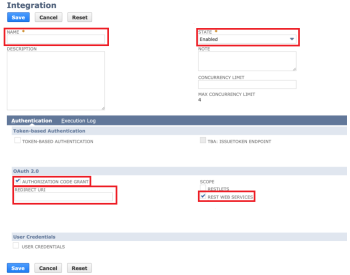

# NetSuite modules

In an Adobe Workfront Fusion scenario, you can automate workflows that use NetSuite, as well as connect it to to multiple third-party applications and services.

If you need instructions on creating a scenario, see [Create a scenario in Adobe Workfront Fusion](../../workfront-fusion/scenarios/create-a-scenario.md).

For information about modules, see [Modules in Adobe Workfront Fusion](../../workfront-fusion/modules/modules.md).

## Access requirements

You must have the following access to use the functionality in this article:

<table style="table-layout:auto"> 
 <col> 
 <col> 
 <tbody> 
  <tr> 
   <td role="rowheader">Adobe Workfront plan*</td> 
   <td> 
Pro or higher
 </td> 
  </tr> 
  <tr data-mc-conditions=""> 
   <td role="rowheader">Adobe Workfront license*</td> 
   <td> 
Plan, Work
 </td> 
  </tr> 
  <tr> 
   <td role="rowheader">Adobe Workfront Fusion license**</td> 
   <td> 
Workfront Fusion for Work Automation and Integration 
 </td> 
  </tr> 
  <tr> 
   <td role="rowheader">Product</td> 
   <td>Your organization must purchase Adobe Workfront Fusion as well as Adobe Workfront to use functionality described in this article.</td> 
  </tr> <!--
   <tr data-mc-conditions="QuicksilverOrClassic.Draft mode"> 
    <td role="rowheader">Access level configurations*</td> 
    <td> 
      
You must be a Workfront Fusion administrator for your organization.

      
You must be a Workfront Fusion administrator for your team.

    </td> 
   </tr>
  --> 
 </tbody> 
</table>

&#42;To find out what plan, license type, or access you have, contact your Workfront administrator.

&#42;&#42;For information on Adobe Workfront Fusion licenses, see [Adobe Workfront Fusion licenses](../../workfront-fusion/get-started/license-automation-vs-integration.md)

## Prerequisites

To use NetSuite modules, you must have a NetSuite account.

<!--

<h2>Connect NetSuite to Workfront Fusion</h2>
<h3>Prerequisites for using NetSuite's REST web services</h3>

To use NetSuite's REST web services, you must first enable the relevant features in your account, and assign the required permissions to the web services user's role. 
 <note type="note">

For instructions on enabling these features and assigning these permissions:

<ul>
<li> 
See the "REST&nbsp;Web Services Prerequisites and Setup" section of the latest version of Oracle's <a href="https://docs.oracle.com/cloud/latest/netsuitecs_gs/NSTRW/NSTRW.pdf">SuiteTalk REST Web Services</a> documentation.
 
Or
 </li>
<li> 
Log in to your Oracle Net Suite account, and search the online documentation for "REST Web Services Prerequisites and Setup."
 </li>
</ul>
</note>
<ul>
<li> 
<a href="#enable-features" class="MCXref xref">Enable Features</a> 
 </li>
<li> 
<a href="#assign-permissions" class="MCXref xref">Assign permissions</a> 
 </li>
</ul>
<h4 id="enable-features">Enable Features</h4>

Enable the following features

<table style="table-layout:auto">
<col>
<col>
<tbody>
<tr>
<td role="rowheader">REST Web Services feature</td>
<td> 
To use this feature, you must accept the SuiteCloud Terms of Service.
 </td>
</tr>
<tr>
<td role="rowheader">REST Record Service (beta) feature</td>
<td> 
This feature enables you to work with the REST&nbsp;record service beta functionality. 
 
Using the REST record service, you can:

<ul>
<li> 
 Perform CRUD operations on beta records
 </li>
<li> 
Filter record collections 
 </li>
<li> 
Interact with record metadata
 </li>
<li> 
Perform record actions and transformations.
 </li>
</ul> 
To use this feature, you must accept the SuiteCloud Terms of Service.
 </td>
</tr>
<tr>
<td role="rowheader">REST Query Service (beta) feature</td>
<td>This feature enables you to work with the REST&nbsp;query service beta functionality. Using the REST query service, you can work with datasets and related functionality.</td>
</tr>
<tr>
<td role="rowheader">Suite Analytics Workbook feature</td>
<td>This feature allows you to create workbooks that combine datasets, tables, pivot tables, and charts using the analytics data source.</td>
</tr>
</tbody>
</table> <note type="note">

To access the REST Record Service, REST&nbsp;Query Service, Record Customization, or SuiteScript Workbook API beta features, you must complete the Oracle NetSuite Umbrella Beta Program Recruitment Form. On this form, you must identify an authorized user who can sign to accept the Oracle Cloud Services Beta Trial License Agreement. After this agreement is fully executed by an authorized user through completion of this form, the requested features are available for enablement on this page.

To locate the Oracle NetSuite Umbrella Beta Program Recruitment Form, search the Oracle NetSuite documentation.

</note>
<h4 id="assign-permissions">Assign permissions</h4>

Assign the following permissions:

<ul>
<li> 
REST Web Services
 </li>
<li> 
Log in using Access Tokens
 </li>
<li> 
Suite Analytics Workbook
 </li>
</ul>

<strong>Create a new integration record</strong>

To set up a connection between NetSuite and Workfront Fusion, you need to create a new integration record in Netsuite.
 <note type="note">

For instructions on creating a new integration record.

<ul>
<li> 
See the "Setting Up OAuth 2.0 Authentication for REST Web Services" section of the latest version of Oracle's <a href="https://docs.oracle.com/cloud/latest/netsuitecs_gs/NSTRW/NSTRW.pdf">SuiteTalk REST Web Services</a> documentation.
 
Or
 </li>
<li> 
Log in to your Oracle Net Suite account, and search the online documentation for "Create Integration Records for Applications to use Oauth 2.0."
 </li>
</ul>
</note>
<ol>
<li value="1"> 
Begin creating a new integration record. 
 
When creating the new record, configure the following fields:

<table style="table-layout:auto">
<col>
<col>
<tbody>
<tr>
<td role="rowheader">Name</td>
<td>Enter a name for your NetSuite integration</td>
</tr>
<tr>
<td role="rowheader">State</td>
<td>Select <strong>Enabled</strong></td>
</tr>
<tr>
<td role="rowheader">Authorization Code Grant</td>
<td>Check this checkbox</td>
</tr>
<tr>
<td role="rowheader">Redirect URI</td>
<td>https://app.workfrontfusion.com/oauth/cb/workfront-netsuite-rest2</td>
</tr>
<tr>
<td role="rowheader">Scope</td>
<td> 
Check the checkbox next to REST&nbsp;WEB&nbsp;SERVICES.
 </td>
</tr>
</tbody>
</table> 
  
 </li>
<li value="2"> 
<strong>Save</strong> the new integration.
 
A page showing your client credentials appears.
 </li>
<li value="3"> 
Copy and save the client credentials in a secure place. You will need them to create a connection in Workfront Fusion.
 <note type="warning">
You must copy and save the credentials before you close this window. You will not be able to access them again.
</note> </li>
</ol>

<strong>Create a connection to NetSuite in a Workfront Fusion NetSuite module</strong>

You can create a connection to your NetSuite account directly from inside a NetSuite module.

<ol>
<li value="1"> 
In any NetSuite module, click <strong>Add</strong> next to the Connection field.
 </li>
<li value="2"> 
Enter the Account ID&nbsp;of the Netsuite account you want the module to access.
 </li>
<li value="3"> 
Enter the Client ID and Client Secret that you saved in step 3 in <a href="#create-a-new-integration-record" class="MCXref xref">Create a new integration record</a> above.
 <note type="note">
For security reasons, the values for Client Credentials are only displayed on the initial setup page. They cannot be retrieved from the system. If you did not save this information, you must reset credentials to obtain new values for your Client Credentials.
</note> </li>
<li value="4"> 
Click <strong>Continue</strong> to create the connection and go back to the module.
 </li>
</ol>

-->

## NetSuite modules and their fields

When you configure NetSuite modules, Workfront Fusion displays the fields listed below. Along with these, additional NetSuite fields might display, depending on factors such as your access level in the app or service. A bolded title in a module indicates a required field.

If you see the map button above a field or function, you can use it to set variables and functions for that field. For more information, see [Map information from one module to another in Adobe Workfront Fusion](../../workfront-fusion/mapping/map-information-between-modules.md).

<!--

<ul>
<li><a href="#triggers" class="MCXref xref">Triggers</a> </li>
<li><a href="#actions" class="MCXref xref">Actions</a> </li>
<li><a href="#searches" class="MCXref xref">Searches</a> </li>
</ul>

<strong>Triggers</strong>

<h4>Watch records</h4>

This trigger module activates a scenario when a record is created or updated.

<table style="table-layout:auto">
<col>
<col>
<tbody>
<tr>
<td role="rowheader" data-mc-conditions="QuicksilverOrClassic.Draft mode">Connection</td>
<td> 
For instructions about connecting your NetSuite account to Workfront Fusion, see<a href="#create-a-connection-to-netsuite-in-a-workfront-fusion-netsuite-module" class="MCXref xref">Create a connection to NetSuite in a Workfront Fusion NetSuite module</a> in this article.
 </td>
</tr>
<tr>
<td role="rowheader" data-mc-conditions="QuicksilverOrClassic.Draft mode">Record type</td>
<td> 
Select the type of record you want to watch.
 </td>
</tr>
<tr>
<td role="rowheader" data-mc-conditions="QuicksilverOrClassic.Draft mode">Outputs</td>
<td data-mc-conditions="QuicksilverOrClassic.Draft mode">Select the fields that you want to include in the module output. The available fields depend on the type of record you want to watch.</td>
</tr>
<tr>
<td role="rowheader" data-mc-conditions="QuicksilverOrClassic.Draft mode">Event type</td>
<td data-mc-conditions="QuicksilverOrClassic.Draft mode">Select whether you want to watch for new records or updated records.</td>
</tr>
<tr>
<td role="rowheader" data-mc-conditions="QuicksilverOrClassic.Draft mode">Limit</td>
<td data-mc-conditions="QuicksilverOrClassic.Draft mode">Set the highest number of records you want the module to return during each scenario execution cycle.</td>
</tr>
</tbody>
</table>

<strong>Actions</strong>

<ul>
<li> 
<a href="#custom-api-call" class="MCXref xref">Custom API Call</a> 
 </li>
<li> 
<a href="#create-a-record" class="MCXref xref">Create a record</a> 
 </li>
<li> 
<a href="#update-a-record" class="MCXref xref">Update a record</a> 
 </li>
<li> 
<a href="#delete-a-record" class="MCXref xref">Delete a Record</a> 
 </li>
<li> 
<a href="#read-a-record" class="MCXref xref">Read a Record</a> 
 </li>
</ul>

-->

### Custom API Call {#custom-api-call}

This action module lets you make a custom authenticated call to the NetSuite API. This way, you can create a data flow automation that can't be accomplished by the other NetSuite modules.

The action is based on the entity type (Allocadia object type) you specify.

When you are configuring this module, the following fields display.

<table style="table-layout:auto"> 
 <col> 
 <col> 
 <tbody> 
  <tr> 
   <td role="rowheader">Connection</td> 
   <td> 
For instructions about connecting your NetSuite account to Workfront Fusion, see<a href="#create-a-connection-to-netsuite-in-a-workfront-fusion-netsuite-module" class="MCXref xref">Create a connection to NetSuite in a Workfront Fusion NetSuite module</a> in this article.
 </td> 
  </tr> 
  <tr> 
   <td role="rowheader">URL</td> 
   <td> 
Use the following URL format:
 
<code>https://{accountID}.suitetalk.api.netsuite.com/services/rest/record/{version}/{resource}?{query-parameters}</code> 
 </td> 
  </tr> 
  <tr> 
   <td role="rowheader">Method</td> 
   <td> 
Select the HTTP request method you need to configure the API call. For more information, see <a href="../../workfront-fusion/modules/http-request-methods.md" class="MCXref xref" data-mc-variable-override="">HTTP request methods in Adobe Workfront Fusion</a>.
 </td> 
  </tr> 
  <tr> 
   <td role="rowheader">Headers</td> 
   <td> 
Add the headers of the request in the form of a standard JSON object.
 
For example, <code>{"Content-type":"application/json"}</code>
 
Workfront Fusion adds the authorization headers for you.
 </td> 
  </tr> 
  <tr> 
   <td role="rowheader">Query String</td> 
   <td> 
Add the query for the API call in the form of a standard JSON object.
 
For example: <code>{“name”:“something-urgent”}</code>
 </td> 
  </tr> 
  <tr> 
   <td role="rowheader">Body</td> 
   <td> 
Add the body content for the API call in the form of a standard JSON object.
 
Note:  
When using conditional statements such as <code>if</code> in your JSON, put the quotation marks outside of the conditional statement.
 
     
Example: </b>"> 
      
  
 
     
 
 </td> 
  </tr> 
 </tbody> 
</table>

<!--

<h4 id="create-a-record">Create a record</h4>

This action module creates a new record.

You specify the type of record and field values for the new record.

The module returns the ID of the record. You can map this information in subsequent modules in the scenario.

When you are configuring this module, the following fields display.

<table style="table-layout:auto">
<col>
<col>
<tbody>
<tr>
<td role="rowheader" data-mc-conditions="QuicksilverOrClassic.Draft mode">Connection</td>
<td> 
For instructions about connecting your NetSuite account to Workfront Fusion, see<a href="#create-a-connection-to-netsuite-in-a-workfront-fusion-netsuite-module" class="MCXref xref">Create a connection to NetSuite in a Workfront Fusion NetSuite module</a> in this article.
 </td>
</tr>
<tr>
<td role="rowheader" data-mc-conditions="QuicksilverOrClassic.Draft mode">Record type</td>
<td>

Select the type of record you want to create.

</td>
</tr>
<tr>
<td role="rowheader" data-mc-conditions="QuicksilverOrClassic.Draft mode">Properties</td>
<td data-mc-conditions="QuicksilverOrClassic.Draft mode">Fill in any properties that you want to set for the record. The available fields depend on the type of record you want to create.</td>
</tr>
</tbody>
</table>
<h4 id="update-a-record">Update a record</h4>

This action module updates an existing record.

When you are configuring this module, the following fields display.

<table style="table-layout:auto">
<col>
<col>
<tbody>
<tr>
<td role="rowheader" data-mc-conditions="QuicksilverOrClassic.Draft mode">Connection</td>
<td data-mc-conditions="QuicksilverOrClassic.Draft mode"> 
For instructions about connecting your NetSuite account to Workfront Fusion, see<a href="#create-a-connection-to-netsuite-in-a-workfront-fusion-netsuite-module" class="MCXref xref">Create a connection to NetSuite in a Workfront Fusion NetSuite module</a> in this article.
 </td>
</tr>
<tr>
<td role="rowheader" data-mc-conditions="QuicksilverOrClassic.Draft mode">Record type</td>
<td data-mc-conditions="QuicksilverOrClassic.Draft mode">Select the type of record you want to update.</td>
</tr>
<tr>
<td role="rowheader" data-mc-conditions="QuicksilverOrClassic.Draft mode">Internal ID</td>
<td data-mc-conditions="QuicksilverOrClassic.Draft mode">Enter the unique NetSuite ID of the record that you want the module to update</td>
</tr>
<tr>
<td role="rowheader" data-mc-conditions="QuicksilverOrClassic.Draft mode">Properties</td>
<td data-mc-conditions="QuicksilverOrClassic.Draft mode">Fill in any properties that you want to set for the record. The available fields depend on the type of record you want to create.</td>
</tr>
</tbody>
</table>
<h4 id="delete-a-record">Delete a Record</h4>

This action module deletes a single record from NetSuite.

You specify the ID of the record.

The module returns the internal ID of the deleted record.

When you are configuring this module, the following fields display.

<table style="table-layout:auto">
<col>
<col>
<tbody>
<tr>
<td role="rowheader">Connection</td>
<td> 
For instructions about connecting your NetSuite account to Workfront Fusion, see<a href="#create-a-connection-to-netsuite-in-a-workfront-fusion-netsuite-module" class="MCXref xref">Create a connection to NetSuite in a Workfront Fusion NetSuite module</a> in this article.
 </td>
</tr>
<tr>
<td role="rowheader">Record Type</td>
<td>Select the type of record that you want the module to delete.</td>
</tr>
<tr>
<td role="rowheader">Internal ID</td>
<td>Enter or map the NetSuite ID of the record you want the module to delete.</td>
</tr>
</tbody>
</table>
<h4 id="read-a-record">Read a Record</h4>

This action module reads data from a single record in NetSuite.

You specify the ID of the record.

The module returns any standard fields associated with the record, along with any custom fields and values that the connection accesses. You can map this information in subsequent modules in the scenario.

When you are configuring this module, the following fields display.

<table style="table-layout:auto">
<col>
<col>
<tbody>
<tr>
<td role="rowheader">Connection</td>
<td> 
For instructions about connecting your NetSuite account to Workfront Fusion, see<a href="#create-a-connection-to-netsuite-in-a-workfront-fusion-netsuite-module" class="MCXref xref">Create a connection to NetSuite in a Workfront Fusion NetSuite module</a> in this article.
 </td>
</tr>
<tr>
<td role="rowheader">Record Type</td>
<td>Select the type of record that you want the module to read.</td>
</tr>
<tr>
<td role="rowheader">Outputs</td>
<td>Select the fields that you want the module to output. The output for these fields can be mapped in later modules.</td>
</tr>
<tr>
<td role="rowheader">Internal ID</td>
<td>Enter or map the NetSuite ID of the record you want the module to delete.</td>
</tr>
</tbody>
</table>

<strong>Searches</strong>

<h4>Search for records</h4>

This search module searches for records based on custom criteria.

<table style="table-layout:auto">
<col>
<col>
<tbody>
<tr>
<td role="rowheader">Connection</td>
<td> 
For instructions about connecting your NetSuite account to Workfront Fusion, see<a href="#create-a-connection-to-netsuite-in-a-workfront-fusion-netsuite-module" class="MCXref xref">Create a connection to NetSuite in a Workfront Fusion NetSuite module</a> in this article.
 </td>
</tr>
<tr>
<td role="rowheader">Record Type</td>
<td>Select the type of record that you want the module to read.</td>
</tr>
<tr>
<td role="rowheader">Search criteria</td>
<td>
<ul>
<li> 
<strong>Field</strong> 
 
Select the field that you want to use in your search. The available fields depend on the type of record you want to create.
 </li>
<li> 
<strong>Logical operator</strong> 
 
Select the operator. This will vary based on the type of field.
 </li>
<li> 
<strong>Value</strong> 
 
Enter or map the value you want to search for 
 </li>
</ul> </td>
</tr>
<tr data-mc-conditions="QuicksilverOrClassic.Draft mode">
<td role="rowheader">Records to return</td>
<td>Select whether you want to return the first matching record, or all matching records.</td>
</tr>
<tr>
<td role="rowheader">Outputs</td>
<td>Select the fields that you want the module to output. The output for these fields can be mapped in later modules.</td>
</tr>
<tr>
<td role="rowheader">Limit</td>
<td> 
Enter or map the maximum number of records you want the module to return during each scenario execution cycle.
 </td>
</tr>
</tbody>
</table>

-->
