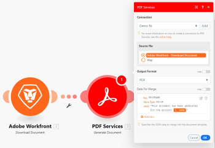

# [!DNL Adobe PDF Services]

With the [!DNL Adobe Workfront Fusion] [!DNL Adobe PDF Services], you can extract data from a PDF file, or generate a new PDF file from data you supply. In addition, you can convert a variety of file types to PDFs, or PDFs to other file types. PDF Services also allow you to combine, compress, or read metadata for a PDF file, as well as control password protection on the file.

If you need instructions on creating a scenario, see [Create a scenario in [!DNL Adobe Workfront Fusion]](../../workfront-fusion/scenarios/create-a-scenario.md).

For information about modules, see [Modules in [!DNL Adobe Workfront Fusion]](../../workfront-fusion/modules/modules.md).

For information on the API used for PDF Services, see [Adobe Document Generation API](https://www.adobe.io/apis/documentcloud/dcsdk/doc-generation.html).

## Security considerations when using [!DNL Adobe PDF Services]

<!--

* [You do not need an [!DNL Adobe] account](#you-do-not-need-an-adobe-account) 
* [[!DNL Workfront Fusion] does not store your files](#workfront-fusion-does-not-store-your-files)

### You do not need an [!DNL Adobe] account 

Because [!DNL Workfront Fusion] is part of the [!DNL Adobe] product suite, you don't need a separate [!DNL Adobe] account to use these tools. Each tool accesses [!DNL Adobe] PDF functionality without using a connection.

Although [!DNL Workfront Fusion] does not require an [!DNL Adobe] account to use the PDF Services, the modules do require a connection. There are no credentials involved in this connection, and you provide only a name for the connection itself.

### [!DNL Workfront Fusion] does not store your files 

-->

The [!DNL Adobe PDF Services] can read, convert, or modify your files, but neither [!DNL Adobe] nor [!DNL Workfront Fusion] store your files or data. This means that:

* You maintain control over your files, including their security
* You do not need to have an [!UICONTROL Adobe] storage or cloud storage account to use the PDF Services.

## Access requirements

You must have the following access to use the functionality in this article:

<table style="table-layout:auto"> 
 <col> 
 <col> 
 <tbody> 
  <tr> 
   <td role="rowheader">[!DNL Adobe Workfront] plan*</td>
  <td> 
[!UICONTROL Pro] or higher
 </td>
  </tr> 
  <tr data-mc-conditions=""> 
   <td role="rowheader">[!DNL Adobe Workfront] license*</td>
   <td> 
[!UICONTROL Plan], [!UICONTROL Work]
 </td> 
  </tr> 
  <tr> 
   <td role="rowheader">[!DNL Adobe Workfront Fusion] license**</td> 
   <td>
   
Current license requirement: No [!DNL Workfront Fusion] license requirement.

   
Or

   
Legacy license requirement: [!UICONTROL [!DNL Workfront Fusion] for Work Automation and Integration] 

   </td> 
  </tr> 
  <tr> 
   <td role="rowheader">Product</td> 
   <td>
   
Current product requirement: If you have the [!UICONTROL Select] or [!UICONTROL Prime] [!DNL Adobe Workfront] Plan, your organization must purchase [!DNL Adobe Workfront Fusion] as well as [!DNL Adobe Workfront] to use functionality described in this article. [!DNL Workfront Fusion] is included in the [!UICONTROL Ultimate] [!DNL Workfront] plan.

   
Or

   
Legacy product requirement: Your organization must purchase [!DNL Adobe Workfront Fusion] as well as [!DNL Adobe Workfront] to use functionality described in this article.

   </td> 
  </tr> 
 </tbody> 
</table>

To find out what plan, license type, or access you have, contact your [!DNL Workfront] administrator.

For information on [!DNL Adobe Workfront Fusion] licenses, see [[!DNL Adobe Workfront Fusion] licenses](../../workfront-fusion/get-started/license-automation-vs-integration.md).

## Prerequisites

To create an OAuth Server-to-Server, you must add the Adobe PDF Services API in your Adobe Developers Console. When adding the API, select the OAuth Server-to-Server option.

For instructions, see [Add API to project using OAuth](https://developer.adobe.com/developer-console/docs/guides/services/services-add-api-oauth/) In the Adobe developer documentation.

## Create a connection to [!DNL Adobe PDF Services]

To create a connection for your [!DNL Adobe PDF Services] modules:

1. In any [!DNL Adobe PDF Services] module, click **[!UICONTROL Add]** next to the Connection box.

1. Fill in the following fields:

   <table style="table-layout:auto"> 
      <col class="TableStyle-TableStyle-List-options-in-steps-Column-Column1">
      </col>
      <col class="TableStyle-TableStyle-List-options-in-steps-Column-Column2">
      </col>
      <tbody>
        <tr>
          <td role="rowheader">[!UICONTROL Connection type]</td>
          <td>
            
Select whether you want to create a server-to-server connection or a JWT connection.

          </td>
        </tr>
        <tr>
          <td role="rowheader">[!UICONTROL Connection name]</td>
          <td>
            
Enter a name for this connection.

          </td>
        </tr>
        <tr>
          <td role="rowheader">[!UICONTROL Client ID]</td>
          <td>Enter your [!DNL Adobe] [!UICONTROL Client ID]. This can be found in the [!UICONTROL Credentials details] section of the [!DNL Adobe Developer Console].
For instructions locating credentials, see <a href="https://developer.adobe.com/developer-console/docs/guides/services/services-add-api-oauth/#credentials" class="MCXref xref" >Credentials</a> in the Adobe developer documentation.
</td>
        </tr>
        <tr>
          <td role="rowheader">[!UICONTROL Client Secret]</td>
          <td>Enter your [!DNL Adobe] [!UICONTROL Client Secret]. This can be found in the [!UICONTROL Credentials details] section of the [!DNL Adobe Developer Console].
For instructions locating credentials, see <a href="https://developer.adobe.com/developer-console/docs/guides/services/services-add-api-oauth/#credentials" class="MCXref xref" >Credentials</a> in the Adobe developer documentation.

        </tr>
        <tr>
          <td role="rowheader">[!UICONTROL Technical account ID] (JWT only)</td>
          <td>Enter your [!DNL Adobe] [!UICONTROL Technical account ID]. This can be found in the [!UICONTROL Credentials details] section of the [!DNL Adobe Developer Console].
For instructions locating credentials, see <a href="https://developer.adobe.com/developer-console/docs/guides/services/services-add-api-oauth/#credentials" class="MCXref xref" >Credentials</a> in the Adobe developer documentation.

        </tr>
        <tr>
          <td role="rowheader">[!UICONTROL Organization ID] (JWT only)</td>
          <td>Enter your [!DNL Adobe] [!UICONTROL Organization ID]. This can be found in the [!UICONTROL Credentials details] section of the [!DNL Adobe Developer Console].
For instructions locating credentials, see <a href="https://developer.adobe.com/developer-console/docs/guides/services/services-add-api-oauth/#credentials" class="MCXref xref" >Credentials</a> in the Adobe developer documentation.

        </tr>
        <tr>
          <td role="rowheader">[!UICONTROL Meta scopes] (JWT only)</td>
          <td>
            Enter any meta scopes needed for the connection.
          </td>
        </tr>
       </tbody>
    </table>
1. Click **[!UICONTROL Continue]** to save the connection and return to the module.

## [!DNL Adobe PDF Services] modules and their fields

When you configure [!DNL PDF Services], [!DNL Workfront Fusion] displays the fields listed below. Along with these, additional fields might display, depending on factors such as your access level in the app or service. A bold title in a module indicates a required field.

If you see the map button above a field or function, you can use it to set variables and functions for that field. For more information, see [Map information from one module to another in [!DNL Adobe Workfront Fusion]](../../workfront-fusion/mapping/map-information-between-modules.md).

* [[!UICONTROL Generate document]](#generate-document) 
* [[!UICONTROL Extract Text / Table]](#extract-text--table) 
* [[!UICONTROL Combine PDF files]](#combine-pdf-files) 
* [[!UICONTROL Compress PDF files]](#compress-pdf-files) 
* [[!UICONTROL Convert document to PDF file]](#convert-document-to-pdf-file) 
* [[!UICONTROL Convert HTML to PDF file]](#convert-html-to-pdf-file) 
* [[!UICONTROL Convert image to PDF file]](#convert-image-to-pdf-file) 
* [[!UICONTROL Convert PDF to document]](#convert-pdf-to-document) 
* [[!UICONTROL Convert PDF to image]](#convert-pdf-to-image) 
* [[!UICONTROL Linearize a PDF file]](#linearize-a-pdf-file) 
* [[!UICONTROL OCR for PDF file]](#ocr-for-pdf-file) 
* [[!UICONTROL Page manipulation]](#page-manipulation) 
* [[!UICONTROL PDF accessibility auto-tag]](#pdf-accessibility-auto-tag)
* [[!UICONTROL PDF file properties]](#pdf-file-properties) 
* [[!UICONTROL Protect PDF file]](#protect-pdf-file) 
* [[!UICONTROL Remove protection of a PDF file]](#remove-protection-of-a-pdf-file)
* [Split a PDF file](#split-a-pdf-file)

### [!UICONTROL Generate document]

The [!UICONTROL Generate document] module is a powerful way to create a PDF that contains data you select. You can format it by using a [!DNL Microsoft Word] template, or by providing data in JSON format.

For more information on the [!UICONTROL [!DNL Adobe PDF Services] Generate document] functionality, see the [Overview of Document Generation](https://www.adobe.io/apis/documentcloud/dcsdk/docs.html) in the [!DNL Adobe Document Services] documentation.

* [Use the [!UICONTROL Generate document] module with a [!DNL Microsoft Word] template](#use-the-generate-document-module-with-a-microsoft-word-template) 
* [Use the [!UICONTROL Generate document] module with JSON](#use-the-generate-document-module-with-json)

#### Use the [!UICONTROL Generate document] module with a [!DNL Microsoft Word] template 

<!--
>[!NOTE]
>
>For a discussion of Microsoft Word templates, see [Microsoft Word Template modules](../../workfront-fusion/apps-and-their-modules/microsoft-word-templates-modules.md). 
>
>You do not need to use Microsoft Word template modules to use a Microsoft Word template with the PDF Services Generate document module.
-->

To use the [!UICONTROL Generate document] module with a [!UICONTROL Microsoft Word] template, you must first create the template. For instructions, search for "Create a template" in the [!DNL Microsoft Office] documentation.

Fill in the [!UICONTROL Generate document] module fields as follows:

<table style="table-layout:auto"> 
 <col> 
 <col> 
 <tbody> 
  <tr> 
   <td role="rowheader">[!UICONTROL Connection]</td> 
   <td> 
Select the connection to use for this module.
 For instructions on creating a connection to [!DNL Adobe PDF Services], see <a href="#create-a-connection-to-adobe-pdf-services" class="MCXref xref" >Create a connection to [!DNL Adobe PDF Services]</a> in this article. </td> 
  </tr> 
  <tr> 
   <td role="rowheader">[!UICONTROL Source File]</td> 
   <td> 
Select a source file from a previous module, or map the source file's name and data.
 
This source file is the [!DNL Microsoft Word ]template that the module uses to generate the new PDF.
 
We recommend creating a project in [!DNL Workfront] for the [!DNL Microsoft Word] templates that you use in [!DNL Workfront Fusion]. You can then use the [!DNL Workfront] &gt; [!UICONTROL Download document] module to pull the appropriate template into your scenario.
 </td> 
  </tr> 
  <tr> 
   <td role="rowheader">[!UICONTROL Output Format]</td> 
   <td> 
Select the format for the generated document.
 
    <ul> 
     <li> 
PDF
 </li> 
     <li> 
DOCX
 </li> 
    </ul> </td> 
  </tr> 
  <tr> 
   <td role="rowheader">[!UICONTROL Data for merge]</td> 
   <td> 
For each value tag in your template that you want to replace with text, fill in the following:
 
    <ul> 
     <li> 
[!UICONTROL Key]
 
Enter a key. In the template, the key is the text shown in the value tag. For example, if you want to place text in the value tag <code>&#123;&#123;name&#125;&#125;</code>, enter <code>name </code>in the key field.
 </li> 
     <li> 
Value Type
 
Select whether the data in the value field is a value, an object, or an array of objects.
 </li> 
     <li> 
[!UICONTROL Value]
 
Enter or map the text that you want to appear in the generated document in place of the value tag.
 </li> 
    </ul> 
  
 </td> 
  </tr> 
 </tbody> 
</table>

#### Use the [!UICONTROL Generate document] module with JSON 

To use the [!UICONTROL Generate document] module with JSON, fill in the fields as follows:

<table style="table-layout:auto"> 
 <col> 
 <col> 
 <tbody> 
  <tr> 
   <td role="rowheader">[!UICONTROL Connection]</td> 
   <td> 
Select the connection to use for this module.
 For instructions on creating a connection to [!DNL Adobe PDF Services], see <a href="#create-a-connection-to-adobe-pdf-services" class="MCXref xref" >Create a connection to [!DNL Adobe PDF Services]</a> in this article. </td> 
  </tr> 
  <tr> 
   <td role="rowheader">[!UICONTROL Source File]</td> 
   <td> 
Select a source file from a previous module, or map the source file's name and data.
 </td> 
  </tr> 
  <tr> 
   <td role="rowheader">[!UICONTROL Output Format]</td> 
   <td> 
Select the format for the generated document.
 
    <ul> 
     <li> 
PDF
 </li> 
     <li> 
DOCX
 </li> 
    </ul> </td> 
  </tr> 
  <tr> 
   <td role="rowheader">[!UICONTROL Data for merge]</td> 
   <td> 
To use JSON in this module, you must enable mapping on this field.
 
Enter or map the JSON to generate the document from. 
 
You can type JSON directly into this field, or map JSON output from a JSON module.
 </td> 
  </tr> 
 </tbody> 
</table>

### [!UICONTROL Extract Text / Table]

This action module allows you to extract data from a PDF file. The module outputs individual text elements, such as a paragraph or the text in a single cell of a table.

<table style="table-layout:auto"> 
 <col> 
 <col> 
 <tbody> 
  <tr> 
   <td role="rowheader">[!UICONTROL Connection]</td> 
   <td> 
Select the connection to use for this module.
 For instructions on creating a connection to [!DNL Adobe PDF Services], see <a href="#create-a-connection-to-adobe-pdf-services" class="MCXref xref" >Create a connection to [!DNL Adobe PDF Services]</a> in this article. </td> 
  </tr> 
  <tr> 
   <td role="rowheader">[!UICONTROL Source file]</td> 
   <td>Select a source file from a previous module, or map the source file's name and data.</td> 
  </tr> 
  <tr> 
   <td role="rowheader">[!UICONTROL Elements that should be extracted as JSON]</td> 
   <td> 
    <ul> 
     <li> 
[!UICONTROL Text]
 </li> 
     <li> 
[!UICONTROL Tables]
 </li> 
    </ul> </td> 
  </tr> 
  <tr> 
   <td role="rowheader">[!UICONTROL Extract Bounding boxes?]</td> 
   <td>Enable this option to extract data about the bounding box of the text.</td> 
  </tr> 
  <tr> 
   <td role="rowheader">[!UICONTROL Include styling information for output?]</td> 
   <td>Enable this option to add styling information to the output JSON.</td> 
  </tr> 
 </tbody> 
</table>

### [!UICONTROL Combine PDF files]

This action module takes multiple PDF files and combines them into a single PDF file. For example, this module could combine all of the documents in a [!UICONTROL Workfront] project into a single PDF upon completion of the project.

<table style="table-layout:auto"> 
 <col> 
 <col> 
 <tbody> 
  <tr> 
   <td role="rowheader">[!UICONTROL Connection]</td> 
   <td> 
Select the connection to use for this module.
 For instructions on creating a connection to [!DNL Adobe PDF Services], see <a href="#create-a-connection-to-adobe-pdf-services" class="MCXref xref" >Create a connection to [!DNL Adobe PDF Services]</a> in this article. </td> 
  </tr> 
  <tr> 
   <td role="rowheader">[!UICONTROL Documents]</td> 
   <td> 
You can use an aggregator module to gather documents to combine into a PDF, or you can add the documents manually. 
 
We recommend using an [!UICONTROL Array Aggregator] module to aggregate output from a previous module. By using an aggregator, you do not need to know the names, locations, or numbers of files to combine. Using an aggregator is therefore much more flexible and scalable than manually entering the documents to be combined.
 
To use the [!UICONTROL Combine PDF] files module with an aggregator, you must enable mapping on the [!UICONTROL Documents] field. 
 
In this example, the [!UICONTROL Read Related Records] module identifies documents associated with a project, and the [!UICONTROL Download Documents] module downloads each one. All of the PDFs are aggregated into an array, which is passed into the [!UICONTROL Combine PDF] files module.
 
  
 
You can also enter documents manually.
 
For each document to include in the combined PDF:
 
    <ol> 
     <li value="1"> 
Click [!UICONTROL Add a Document]
 </li> 
     <li value="2"> 
In the [!UICONTROL Source file] field, select the module that outputs the document you want to include, or map the source file's name and data. 
 </li> 
     <li value="3"> 
(Optional) If you want to include only certain pages from the source file, for each page range that you want to add, click <strong>[!UICONTROL Add item]</strong> in the [!UICONTROL Pages] field, then enter the first and last pages of the page range to include, and click <strong>[!UICONTROL Add]</strong>. You can include more than one page range from a single document.
 </li> 
     <li value="4"> 
Click <strong>[!UICONTROL Add]</strong>. 
 </li> 
    </ol> </td> 
  </tr> 
 </tbody> 
</table>

### [!UICONTROL Compress PDF files]

This action module takes a PDF file and compresses it. This can be useful for conserving bandwidth or memory.

<table style="table-layout:auto"> 
 <col> 
 </col> 
 <col> 
 </col> 
 <tbody> 
  <tr> 
   <td role="rowheader">[!UICONTROL Connection]</td> 
   <td> 
Select the connection to use for this module.
 For instructions on creating a connection to [!DNL Adobe PDF Services], see <a href="#create-a-connection-to-adobe-pdf-services" class="MCXref xref" >Create a connection to [!DNL Adobe PDF Services]</a> in this article. </td> 
  </tr> 
  <tr> 
   <td role="rowheader">[!UICONTROL Source file]</td> 
   <td> 
Select a source file from a previous module, or map the source file's name and data.
 
The source file must be in PDF format. 
 </td> 
  </tr> 
  <tr> 
   <td role="rowheader">[!UICONTROL Compression level]</td> 
   <td>Select the compression level that you want to use.</td> 
  </tr> 
 </tbody> 
</table>

### [!UICONTROL Convert document to PDF file]

This tool converts a document to a PDF file. The source file must be one of the following document formats:

* DOC
* XLS
* PPT
* TXT
* RTF

<table style="table-layout:auto"> 
 <col> 
 </col> 
 <col> 
 </col> 
 <tbody> 
  <tr> 
   <td role="rowheader">[!UICONTROL Connection]</td> 
   <td> 
Select the connection to use for this module.
 For instructions on creating a connection to [!DNL Adobe PDF Services], see <a href="#create-a-connection-to-adobe-pdf-services" class="MCXref xref" >Create a connection to [!DNL Adobe PDF Services]</a> in this article. </td> 
  </tr> 
  <tr> 
   <td role="rowheader">[!UICONTROL Source file]</td> 
   <td> 
Select a source file from a previous module, or map the source file's name and data.
 
The source file must be in one of the following formats:
 
    <ul> 
     <li> 
DOC
 </li> 
     <li> 
XLS
 </li> 
     <li> 
PPT
 </li> 
     <li> 
TXT
 </li> 
     <li> 
RTF
 </li> 
    </ul> </td> 
  </tr> 
  <tr> 
   <td role="rowheader">[!UICONTROL Language]</td> 
   <td> 
Select the default language for the source document. This allows the module to select an appropriate font, if not font is included in the source file.
 
Select from the following languages:
 
    <ul> 
     <li> 
en-US (Default): English (United States of America)
 </li> 
     <li> 
ca-ES: Catalan (Spain)
 </li> 
     <li> 
cs-CZ: Czech (Czech Republic)
 </li> 
     <li> 
da-DK: Danish (Denmark)
 </li> 
     <li> 
de-DE: German (Germany)
 </li> 
     <li> 
en-AE: English (United Arab Emirates)
 </li> 
     <li> 
en-GB: English (United Kingdom)
 </li> 
     <li> 
en-IL: English (Israel)
 </li> 
     <li> 
en-US: English (United States of America)
 </li> 
     <li> 
es-ES: Spanish (Spain)
 </li> 
     <li> 
es-MX: Spanish (Mexico)
 </li> 
     <li> 
eu-ES: Basque (Spain)
 </li> 
     <li> 
fi-FI: Finnish (Finland)
 </li> 
     <li> 
fr-CA: French (Canada)
 </li> 
     <li> 
fr-FR: French (France)
 </li> 
     <li> 
fr-MA: French (Morocco)
 </li> 
     <li> 
hr-HR: Croatian (Croatia)
 </li> 
     <li> 
hu-HU: Hungarian (Hungary)
 </li> 
     <li> 
it-IT: Italian (Italy)
 </li> 
     <li> 
ja-JP: Japanese (Japan)
 </li> 
     <li> 
kr-KR: Korean (South Korea)
 </li> 
     <li> 
nb-NO: Norwegian Bokmål (Norway)
 </li> 
     <li> 
nl-NL: Dutch (Netherlands)
 </li> 
     <li> 
pl-PL: Polish (Poland)
 </li> 
     <li> 
pt-BR: Portuguese (Brazil)
 </li> 
     <li> 
pt-PT: Portuguese (Portugal)
 </li> 
     <li> 
ro-RO: Romanian (Romania)
 </li> 
     <li> 
ru-RU: Russian (Russia)
 </li> 
     <li> 
sk-SK: Slovak (Slovakia)
 </li> 
     <li> 
sl-SI: Slovenian (Slovenia)
 </li> 
     <li> 
sv-SE: Swedish (Sweden)
 </li> 
     <li> 
tr-TR: Turkish (Turkey)
 </li> 
     <li> 
uk-UA: Ukrainian (Ukraine)
 </li> 
     <li> 
zh-CN: Chinese (Mainland China)
 </li> 
     <li> 
zh-TW: Chinese (Taiwan)
 </li> 
    </ul> </td> 
  </tr> 
 </tbody> 
</table>

### [!UICONTROL Convert HTML to PDF file]

This tool converts an HTML file to a PDF file. 

<table style="table-layout:auto"> 
 <col> 
 </col> 
 <col> 
 </col> 
 <tbody> 
  <tr> 
   <td role="rowheader">[!UICONTROL Connection]</td> 
   <td> 
Select the connection to use for this module.
 For instructions on creating a connection to [!DNL Adobe PDF Services], see <a href="#create-a-connection-to-adobe-pdf-services" class="MCXref xref" >Create a connection to [!DNL Adobe PDF Services]</a> in this article. </td> 
  </tr> 
  <tr> 
   <td role="rowheader">[!UICONTROL Source file]</td> 
   <td> 
Select a source file from a previous module, or map the source file's name and data.
 
Important: Source file must be in HTML or ZIP format. 
 </td> 
  </tr> 
  <tr> 
   <td role="rowheader">[!UICONTROL JSON]</td> 
   <td> 
If your HTML references JavaScript variables, you can include those variables here. 
 
For each variable, click <strong>[!UICONTROL Add item]</strong> and include the variable's key and value.
 
Note:   
     <ul> 
      <li> 
When creating a PDF from a ZIP file, the source collateral must include a script element such as: <code> &lt;script src='./json.js' type='text/javascript'&gt;&lt;/script&gt;</code> 
 </li> 
      <li> 
When creating a PDF from a URL, the content of this JSON object is injected into the browser VM before the page is rendered. 
 </li> 
     </ul> 
 </td> 
  </tr> 
  <tr> 
   <td role="rowheader">[!UICONTROL Include header and footer]</td> 
   <td> 
Enable this option to create headers and footers for the PDF document.
 
    <ul> 
     <li> 
The header includes a date and the document title.
 </li> 
     <li> 
The footer includes the file name and a page number.
 </li> 
    </ul> </td> 
  </tr> 
  <tr> 
   <td role="rowheader">[!UICONTROL Page width]</td> 
   <td>Enter the width of the paper, in inches. The module uses this information to format the pages in the created PDF file.</td> 
  </tr> 
  <tr> 
   <td role="rowheader">[!UICONTROL Page height]</td> 
   <td>Enter the height of the paper, in inches. The module uses this information to format the pages in the created PDF file.</td> 
  </tr> 
 </tbody> 
</table>

### [!UICONTROL Convert image to PDF file]

This tool converts an image to a PDF file. 

<table style="table-layout:auto"> 
 <col> 
 </col> 
 <col> 
 </col> 
 <tbody> 
  <tr> 
   <td role="rowheader">[!UICONTROL Connection]</td> 
   <td> 
Select the connection to use for this module.
 For instructions on creating a connection to [!DNL Adobe PDF Services], see <a href="#create-a-connection-to-adobe-pdf-services" class="MCXref xref" >Create a connection to [!DNL Adobe PDF Services]</a> in this article. </td> 
  </tr> 
  <tr> 
   <td role="rowheader">[!UICONTROL Source file]</td> 
   <td> 
Select a source file from a previous module, or map the source file's name and image file.
 </td> 
  </tr> 
 </tbody> 
</table>

### [!UICONTROL Convert PDF to document]

This tool converts a PDF file to a document. You can select one of the following formats for the output file.

* DOC
* DOCX
* PPTX
* XLSX
* RTF

<table style="table-layout:auto"> 
 <col> 
 </col> 
 <col> 
 </col> 
 <tbody> 
  <tr> 
   <td role="rowheader">[!UICONTROL Connection]</td> 
   <td> 
Select the connection to use for this module.
 For instructions on creating a connection to [!DNL Adobe PDF Services], see <a href="#create-a-connection-to-adobe-pdf-services" class="MCXref xref" >Create a connection to [!DNL Adobe PDF Services]</a> in this article. </td> 
  </tr> 
  <tr> 
   <td role="rowheader">[!UICONTROL Source file]</td> 
   <td> 
Select a source file from a previous module, or map the source file's name and data.
 
The source file must be in PDF format. 
 </td> 
  </tr> 
  <tr> 
   <td role="rowheader">[!UICONTROL Output Files Format]</td> 
   <td> 
Select the format that you want the files to be output as:
 
    <ul> 
     <li> 
DOC
 </li> 
     <li> 
DOCX
 </li> 
     <li> 
PPTX
 </li> 
     <li> 
XLSX
 </li> 
     <li> 
RTF
 </li> 
    </ul> </td> 
  </tr> 
 </tbody> 
</table>

### [!UICONTROL Convert PDF to image]

This tool converts a PDF to an image in PNG or JPEG format., which is then output as a ZIP. The PDF is converted into one image per page, and each image ends with the page number. The image files are then combined into a ZIP file.

For example, a file called "TestFile" with 8 pages would produce 8 images, named "TestFile_1" through "TestFile_8." The module's output is a ZIP file containing the 8 images.

<table style="table-layout:auto"> 
 <col> 
 </col> 
 <col> 
 </col> 
 <tbody> 
  <tr> 
   <td role="rowheader">[!UICONTROL Connection]</td> 
   <td> 
Select the connection to use for this module.
 For instructions on creating a connection to [!DNL Adobe PDF Services], see <a href="#create-a-connection-to-adobe-pdf-services" class="MCXref xref" >Create a connection to [!DNL Adobe PDF Services]</a> in this article. </td> 
  </tr> 
  <tr> 
   <td role="rowheader">[!UICONTROL Source file]</td> 
   <td> 
Select a source file from a previous module, or map the source file's name and data.
 
The source file must be in PDF format. 
 </td> 
  </tr> 
  <tr> 
   <td role="rowheader">[!UICONTROL Output Files Format]</td> 
   <td> 
Select the format that you want the files to be output as:
 
    <ul> 
     <li>PNG</li> 
     <li>JPEG</li> 
    </ul> </td> 
  </tr> 
 </tbody> 
</table>

### [!UICONTROL Linearize a PDF file]

This tool linearizes a PDF document to create a web-optimized PDF document. A linearized PDF document can be viewed page-by-page without needing to download the entire document.

<table style="table-layout:auto"> 
 <col> 
 </col> 
 <col> 
 </col> 
 <tbody> 
  <tr> 
   <td role="rowheader">[!UICONTROL Connection]</td> 
   <td> 
Select the connection to use for this module.
 For instructions on creating a connection to [!DNL Adobe PDF Services], see <a href="#create-a-connection-to-adobe-pdf-services" class="MCXref xref" >Create a connection to [!DNL Adobe PDF Services]</a> in this article. </td> 
  </tr> 
  <tr> 
   <td role="rowheader">[!UICONTROL Source file]</td> 
   <td> 
Select a source file from a previous module, or map the source file's name and data.
 </td> 
  </tr> 
 </tbody> 
</table>

### [!UICONTROL OCR for PDF file]

This tool performs Optical Character Recognition (OCR) on a file and produces a PDF. 

<table style="table-layout:auto"> 
 <col> 
 </col> 
 <col> 
 </col> 
 <tbody> 
  <tr> 
   <td role="rowheader">[!UICONTROL Connection]</td> 
   <td> 
Select the connection to use for this module.
 For instructions on creating a connection to [!DNL Adobe PDF Services], see <a href="#create-a-connection-to-adobe-pdf-services" class="MCXref xref" >Create a connection to [!DNL Adobe PDF Services]</a> in this article. </td> 
  </tr> 
  <tr> 
   <td role="rowheader">[!UICONTROL Source file]</td> 
   <td> 
Select a source file from a previous module, or map the source file's name and data.
 </td> 
  </tr> 
  <tr> 
   <td role="rowheader">[!UICONTROL OCR type]</td> 
   <td> 
    <ul> 
     <li> 
[!UICONTROL Modified original image] type ensures that text is searchable and selectable, but modifies the original image during the cleanup process (for example, deskews it) before placing an invisible text layer over it. This type removes unwanted artifacts and may result in a more readable document in some scenarios. 
 </li> 
     <li> 
[!UICONTROL Unchanged original image] type also overlays a searchable text layer over the original image, but in this case, the original image is unchanged. This type produces maximum fidelity to the original image.
 </li> 
    </ul> </td> 
  </tr> 
  <tr> 
   <td role="rowheader">[!UICONTROL Language]</td> 
   <td>Select the language of this document.</td> 
  </tr> 
 </tbody> 
</table>

### [!UICONTROL Page manipulation]

This module allows you to selectively rotate or delete pages in a PDF document. For example, you can change portrait view to landscape view or remove certain pages from the PDF document.

<table style="table-layout:auto"> 
 <col> 
 </col> 
 <col> 
 </col> 
 <tbody> 
  <tr> 
   <td role="rowheader">[!UICONTROL Connection]</td> 
   <td> 
Select the connection to use for this module.
 For instructions on creating a connection to [!DNL Adobe PDF Services], see <a href="#create-a-connection-to-adobe-pdf-services" class="MCXref xref" >Create a connection to [!DNL Adobe PDF Services]</a> in this article. </td> 
  </tr> 
  <tr> 
   <td role="rowheader">[!UICONTROL Source file]</td> 
   <td> 
Select a source file from a previous module, or map the source file's name and data.
 </td> 
  </tr> 
  <tr> 
   <td role="rowheader">[!UICONTROL Action]</td> 
   <td> 
Select the action you want to perform on the file.
 
    <ul> 
     <li> 
<b>[!UICONTROL Delete]</b> 
 
Select this option to delete pages from the document.
 </li> 
     <li> 
<b>[!UICONTROL Rotate]</b> 
 
Select this option to rotate pages, then enter the angle, in degrees clockwise, that you want to rotate the document pages relative to their starting orientation.
 
To rotate from portrait to landscape or vice versa, rotate the page 90 or 270 degrees.
 
If a page is upside down, rotate it 180 degrees.
 </li> 
    </ul> </td> 
  </tr> 
  <tr> 
   <td role="rowheader">[!UICONTROL Pages]</td> 
   <td> 
For each page range you want to delete, click <strong>[!UICONTROL Add]</strong> and then enter the page range's first and last page. 
 
Note:   
     <ul> 
      <li> 
You can use negative numbers to count back from the end of the document. The last page of a document is -1, the second to the last page is -2, and so on.
 </li> 
      <li> 
To delete a single page, set the same page number as both the start and end of the range.
 </li> 
     </ul> 
 </td> 
  </tr> 
  <tr> 
   <td role="rowheader">[!UICONTROL Limit]</td> 
   <td> 
Enter or map the maximum number of records you want the module to work with during each scenario execution cycle.
 </td> 
  </tr> 
 </tbody> 
</table>

### [!UICONTROL PDF accessibility auto-tag]

This action module creates a PDF that is tagged for accessibility use cases. It also creates an optional Microsoft Excel report that lists problems and suggests fixes.

<table style="table-layout:auto"> 
 <col> 
 </col> 
 <col> 
 </col> 
 <tbody> 
  <tr> 
   <td role="rowheader">[!UICONTROL Connection]</td> 
   <td> 
Select the connection to use for this module.
 For instructions on creating a connection to [!DNL Adobe PDF Services], see <a href="#create-a-connection-to-adobe-pdf-services" class="MCXref xref" >Create a connection to [!DNL Adobe PDF Services]</a> in this article. </td> 
  </tr> 
  <tr> 
   <td role="rowheader">[!UICONTROL Source file]</td> 
   <td> 
Select a source file from a previous module, or map the source file's name and data.
 </td> 
  </tr> 
  <tr> 
   <td role="rowheader">[!UICONTROL Shift Headings]</td> 
   <td> 
Enable this option to shift headings on the document.
 
    <ul> 
     <li> 
<b>[!UICONTROL Generate Report]</b> 
 
Enable this option to generate a report that lists accessibility problems in the PDF along with their location, and gives suggestions on how to fix these problems.
 </li> 
    </ul> </td> 
  </tr> 
 </tbody> 
</table>

### [!UICONTROL PDF file properties]

This tool extracts basic information about the document, such as:

* Page count
* PDF version
* Whether the file is encrypted
* Whether the file is linerarized
* Whether the file contains embedded files

<table style="table-layout:auto"> 
 <col> 
 </col> 
 <col> 
 </col> 
 <tbody> 
  <tr> 
   <td role="rowheader">[!UICONTROL Connection]</td> 
   <td> 
Select the connection to use for this module.
 For instructions on creating a connection to [!DNL Adobe PDF Services], see <a href="#create-a-connection-to-adobe-pdf-services" class="MCXref xref" >Create a connection to [!DNL Adobe PDF Services]</a> in this article. </td> 
  </tr> 
  <tr> 
   <td role="rowheader">[!UICONTROL Source file]</td> 
   <td> 
Select a source file from a previous module, or map the source file's name and data.
 </td> 
  </tr> 
 </tbody> 
</table>

### [!UICONTROL Protect PDF file]

This tool secures a PDF document with a user or owner password. It also sets restrictions on certain features like printing, editing, and copying in the PDF document. You select the type of content to be encrypted and the encryption algorithm.

<table style="table-layout:auto"> 
 <col> 
 </col> 
 <col> 
 </col> 
 <tbody> 
  <tr> 
   <td role="rowheader">[!UICONTROL Connection]</td> 
   <td> 
Select the connection to use for this module.
 For instructions on creating a connection to [!DNL Adobe PDF Services], see <a href="#create-a-connection-to-adobe-pdf-services" class="MCXref xref" >Create a connection to [!DNL Adobe PDF Services]</a> in this article. </td> 
  </tr> 
  <tr> 
   <td role="rowheader">[!UICONTROL Source file]</td> 
   <td> 
Select a source file from a previous module, or map the source file's name and data.
 
The source file must be in PDF format. 
 </td> 
  </tr> 
  <tr> 
   <td role="rowheader">[!UICONTROL Password Protection Type]</td> 
   <td> 
Enable this option to use passwords to encrypt the input PDF document. If you enable this option, you must specify and enter a value for one or both of the following: 
 
    <ul> 
     <li> 
[!UICONTROL userPassword]
 </li> 
     <li> 
[!UICONTROL ownerPassword] 
 </li> 
    </ul> 
Each password can be up to 128 characters in length.
 </td> 
  </tr> 
  <tr> 
   <td role="rowheader">[!UICONTROL Encryption Algorithm]</td> 
   <td> 
Select the encryption algorithm. 
 
    <ul> 
     <li> 
[!UICONTROL AES-128 encryption]
 
The password supports LATIN-I characters only. 
 </li> 
     <li> 
[!UICONTROL AES-256 encryption]
 
The password supports Unicode character set
 </li> 
    </ul> </td> 
  </tr> 
  <tr> 
   <td role="rowheader">[!UICONTROL Content to Encrypt]</td> 
   <td> 
Select the type of content to be encrypted.
 
    <ul> 
     <li> 
[!UICONTROL All content]
 </li> 
     <li> 
[!UICONTROL All content except metadata]
 </li> 
     <li> 
[!UICONTROL Only embedded data] 
 </li> 
    </ul> 
Selecting "[!UICONTROL Only embedded data]" renders any provided access permissions as ineffective.
 </td> 
  </tr> 
  <tr> 
   <td role="rowheader">[!UICONTROL Permissions]</td> 
   <td> 
Select any permissions you want to include to allow printing, editing, or content copying.
 
Permissions settings are only used if the [!UICONTROL ownerPassword] is set in the [!UICONTROL Password Protection Type] field.
 </td> 
  </tr> 
 </tbody> 
</table>

### [!UICONTROL Remove protection of a PDF file]

This tool removes security (password protection) from a PDF document.

<table style="table-layout:auto"> 
 <col> 
 </col> 
 <col> 
 </col> 
 <tbody> 
  <tr data-mc-conditions=""> 
   <td role="rowheader">[!UICONTROL Connection]</td> 
   <td> 
Select the connection to use for this module.
 For instructions on creating a connection to [!DNL Adobe PDF Services], see <a href="#create-a-connection-to-adobe-pdf-services" class="MCXref xref" >Create a connection to [!DNL Adobe PDF Services]</a> in this article. </td> 
  </tr> 
  <tr> 
   <td role="rowheader">[!UICONTROL Source file]</td> 
   <td> 
Select a source file from a previous module, or map the source file's name and data.
 
The source file must be in PDF format.
 </td> 
  </tr> 
  <tr> 
   <td role="rowheader">[!UICONTROL Password]</td> 
   <td>Enter the password that currently protects the file.</td> 
  </tr> 
 </tbody> 
</table>

### [!UICONTROL Split a PDF file]

This action module splits a PDF document into multiple smaller documents. You specify whether to split it by number of files, pages per file, or page ranges.

<table style="table-layout:auto"> 
 <col> 
 </col> 
 <col> 
 </col> 
 <tbody> 
  <tr data-mc-conditions=""> 
   <td role="rowheader">[!UICONTROL Connection]</td> 
   <td> 
Select the connection to use for this module.
 For instructions on creating a connection to [!DNL Adobe PDF Services], see <a href="#create-a-connection-to-adobe-pdf-services" class="MCXref xref" >Create a connection to [!DNL Adobe PDF Services]</a> in this article. </td> 
  </tr> 
  <tr> 
   <td role="rowheader">[!UICONTROL Source file]</td> 
   <td> 
Select a source file from a previous module, or map the source file's name and data.
 
The source file must be in PDF format.
 </td> 
  </tr> 
  <tr> 
   <td role="rowheader">[!UICONTROL Split option]</td> 
   <td>Select how you want to split the file. 
   <ul>
   <li>
<b>Page Ranges</b>

For each page range that you want to split into a separate document, click <b>Add</b> and enter the page on which you want to start and the page on which you want to end.
</li>
   <li>
<b>Page Count</b>

Enter the number of pages that you want to include in the new documents.
</li>
   <li>
<b>Number of files</b>

Enter the number of evenly sized files that you want to split the document into.
</li>
   </ul>
   </td> 
  </tr> 
 </tbody> 
</table>

## Make a custom API call

This action module a custom HTTP request to the PDF Services API.

<table style="table-layout:auto"> 
 <col> 
 <col> 
 <tbody> 
  <tr> 
   <td role="rowheader">[!UICONTROL Connection]</td> 
   <td> 
Select the connection to use for this module.
 For instructions on creating a connection to [!DNL Adobe PDF Services], see <a href="#create-a-connection-to-adobe-pdf-services" class="MCXref xref" >Create a connection to [!DNL Adobe PDF Services]</a> in this article. </td> 
  </tr> 
  <tr> 
   <td role="rowheader">[!UICONTROL URL]</td> 
   <td> Enter a relative path or a URL. 
 </td> 
  </tr> 
  <tr> 
   <td role="rowheader">[!UICONTROL Method]</td> 
   <td> 
Select the HTTP request method you need to configure the API call. For more information, see <a href="../../workfront-fusion/modules/http-request-methods.md" class="MCXref xref" data-mc-variable-override="">HTTP request methods in [!DNL Adobe Workfront Fusion]</a>.
 </td> 
  </tr> 
  <tr> 
   <td role="rowheader">[!UICONTROL Headers]</td> 
   <td> 
Add the headers of the request in the form of a standard JSON object.
 
For example, <code>{"Content-type":"application/json"}</code>
 
Workfront Fusion adds the authorization headers automatically.
 </td> 
  </tr> 
  <tr> 
   <td role="rowheader">[!UICONTROL Query String]</td> 
   <td> 
Add the query for the API call in the form of a standard JSON object.
 
For example: <code>{"name":"something-urgent"}</code>
 </td> 
  </tr> 
  <tr> 
   <td role="rowheader">[!UICONTROL Fields]</td> 
   <td> 
For each field that you want to add to the API call, click <b>Add item</b> and enter the field's key and optional value.
 
Note:  
When using conditional statements such as <code>if</code> in your JSON, put the quotation marks outside of the conditional statement.
 
     
Example: </b>"> 
      
  
 
     
 
 </td> 
  </tr> 
 </tbody> 
</table>

