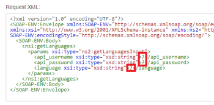

# [!UICONTROL SOAP] module

You can use the [!UICONTROL SOAP] module to connect to [!UICONTROL SOAP] APIs in [!UICONTROL Adobe Workfront Fusion].

## Access requirements

You must have the following access to use the functionality in this article:

<table style="table-layout:auto"> 
 <col> 
 <col> 
 <tbody> 
  <tr> 
   <td role="rowheader">[!DNL Adobe Workfront] plan*</td>
  <td> <p>[!UICONTROL Pro] or higher</p> </td>
  </tr> 
  <tr data-mc-conditions=""> 
   <td role="rowheader">[!DNL Adobe Workfront] license*</td>
   <td> <p>[!UICONTROL Plan], [!UICONTROL Work]</p> </td> 
  </tr> 
  <tr> 
   <td role="rowheader">[!DNL Adobe Workfront Fusion] license**</td> 
   <td>
   <p>Current license requirement: No [!DNL Workfront Fusion] license requirement.</p>
   <p>Or</p>
   <p>Legacy license requirement: [!UICONTROL [!DNL Workfront Fusion] for Work Automation and Integration] </p>
   </td> 
  </tr> 
  <tr> 
   <td role="rowheader">Product</td> 
   <td>
   <p>Current product requirement: If you have the [!UICONTROL Select] or [!UICONTROL Prime] [!DNL Adobe Workfront] Plan, your organization must purchase [!DNL Adobe Workfront Fusion] as well as [!DNL Adobe Workfront] to use functionality described in this article. [!DNL Workfront Fusion] is included in the [!UICONTROL Ultimate] [!DNL Workfront] plan.</p>
   <p>Or</p>
   <p>Legacy product requirement: Your organization must purchase [!DNL Adobe Workfront Fusion] as well as [!DNL Adobe Workfront] to use functionality described in this article.</p>
   </td> 
  </tr> 
 </tbody> 
</table>

To find out what plan, license type, or access you have, contact your [!DNL Workfront] administrator.

For information on [!DNL Adobe Workfront Fusion] licenses, see [[!DNL Adobe Workfront Fusion] licenses](../../workfront-fusion/get-started/license-automation-vs-integration.md).

## Using the [!UICONTROL SOAP] module

The [!UICONTROL SOAP] module is currently in beta and does not support:

* Redefine elements
* Fraction digits restrictions
* Total digits restrictions
* White space restrictions
* Multiple parts in input and output messages. Only single part messages are supported
* Custom XML Schema elements defined with the help of [[!UICONTROL SOAP] Encoding](http://schemas.xmlsoap.org) schemas and elements.

>[!INFO]
>
>**Example:** 
>  
>The following would not be recognized correctly by [!UICONTROL Workfront Fusion]:
>
>```
><complexType name="ArrayOfFloat">
>   <complexContent>
>      <restriction base="soapenc:Array">
>         <attribute ref="soapenc:arrayType"
>            wsdl:arrayType="xsd:integer[]"/>
>      </restriction>
>   </complexContent>
></complexType>
>```

It includes the `soapenc:Array`, `soapenc:arrayType` and `wsdl:arrayType` references, which are not yet supported in [!UICONTROL Workfront Fusion].

## Workaround

If the [!UICONTROL SOAP] module refuses to process the WSDL file or throws various errors in the module's configuration, you may try using the universal **[!UICONTROL HTTP] > [!UICONTROL Make a request]** module instead:

1. In [!DNL Workfront Fusion], create a new scenario.
1. Insert the **[!UICONTROL HTTP] > [!UICONTROL Make a request]** module in the scenario.
1. Open the module's configuration and fill in the follwoing fields:

   <table style="table-layout:auto"> 
    <col> 
    <col> 
    <tbody> 
     <tr> 
      <td role="rowheader">[!UICONTROL Method]</td> 
      <td> <p>[!UICONTROL POST]</p> </td> 
     </tr> 
     <tr data-mc-conditions=""> 
      <td role="rowheader">[!UICONTROL Body type]</td> 
      <td> <p>[!UICONTROL Raw]</p> </td> [!UICONTROL ]
     </tr> 
     <tr> 
      <td role="rowheader">[!UICONTROL Content type]</td> 
      <td> <p>[!UICONTROL XML (application/xml)]</p> </td> 
     </tr> 
     <tr> 
      <td role="rowheader">[!UICONTROL Parse response]</td> 
      <td>[!UICONTROL Enabled]</td> 
     </tr> 
    </tbody> 
   </table>

   

1. Open a new web browser window or tab.
1. Paste the WSDL URL into the web browser's address bar and fetch the XML file.

   The WSDL URL usually ends with `?wsdl`, but not necessarily, for example `http://voip.ms/api/v1/server.wsdl`.

1. If the WSDL file does not display directly in the web browser, open the downloaded file in a text editor.
1. Search for the `<service>` or `<wsdl:service>` tag:

   

1. Once located, copy the URL from the `location` attribute.
1. In [!DNL Workfront Fusion], paste the URL into the HTTP module's URL field.
1. Open the [Online [!UICONTROL SOAP] Client](https://wsdlbrowser.com/) in a new web browser window/tab.
1. Paste the WSDL URL into the WSDL URL field.
1. Click **[!UICONTROL Browse]**.
1. Pick from the list of functions to the left, for example `getLanguages`.
1. Copy the content of the [!UICONTROL Request XML] text area.
1. In [!UICONTROL Workfront Fusion], paste the copied content to the module's URL field.
1. Provide values for selected parameters by replacing the question marks with actual values:

   

1. Close the module's configuration by clicking **[!UICONTROL OK]**.
1. Execute the scenario or module.
