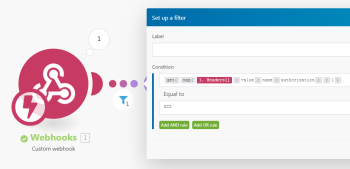
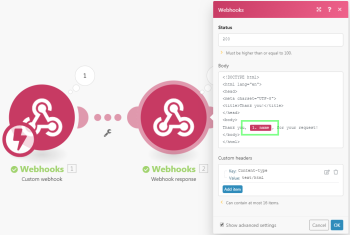

# Webhooks

A webhook is an HTTP call that is triggered by an event. You can use webhooks to activate instant trigger modules. Any application that is connected to the Internet and allows HTTP requests can send webhooks to Adobe Workfront Fusion.

## Access requirements

You must have the following access to use the functionality in this article:

<table style="table-layout:auto"> 
 <col> 
 <col> 
 <tbody> 
  <tr> 
   <td role="rowheader">[!DNL Adobe Workfront] plan*</td> 
   <td> <p>[!UICONTROL Pro] or higher</p> </td> 
  </tr> 
  <tr data-mc-conditions=""> 
   <td role="rowheader">[!DNL Adobe Workfront] license*</td> 
   <td> <p>[!UICONTROL Plan], [!UICONTROL Work]</p> </td> 
  </tr> 
  <tr> 
   <td role="rowheader">[!DNL Adobe Workfront Fusion] license**</td> 
   <td>
   <p>Current license requirement: No [!DNL Workfront Fusion] license requirement.</p>
   <p>Or</p>
   <p>Legacy license requirement: [!UICONTROL [!DNL Workfront Fusion] for Work Automation and Integration] </p>
   </td> 
  </tr> 
  <tr> 
   <td role="rowheader">Product</td> 
   <td>
   <p>Current product requirement: If you have the [!UICONTROL Select] or [!UICONTROL Prime] [!DNL Adobe Workfront] Plan, your organization must purchase [!DNL Adobe Workfront Fusion] as well as [!DNL Adobe Workfront] to use functionality described in this article. [!DNL Workfront Fusion] is included in the [!UICONTROL Ultimate] [!DNL Workfront] plan.</p>
   <p>Or</p>
   <p>Legacy product requirement: Your organization must purchase [!DNL Adobe Workfront Fusion] as well as [!DNL Adobe Workfront] to use functionality described in this article.</p>
   </td> 
  </tr>
 </tbody> 
</table>

&#42;To find out what plan, license type, or access you have, contact your Workfront administrator.

&#42;&#42;For information on [!DNL Adobe Workfront Fusion] licenses, see [[!DNL Adobe Workfront Fusion] licenses](../../workfront-fusion/get-started/license-automation-vs-integration.md)

## Use a webhook in [!DNL Workfront Fusion]

>[!NOTE]
>
>To call a third party webhook (an outgoing webhook) use one of the HTTP modules. For more information, see [HTTP modules](../../workfront-fusion/apps-and-their-modules/http-modules/http-modules-1.md).

To use a webhook to connect an app to [!DNL Workfront Fusion]:

1. Add the **[!UICONTROL Webhooks]** >**[!UICONTROL Custom Webhook]** instant trigger module to your scenario.

1. Click **[!UICONTROL Add]** next to the Webhook field and enter a name for the new webhook.
1. (Optional) Click **[!UICONTROL Advanced Settings]**. 
1. In the **[!UICONTROL IP restrictions]** field, enter a comma-separated list of the IP addresses that the module can accept data from.
1. Click **[!UICONTROL Save]**

After you create a webhook, a unique URL displays. This is the address where the webhook sends data. Workfront Fusion validates the data sent to this address, then passes it on for processing in the scenario.

>[!NOTE]
>
>Once you create a webhook, you can use it in more than one scenario at a time.

### Configure the webhook's data structure {#configure-the-webhook-s-data-structure}

In order to recognize the data structure of the incoming payload, [!DNL Workfront Fusion] parses sample data that you send to the displayed address. You can supply the sample data by making a change in the service or app that will make that service or app call the webhook. For example, you could remove a file.

Or you can follow the steps below to send the sample data via the [!UICONTROL HTTP] > [!UICONTROL Make a request] module.

1. Create a new scenario with the **[!UICONTROL HTTP]** > **[!UICONTROL Make a request]** module

1. Configure the module with the following values: 

   <table style="table-layout:auto"> 
    <col> 
    <col> 
    <tbody> 
     <tr> 
      <td role="rowheader"><p>[!UICONTROL URL] </p></td> 
      <td>Enter the URL of the webhook. You can find this URL in the [!UICONTROL Webhooks] module that you have used to set up the webhook.</td> 
     </tr> 
     <tr> 
      <td role="rowheader">[!UICONTROL Method] </td> 
      <td><p>[!UICONTROL POST]</p></td> 
     </tr> 
     <tr> 
      <td role="rowheader">[!UICONTROL Body type]</td> 
      <td><p> [!UICONTROL Raw]</p></td> 
     </tr> 
     <tr> 
      <td role="rowheader">[!UICONTROL Content type]</td> 
      <td><p> JSON (application/json)</p></td> 
     </tr> 
     <tr> 
      <td role="rowheader">[!UICONTROL Request content]</td> 
      <td><p>Raw JSON expected in the webhook</p></td> 
     </tr> 
    </tbody> 
   </table>

   

1. Open the scenario with the [!UICONTROL Webhooks] module in a separate browser tab or window.
1. In the webhooks module, click **[!UICONTROL Redetermine data structure]**.

   You do not need to unlink other modules from the webhooks module.

1. Switch to the scenario with the [!UICONTROL HTTP] module and run it.
1. Switch back to the scenario with the Webhooks module.

   A "[!UICONTROL Successfully determined]" message means that the module has successfully determined the data structure.

   

1. Click **[!UICONTROL OK]** to save the data structure.

   The webhook's items are now available in the mapping panel for use with subsequent modules in the scenario.

## The webhook queue

If a webhook receives data and there is not an active scenario that is expecting that data, the data is stored in the queue. Once you activate the scenario, it processes all bundles waiting in the queue sequentially.

>[!IMPORTANT]
>
>Webhook queues are shared among scenarios that employ the same webhook. If one of the scenarios is disabled, all incoming data is held in the queue.

## Supported incoming data formats

[!DNL Workfront Fusion] supports 3 incoming data formats: [!UICONTROL Query String], [!UICONTROL Form Data] and [!UICONTROL JSON].

[!DNL Workfront Fusion] validates all incoming data against the selected data structure. Then, depending on the scenario's settings, the data is either stored in the queue for processing, or it is processed immediately.

If any part of the data does not pass the validation, [!DNL Workfront Fusion] returns a 400 HTTP status code and specifies, in the body of the HTTP response, the reason why the incoming data failed the validation checks. If the validation of the incoming data succeeds, Workfront Fusion returns a "[!UICONTROL 200 Accepted]" status.

* [[!UICONTROL Query String]](#query-string) 
* [[!UICONTROL Form Data]](#form-data) 
* [[!UICONTROL JSON]](#json)

### [!UICONTROL Query String] 

```
GET https://app.workfrontfusion.com/wh/<yourunique32characterslongstring>?name=<yourname>&job=automate
```

### [!UICONTROL Form Data] 

```
POST https://app.workfrontfusion.com/wh/<yourunique32characterslongstring>

Content-Type: application/x-www-form-urlencoded

name=<yourname>&job=automate
```

#### Multipart form data

```
POST https://app.workfrontfusion.com/wh/<yourunique32characterslongstring>


Content-Type: multipart/form-data; boundary=---generatedboundary

---generatedboundary

Content-Disposition: form-data; name="file"; filename="file.txt"


Content-Type: text/plain


Content of file.txt


---generatedboundary

Content-Disposition: form-data; name="name"

Workfront Fusion

---generatedboundary
```

In order to receive files encoded with `multipart/form-data`, you must configure a data structure with a `collection` type field that contains the nested fields `name`, `mime`, and `data`. The field `name` is a `text` type and contains the name of the uploaded file. The `mime` is a `text` type and contains a file in MIME format. The field `data` is a `buffer` type and contains binary data for the file being transferred.

For more information on MIME format, see [MIME modules](../../workfront-fusion/apps-and-their-modules/mime.md).

### [!UICONTROL JSON]

```
POST https://app.workfrontfusion.com/wh/<yourunique32characterslongstring>

Content-Type: application/json

{"name": "Workfront Fusion", "job": "automate"}
```

>[!TIP]
>
>If you want to access the original JSON, enable JSON pass-through when setting up the webhook.
>
>1. Click **[!UICONTROL Add]** to add a new webhook.
>1. Click **[!UICONTROL Show advanced settings]**.
>1. Click **[!UICONTROL JSON pass-through]**.
>

## Webhook headers

To access the webhook's headers, enable Get request headers when setting up the webhook.

1. Click **[!UICONTROL Add]** to add a new webhook.
1. Click **[!UICONTROL Show advanced settings]**.
1. Click **[!UICONTROL Get request headers]**.

You can extract a particular header value with the combination of `map()` and `get()` functions. 

>[!INFO]
>
>**Example:** 
>
>The example below shows a formula that extracts the value of the `authorization` header from the `Headers[]` array. The formula is used in a filter that compares the extracted value with the given text to pass only webhooks if there is a match.
>
>
>
>For further information on obtaining an array's element with a given key, see [Map an array's element with a given key](../../workfront-fusion/mapping/map-information-between-modules.md#mapping) in the article [Map information from one module to another in Adobe Workfront Fusion](../../workfront-fusion/mapping/map-information-between-modules.md).

## Responding to webhooks

The default response to a webhook call is the text "Accepted". The response is returned to the app that called the webhook during the execution of the Custom Webhook module.

* [Test the response to a webhook](#test-the-response-to-a-webhook) 
* [HTML Response example](#html-response-example) 
* [Redirect example](#redirect-example)

### Test the response to a webhook 

1. Include the **[!UICONTROL Custom Webhook]** module in your scenario.
1. Add a new webhook to the module.
1. Copy the webhook URL to your clipboard.
1. Run the scenario.

   The lightning icon on the [!UICONTROL Custom Webhook] module changes to spinning dots. This shows that the module is now waiting for the webhook call.

1. Open a new browser window, paste the copied URL in the address bar and press **[!UICONTROL Enter]**.

   The [!UICONTROL Custom Webhook] module is triggered and the browser will display a new page.

If you want to customize the webhook's response, employ the module Webhook Response.

The configuration of the module contains two fields: [!UICONTROL Status] and [!UICONTROL Body].

* The [!UICONTROL Status] field contains HTTP response status codes such as 2xx for Success (for example, `200` for OK), 3xx for Redirection (for example, `307` for Temporary Redirect), 4xx for Client errors (for example, `400` for Bad Request), and so on. 

* The [!UICONTROL Body] field contains anything that will be accepted by the webhook's call. It can be simple text, HTML, XML, JSON, and so on.

  >[!TIP]
  >
  >We recommend setting the `Content-Type` header to the corresponding MIME type: `text/plain` for plain text, `text/html` for HTML, `application/json` for JSON, `application/xml` for XML, and so on. For more information on MIME types, see [MIME modules](../../workfront-fusion/apps-and-their-modules/mime.md).

Timeout for sending a response is 40 seconds. If the response is not available within that period, Workfront Fusion returns a '200 Accepted' status.

### HTML Response example 

>[!INFO]
>
>**Example:** 
>
>Configure the [!UICONTROL Webhook Response] module as follows:
>
><table style="table-layout:auto"> 
> <col> 
> <col> 
> <tbody> 
>  <tr> 
>   <td role="rowheader">[!UICONTROL Status] </td> 
>   <td> <p>2xx success HTTP status code, e.g. 200</p> </td> 
>  </tr> 
>  <tr> 
>   <td role="rowheader">[!UICONTROL Body] </td> 
>   <td> <p>HTML code</p> </td> 
>  </tr> 
>  <tr> 
>   <td role="rowheader"> <p>[!UICONTROL Custom headers]</p> </td> 
>   <td> 
>    <ul> 
>     <li><strong>Key</strong>: Content-type</li> 
>     <li><strong>Value</strong>: text/html</li> 
>    </ul> </td> 
>  </tr> 
> </tbody> 
></table>
>
>
>
>This will produce an HTML response that displays in a web browser:
>
>

### Redirect example 

>[!INFO]
>
>**Example:** Configure the [!UICONTROL Webhook Response] module as follows:
>
><table style="table-layout:auto"> 
> <col> 
> <col> 
> <tbody> 
>  <tr> 
>   <td role="rowheader">[!UICONTROL Status] </td> 
>   <td> <p>3xx redirection HTTP status code, e.g. 303</p> </td> 
>  </tr> 
>  <tr> 
>   <td role="rowheader"> <p>[!UICONTROL Custom headers]</p> </td> 
>   <td> 
>    <ul> 
>     <li><strong>[!UICONTROL Key]</strong>: Location</li> 
>     <li><strong>[!UICONTROL Value]</strong>: The URL you would like to redirect to.</li> 
>    </ul> </td> 
>  </tr> 
> </tbody> 
></table>
>
>

## Webhook deactivation

Webhooks are deactivated automatically if either of the following applies:

* The webhook has not been connected to any scenario for more than 5 days
* The webhook is used only in inactive scenarios, which have been inactive for more than 30 days.

Deactivated webhooks are deleted and unregistered automatically if they are not connected to any scenarios and have been in deactivated status for over 30 days.


## Troubleshooting

### Missing items in the mapping panel

If some items are missing in the mapping panel in the setup of the modules following the [!UICONTROL Webhooks] > [!UICONTROL Custom Webhook] module, click on the **[!UICONTROL Webhooks] > [!UICONTROL Custom Webhook]** module to open its setup and click **[!UICONTROL Re-determine data structure]**:


Then follow the steps described in the section [Configure the webhook's data structure](#configure-the-webhook-s-data-structure) in this article.
