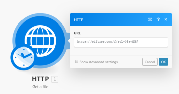
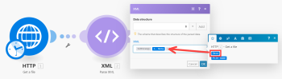
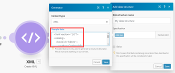

# XML

The [!UICONTROL XML] app enables you to parse an XML formatted text via the [!UICONTROL XML] > [!UICONTROL Parse XML] module and convert it to a bundle to make the data available to other modules. You can also convert a bundle to an XML formatted text via the [!UICONTROL XML] > [!UICONTROL Create XML] module

## Access requirements

You must have the following access to use the functionality in this article:

<table style="table-layout:auto"> 
 <col> 
 <col> 
 <tbody> 
  <tr> 
   <td role="rowheader">[!DNL Adobe Workfront] plan*</td>
  <td> <p>[!UICONTROL Pro] or higher</p> </td>
  </tr> 
  <tr data-mc-conditions=""> 
   <td role="rowheader">[!DNL Adobe Workfront] license*</td>
   <td> <p>[!UICONTROL Plan], [!UICONTROL Work]</p> </td> 
  </tr> 
  <tr> 
   <td role="rowheader">[!DNL Adobe Workfront Fusion] license**</td> 
   <td>
   <p>Current license requirement: No [!DNL Workfront Fusion] license requirement.</p>
   <p>Or</p>
   <p>Legacy license requirement: [!UICONTROL [!DNL Workfront Fusion] for Work Automation and Integration] </p>
   </td>  
  </tr> 
  <tr> 
   <td role="rowheader">Product</td> 
   <td>
   <p>Current product requirement: If you have the [!UICONTROL Select] or [!UICONTROL Prime] [!DNL Adobe Workfront] Plan, your organization must purchase [!DNL Adobe Workfront Fusion] as well as [!DNL Adobe Workfront] to use functionality described in this article. [!DNL Workfront Fusion] is included in the [!UICONTROL Ultimate] [!DNL Workfront] plan.</p>
   <p>Or</p>
   <p>Legacy product requirement: Your organization must purchase [!DNL Adobe Workfront Fusion] as well as [!DNL Adobe Workfront] to use functionality described in this article.</p>
   </td> 
  </tr> 
 </tbody> 
</table>

To find out what plan, license type, or access you have, contact your [!DNL Workfront] administrator.

For information on [!DNL Adobe Workfront Fusion] licenses, see [[!DNL Adobe Workfront Fusion] licenses](../../workfront-fusion/get-started/license-automation-vs-integration.md).

## [!UICONTROL Parse XML]

The [!UICONTROL XML] > [!UICONTROL Parse XML] module parses an XML formatted text and outputs a single bundle containing all the information extracted from the XML.

<table style="table-layout:auto"> 
 <col> 
 <col> 
 <tbody> 
  <tr> 
   <td role="rowheader"> <p>[!UICONTROL Data structure]</p> </td> 
   <td> <p>The data structure describes the structure of the XML to make the output of the module available in the mapping panel for the following modules.</p> <p>If you have a sample of the XML you would like to parse, you can use it to generate the data structure:</p> 
    <ol> 
     <li value="1">Click the <strong>[!UICONTROL Add]</strong> button.</li> 
     <li value="2">Click the <strong>[!UICONTROL Generator]</strong> button.</li> 
     <li value="3">Copy and paste the XML sample into the <strong>[!UICONTROL Sample data]</strong> field.</li> 
     <li value="4">Click <strong>[!UICONTROL Save]</strong>.</li> 
     <li value="5">Verify that the data structure has been successfully generated.</li> 
     <li value="6"> <p>Click the <strong>[!UICONTROL Save]</strong> button to save the data structure.</p> <p>You can skip the steps 2-5 to supply an empty data structure. If the data structure is empty, the output of the module is not available in the mapping panel until the module has been executed at least once.</p> </li> 
    </ol> <p>For more information, see <a href="../../workfront-fusion/modules/data-structures.md" class="MCXref xref">Data structures in [!DNL Adobe Workfront Fusion]</a>.</p> </td> 
  </tr> 
  <tr> 
   <td role="rowheader">[!UICONTROL Preserve numbers as text]</td> 
   <td>Enable this option to ensure that numbers remain as text (string) values. Otherwise, numbers are cast to number values.</td> 
  </tr> 
  <tr> 
   <td role="rowheader"> <p>[!UICONTROL XML]</p> </td> 
   <td> <p>Enter or map the XML formatted text you would like to parse.</p> <p>If you use a formula, make sure its result value type is (or can be automatically coerced to) the [!UICONTROL Text] data type. </p> <p>  </p> <p>If the result value type is [!UICONTROL Buffer] (binary data) then use the <code>toString()</code> function to convert it to the Text data type. For more information, see <a href="../../workfront-fusion/mapping/type-coercion.md" class="MCXref xref">Type coercion in [!DNL Adobe Workfront Fusion]</a> and <a href="../../workfront-fusion/mapping/item-data-types.md" class="MCXref xref">Item data types in [!UICONTROL Adobe Workfront Fusion]</a>.</p> </td> 
  </tr> 
 </tbody> 
</table>

>[!INFO]
>
>**Example:** To download an XML file from a URL and parse its content:
>
>1. Create a new scenario.
>1. Insert [!UICONTROL HTTP] > [!UICONTROL Get a file] module
>1. Open the module's configuration and configure it as follows:
>
>   **URL**: URL of the XML file (e.g. `https://siftrss.com/f/rqLy05ayMBJ`)
>
>   
>
>1. Click **[!UICONTROL OK]**&#x200B;to save and close the module's configuration.
>1. Add [!UICONTROL XML] > [!UICONTROL Parse XML] module, connect it after the [!UICONTROL HTTP] > [!UICONTROL Get a file] module and configure it as follows:
>
>   <table style="table-layout:auto"> 
>    <col> 
>    <col> 
>    <tbody> 
>     <tr> 
>      <td role="rowheader">[!UICONTROL Data structure]</td> 
>      <td> 
>       <ol> 
>        <li value="1">Click the <strong>[!UICONTROL Add]</strong> button.</li> 
>        <li value="2">Click the <strong>[!UICONTROL Generator]</strong> button.</li> 
>        <li value="3">In your web browser, open a new tab or window.</li> 
>        <li value="4">Put the URL you used in the third step in the address bar and fetch the XML file.</li> 
>        <li value="5">Select all the XML text and copy it into the clipboard.</li> 
>        <li value="6">Close the tab or window and get back to your scenario.</li> 
>        <li value="7">Paste the copied XML text into the Sample data field.</li> 
>        <li value="8">Click <strong>[!UICONTROL Save]</strong>.</li> 
>        <li value="9">Verify that the data structure has been successfully generated.</li> 
>        <li value="10">Click <strong>[!UICONTROL Save]</strong> to save the data structure.</li> 
>       </ol> <p>You can skip steps 2 through 9 to supply an empty data structure. If the data structure is empty, the output of the module is not available in the mapping panel until the module has been executed at least once.</p> </td> 
>     </tr> 
>     <tr> 
>      <td role="rowheader">[!UICONTROL XML]</td> 
>      <td> <p>Map the <code>Data </code>item from the output of the [!UICONTROL HTTP] &gt; [!UICONTROL Get a file] module into the field. Use the <code>toString()</code> function to convert its value from the [!UICONTROL Buffer] (binary data) type to [!UICONTROL Text] data type.</p> <p>You may copy and paste the formula's code into the field: <code>&#123;&#123;toString(1.data)&#125;&#125;</code></p> <p>For more information the Buffer and Text data types, see <a href="../../workfront-fusion/mapping/item-data-types.md" class="MCXref xref">Item data types in Adobe Workfront Fusion</a>.</p> <p>  </p> </td> 
>     </tr> 
>    </tbody> 
>   </table>

## [!UICONTROL Parsing XML attributes]

By default, the [!UICONTROL XML] > [!UICONTROL Parse XML] module puts attributes in a special collection `_attributes` as a child of the node that has these attributes. If the node is a text node and it has attributes, then two special properties are added: `_attributes` for attributes and `_value` for the text content of the node.

>[!INFO]
>
>**Example:** This XML: 

```
<root attr="1">
<node attr="ABC">Hello, World</node>
</root>
```

is converted into this bundle:


## Create XML

The [!UICONTROL XML] > [!UICONTROL Create XML] module converts a bundle to an XML formatted text.

<table style="table-layout:auto"> 
 <col> 
 <col> 
 <tbody> 
  <tr> 
   <td role="rowheader"> <p>[!UICONTROL Data structure]</p> </td> 
   <td> <p>The Data structure describes the structure of the resulting XML. If you have a sample of the XML you would like to create, you can use it to generate the data structure:</p> 
    <ol> 
     <li value="1">Click the <strong>[!UICONTROL Add]</strong> button.</li> 
     <li value="2">Click the <strong>[!UICONTROL Generator]</strong> button.</li> 
     <li value="3">Copy and paste the XML sample into the Sample data field.</li> 
     <li value="4">Click the <strong>[!UICONTROL Save]</strong> button.</li> 
     <li value="5">Verify that the data structure has been successfully generated.</li> 
     <li value="6">Click <strong>[!UICONTROL Save]</strong> to save the data structure.</li> 
    </ol> </td> 
  </tr> 
  <tr> 
   <td role="rowheader">[!UICONTROL Root element name]</td> 
   <td>Enter the name of the XML's root element. The default value is <code>root</code>.</td> 
  </tr> 
  <tr> 
   <td role="rowheader">[!UICONTROL Doctype SYSTEM ID]</td> 
   <td>Enter the file name to use in the<code> !DOCTYPE SYSTEM</code> declaration</td> 
  </tr> 
  <tr> 
   <td role="rowheader">[!UICONTROL Doctype PUBLIC ID]</td> 
   <td>Enter the file name to use in the<code> !DOCTYPE PUBLIC</code> declaration</td> 
  </tr> 
  <tr> 
   <td role="rowheader">[!UICONTROL Strip Xml Declaration]</td> 
   <td>Enable this option to remove the XML Declaration <code>&lt;?xml ... ?&gt;</code> and <code>&lt;!DOCTYPE ... &gt;</code>and leave only the XML root element and its contents.</td> 
  </tr> 
 </tbody> 
</table>

>[!INFO]
>
>**Example:** 
>
>A typical use case is to transform data from a [!DNL Google] >spreadsheet into XML.
>
>1. Place the [!DNL Google Sheets] > [!UICONTROL Select rows] module in your scenario to fetch the data. Set up the module to retrieve rows from your [!DNL Google] spreadsheet. Set the&#x200B;**[!UICONTROL Maximum number of returned rows]** to a small number, but larger than one for testing purposes (Example, three). Execute the [!DNL Google Sheets] module by right-clicking it and choosing "**[!UICONTROL Run this module only]**." Verify the output of the module.
>1. Connect the [!UICONTROL Array Aggregator] module after the [!DNL Google Sheets] module. In the module's setup choose the [!DNL Google Sheets] module in the **[!UICONTROL Source node]** field. Leave the other fields as they are for the moment.
>1. Connect the [!UICONTROL XML] > [!UICONTROL Create XML] module after the [!UICONTROL Array Aggregator] module.
>
>    The module's setup requires a data structure that describes the structure of the XML output. Click the **[!UICONTROL Add]** button to open the data structure setup. The easiest way to create this data structure is to generate it automatically from an XML sample. 
>
>1. Click the **[!UICONTROL Generator]** button and paste your XML sample to the [!UICONTROL Sample data] field:
>
>   
>
>1. Click **[!UICONTROL Save]**. The Specification field in the Data structure now contains the generated structure.
>1. Change the name of your Data structure to something more specific and click **[!UICONTROL Save]**. A field corresponding to the root array attribute appears as a mappable field in the JSON module's setup.
>1. Click the **[!UICONTROL Map]** button next to the field and map the `Array[]` item from the [!UICONTROL Array aggregator] output to it:
>1. Click **[!UICONTROL OK]** to close the XML module's setup.
>1. Open the setup of the [!UICONTROL Array Aggregator] module. Change the **[!UICONTROL Target structure]** from Custom to an XML module's field corresponding to the parent XML element.Map items from the [!DNL Google Sheets] module to the appropriate fields.
>1. Click **[!UICONTROL OK]** to close the Array Aggregator module's setup.
>1. Run the scenario.
>
>    The XML module outputs the correct XML file. 
>
>1. Open the setup of the [!DNL Google Sheets] module and increase the [!UICONTROL Maximum number of returned rows] number to be larger than the number of rows in your spreadsheet to process all the data.
>
>    The resulting XML can be saved to [!DNL Dropbox], sent as an attachment via email, uploaded via FTP to a server, and so on.

## Adding XML attributes

If you want to add attributes to a complex node (a node that will contain other nodes), you must add a collection with the name `_attributes` for the complex note in your custom data structure. This collection will be mapped to node attributes. If you want to add attributes to a text node (for example: `<node attr="1">abc</node>`), you must add a collection `_attributes` for attributes and a text property `_value` for the node value for this node in your custom data structure.

```
{
   "name": "node",
   "type": "collection",
   "spec": [
      {
         "name": "_attributes",
         "type": "collection"
         "spec": [
            {
               "name": "attr1",
               "type": "text"
            }
         ]
      },
      {
         "name": "_value",
         "type": "text"
      }
   ]
}
```

## Troubleshooting: Cannot map data from the [!UICONTROL Parse XML] module

Make sure the data structure is defined correctly. Alternatively, you may use an empty data structure and execute the module at least once to process an XML input.
