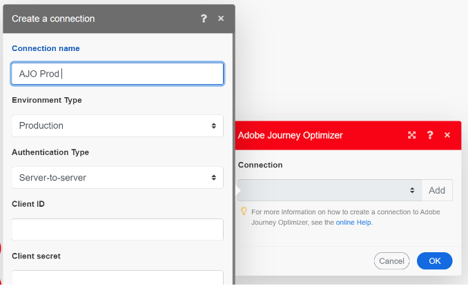
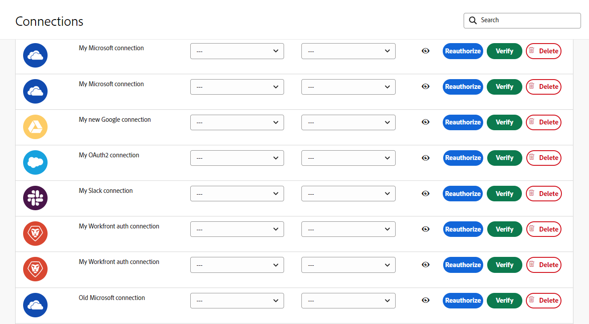

# Connection metadata in Adobe Workfront Fusion

>[!NOTE]
>
>[!DNL Adobe Workfront Fusion] requires an [!DNL Adobe Workfront Fusion] license in addition to an [!DNL Adobe Workfront] license.

Not all connections are the same. Understanding the differences between connections is very important for knowing their business context. Fusion uses metadata to identify important attributes of a connection.  

Connection metadata can be set when creating a new connection. These attributes are in the same dialog box used for setting up a connection: 

Fusion users can view and edit connections from the Connections area.  

## Environment Type 

Fusion connections can be used by both production and non-production systems. Knowing the difference is very important for protecting production environments. Please note that the environment type, like other connection metadata, is used for informational purposes only. Users are still responsible for accurate setting this attribute.  

## Authentication Type 

Fusion connections can be used for both service accounts and personal accounts. Service accounts are used for authentication when a scenario automates as Fusion. Personal accounts are authentication based on a specific person. Which authentication type is used depends on the scenario's requirements. Personal accounts should be used for automated user actions. For example, if a Fusions scenario automates approval by a specific person, then the authentication type should be for that person. 

For more information on authentication types, please see [Authentication](https://developer.adobe.com/developer-console/docs/guides/authentication/) in Adobe's Authentication guide. 

 