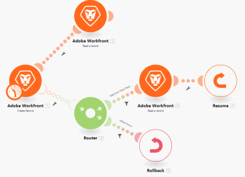
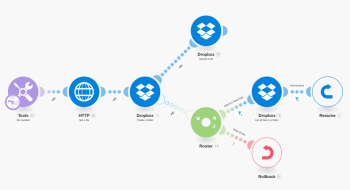
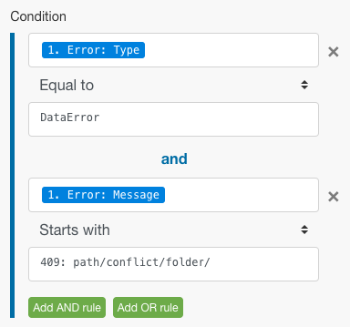
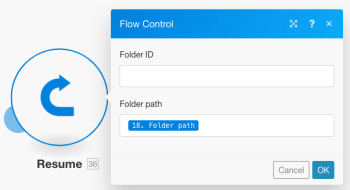

# Advanced error handling in Adobe Workfront Fusion

Advanced error handling techniques include filtering and nesting.

## Access requirements

You must have the following access to use the functionality in this article:

<table> 
 <col> 
 <col> 
 <tbody> 
  <tr> 
   <td role="rowheader">Adobe Workfront plan*</td> 
   <td> 
Pro or higher
 </td> 
  </tr> 
  <tr data-mc-conditions=""> 
   <td role="rowheader">Adobe Workfront license*</td> 
   <td> 
Plan, Work
 </td> 
  </tr> 
  <tr> 
   <td role="rowheader">Adobe Workfront Fusion license**</td> 
   <td> 
Workfront Fusion for Work Automation and Integration 
  </td> 
  </tr> 
  <tr> 
   <td role="rowheader">Product</td> 
   <td>Your organization must purchase Adobe Workfront Fusion as well as Adobe Workfront to use functionality described in this article.</td> 
  </tr> <!--
   <tr data-mc-conditions="QuicksilverOrClassic.Draft mode"> 
    <td role="rowheader">Access level configurations*</td> 
    <td> <!--
      
You must be a Workfront Fusion administrator for your organization.

     --> <!--
      
You must be a Workfront Fusion administrator for your team.

     --> </td> 
   </tr>
  --> 
 </tbody> 
</table>

&#42;To find out what plan, license type, or access you have, contact your Workfront administrator.

&#42;&#42;For information on Adobe Workfront Fusion licenses, see [Adobe Workfront Fusion licenses](../../workfront-fusion/get-started/license-automation-vs-integration.md)

## Filtering

There are two kinds of filtering that can take place on an error handler route.

* [Adding a filter to the error handler route](#adding-a-filter-to-the-error-handler-route) 
* [Adding a Router followed by filters to the error handler route](#adding-a-router-followed-by-filters-to-the-error-handler-route)

### Adding a filter to the error handler route {#adding-a-filter-to-the-error-handler-route}

You can use a filter to control which errors are handled by the error handler route. This allows you to process only specific types of errors. If an error does not pass through the filter, it will be treated as if there is no error handler route defined for the given module.

**Example:**  

### Adding a Router followed by filters to the error handler route {#adding-a-router-followed-by-filters-to-the-error-handler-route}

In this example, the error takes place at the Create a folder module (A), which has a regular route and an error handler route. The latter is followed by a router with one route that has a filter that defines a specific type of error (Data Error Takes Place), and the other which is the default route for all other errors. The first route ends with the Resume directive which contains substitute values for the scenario to resume from module A (Create a folder), while the second route ends with the Rollback directive which stops the scenario execution immediately.

See [Error processing in Adobe Workfront Fusion](../../workfront-fusion/errors/error-processing.md) for further information on various error types and on how Workfront Fusion processes and evaluates them.

### The example scenario

You can set up this example scenatio to understand how these filters work for error handling.

Use an existing Dropbox folder to upload a file instead of creating a new one

If you use the Create a folder module on Dropbox and a folder with the same name already exists, the module will throw a Data Error as shown below:

The complete scenario:

1. The Tools > Set Variable module contains the folder name
1. The HTTP > Get a file module fetches the file that needs to be uploaded to the folder
1. The Dropbox > Create a folder module throws an error if a folder already exists with the same name as the one mapped in the module
1. The error handler route (transparent bubbles) contains a router to filter the errors
1. The first route is for a specified type of error called Data Error as we know of it already:

   1. If a Data Error takes place and the error details pass through the filter, the Dropbox > List all files/subfolders in a folder module lists all folders in Dropbox
   1. The subsequent filter matches the folder names
   1. The Resume directive specifies the folder ID and folder path of the existing folder and the scenario execution resumes from the Dropbox > Create a folder module but instead of trying to create a new folder, this time it uses the values from the Resume directive to move to the next module and upload the file in the existing folder

1. The second route is for all other errors and ends with the Rollback directive which results in stopping the scenario immediately

Below is a detailed explanation of the 5th statement:

In order to use the existing folder in your subsequent modules (Upload a file below), you need to add an error handler route to the module and fetch the folder path to be mapped into the Resume directive module that follows:

The filter on the first route is set to only handle the particular error (Data Error) that appears when a folder with the same name already exists:

The Dropbox > List all files in a folder module is configured to return all the folders in the target folder. The following filter only passes on the one we were originally trying to create (the folder name is stored in the 33. Folder Name item):

Eventually, the Resume directive supplies the Folder path as the output for the failed module. Note that the Folder ID has been left blank since it is not needed by the 'Upload a file' module:

## Nesting

Regardless of where a module is located, error handler routes can be created and implemented on all modules, except routers. So it is possible to create an error handler route for a module that is already part of an existing error handler route created for another module.

Here's an example of a nested error handler route:

In this scenario, the second error handler route is nested under the first error handler route. So, if the Dropbox > Create a folder module encounters an error, the execution moves to Route 1, if the Data Error Takes Place filter is passed, the next module is executed followed by the Resume directive module if an error does not take place with the Dropbox > List all files/subfolders in a folder module.

However, if an error does take place with this Dropbox module, then the execution moves to Error Handler Route 2 and ends with the Ignore directive. It is obvious that the Resume directive module is not executed in this case.

That is a combination of filtering and nesting error handlers.

<!--

Watch this 4-part video course to learn all about error handling in less than 22 minutes

-->

