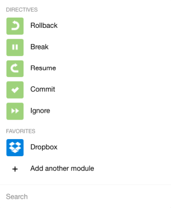

# Error handling in [!DNL Adobe Workfront] Fusion

When errors occur during the execution of a scenario, it's usually because a service is unavailable due to a failure, a service responds with unexpected data, or the validation of input data fails.

>[!NOTE]
>
>If a module throws an error during the scenario execution and there is no error handling route attached to the module, a default error handling logic is executed as described in [Error processing in [!DNL Adobe Workfront] Fusion](../../workfront-fusion/errors/error-processing.md).

By adding an error handler route to a module, you can replace the default error handling logic with your own. [!DNL Adobe Workfront Fusion] offers 5 different directives, any of which can be inserted at the end of your error handler routes. For more information, see [Directives for error handling in Adobe Workfront Fusion](../../workfront-fusion/errors/directives-for-error-handling.md).

## Access requirements

You must have the following access to use the functionality in this article:

<table style="table-layout:auto">
 <col> 
 <col> 
 <tbody> 
  <tr> 
   <td role="rowheader">Adobe Workfront plan*</td> 
   <td> 
Pro or higher
 </td> 
  </tr> 
  <tr data-mc-conditions=""> 
   <td role="rowheader">Adobe Workfront license*</td> 
   <td> 
Plan, Work
 </td> 
  </tr> 
  <tr> 
   <td role="rowheader">Adobe Workfront Fusion license**</td> 
   <td> 
Workfront Fusion for Work Automation and Integration 
  </td> 
  </tr> 
  <tr> 
   <td role="rowheader">Product</td> 
   <td>Your organization must purchase [!DNL Adobe Workfront Fusion] as well as [!DNL Adobe Workfront] to use functionality described in this article.</td> 
  </tr> 
 </tbody> 
</table>

&#42;To find out what plan, license type, or access you have, contact your [!DNL Workfront] administrator.

&#42;&#42;For information on Adobe Workfront Fusion licenses, see [Adobe Workfront Fusion licenses](../../workfront-fusion/get-started/license-automation-vs-integration.md)

## Error handler route

To add an error handler route to a module, (we will call it Module X), right click the module and select **Add error handler**:

The module shows a list of Directives as well as the apps being used in your scenario. If Module X is the last module in your route, you need to choose one of the directives. Or you can go on to add one or more modules to your route. In this case, the Ignore directive is applied by default to Module X and, in the event of an error, the subsequent modules on that route are processed.

As you can see below, if an error occurs while executing the [!UICONTROL Create a folder] module, the [!UICONTROL Ignore] directive will be applied automatically and the scenario will move to the next module on the error handler route if the filter "Data Error Takes Place" returns one or more bundles.

However, if there is no error, the scenario will move to the [!UICONTROL List all files in a folder module] on the regular route.

Also, to differentiate an error handler route from a regular route, the former is composed of transparent circles as shown above.

## Error handling directives

The directives are briefly explained below. For more information, see [Directives for error handling in Adobe Workfront Fusion](../../workfront-fusion/errors/directives-for-error-handling.md).

There are a total of five directives which can be grouped into the following categories based on whether a scenario execution should continue or not:

The following directives ensure that a scenario execution continues:

* Resume allows you to specify a substitute output for the module with the error and the scenario execution status is marked as success
* Ignore simply ignores the error and the scenario execution status is marked as success
* Break stores the input to the queue of incomplete executions and the scenario execution status is marked as warning. For more information, see [View and resolve incomplete executions in Adobe Workfront Fusion](../../workfront-fusion/scenarios/view-and-resolve-incomplete-executions.md).

On the other hand, if a scenario execution should be stopped, you must use one of the following directives:

* Rollback stops the scenario execution immediately and marks its status as error
* Commit stops the scenario execution immediately and marks its status as success

## Additional Resources

* [Directives for error handling in [!DNL Adobe Workfront] Fusion](../../workfront-fusion/errors/directives-for-error-handling.md)
* [Advanced error handling in [!DNL Adobe Workfront Fusion]](../../workfront-fusion/errors/advanced-error-handling.md) (includes the set up of the Dropbox Scenario referenced above)
