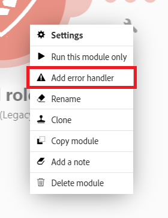

# Error handling in [!DNL Adobe Workfront Fusion]

When errors occur during the execution of a scenario, it's usually because a service is unavailable due to a failure, a service responds with unexpected data, or the validation of input data fails.

If a module throws an error during the scenario execution and there is no error handling route attached to the module, the default error handling logic executes, as described in [Error processing in [!DNL Adobe Workfront Fusion]](../../workfront-fusion/errors/error-processing.md).

By adding an error handler route to a module, you can replace the default error handling logic with your own. [!DNL Adobe Workfront Fusion] offers five different directives that can be inserted at the end of your error handler routes. 

For more information, see [Directives for error handling in [!DNL Adobe Workfront Fusion]](../../workfront-fusion/errors/directives-for-error-handling.md).

## Access requirements

You must have the following access to use the functionality in this article:

<table style="table-layout:auto">
 <col> 
 <col> 
 <tbody> 
  <tr> 
   <td role="rowheader">[!DNL Adobe Workfront] plan*</td> 
   <td> 
[!DNL Pro] or higher
 </td> 
  </tr> 
  <tr data-mc-conditions=""> 
   <td role="rowheader">[!DNL Adobe Workfront] license*</td> 
   <td> 
[!UICONTROL Plan], [!UICONTROL Work]
 </td> 
  </tr> 
  <tr> 
   <td role="rowheader">[!UICONTROL Adobe Workfront Fusion] license**</td> 
   <td>
   
Current license requirement: No [!DNL Workfront Fusion] license requirement.

   
Or

   
Legacy license requirement: [!UICONTROL [!DNL Workfront Fusion] for Work Automation and Integration] 

   </td> 
  </tr> 
  <tr> 
   <td role="rowheader">Product</td> 
   <td>
   
Current product requirement: If you have the [!UICONTROL Select] or [!UICONTROL Prime] [!DNL Adobe Workfront] Plan, your organization must purchase [!DNL Adobe Workfront Fusion] as well as [!DNL Adobe Workfront] to use functionality described in this article. [!DNL Workfront Fusion] is included in the [!UICONTROL Ultimate] [!DNL Workfront] plan.

   
Or

   
Legacy product requirement: Your organization must purchase [!DNL Adobe Workfront Fusion] as well as [!DNL Adobe Workfront] to use functionality described in this article.

   </td> 
  </tr> 
 </tbody> 
</table>

To find out what plan, license type, or access you have, contact your [!DNL Workfront] administrator.

For information on [!DNL Adobe Workfront Fusion] licenses, see [[!DNL Adobe Workfront Fusion] licenses](../../workfront-fusion/get-started/license-automation-vs-integration.md).

## Error handler route

To add an error handler route to a module:

1. Right click the module and select **[!UICONTROL Add error handler]**:

    

    The module shows a list of Directives as well as the apps being used in your scenario. 
    
1.  If the module that you added an error handler to is the last module in your route, select one of the directives. 

    Or 

    Add one or more modules to the error handler route. 

    If you add more modules to the route, the [!UICONTROL Ignore] directive is applied by default, and, in the event of an error, the subsequent modules on that route are processed.

>[!INFO]
>
>In this example, if an error occurs while executing the [!UICONTROL Create a folder] module, the [!UICONTROL Ignore] directive will be applied automatically and the scenario will move to the next module on the error handler route.
>
>However, if there is no error, the scenario will move to the [!UICONTROL List all files in a folder module] on the regular route.
>
>

Note that an error handler route is composed of transparent circles, while a regular route is composed of solid circles.

## Error handling directives

The directives are briefly explained below. For more information, see [Directives for error handling in [!DNL Adobe Workfront Fusion]](../../workfront-fusion/errors/directives-for-error-handling.md).

There are a total of five directives which can be grouped into the following categories based on whether a scenario execution should continue or not.

The following directives ensure that a scenario execution continues:

* **[!UICONTROL Resume]**: Allows you to specify a substitute output for the module with the error. The scenario execution status is marked as success
* **[!UICONTROL Ignore]**: ignores the error. The scenario execution status is marked as success
* **[!UICONTROL Break]**: Stores the input to the queue of incomplete executions. The scenario execution status is marked as warning. For more information, see [View and resolve incomplete executions in [!DNL Adobe Workfront Fusion]](../../workfront-fusion/scenarios/view-and-resolve-incomplete-executions.md).

If a scenario execution should stop when an error occurs, use one of the following directives:

* **[!UICONTROL Rollback]**: Stops the scenario execution immediately and marks its status as error
* **[!UICONTROL Commit]**: Stops the scenario execution immediately and marks its status as success

For more information on error handling, see:

* [Directives for error handling in [!DNL Adobe Workfront Fusion]](../../workfront-fusion/errors/directives-for-error-handling.md)
* [Advanced error handling in [!DNL Adobe Workfront Fusion]](../../workfront-fusion/errors/advanced-error-handling.md) 