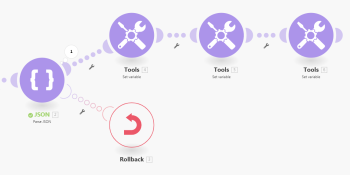

# Throw error handling in [!DNL Adobe Workfront Fusion]

In some cases, you may want to forcibly stop the scenario execution followed by [Rollback](../../workfront-fusion/scenarios/scenario-execution-cycles-phases.md#rollback) or [Commit](../../workfront-fusion/scenarios/scenario-execution-cycles-phases.md#commit) phase or to stop the processing of a route and optionally store it in the queue of incomplete executions.

Currently the error handling directives cannot be used out of the scope of an [Error handler route](../../workfront-fusion/errors/error-handling.md#error) and [!DNL Adobe Workfront Fusion] does not offer a module that would enable you to easily conditionally generate (throw) errors.

For information on incomplete executions, see [View and resolve incomplete executions in Adobe Workfront Fusion](../../workfront-fusion/scenarios/view-and-resolve-incomplete-executions.md).

For information on error handling directives, see [Directives for error handling in [!DNL Adobe Workfront Fusion]](../../workfront-fusion/errors/directives-for-error-handling.md).

## Access requirements

You must have the following access to use the functionality in this article:

<table style="table-layout:auto">
 <col> 
 <col> 
 <tbody> 
  <tr> 
   <td role="rowheader">[!DNL Adobe Workfront] plan*</td> 
   <td> 
[!DNL Pro] or higher
 </td> 
  </tr> 
  <tr data-mc-conditions=""> 
   <td role="rowheader">[!DNL Adobe Workfront] license*</td> 
   <td> 
[!UICONTROL Plan], [!UICONTROL Work]
 </td> 
  </tr> 
  <tr> 
   <td role="rowheader">[!UICONTROL Adobe Workfront Fusion] license**</td> 
   <td>
   
Current license requirement: No [!DNL Workfront Fusion] license requirement.

   
Or

   
Legacy license requirement: [!UICONTROL [!DNL Workfront Fusion] for Work Automation and Integration] 

   </td> 
  </tr> 
  <tr> 
   <td role="rowheader">Product</td> 
   <td>
   
Current product requirement: If you have the [!UICONTROL Select] or [!UICONTROL Prime] [!DNL Adobe Workfront] Plan, your organization must purchase [!DNL Adobe Workfront Fusion] as well as [!DNL Adobe Workfront] to use functionality described in this article. [!DNL Workfront Fusion] is included in the [!UICONTROL Ultimate] [!DNL Workfront] plan.

   
Or

   
Legacy product requirement: Your organization must purchase [!DNL Adobe Workfront Fusion] as well as [!DNL Adobe Workfront] to use functionality described in this article.

   </td> 
  </tr> 
 </tbody> 
</table>

To find out what plan, license type, or access you have, contact your [!DNL Workfront] administrator.

For information on [!DNL Adobe Workfront Fusion] licenses, see [[!DNL Adobe Workfront Fusion licenses]](../../workfront-fusion/get-started/license-automation-vs-integration.md)

## Workaround for Throw

To conditionally throw an error, you can configure a module to make it optionally purposely fail during its operation. One possibility is to employ the [!UICONTROL JSON] > [!UICONTROL Parse JSON] module (see [JSON modules](../../workfront-fusion/apps-and-their-modules/json-modules.md)), configured to optionally throw an error (BundleValidationError in this case):

You can then attach one of the error handling directives to the error handling route to:

* Force the scenario execution to stop and perform the rollback phase: [!UICONTROL Rollback]
* Force the scenario execution to stop and perform the commit phase: [!UICONTROL Commit]
* Stop the processing of a route: [!UICONTROL Ignore]
* Stop the processing of a route and store it in the queue of incomplete executions folder: [!UICONTROL Break]

The following example shows the use of the [!DNL Rollback] directive:

