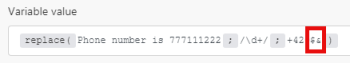
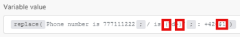

# String functions in [!DNL Adobe Workfront Fusion]

## Access requirements

You must have the following access to use the functionality in this article:

<table style="table-layout:auto"> 
 <col>  
 <col>  
 <tbody>  
  <tr>  
   <td role="rowheader">[!DNL Adobe Workfront] plan</td>  
   <td> 
Any
 </td>  
  </tr>  
  <tr data-mc-conditions="">  
   <td role="rowheader">[!DNL Adobe Workfront] license</td>  
   <td> 
New: [!UICONTROL Standard]

Or

Current: [!UICONTROL Work] or higher
 </td>  
  </tr>  
  <tr>  
   <td role="rowheader">[!DNL Adobe Workfront Fusion] license**</td>  
   <td> 
   
Current: No [!DNL Workfront Fusion] license requirement.
 
   
Or
 
   
Legacy: Any 
 
   </td>  
  </tr>  
  <tr>  
   <td role="rowheader">Product</td>  
   <td> 
   
New:
 <ul><li>[!UICONTROL Select] or [!UICONTROL Prime] [!DNL Workfront] Plan: Your organization must purchase [!DNL Adobe Workfront Fusion].</li><li>[!UICONTROL Ultimate] [!DNL Workfront] Plan: [!DNL Workfront Fusion] is included.</li></ul> 
   
Or
 
   
Current: Your organization must purchase [!DNL Adobe Workfront Fusion].
 
   </td>  
  </tr> 
 </tbody>  
</table>  

For more detail about the information in this table, see [Access requirements in Workfront documentation](/help/quicksilver/administration-and-setup/add-users/access-levels-and-object-permissions/access-level-requirements-in-documentation.md). 

For information on [!DNL Adobe Workfront Fusion] licenses, see [[!DNL Adobe Workfront Fusion] licenses](../../workfront-fusion/get-started/license-automation-vs-integration.md).

## [!UICONTROL ascii (text; [remove diacritics])]

Removes all non-ascii characters from a text string.

>[!INFO]
>
>**Examples:**
>
>* `ascii(` `Wěošrčkřfžrýoáníté` `)`
>
>   Returns: [!DNL Workfront]
>
>* `ascii(` `ěščřž` `;` `true` `)`
>
>   Returns: [!UICONTROL escrz]

## [!UICONTROL base64 (text)]

Transforms text to base64.

>[!INFO]
>
>**Example:** 
>
>`base64( workfront )`
>
>Returns: d29ya2Zyb250==  

## [!UICONTROL capitalize (text)]

Converts the first character in a text string to uppercase.

>[!INFO]
>
>**Example:** 
>
>`capitalize( workfront )`
>
>Returns: [!DNL Workfront]  

## contains (text; search string)

Verifies whether text contains the search string.

>[!INFO]
>
>**Examples:**
>
>* `contains( Hello World ; Hello )`
>
>   Returns: [!UICONTROL true]
>
>* `contains( Hello World ; Bye )`
>
>   Returns: [!UICONTROL false]

## [!UICONTROL decodeURL (text)]

Decodes special characters in a URL to text.

>[!INFO]
>
>**Example:** 
>`decodeURL( Automate%20your%20workflow )`
>
>Returns: [!UICONTROL Automate your workflow]  

## [!UICONTROL encodeURL (text)]

Encodes special characters in some text to a valid URL address.

## [!UICONTROL escapeHTML (text)]

Escapes all HTML tags in text.

>[!INFO]
>
>**Example:** 
>
>`escapeHTML( <b>Hello</b> )`
>
> Returns: `&lt;b&gt;Hello&lt;/b&gt;`

## [!UICONTROL escapeMarkdown(text)]

Escapes all Markdown tags in text.

>[!INFO]
>
>**Example:** 
>
>`escapeMarkdown( # Header )`
>
>Returns: `&#35; Header`

## [!DNL indexOf (string; value; [start])]

Returns the position of the first occurrence of a specified value in a string. This method returns '-1' if the value that is searched for is not there. The start value indicates where in the string the search should begin.

>[!INFO]
>
>**Examples:**
>
>* `indexOf( Workfront ; o )`
>
>   Returns: 1
>
>* `indexOf( Workfront ; x )`
>
>   Returns: -1
>
>* `indexOf( Workfront ; o ; 3 )`
>
>   Returns: 6

## [!UICONTROL length (text or buffer)]

Returns the length of text string (number of characters) or binary buffer (buffer size in bytes).

>[!INFO]
>
>**Example:** 
>
>`length( hello )`  
>
>Returns: 5

## [!UICONTROL lower (text)]

Converts all alphabetical characters in a text string to lowercase.

>[!INFO]
>
>**Example:** 
>
>`lower( Hello )`
>
>Returns: hello

## [!UICONTROL md5 (text)]

Calculates the md5 hash of a string.

>[!INFO]
>
>**Example:** 
>
>`md5( Workfront )`
>
>Returns: `1448bbbeaa7a9b8091d426999f1f666b`

## [!UICONTROL replace (text;search string; replacement string)]

Replaces the search string with the new string.

>[!INFO]
>
>**Example:** 
>
>`replace( Hello World ; Hello ; Hi )`
>
>Returns: [!UICONTROL Hi World]  

Regular expressions (enclosed in `/.../`) can be used as search string with a combination of flags (such as `g`, `i`, `m`) appended:

>[!INFO]
>
>**Example:**  
>
>
>
>All of these numbers X X X X are replaced with X  

The replacement string can include the following special replacement patterns:

* `$&` Inserts the matched substring.
* `$n` Where n is a positive integer less than 100, inserts the nth parenthesized submatch string. This is 1-indexed.

>[!INFO]
>
>**Examples:**  
>
>
>
>Returns: Phone number `+420777111222`
>>
>
>
>Returns: Phone number: `+420777111222`

>[!CAUTION]
>
>Do not use named capture groups such as `/ is (?<number>\d+)/` in the replacement string argument. Doing so results in an error.

For more information on regular expressions, see [Text parser](../../workfront-fusion/apps-and-their-modules/text-parser.md).

## [!UICONTROL sha1 (text; [encoding]; [key])]

Calculates the sha1 hash of a string. If the key argument is specified, sha1 HMAC hash is returned instead. Supported encodings: "hex" (default), "base64" or "latin1."

>[!INFO]
>
>**Example:** 
>
>`sha1( workfront )`
>
>Returns: b2b30b8ae1f9e5b40fbb0696eaabdbfd8d0c087f  

## [!UICONTROL sha256 (text; [encoding]; [key])]

Calculates the sha256 hash of a string. If the key argument is specified, sha256 HMAC hash is returned instead. Supported encodings: "hex" (default), "base64" or "latin1".>

>[!INFO]
>
>**Example:**
>
>`sha256( workfront )`
>
>Returns: ed3d7397eec7b94453035b67ba4468c883ee3bedeb57137f7371f2e0cf5e2bbc  

## [!UICONTROL sha512 (text; [output encoding]; [key]; [key encoding])]

Calculates the sha512 hash of a string. If the key argument is specified, sha512 HMAC hash is returned instead.

Supported encodings:

* "[!UICONTROL hex]" (default)
* "[!UICONTROL base64]"
* "[!UICONTROL latin1]"

Supported key encodings:

* "[!UICONTROL text]" (default)
* "[!UICONTROL hex]"
* "[!UICONTROL base64]" or "[!UICONTROL binary]"

When using "[!UICONTROL binary]" key encoding, a key must be a buffer, not a string.

>[!INFO]
>
>**Example:** 
>
>`sha512(workfront)`
>
>Returns: 789ae41b9456357e4f27c6a09956a767abbb8d80b206003ffdd1e94dbc687cd119b85e1e19db58bb44b234493af35fd431639c0345aadf2cf7ec26e9f4a7fb19  

## [!UICONTROL split (text; separator)]

Splits a string into an array of strings by separating the string into substrings.

>[!INFO]
>
>**Example:** 
>
>`split( John, George, Paul ; , )`

## [!UICONTROL startcase (text)]

Capitalizes the first letter of every word and lower cases all other letters.

>[!INFO]
>
>**Example:** 
>`startcase( hello WORLD )`
>
>Returns: [!UICONTROL Hello World]

## [!UICONTROL stripHTML (text)]

Removes all HTML tags from text.

>[!INFO]
>
>**Example:** 
>
>`stripHTML( <b>Hello</b> )`
>
>Returns: Hello

## [!UICONTROL substring (text; start;end)]

Returns a portion of a text string between the "start" position and "end" position.

>[!INFO]
>
>**Examples:**
>
>* `substring( Hello ; 0 ; 3)`
>
>   Returns: Hel
>
>* `substring( Hello ; 1 ; 3 )`
>
>   Returns: el

## [!UICONTROL toBinary (value)]

Converts any value to binary data.

You can also specify encoding as a second argument to apply binary conversions from hex or base64 to binary data.

>[!INFO]
>
>**Examples:**
>
>* `toBinary( Workfront )`
>
>   Returns: 57 6f 72 6b 66 72 6f 6e 74
>
>* `toBinary( V29ya2Zyb250 ; base64 )`
>
>   Returns: 57 6f 72 6b 66 72 6f 6e 74

## [!UICONTROL toString (value)]

Converts any value to a string.

## [!UICONTROL trim (text)]

Removes space characters at the start or end of the text.

## [!UICONTROL upper (text)]

Converts all alphabetical characters in a text string to uppercase.

>[!INFO]
>
>**Example:** 
>
>`upper( Hello )`
>
>Returns: [!UICONTROL HELLO]
