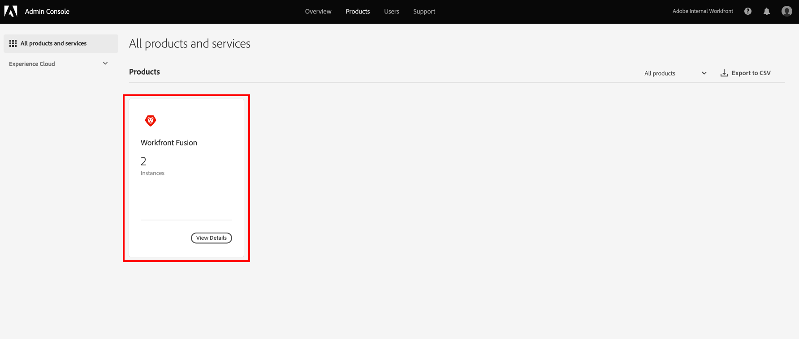
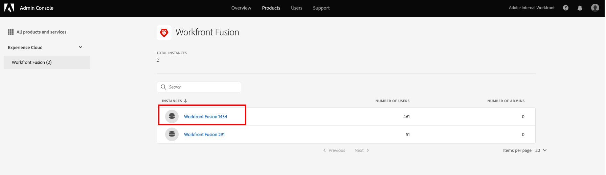

# Add users to [!DNL Adobe Workfront Fusion] through the [!DNL Adobe Admin Console]

>[!IMPORTANT]
>
>The procedures described on this page apply only to organizations that have been onboarded to the [!DNL Adobe Admin Console].
>
>If your organization has not yet been onboarded to the [!DNL Adobe Admin Console], see [Add a user to an organization in [!DNL Adobe Workfront Fusion]](../organizations/add-user-to-an-organization.md).
>
>For a list of procedures that differ based on whether your organization has been onboarded to the [!DNL Adobe Admin Console], see [Platform-based administration differences ([!DNL Adobe Workfront Fusion]/[!DNL Adobe Business Platform])](../fusion-in-admin-console/fusion-adobe-admin-console.md).

You can add a user to the [!DNL Adobe Admin Console] and assign them to [!DNL Adobe Workfront Fusion], or assign an existing user in the [!DNL Adobe Admin Console] to [!DNL Workfront Fusion].

For a video describing [!DNL Workfront Fusion] in the [!DNL Adobe Admin Console], including how to add users, see [[!DNL Fusion] on Adobe IMS](https://video.tv.adobe.com/v/3412464/){target=_blank}.

## Access requirements

You must have the following access to use the functionality in this article:

<table style="table-layout:auto"> 
 <col> 
 <col> 
 <tbody> 
  <tr> 
   <td role="rowheader">[!DNL Adobe Workfront] plan*</td> 
   <td> 
[!UICONTROL Pro] or higher
 </td> 
  </tr> 
  <tr data-mc-conditions=""> 
   <td role="rowheader">[!DNL Adobe Workfront] license*</td> 
   <td> 
[!UICONTROL Plan], [!UICONTROL Work]
 </td> 
  </tr> 
  <tr> 
   <td role="rowheader">[!DNL Adobe Workfront Fusion] license**</td> 
   <td> 
[!UICONTROL Workfront Fusion for Work Automation and Integration] 
 
[!UICONTROL Workfront Fusion for Work Automation] 
  </td> 
  </tr> 
  <tr> 
   <td role="rowheader">Product</td> 
   <td>Your organization must purchase [!DNL Adobe Workfront Fusion] as well as [!DNL Adobe Workfront] to use functionality described in this article.</td> 
  </tr>
   <tr> 
   <td role="rowheader">[!DNL Adobe] administrator rights</td> 
   <td>You must be a [!UICONTROL Product Configuration Administrator] of [!DNL Adobe] products for your organization.</td> 
  </tr>
  </tbody> 
</table>

&#42;To find out what plan, license type, or access you have, contact your [!DNL Workfront] administrator.

&#42;&#42;For information on [!DNL Adobe Workfront Fusion] licenses, see [[!DNL Adobe Workfront Fusion] licenses](../../workfront-fusion/get-started/license-automation-vs-integration.md)

## Prerequisites

Before using the [!DNL Admin Console] for [!DNL Workfront], you should receive a receive an email inviting you to the console.

1.  If you are new to [!DNL Adobe] and you have received an email telling you that you now have administer rights to manage [!DNL Adobe] software and services for your organization, click the button in the email to create an [!DNL Adobe] account and open the [!DNL Admin Console].
    
    Or
    
    If you already have an Adobe account, go to the [[!DNL Adobe Admin Console] page](https://adminconsole.adobe.com/).
    

## Add a new user to the [!DNL Adobe Admin Console] and [!DNL Workfront Fusion]

1.  From the [[!DNL Adobe Admin Console] page](https://adminconsole.adobe.com/), select the **[!UICONTROL Products]** tab in the top navigation bar, and then select the **[!DNL Workfront Fusion]** product tile.
    
    
    
1.  In the list that displays, select the organization where you want to add a user.
    
    
    
1.  In the list that displays, with the **[!UICONTROL Product Profiles]** tab selected, click the name of the [!DNL Workfront Fusion] [!UICONTROL Product Profile] link.
    
    
     
    >[!IMPORTANT]
    >
    > Do not make any changes to the [!UICONTROL Product Profile] itself.
    
1.  With the **[!UICONTROL Users]** tab selected above the list, click **[!UICONTROL Add User]**.
    
1.  In the **[!UICONTROL Add users to this product profile]** box, enter the email address or name of a user you want to add, then select the user in the list that appears.

1. Click **[!UICONTROL Save]**.
    
    The user is created in [!DNL Workfront Fusion].
    
    <!--
    >[!IMPORTANT]
    >
    > Do not make any changes to the Product Profile itself.
    -->

1. (Optional) Continue to [Change a user's access level in [!DNL Workfront Fusion]](#change-a-users-access-level-in-workfront-fusion)

## Change a user's access level in Workfront Fusion

### Change a user's role to Admin

Giving a user an Admin role must be done in the [!DNL Adobe Admin Console]. 

1. On the [!DNL Workfront Fusion] [!UICONTROL Product Profile] page where you added the user, select the **[!UICONTROL Admins]** tab.

1. Click **[!UICONTROL Add Admin]**.

1.  In the **[!UICONTROL Add product profile administrators]** box, enter the email address or name of a user you want to add, then select the user in the list that appears.

1. Click **[!UICONTROL Save]**.

   This user is now an Administrator in [!DNL Workfront Fusion].

### Change a user's role to [!UICONTROL Member], [!UICONTROL Accountant], or [!UICONTROL App Developer].
    
[!UICONTROL Member], [!UICONTROL Accountant], and [!UICONTROL App Developer] roles are handled inside [!DNL Workfront Fusion]. 

For instructions, see [View or edit user roles](../organizations/manage-fusion-users.md#view-or-edit-user-roles) in the article [Manage [!DNL Adobe Workfront Fusion] users in your organization](../organizations/manage-fusion-users.md)
    
## Assign an existing user in the [!DNL Adobe Admin Console] to [!DNL Workfront Fusion]

1.  Begin editing the user as described in the "Edit user details" section of the article [Manage users individually](https://helpx.adobe.com/enterprise/using/manage-users-individually.html) in the [!DNL Adobe Admin Console] documentation.
    
1.  Add **[!DNL Adobe Workfront Fusion]** to the products assigned to the user.
