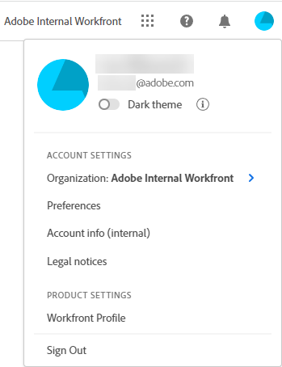

# [!DNL Adobe Unified Experience] for [!DNL Workfront Fusion]

Accessing [!DNL Workfront Fusion] through [!DNL Adobe Experience Cloud] gives you a seamless, unified experience for managing all of your [!DNL Adobe] applications. Single identity management gives you one place to log in, without multiple URLs or login IDs.

For a video describing navigation in [!DNL Fusion] in the [!DNL Adobe Experience Cloud], see:

 [[!DNL Fusion] on the [!DNL Unified Shell]](https://video.tv.adobe.com/v/3412392/){target=_blank}

## Access requirements

You must have the following access to perform the steps in this article:

<table style="table-layout:auto"> 
 <col> 
 <col> 
 <tbody> 
  <tr> 
   <td role="rowheader">[!DNL Adobe Workfront] plan*</td> 
   <td> 
[!UICONTROL Pro] or higher
 </td> 
  </tr> 
  <tr data-mc-conditions=""> 
   <td role="rowheader">[!DNL Adobe Workfront] license*</td> 
   <td> 
[!UICONTROL Plan], [!UICONTROL Work]
 </td> 
  </tr> 
  <tr> 
   <td role="rowheader">[!DNL Adobe Workfront Fusion] license**</td> 
   <td>
   
Current license requirement: No [!DNL Workfront Fusion] license requirement.

   
Or

   
Legacy license requirement: [!UICONTROL [!DNL Workfront Fusion] for Work Automation and Integration] 
 
  </tr> 
  <tr> 
   <td role="rowheader">Product</td> 
   <td>
   
Current product requirement: If you have the [!UICONTROL Select] or [!UICONTROL Prime] [!DNL Adobe Workfront] Plan, your organization must purchase [!DNL Adobe Workfront Fusion] as well as [!DNL Adobe Workfront] to use functionality described in this article. [!DNL Workfront Fusion] is included in the [!UICONTROL Ultimate] [!DNL Workfront] plan.

   
Or

   
Legacy product requirement: Your organization must purchase [!DNL Adobe Workfront Fusion] as well as [!DNL Adobe Workfront] to use functionality described in this article.

   </td> 
  </tr> 
 </tbody> 
</table>
&#42;To find out what plan, license type, or access you have, contact your [!DNL Workfront Fusion] administrator.

## Prerequisites

Your organization's instance of Workfront Fusion must be onboarded to the [!DNL Adobe Business Platform] / [!DNL Adobe Admin Console].

## Log in to [!DNL Adobe Experience Cloud]

1. Open a browser window and go to <https://experience.adobe.com>.
1. On the Sign in screen, type your email address and click **[!UICONTROL Continue]**.

   ![Sign in to [!DNL Adobe Experience Cloud]](assets/aec-login-page.png)

## Access [!DNL Workfront Fusion]

Once you are logged in to [!DNL Adobe Experience Cloud], you can view all of the [!DNL Workfront Fusion] organizations and environments that you have access to by clicking the organization switcher in the top navigation area. Select the [!DNL Workfront Fusion] organization or environment that you want to work in. 

![View [!DNL Workfront Fusion] organizations and environments](assets/aec-view-all-orgs.png)

>[!NOTE]
>
>The first time you log in to [!DNL Adobe Experience Cloud], the organization defaults to the first one in the alphabetical list. The next time you log in, the organization defaults to the last one you visited.

[!DNL Workfront Fusion] appears in the list of [!DNL Adobe Experience Cloud] products you have access to. You can choose [!DNL Workfront Fusion] in the quick access menu on the [!DNL Experience Cloud] home page, or use the product switcher  to change applications at any time.

![Select [!DNL Workfront Fusion] to access the application](assets/aec-product-switcher.png)

## Navigate [!DNL Workfront Fusion]

Use the [!UICONTROL Main Menu] icon  on the left of the [!DNL Adobe] navigation bar to open the [!UICONTROL Organization] and [!UICONTROL Team] menus. If you are a [!DNL Workfront Fusion] administrator, your [!UICONTROL Administration] menu also appears here.

To switch teams, click on the team name at the top of the page, then select the team. This appears only on pages that are specific to a team, such as a scenario builder or the [!UICONTROL Connections] page. 

To switch organizations, click the organization name at the upper-right of your screen, then select the organization.

## Access your profile and preferences

You can access your profile and preference options by clicking your profile picture in the top navigation area.

This menu allows you to:

* Choose **[!UICONTROL Dark theme]** formatting for [!DNL Adobe Experience Cloud].
* Set **[!UICONTROL Preferences]** for [!DNL Adobe Experience Cloud], including primary and secondary language preferences.
* Access your **[!UICONTROL [!DNL Workfront Fusion] Profile]**. Once you are on the profile, click the **[!UICONTROL More]** menu  and select **[!UICONTROL Edit]**. For more information about the profile, see [Configure My Settings](/help/quicksilver/workfront-basics/manage-your-account-and-profile/configuring-your-user-profile/configure-my-settings.md).
* **[!UICONTROL Sign out]** of Adobe Experience Cloud.
 

## Access your notifications

You can find yourr notifications and announcements in the Notifications area of the Unified Shell.

To view your notifications, click the Notifications icon  near the upper-right corner of the screen. A red dot on the Notifications icon indicates that you have unread notifications or announcements.

