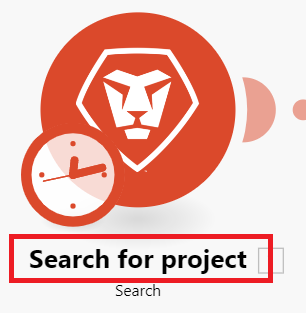
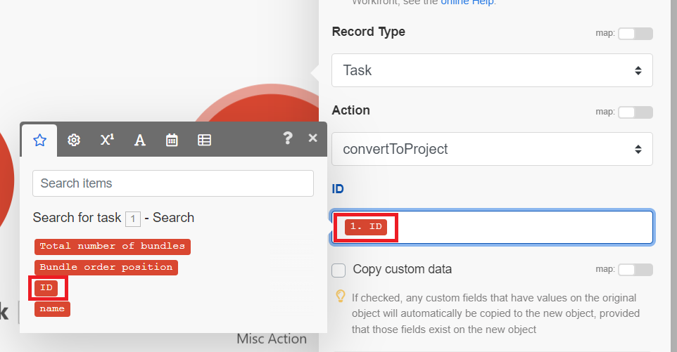

# Create a basic scenario in [!DNL Adobe Workfront Fusion]

The role of [!DNL Adobe Workfront Fusion] is to automate your processes so that you can concentrate on new tasks rather than repeating the same tasks again and again. It works by linking actions within and between apps and services to create a scenario that transfers and transforms your data automatically. The scenario you create watches for data in an app or service and processes that data to provide the result you want.

This example takes you through the process of creating a scenario that searches for an issue in Workfront and the converts it to a project.

<!--# Access requirements

You must have the following access to use the functionality in this article:

<table style="table-layout:auto">
 <col> 
 <col> 
 <tbody> 
  <tr> 
   <td role="rowheader">[!DNL Adobe Workfront] plan*</td> 
   <td> 
[!DNL Pro] or higher
 </td> 
  </tr> 
  <tr data-mc-conditions=""> 
   <td role="rowheader">[!DNL Adobe Workfront] license*</td> 
   <td> 
[!UICONTROL Plan], [!UICONTROL Work]
 </td> 
  </tr> 
  <tr> 
   <td role="rowheader">[!UICONTROL Adobe Workfront Fusion] license**</td> 
   <td>
   
Current license requirement: No [!DNL Workfront Fusion] license requirement.

   
Or

   
Legacy license requirement: [!UICONTROL [!DNL Workfront Fusion] for Work Automation and Integration] 

   </td> 
  </tr> 
  <tr> 
   <td role="rowheader">Product</td> 
   <td>
   
Current product requirement: If you have the [!UICONTROL Select] or [!UICONTROL Prime] [!DNL Adobe Workfront] Plan, your organization must purchase [!DNL Adobe Workfront Fusion] as well as [!DNL Adobe Workfront] to use functionality described in this article. [!DNL Workfront Fusion] is included in the [!UICONTROL Ultimate] [!DNL Workfront] plan.

   
Or

   
Legacy product requirement: Your organization must purchase [!DNL Adobe Workfront Fusion] as well as [!DNL Adobe Workfront] to use functionality described in this article.

   </td> 
  </tr> 
 </tbody> 
</table>
To find out what plan, license type, or access you have, contact your [!DNL Workfront] administrator.

For information on [!DNL Adobe Workfront Fusion] licenses, see [[!DNL Adobe Workfront Fusion] licenses](../../workfront-fusion/get-started/license-automation-vs-integration.md).

-->

## Create a practice scenario

### Begin creating the scenario

1. In the **Scenarios** area, click **Create a new scenario**.

    <!--To locate the Scenarios area, see navigation article-->

   The scenario editor displays, containing an empty module in the center.

   <!--picture?-->

1. Select the **[!UICONTROL New scenario]** placeholder name in the upper-left corner, then enter a name.
1. Continue with [Add and configure the first module](#add-and-configure-the-first-module) below.

### Add and configure the first module

1. Click the empty module to choose the app from which you will select a module.

   A list of apps appears to the right of the module.

1. Select **[!DNL Adobe Workfront]**. If it is not visible, click the search bar at the bottom of the list, type "Workfront," and select it when it appears in the list.

   The list changes to display all [!DNL Workfront] modules that you can use.

1. Click the **[!UICONTROL Search]** module.

   The module configuration window opens.

1. In the [!UICONTROL Connection] box, select your Workfront connection. 

   If you do not have a Workfront connection, see [Create a connection to [!DNL Adobe Workfront Fusion]](/help/quicksilver/workfront-fusion/connections/connect-to-fusion-general.md)
1. In the [!UICONTROL Record Type] box, select **[!UICONTROL Issue]**. This sets the module to search only issues.

   You can find **[!UICONTROL Issue]** in the list if you start typing the word "[!UICONTROL issue]."

1. In the **[!UICONTROL Result Set]** box, select **[!UICONTROL First Matching Record]**. 

   This sets the module to return only the first record it finds that meets the criteria. 
1. In the **[!UICONTROL Search criteria]** area, configure the criteria to return the specific issue.

   1. In the first box under [!UICONTROL Search Criteria], select the field that you want to include in your search. For this example, select **[!UICONTROL Name]**.

      You can find **[!UICONTROL Name]** in the list if you start typing the word "[!UICONTROL name]."
   1. For the operator, click the dropdown arrow next to **Exist** and change it to [!UICONTROL **Contains (case insensitive)**]. 
      
      This allows the module to find projects with your chosen words in its name, even if you do not enter the entire name, or enter the name with the incorrect case (such as all caps).
   1. In the last field under [!UICONTROL Search Criteria], enter a word or phrase that you know is in the name of the issue you are searching for.

1. In the **[!UICONTROL Outputs]** list, select the fields that you want the module to output. For this example, select the **[!UICONTROL ID]** and **[!UICONTROL Name]** fields.

   >[!TIP]
   >
   >You can use **Cmd+F** ([!DNL Mac] OS) or **Ctrl-F** ([!DNL Windows] OS) to find a field quickly.

1. Click **[!UICONTROL OK]** to save the module configuration.

1. Right-click the module, click **[!UICONTROL Rename]**, then type a name the describes what you want the module to do (such as "Search for issue)," then click **[!UICONTROL OK]**.

   The name appears just below the module. Below that, [!DNL Workfront Fusion] includes a brief description of the type of action performed by the module.

   

1. Continue with [Add and configure the second module](#add-and-configure-the-second-module).

## Add and configure the second module

1. Hover over the partial circle to the right of the of the module, then click **[!UICONTROL Add another module]**. 
1. Select [!DNL Adobe Workfront] from the list of applications, then choose the module **[!UICONTROL Misc Action]**.

   The Misc Action module allows you to perform actions in Workfront that do not have a dedicated module. In this example, this module is used to convert the issue to a project.
1. In the [!UICONTROL Connection] field, select  the same Workfront connection that you used in the previous module . 
1. In the **[!UICONTROL Record type]**field, select **[!UICONTROL Issue]**, because the action to perform is related to an issue.
1. In the **[!UICONTROL Action]** field, select **convertToProject**. This is the action that will convert the selected issue to a Project.
1. Click the **[!UICONTROL ID]** field. 

   A panel opens that allows you to select what to use as the ID of the issue you want to convert to a project. The panel includes output from any previous modules. Because you selected ID as an output of the previous module, it is now available in the panel.

   This panel is called the mapping panel. For more information on the mapping panel, see [Map information from one module to another](/help/quicksilver/workfront-fusion/mapping/map-information-between-modules.md).
1. Select **ID** in the mapping panel.

   An ID block appears in the ID field. It shows the number of the module it is mapped from, and the field that is mapped.

   

1. (Optional) In the Project section, locate the Owner ID field and begin typing your name in the field, then select it when it appears. This will set you as the owner of the project, and will make it easier to find in Workfront.
 
   >[!TIP]
   >
   >You can use **Cmd+F** ([!DNL Mac] OS) or **Ctrl-F** ([!DNL Windows] OS) to find a field quickly.

1. Click **[!UICONTROL OK]** to save the module configuration.

1. Right-click the module, click **[!UICONTROL Rename]**, then type a name the describes what you want the module to do (such as "Convert to project)," then click **[!UICONTROL OK]**.

1. Continue to [Test the scenario](#test-the-scenario).

## Test the scenario

Before you activate your scenario, it's important to test it by running it at least once and viewing the results. This helps you understand how data flows through the scenario and find any errors.

For this scenario, a successful test would result in locating the issue and converting it to a project.

1. Click **[!UICONTROL Run once]** in the lower-left corner of the scenario editor.
1. After the scenario finishes running, click the bubble above the first module to can view information about the bundle of data that the module processed, including data pulled from the issue that the module returned.

1. Click the execution inspector bubble above the second module to see the input (the issue) and the output (the converted project).

   For more information about the data in the inspection bubbles, see:

   * For general information, see [Scenario execution flow in [!DNL Adobe Workfront Fusion]](../../workfront-fusion/scenarios/scenario-execution-flow.md).
   * For information about processed bundles, see [Scenario execution, cycles, and phases in [!DNL Adobe Workfront Fusion]](../../workfront-fusion/scenarios/scenario-execution-cycles-phases.md).

1. In [!DNL Workfront Fusion], click **[!UICONTROL Save]** near the lower-left corner to save your progress on the scenario.

   >[!IMPORTANT]
   >
   >Save often as you hone and test a scenario.

>[!TIP]
>
>We recommend the optional but useful practice of adding notes about each module.
>
>1. Right-click a [!DNL Workfront] module, then click **[!UICONTROL Add a note]**.
>1. In the note that displays, type an overview for the module.
>
>    You can add multiple notes for a module.
>
>1. Close the **[!UICONTROL Notes]** area.
>
>     After you add a note to a scenario, an orange dot displays on the **[!UICONTROL Notes]** icon  at the bottom of the scenario editor.
>
>1. Click the **[!UICONTROL Notes]** icon  to view your notes.
>

## Activate the scenario

The last step in creating a scenario is activating it.

Because this scenario is searching for a specific issue, there is no need to activate it. Activating a scenario causes it to run on a schedule or when a specific action occurs in an application. After you activate a scenario, by default, it runs every 15 minutes. You can change this by defining when and how often you want it to run.

For more information about activating scenarios, see [Activate or deactivate a scenario in [!UICONTROL Adobe Workfront Fusion]](../../workfront-fusion/scenarios/activate-or-inactivate-scenario.md).

For information about schedules, see [Schedule a scenario in [!UICONTROL Adobe Workfront Fusion]](../../workfront-fusion/scenarios/schedule-a-scenario.md).
