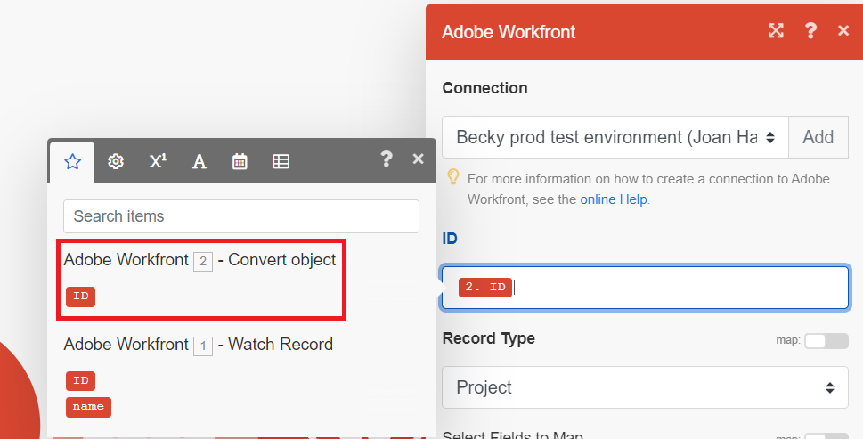
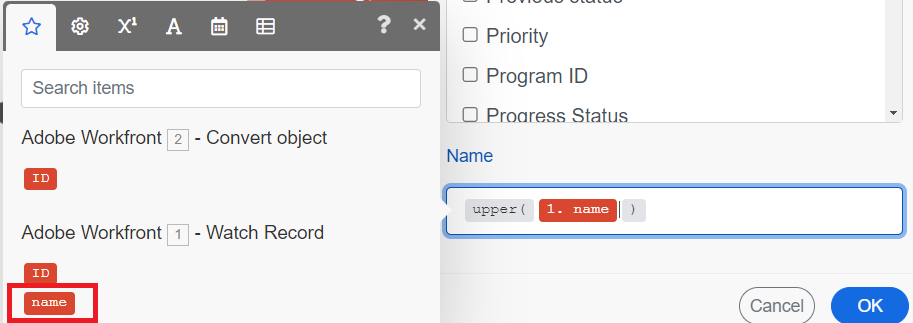

# Use a function to update a project in a simple scenario  in [!DNL Adobe Workfront Fusion]

Updating a Workfront work item is a common use case for Workfront Fusion. In this example, you will use a function to change the name of a project to be in uppercase letters.

Fusion includes many types of functions that allow you to transform and perform conditional logic on your data. For more information on using functions, see [Map information from one module to another in Adobe Workfront Fusion](/help/quicksilver/workfront-fusion/mapping/map-information-between-modules.md).

This example modifies the scenario created in [Create a basic scenario](/help/quicksilver/workfront-fusion/get-started/build-practice-scenarios/create-simple-scenario.md).

## Prerequisites

You must create the scenario described in [Create a basic scenario](/help/quicksilver/workfront-fusion/get-started/build-practice-scenarios/create-simple-scenario.md) before following this procedure.

## Use a function to update a project

### Add the Update Record module to your scenario

1. Open the scenario in the scenario editor.
1. Hover over the partial circle to the right of the of the module, then click **[!UICONTROL Add another module]**. 
1. Select [!DNL Adobe Workfront] from the list of applications, then choose the module **[!UICONTROL Update Record]**.
1. in the ID field, select the ID block that is under the Convert object module. This is the ID of the project that was output by that module. 

   

1. In the Record Type field, select Project, because the object to be updated is a project.
1. In the Select Fields to Map area, select Name. 

    A Name field will open.

### Map the function for the name update

When this scenario converts a request to a project, the project's name is the same as the request. The function here takes that name and capitalizes all of the letters in it. 

1. Click the **Name** field. 

   The mapping panel opens.
1. In the mapping panel, click the **Text and binary functions** icon. 
1. Select the function **upper**.

   The function appears in the Name field, including the formatting for the input it expects.

   The input for this example is the name of the issue the project was converted from.

1. Move your cursor between the parentheses, because this is where the input will go.
1. In the mapping panel, click the **module output** icon.  
1. Select the name block that was output by your first module.

   The name block appears in the function.

   

1. Click OK to save the module settings.

### Test and activate

1. Test the scenario by clicking **Run once** in the lower-left corner of the screen.
1. Examine the output to ensure that the scenario ran as expected.
1. When you are satisfied that the scenario is working as expected, click the **Scheduling** toggle in the lower-left of the screen to **On**.

   This activates the scenario. Active scenarios run according to the schedule set in the trigger module.
1. In [!DNL Workfront Fusion], click **[!UICONTROL Save]** near the lower-left corner to save your progress on the scenario.

   >[!IMPORTANT]
   >
   >Save often as you hone and test a scenario.

## Resources:

* [Map items using functions in [!DNL Adobe Workfront Fusion]](/help/quicksilver/workfront-fusion/mapping/map-information-between-modules.md)
