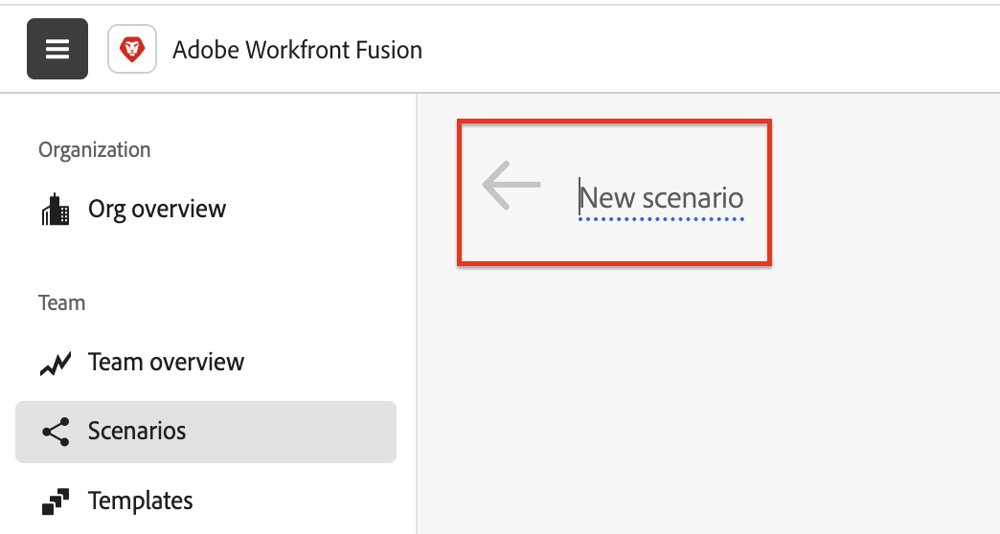
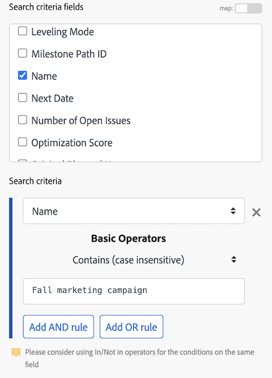
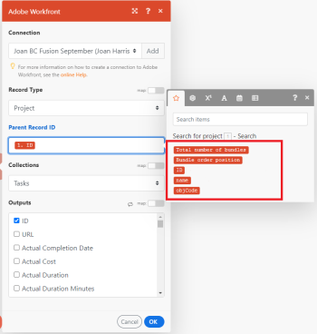

# Create a practice automation scenario in [!DNL Adobe Workfront Fusion]

Automation scenarios automate Workfront processes, including data manipulation and transformation. This article takes you through the process of creating a scenario that searches for a project and then returns all of the tasks associated with that project.

<!-- not sure why these are here?
For instructions on building an integration scenario that connects separate apps, see [Create a practice integration scenario in Adobe Workfront Fusion](../../workfront-fusion/get-started/create-a-practice-scenario.md).

For more information on functionality available with each Workfront Fusion license, see [Adobe Workfront Fusion licenses](../../workfront-fusion/get-started/license-automation-vs-integration.md).

-->

## Access requirements

+++ Expand to view access requirements for the functionality in this article.

You must have the following access to use the functionality in this article: 

<table style="table-layout:auto"> 
  <tbody>  
    <tr>  
      <td>Adobe Workfront plan</td>  
      <td>Any</td>  
    </tr>  
    <tr>  
      <td>Adobe Workfront license</td>  
      <td>
        New: Standard 
        Or 
        Current: Work or higher
      </td>  
    </tr>  
    <tr>  
      <td>Adobe Workfront Fusion license</td>  
      <td> 
        Current: No Workfront Fusion license requirement. 
        Or 
        Legacy: Any
      </td>  
    </tr>  
    <tr>  
      <td>Product</td>  
      <td> 
        New: Select or Prime Workfront Plan: Your organization must purchase Adobe Workfront Fusion. 
        Ultimate Workfront Plan: Workfront Fusion is included. 
        Or 
        Current: Your organization must purchase Adobe Workfront Fusion.
      </td>  
    </tr> 
  </tbody>  
</table> 

For more detail about the information in this table, see [Access requirements in Workfront documentation](/help/quicksilver/administration-and-setup/add-users/access-levels-and-object-permissions/access-level-requirements-in-documentation.md). 

For information on [!DNL Adobe Workfront Fusion] licenses, see [[!DNL Adobe Workfront Fusion] licenses](../../workfront-fusion/get-started/license-automation-vs-integration.md). 

+++

## Create a automation practice scenario

[!DNL Adobe Workfront Fusion] helps you focus on important tasks by automating repetitive ones. It creates scenarios that automatically manage your data across various apps and services.

Each scenario consists of modules, which guide how data is processed within an app or transferred between different apps and services. For instance, you can create a scenario in Fusion to automatically find a [!DNL Workfront] project and list its tasks. This way, Fusion saves you time and effort by handling routine tasks.

This practice scenario takes you through the process of creating a scenario that searches for a [!DNL Workfront] project and returns the tasks in the project.

### Before you begin

Create a project with tasks in workfront you can use for this exercise. You do not need to do any additional configuration outside of adding tasks to the project. 

 For information about creating a project in Workfornt, see xxx. 

### 1. Create and name the scenario

1. Sign into your [!DNL Workfront Fusion] account.
1. Click **[!UICONTROL Scenarios]**  in the left panel.

   >[!NOTE]
   >
   >If you do not see the left navigation panel or its icons, click the Menu  icon.

1. In the [!UICONTROL **Folders**] panel, click the **[!UICONTROL Add folder]** icon , then type a name like "Practice scenarios" for your first folder.

1. Open the folder, then click **[!UICONTROL Create a new scenario]** in the upper-right corner of the page.

1. For this exercise, select the **[!DNL Adobe Workfront]** app, then click **Search** near the bottom.

1. Select the **[!UICONTROL New scenario]** placeholder name in the upper-left corner, then type a name such as "Practice scenario 1."

   

1. Continue with [Connect the first module](#2-connect-the-first-module) below.

### 2. Connect the first module

Now, you need to establish an authenticated connection to your [!DNL Workfront] account. Every module you add to a scenario must have a connection to its app.

1. In the **[!DNL Workfront]** box, under **[!UICONTROL Connection]**, click **[!UICONTROL Add]**, then type a name for the connection, such as "Olivia's Workfront account," then click **[!UICONTROL Continue]**.
1. Authenticate the connection in the window that displays.

   The process for authenticating a connection can vary a bit between apps. The following process is specific to [!DNL Workfront], but the process is similar to many apps:

   1. Enter your [!DNL Workfront] domain, then click **[!UICONTROL Continue]**.
   1. Log into [!DNL Workfront].
   1. Examine the access that [!DNL Workfront Fusion] is requesting, then click **[!UICONTROL Allow Access]**.

   If you need help, see [Connections overview](../../workfront-fusion/connections/about-connecting-wf-fusion-to-app-or-service.md).

### 3. Configure the first module

After you connect [!DNL Workfront Fusion] to your [!DNL Workfront] account, you can specify a [!DNL Workfront] project that you have access to and the data that you want the first module to process.

1. In the [!UICONTROL Record Type] box, select **[!UICONTROL Project]**. This sets the module to search only projects.

   >[!TIP]
   >
   >You can find **[!UICONTROL Project]** in the list if you start typing the word "[!UICONTROL project]."

1. In the **[!UICONTROL Result Set]** box, select **[!UICONTROL First Matching Record]**. This sets the module to return only the first record it finds that meets the criteria. For this example, we need only one record returned.
1. In the **[!UICONTROL Search criteria]** area, we'll set up a filter to return the specific project:

   | Field | Action |
   |--------|-------------|
   | Search criteria fields | Select the field that you want to search the values of. For this example, select **[!UICONTROL Name]**. |
   | Search criteria | In the first drop-down menu, select **[!UICONTROL Name]**. |
   | Basic Operators | In the second drop-down, select [!UICONTROL Contains (case insensitive)]. This allows the module to find projects with your chosen words in its name, even if you do not enter the entire name, or enter the name with the incorrect case (such as all caps). |
   | Text box | Enter a word or phrase that you know is in the name of the project you are searching for. |

   +++ Expand to view an on-screen example.
   
   +++

1. In the **[!UICONTROL Outputs]** list, select the fields that you want the module to output. For this example, select the **[!UICONTROL ID]** and **[!UICONTROL Name]** fields.

   >[!TIP]
   >
   >You can use **Cmd+F** ([!DNL Mac] OS) or **Ctrl-F** ([!DNL Windows] OS) to find a field quickly.

1. Click **[!UICONTROL OK]**.

   >[!NOTE]
   >
   >Since this is not a trigger module, you do not choose where to start it. When using a trigger module, you would now select where to start it.
   >
   >
   >For more information, see [Choose where a trigger module starts in [!DNL Adobe Workfront Fusion]](../../workfront-fusion/modules/choose-where-trigger-module-starts.md).

1. Right-click the module, click **[!UICONTROL Rename]**, then type a name the describes what you want the module to do (such as "Search for project)," then click **[!UICONTROL OK]**.

   The name appears just below the module. Below that, [!DNL Workfront Fusion] includes a brief description of the type of action performed by the module.

   

1. Continue with [Add and configure the second module](#add-and-configure-the-second-module).

### 4. Add and configure the second module

1. Click the partial circle to the right of the of the module to **[!UICONTROL Add another module]**.
1. Select [!DNL Workfront] from the list of applications, then choose the search module **[!UICONTROL Read Related Records]**.
1. In the **[!UICONTROL Connection]** box, select the connection that you created for the previous module. You must make sure this module is using the same connection as the previous module.
1. Click **[!UICONTROL Record type]**, then select **[!UICONTROL Project]**, because we want to read records related to a project.

   >[!TIP]
   >
   >You can find **[!UICONTROL Project]** in the list if you start typing the word "project."

1. Click the **[!UICONTROL Parent Record ID]** field. This field requires the Workfront ID of the project that you want to return tasks from.

   Clicking the field opens the list of variables that you can use in the **[!UICONTROL Parent Record ID]** field to identify the project in Workfront.

   

1. Click the variable **[!UICONTROL ID]** to add it to the **[!UICONTROL Parent Record ID]** field. This allows the ID returned from the first module to be used as the identifier for the project that you want to work with in the second module, which ensures that the tasks returned will belong to that project.
1. In the **[!UICONTROL Outputs]** field, select **[!UICONTROL Tasks]**. This indicates that the module is to return tasks associated with the chosen project.
1. Click **[!UICONTROL OK]**

   Now you have a working scenario.

1. Give the second module a name such as "Return tasks associated with project," then continue with [Test the scenario](#test-the-scenario).

## Test the scenario

Before you activate your scenario, it's important to test it by running it at least once and viewing the results. This helps you understand how data flows through the scenario and find any errors.

We chose to have 1 project returned, as well as the tasks associated with that project. If you run the scenario, that is what should happen.

1. Click **[!UICONTROL Run once]** in the lower-left corner of the scenario editor.
1. After the scenario finishes running, click the bubble above the first module.

   

   In the box that appears, you can view information about the bundle of data that the module processed, including the actual data that was pulled from the project that the module returned.

   

1. Click the execution inspector bubble above the Second module to see the input of information and the output, which is a collection of tasks contained in the project.

   

   You can learn more about how to read scenario execution information in the following articles:

   * For general information, see [Scenario execution flow in [!DNL Adobe Workfront Fusion]](../../workfront-fusion/scenarios/scenario-execution-flow.md).
   * For information about processed bundles, see [Scenario execution, cycles, and phases in [!DNL Adobe Workfront Fusion]](../../workfront-fusion/scenarios/scenario-execution-cycles-phases.md).

1. In [!DNL Workfront Fusion], click **[!UICONTROL Save]**  near the lower-left corner to save your progress on the scenario.

   >[!IMPORTANT]
   >
   >Save often as you hone and test a scenario.

>[!TIP]
>
>We recommend the optional but useful practice of adding notes about each module.
>
>1. Right-click a [!DNL Workfront] module, then click **[!UICONTROL Add a note]**.
>1. In the note that displays, type an overview for the module.
>
>    You can add multiple notes for a module.
>
>1. Close the **[!UICONTROL Notes]** area.
>
>     After you add a note to a scenario, an orange dot displays on the **[!UICONTROL Notes]** icon  at the bottom of the scenario editor.
>
>1. Click the **[!UICONTROL Notes]** icon  to view your notes.
>

## Activate the scenario

This example scenario does not have a trigger module. If this were a scenario you would be using for real data it would start with a trigger module, and the last thing you would do is activate it. After you activate a scenario, by default, it runs every 15 minutes. You can change this by defining when and how often you want it to run.

For more information about activating scenarios, see [Activate or deactivate a scenario in [!UICONTROL Adobe Workfront Fusion]](../../workfront-fusion/scenarios/activate-or-inactivate-scenario.md).

For information about schedules, see [Schedule a scenario in [!UICONTROL Adobe Workfront Fusion]](../../workfront-fusion/scenarios/schedule-a-scenario.md).
