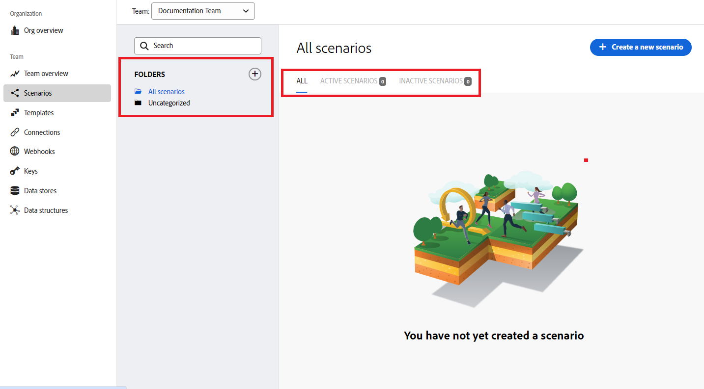
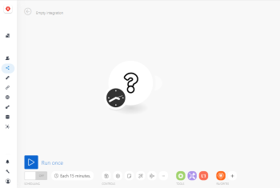
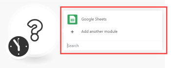
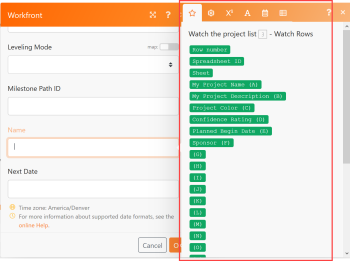

# Create a practice integration scenario in Adobe Workfront Fusion

This article describes how to create an integration scenario with Adobe Workfront Fusion. Integration scenarios connect separate apps together, allowing your data to flow through different applications.

To create an integration scenario, your organization must have a [!DNL Workfront Fusion for Work Automation and Integration] license.

For instructions on building a Workfront-only automation scenario, see [Create a practice automation scenario in Adobe Workfront Fusion](../../workfront-fusion/get-started/create-a-practice-automation-scenario.md)

For more information on Workfront Fusion licenses, see [Adobe Workfront Fusion licenses](../../workfront-fusion/get-started/license-automation-vs-integration.md).

>[!NOTE]
>
>Your organization may not allow access to Google Sheets. If that is the case, you will not be able to set up this integration, but the information presented here can be used as a general example of how integration scenarios function.

## Access requirements

You must have the following access to use the functionality in this article:

<table style="table-layout:auto"> 
 <col> 
 <col> 
 <tbody> 
  <tr> 
    <td role="rowheader">[!DNL Adobe Workfront] plan*</td> 
   <td> 
[!DNL Pro] or higher
 </td> 
  </tr> 
  <tr data-mc-conditions=""> 
   <td role="rowheader">[!DNL Adobe Workfront] license*</td> 
   <td> 
[!UICONTROL Plan], [!UICONTROL Work]
 </td> 
  </tr> 
  <tr> 
   <td role="rowheader">[!UICONTROL Adobe Workfront Fusion] license**</td> 
   <td> 
[!UICONTROL [!DNL Workfront Fusion] for Work Automation and Integration] 
 </td> 
  </tr> 
  <tr> 
   <td role="rowheader">Product</td> 
   <td>Your organization must purchase [!DNL Adobe Workfront Fusion] as well as [!DNL Adobe Workfront] to use functionality described in this article.</td> 
  </tr> 
 </tbody> 
</table>

To find out what plan, license type, or access you have, contact your [!DNL Workfront] administrator.

For information on [!DNL Adobe Workfront Fusion] licenses, see [[!DNL Adobe Workfront Fusion] licenses](../../workfront-fusion/get-started/license-automation-vs-integration.md).

## Create a practice scenario

The role of [!DNL Adobe Workfront Fusion] is to automate your processes so that you can concentrate on new tasks rather than repeating the same tasks again and again. It works by linking actions within and between apps and services to create a scenario that transfers and transforms your data automatically. The scenario you create watches for data in an app or service and processes that data to provide the result you want.

A scenario is comprised of a series of modules that indicate how data should be transformed within an app or transferred between apps and web services.

To explain how to create a scenario and reinforce best practices as you learn to use [!DNL Workfront Fusion], this article takes you through the process step-by-step. We will create a scenario that creates a new record in [!DNL Workfront] for every row in a [!DNL Google Sheets] spreadsheet.

>[!TIP]
>
>A scenario like this would be useful if you had a spreadsheet listing projects that need to be worked on using projects in [!DNL Workfront]. The scenario could "watch" the spreadsheet for new rows and add a new project in [!DNL Workfront] for each one.

Creating a scenario consists of several main tasks:

## Choose the apps and name the scenario

1. Download this [spreadsheet](https://cdn.experience.workfront.com/Documentation/Workfront+Fusion/Fusion+Practice+Scenario+Sample+Sheet.xlsx), then upload it to your [!DNL Google Drive] for use throughout this exercise.

   Or

   Create or find your own simple [!DNL Google Sheets] spreadsheet similar to this one:

   

1. Sign into your [!DNL Workfront Fusion] account.
1. Click **[!UICONTROL Scenarios]**  in the left panel.

   >[!NOTE]
   >
   >If you do not see the left navigation panel or its icons, click the Menu  icon.

   In the gray [!UICONTROL Folders] panel that displays, you can organize your scenarios into folders.

   At the top of the main area to the right, you can view **[!UICONTROL All]** scenarios you have built, your **[!UICONTROL Active Scenarios]** and **[!UICONTROL Inactive Scenarios]**, and **[!UICONTROL Concepts]**, which are scenarios that need some more work before [!DNL Workfront Fusion] can classify them as active or inactive.

<!--
   
--> 

1. In the [!UICONTROL Folders] panel, click the **[!UICONTROL Add folder]** icon , then type a name like "Practice scenarios" for your first folder.

1. Open the folder, then click **[!UICONTROL Create a new scenario]** in the upper-right corner of the page.

   The landing page that displays lets you pre-load any apps you want to use in the scenario you are going to build.

1. For this exercise, search for and select the **[!UICONTROL Google Sheets]** app.
1. Click **[!UICONTROL Continue]** in the upper-right corner.

   The scenario editor displays, containing an empty module in the center, the [!DNL Google Sheets] app you pre-loaded, and some options in the toolbar at the bottom.

<!--
   
-->

   When you begin creating a new scenario, it's a good idea to start by creating a name for it.

1. Select the **[!UICONTROL New scenario]** placeholder name in the upper-left corner, then type a name such as "Practice scenario 1."
1. Continue with [Add and configure the first module](#add-and-configure-the-first-module) below.

## Add and configure the first module 

The empty module with a question mark represents the trigger module you need to add. This module will start the scenario each time it runs. The clock icon on the empty module indicates that is a scheduled module.

This module will contain the data that you want the scenario to watch for.

1. Click the empty module to choose the app from which you will select a module.

   The app you pre-loaded earlier displays next to the empty module. You can add any other apps that have modules using the [!UICONTROL Search] box.

   

1. Click **[!DNL Google Sheets]**.

   The list changes to display all [!DNL Google Sheets] modules that you can use as a trigger module.

1. Click the trigger module **[!UICONTROL Watch for Records]**.

   Now you need to establish an authenticated connection to your Google account. Every module you add to a scenario must have a connection to its app.

1. In the **[!DNL Google Sheets]** box, under **[!UICONTROL Connection]**, click **[!UICONTROL Add]**, then type a name for the connection, such as "Olivia's Google account," then click **[!UICONTROL Continue]**.
1. Authenticate the connection in the window that displays.

   The process for authenticating a connection can vary a bit between apps. You may need to log in to the app. You will usually need to click an **[!UICONTROL Allow]** button. If you need help, see [About connecting [!DNL Adobe Workfront Fusion] to an app or service](../../workfront-fusion/connections/about-connecting-wf-fusion-to-app-or-service.md).

## Configure the first module

After you connect [!DNL Workfront Fusion] to your [!DNL Google Sheets] account, you can specify a [!DNL Google Sheets] spreadsheet that you have access to and the data there that you want the first module to process.

1. Click the **[!UICONTROL Spreadsheet]** box, then select the **[!UICONTROL Workfront Fusion practice scenario] #1** spreadsheet in the list that appears.

   This spreadsheet contains 2 sheets (tabs), so we need to specify which sheet contains the data we want:

1. In the **[!UICONTROL Sheet]** drop-down list, select **[!UICONTROL Projects]**.

   Our spreadsheet contains headers and we want the module to use them to identify the data we want to process:

   

1. Leave **[!UICONTROL Yes]** selected for **[!UICONTROL Table contains headers]**.

1. In the **[!UICONTROL Row with headers]** box, you could specify a range of rows that you want to include, but let's leave the default A1:Z1 there for this exercise.
1. In the **[!UICONTROL Limit]** box, type 1.

   This way, every time you run the scenario, the module will process only 1 row in the spreadsheet. This is useful for simplifying your test runs while you are building the scenario.

1. Click **[!UICONTROL OK]**.

   The **[!UICONTROL Choose where to start]** box prompts you to specify where in the spreadsheet you want the module to start processing.

1. Click **[!UICONTROL Choose manually]**, select the top option in the list that appears, then click **[!UICONTROL OK]**.
1. Right-click the module, click **[!UICONTROL Rename]**, then type a name the describes what you want the module to do (such as "Watch the project list)," then click **[!UICONTROL OK]**.

   The name appears just below the module. Below that, [!DNL Workfront Fusion] includes a brief description of the type of action performed by the module.

   

1. Continue with [Add and configure the second module](#add-and-configure-the-second-module).

## Add and configure the second module

1. Click the partial circle to the right of the of the module to **[!UICONTROL Add another module]**.

   This second module needs to be a [!DNL Workfront] module, but we didn't pre-load the [!DNL Workfront] app.

1. To find the [!DNL Workfront] app, start typing "[!DNL Workfront]" and click the app when it appears.
1. In the list of [!DNL Workfront] modules that appears, click **[!UICONTROL Create Record]**.

1. As you did before with the Google Sheets app, click **[!UICONTROL Add]** in the [!DNL Workfront] box to add a connection between Workfront Fusion and Workfront.

   Now we will start specifying what we want to do with the data from the spreadsheet.

1. Click **[!UICONTROL Record type]**, then select **[!UICONTROL Project]** because we want to create a project in [!DNL Workfront] using a row from the spreadsheet.

   >[!TIP]
   >
   >You can find **[!UICONTROL Project]** in the list if you start typing the word "[!UICONTROL project]."

   The box expands to display all of the available [!DNL Workfront] project fields where you can put the information found by the first module.

   We're going to use the **[!UICONTROL Name]** field: we want this module to name each project in [!DNL Workfront] using the text in the corresponding [!UICONTROL Google Sheets] row.

1. Find and click the **[!UICONTROL Name]** field.

   >[!TIP]
   >
   >You can use **Cmd+F** ([!DNL Mac] OS) or **Ctrl-F**([!DNL Windows] OS) to find a field quickly.

   This opens the list of variables that you can use in the **[!UICONTROL Name]** field to define the name for each project created in Workfront.

   

   Notice that the variables near the top of the list correspond to the column headers in the spreadsheet.

   

   

1. Click the variable **[!UICONTROL My Project Name (A)]** to add it to the **[!UICONTROL Name]** field.

   You have just mapped your first piece of data for this scenario.

   Let's map one more piece of data from the spreadsheet to [!DNL Workfront]: the start date for each project.

1. Find and click the **[!UICONTROL Planned Start Date]** field, then click the **[!UICONTROL Planned Begin Date (E)]** variable, to pull data from that column in the spreadsheet.

1. Click **[!UICONTROL OK]**.

   Now you have a working scenario.

1. Give the second module a name such as "Create Workfront project," then continue with [Test the scenario](#test-the-scenario).

## Test the scenario

Before you activate your scenario, it's important to test it by running it at least once and viewing the results. This helps you understand how data flows through the scenario and find any errors.

We chose to have 1 row from the spreadsheet processed to create a project in Workfront. If you run the scenario, that is what should happen.

1. Click **[!UICONTROL Run once]** in the lower-left corner of the scenario editor.
1. After the scenario finishes running, click the bubble above the [!DNL Google Sheets] module.

   

   In the box that appears, you can view information about the bundle of data that the module processed, including the actual data that was pulled from the spreadsheet for the row you started with.

   

1. Click the execution inspector bubble above the [!DNL Workfront] module to see the input of information and the output, which is the ID of the project now created in [!DNL Workfront]

   

   You can learn more about how to read scenario execution information in the following articles:

   * For general information, see [Scenario execution flow in [!DNL Adobe Workfront Fusion]](../../workfront-fusion/scenarios/scenario-execution-flow.md).
   * For information about processed bundles, see [Scenario execution, cycles, and phases in [!DNL Adobe Workfront Fusion]](../../workfront-fusion/scenarios/scenario-execution-cycles-phases.md).

1. Go to [!DNL Workfront] and search for "soho downtown loft" to see the project that the scenario created. This was the last row in the spreadsheet.
1. In [!DNL Workfront Fusion], click **[!UICONTROL Save]**  near the lower-left corner to save your progress on the scenario.

   >[!IMPORTANT]
   >
   >Save often as you hone and test a scenario.

## Finalize the scenario and test it again

We still need to configure the scenario to create projects for all the other rows in the spreadsheet.

1. Click the **[!UICONTROL Watch Rows]** module you created for Google Sheets.
1. Change the **[!UICONTROL Limit]** to 100.

   Specifying a number higher than the number of rows you know are are in the spreadsheet assures that the scenario will capture all of them.

1. Right-click the **[!UICONTROL Watch Rows]** module, click **[!UICONTROL Choose where to start]**, click **[!UICONTROL All]**, then click **[!UICONTROL OK]**.

1. Click **[!UICONTROL Run once]** and watch what happens in the execution inspector bubbles.

   The [!DNL Google] Sheets **[!UICONTROL Watch Rows]** module runs once to read all of the rows. Then the Workfront **[!UICONTROL Create Record]** module runs 20 times to create a project for each of the remaining 20 rows in the spreadsheet.

1. Click the execution inspector bubble for the [!DNL Workfront] module to view all 20 operations, then click one of the operations to view the information about the project created.
1. Click **[!UICONTROL Save]**  near the lower-left corner.
1. Go to [!DNL Workfront] to see the projects that the scenario created.

>[!TIP]
>
>We recommend the optional but useful practice of adding notes about each module.
>
>1. Right-click the [!DNL Workfront] module, then click **[!UICONTROL Add a note]**.
>1. In the note that displays, type an overview for the module.
>
>    This is helpful because you won't have to continually open the module to see what it does. You could type something like "Creates a project with Name, Planned Start Date, and Priority mapped from spreadsheet."
>
>    For the [!UICONTROL Google Sheets] module, you could type something like "Watch Project List for new rows/projects added."
>
>    You can add multiple notes for a module.
>
>1. Close the **[!UICONTROL Notes]** area.
>
>    After you add a note to a scenario, an orange dot displays on the **[!UICONTROL Notes]** icon  at the bottom of the scenario editor.
>
>1. Click the **[!UICONTROL Notes]** icon  to view your notes.
>

## Activate the scenario

If this were a scenario you would be using for real data, the last thing you would do is activate it. After you activate a scenario, by default, it runs every 15 minutes. You can change this by defining when and how often you want it to run.

For more information about activating scenarios, see [Activate or deactivate a scenario in Adobe Workfront Fusion](../../workfront-fusion/scenarios/activate-or-inactivate-scenario.md).

For information about schedules, see [Schedule a scenario in Adobe Workfront Fusion](../../workfront-fusion/scenarios/schedule-a-scenario.md).
