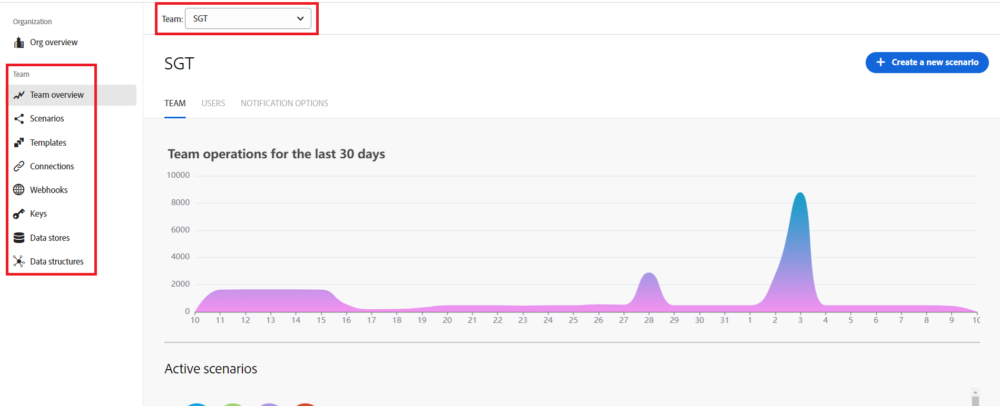

# Navigate dashboards in Workfront Fusion

When you log into Workfront Fusion, you are taken to your organization's dashboard. From here, you can navigate to different areas of Fusion by clicking on the areas in the left navigation.

If you do not see the left navigation panel, click the Main Menu icon   in the upper-left corner of the screen.

| Icon | Area | Description |
|---|---|---|
|  | Org overview | Here, you can see information about your Fusion organization. You can view the number of operations performed by scenarios in this organization, as well as a list of active scenarios. You can also view lists of this organization's team, users, and environments. |
| | Team overview | Here, you can see information about Fusion teams, such as the number of operations performed by scenarios in this team and a list of active scenarios. You can also view and manage the users on this team, and set notification options for this team. When viewing a team, you can select a different team from a dropdown at the top of this page. |
| | Scenarios | A scenario in Fusion represents an automated workflow. For example, one scenario may watch for incoming Workfront requests and convert them to projects, while another scenario may generate images, upload them to a document provider, and add approval tasks to Workfront. Most of your work in Fusion is configuring and managing scenarios. In the Scenarios area, you can view and organize a list of your team's scenarios, and select individual scenarios to view or modify. |
| | Templates | Templates are prebuilt scenarios that you can configure for your own use cases. Here, you can see public scenarios provided by Workfront Fusion, as well as templates created by your team. |
| | Connections | Connections contain login credentials and permissions that allow Fusion to interact with other applications. You create a connection with a specific set of credentials and permissions for a specific application, and then use that connection in your scenario. The scenario can then access and modify the records or other data available to a user with those credentials and permissions. You can create multiple connections for an application, and can use a connection in multiple scenarios. In the Connections area, you can view and manage a list of connections that have been set up by your team. |
| | Webhooks | Webhooks watch applications for changes, and then start a scenario based on that change. For example, you can configure a webhook to start a scenario when an issue is submitted to a particular Workfront project. In the Webhooks area, you can see a list of webhooks configured by your team, and the scenarios they are used in. |
| | Keys | Public and private keys are used to encrypt and decrypt data. The public key can be distributed, and anyone with the public key can encrypt data, but only the private key can decrypt it. Similarly, a user with a private key can encrypt data that anyone with the public key can decrypt. In the Keys area, you can view and manage keys that your team owns. |
| | Data Stores | Data stores are small databases that exist outside of scenarios. Data stores allow you to transfer data between scenarios or between separate runs of a scenario. In the Data Stores area, you can view and manage data stores owned by your team. |
| | Data Structures | Data structures describe the format of data being transferred to Fusion, and are commonly used for serializing or parsing formats such as JSON, XML, and CSV. In the Data Structures, you can view and manage data structures owned by your team. |

>[!NOTE]
>
>In all of the areas under the Team section, you can view a different team's items by clicking the team name near the top of the page and selecting the new team from the dropdown.
>
>

<!--
If you are an administrator, the following sections are available (Find out if these are visible, and if so, what they mean.)
Native apps | 
Apps | 
Organizations | 
All scenarios | 
All users |
-->

