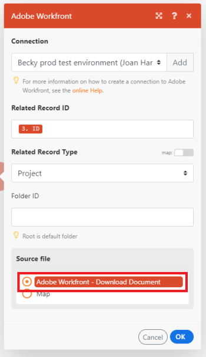

# About mapping files in [!DNL Adobe Workfront Fusion]

Some modules have the capability to process files. These modules can either return an output file to be sent for further processing or require a file to be passed to them for processing. Before these modules can work together to process files, they have to be mapped to each other.

## Access requirements

You must have the following access to use the functionality in this article:

<table style="table-layout:auto">
 <col> 
 <col> 
 <tbody> 
  <tr> 
    <td role="rowheader">[!DNL Adobe Workfront] plan*</td> 
   <td> 
[!DNL Pro] or higher
 </td> 
  </tr> 
  <tr data-mc-conditions=""> 
   <td role="rowheader">[!DNL Adobe Workfront] license*</td> 
   <td> 
[!UICONTROL Plan], [!UICONTROL Work]
 </td> 
  </tr> 
  <tr> 
   <td role="rowheader">[!UICONTROL Adobe Workfront Fusion] license**</td> 
   <td>
   
Current license requirement: No [!DNL Workfront Fusion] license requirement.

   
Or

   
Legacy license requirement: [!UICONTROL [!DNL Workfront Fusion] for Work Automation and Integration] 

   </td> 
  </tr> 
  <tr> 
   <td role="rowheader">Product</td> 
   <td>
   
Current product requirement: If you have the [!UICONTROL Select] or [!UICONTROL Prime] [!DNL Adobe Workfront] Plan, your organization must purchase [!DNL Adobe Workfront Fusion] as well as [!DNL Adobe Workfront] to use functionality described in this article. [!DNL Workfront Fusion] is included in the [!UICONTROL Ultimate] [!DNL Workfront] plan.

   
Or

   
Legacy product requirement: Your organization must purchase [!DNL Adobe Workfront Fusion] as well as [!DNL Adobe Workfront] to use functionality described in this article.

   </td> 
  </tr>  </tbody> 
</table>

To find out what plan, license type, or access you have, contact your [!DNL Workfront] administrator.

For information on [!DNL Adobe Workfront Fusion] licenses, see [[!DNL Adobe Workfront Fusion] licenses](../../workfront-fusion/get-started/license-automation-vs-integration.md).

## Mapping Files

Modules that have the ability to work with files require two pieces of information:

* File name
* File content (data)

When you map a file, you choose the modules in your scenario from which you want to obtain the data. The file name and file content are then automatically mapped as they are.

>[!NOTE]
>
>If you need to process a file from a URL, we recommend using the `HTTP > Get a File` module to download the file from the URL, and then mapping the file from the `HTTP > Get a File` module to the desired module's field in your scenario.

>[!INFO]
>
>**Example:** This example shows how to download documents from [!DNL Adobe Workfront] to [!DNL Google Drive]. The [!DNL Workfront] trigger [!UICONTROL Watch Record] returns detailed information about each document, including its name and ID.
>
>The next module, [!UICONTROL Download Document], downloads the actual data so that it can be uploaded to Google Drive.
>
>To map this information to [!DNL Google Drive] so that it can be uploaded, you need to specify the source file from which the information will be mapped. If you select the [!DNL Workfront] > [!UICONTROL Download Document] option under the source file, [!DNL Workfront Fusion] maps the file name and file content so that the document from [!DNL Workfront] is uploaded to the specified Google folder.
>
>
>
>However, if you wanted to rename the file, but keep the data as it is, you could use the [!UICONTROL Map] option to map the file name and file content separately. You would enter the full file name, including the extension. Text formats and binary formats, such as photos, videos, and PDF, are supported.
>
>
