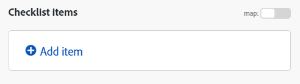
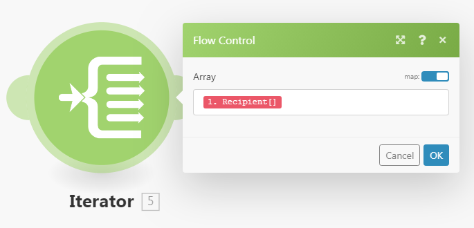

# Map an array in [!DNL Adobe Workfront Fusion]

An array is a special type of item that can contain the following:

* One or more text values (simple array)
* One or more collections of the same type (complex array)

>[!INFO]
>
>**Example:** The [!UICONTROL Watch emails] module returns an array of attachments for every email. Every attachment represents a collection that may contain a name, content, size, and so on.

For more information, see [Item data types in [!DNL Adobe Workfront Fusion]](../../workfront-fusion/mapping/item-data-types.md).

## Access requirements

You must have the following access to use the functionality in this article:

<table style="table-layout:auto">
 <col> 
 <col> 
 <tbody> 
  <tr> 
    <td role="rowheader">[!DNL Adobe Workfront] plan*</td> 
   <td> 
[!DNL Pro] or higher
 </td> 
  </tr> 
  <tr data-mc-conditions=""> 
   <td role="rowheader">[!DNL Adobe Workfront] license*</td> 
   <td> 
[!UICONTROL Plan], [!UICONTROL Work]
 </td> 
  </tr> 
  <tr> 
   <td role="rowheader">[!UICONTROL Adobe Workfront Fusion] license**</td> 
   <td>
   
Current license requirement: No [!DNL Workfront Fusion] license requirement.

   
Or

   
Legacy license requirement: [!UICONTROL [!DNL Workfront Fusion] for Work Automation and Integration] 

   </td> 
  </tr> 
  <tr> 
   <td role="rowheader">Product</td> 
   <td>
   
Current product requirement: If you have the [!UICONTROL Select] or [!UICONTROL Prime] [!DNL Adobe Workfront] Plan, your organization must purchase [!DNL Adobe Workfront Fusion] as well as [!DNL Adobe Workfront] to use functionality described in this article. [!DNL Workfront Fusion] is included in the [!UICONTROL Ultimate] [!DNL Workfront] plan.

   
Or

   
Legacy product requirement: Your organization must purchase [!DNL Adobe Workfront Fusion] as well as [!DNL Adobe Workfront] to use functionality described in this article.

   </td> 
  </tr> 
 </tbody> 
</table>

To find out what plan, license type, or access you have, contact your [!DNL Workfront] administrator.

For information on [!DNL Adobe Workfront Fusion] licenses, see [[!DNL Adobe Workfront Fusion] licenses](../../workfront-fusion/get-started/license-automation-vs-integration.md).

## Map an entire array

1. In the modules that you are mapping the array to, click the field where you want to map the array. This is the field that the array is mapped to.

1. In the box that displays, map the item.

   The panel allows you to map fields in the same way as with any other type of item. If you do not want to fill in each item separately, but want to map another array into the target field, use the [!UICONTROL Map] button. In this case, make sure that both arrays (the source array and the target array) have the same structure.

   You can add any number of items to an array.

You can divide an array into individual bundles using an iterator. Fore more information, see [[!UICONTROL Iterator] module in [!DNL Adobe Workfront Fusion]](/help/workfront-fusion/references/modules/iterator-module.md).

## Map items into a new array

Some fields in Workfront Fusion allow you to map elements into an array. For example, you can create an array of checklist items into the Workfront Boards > Add checklist item module. When the module is run, all of the checklist items are added to the card.

Any module field that displays "Add item" creates an array.

To add elements to the array:

1. Click **Add item**
1. In the panel that opens, enter details about the item.
1. Click **Add**.
1. (Optional) Repeat steps 1-3 for each element you want to add to the[!UICONTROL ] array.                                                           

## Map array elements

### Map array elements by number

Array elements display as a number in square brackets after the array name. You can map an individual element of an array into a field by using this index number.

>[!NOTE]
>
>Array indexing in Workfront Fusion starts from 1.

To map an array element:

1. Click the field where to you want to map the element. 

   The mapping panel opens.

1. Locate the array that contains the element you want to map. 
1. Click the dropdown arrow next to the array.
1. Click the element that you want to map.

   The element is mapped, with the index of 1. This maps the first element in the array.

1. To map a different element of the array, click on the [1] and enter the index number of the array element that you want to map.

   

### Map an array's element with a given key

Some arrays contain collections with key-value items such as metadata, attributes, and so on. To use one of these values, you can look up an element by its given key value and obtain the corresponding value from the value item. We recommend using a formula employing a combination of the `map()` and `get()` functions.

>[!BEGINSHADEBOX]

The following example shows the output of the [!DNL Jira] App.

This example gets a file name from an array of attachments, for the specific attachment with an ID of 10108.

This example generates the following output:

The formula can be explained as follows:

* `map`

    1. The first parameter of the `map()` function is the whole array item.
    1. The second parameter is the raw name of the value item. To obtain the raw name, hover over the item in the [!UICONTROL mapping] panel:

       

       >[!NOTE]
       >
       >All parameters are case sensitive. Even though in this particular example the item's label differs from its raw name only in capitalization, it is necessary to use the raw name.

    1. The third parameter is the raw name of the key item:

       

    1. The fourth parameter is the given key value.

    Because the `map()` function returns an array (as there could be more elements with the given key value), it is necessary to apply the `get()` function to get its first element:

* `get`

    1. The first parameter of the `get()` function is the result of the `map()` function.

    1. The second parameter is the element's index. In this exammple, the index is `1`.

This example generates the following output:

>[!ENDSHADEBOX]

For more information about the `map()` function, see [Array functions](/help/workfront-fusion/references/mapping-panel/functions/array-functions.md).

For more information about the `get()` function, see [General functions](/help/workfront-fusion/references/mapping-panel/functions/general-functions.md).

## Convert array elements to a series of bundles

Arrays can be converted to a series of bundles using the [!UICONTROL Iterator] module. For more information, see [[!UICONTROL Iterator] module](/help/workfront-fusion/references/modules/iterator-module.md).

