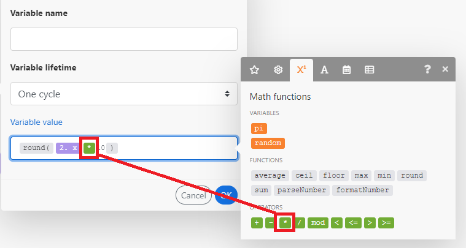
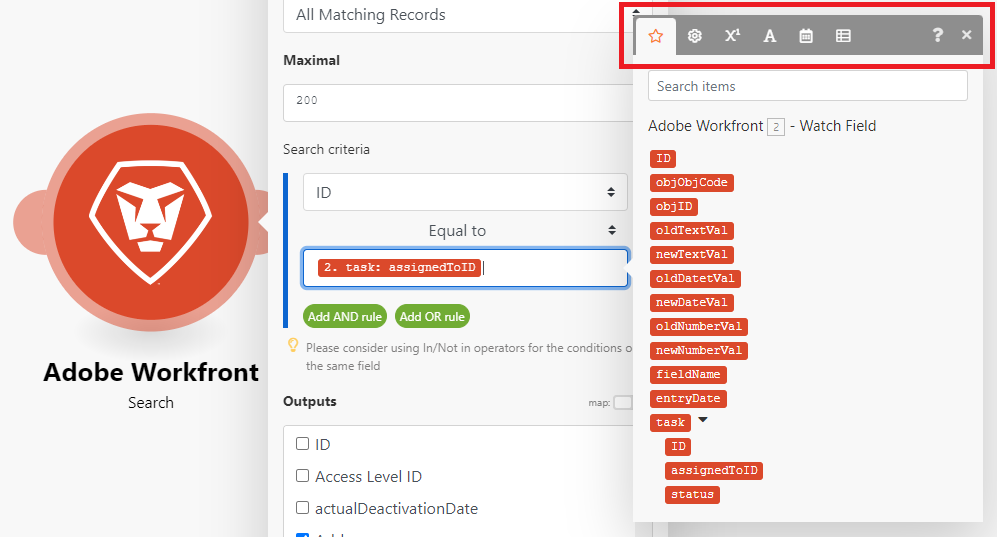
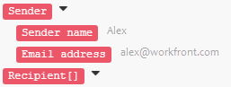
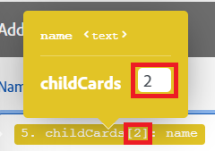
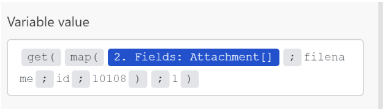
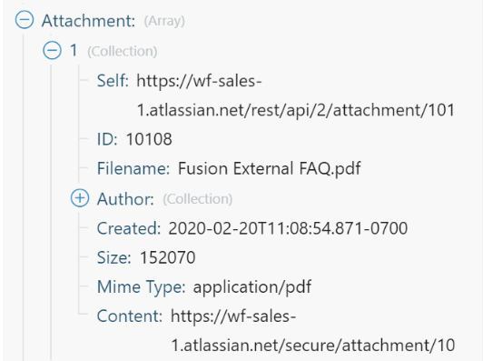
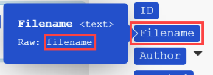
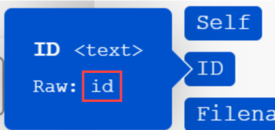
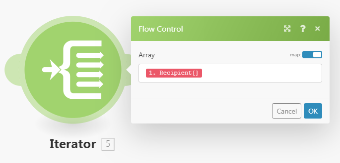

# Map information from one module to another in [!DNL Adobe Workfront Fusion]

Mapping is the process of assigning a module's outputs, structured into items, to another module's input fields.

The mapping panel displays when you click a field where you want to insert a value outputted from a preceding module in a scenario. Within a module, in any field that is available for mapping, you can create a formula using any combination of functions and mapped items from the mapping panel with static text that you type. These elements can be nested inside each other.

## Access requirements

You must have the following access to use the functionality in this article:

<table style="table-layout:auto">
 <col> 
 <col> 
 <tbody> 
  <tr> 
    <td role="rowheader">[!DNL Adobe Workfront] plan*</td> 
   <td> 
[!DNL Pro] or higher
 </td> 
  </tr> 
  <tr data-mc-conditions=""> 
   <td role="rowheader">[!DNL Adobe Workfront] license*</td> 
   <td> 
[!UICONTROL Plan], [!UICONTROL Work]
 </td> 
  </tr> 
  <tr> 
   <td role="rowheader">[!UICONTROL Adobe Workfront Fusion] license**</td> 
   <td>
   
Current license requirement: No [!DNL Workfront Fusion] license requirement.

   
Or

   
Legacy license requirement: [!UICONTROL [!DNL Workfront Fusion] for Work Automation and Integration] 

   </td> 
  </tr> 
  <tr> 
   <td role="rowheader">Product</td> 
   <td>
   
Current product requirement: If you have the [!UICONTROL Select] or [!UICONTROL Prime] [!DNL Adobe Workfront] Plan, your organization must purchase [!DNL Adobe Workfront Fusion] as well as [!DNL Adobe Workfront] to use functionality described in this article. [!DNL Workfront Fusion] is included in the [!UICONTROL Ultimate] [!DNL Workfront] plan.

   
Or

   
Legacy product requirement: Your organization must purchase [!DNL Adobe Workfront Fusion] as well as [!DNL Adobe Workfront] to use functionality described in this article.

   </td> 
  </tr> 
 </tbody> 
</table>

To find out what plan, license type, or access you have, contact your [!DNL Workfront] administrator.

For information on [!DNL Adobe Workfront Fusion] licenses, see [[!DNL Adobe Workfront Fusion] licenses](../../workfront-fusion/get-started/license-automation-vs-integration.md).

## Bundles and items

The operation of a module produces zero, one, or more bundles as its output. A bundle consists of one or more items.

To explore the output of a module:

1. Click **[!UICONTROL Run once]** to execute the module.
1. Click the bubble above the module.

   A log containing all of the module's phases displays. You can find the bundle or bundles outputted by a module's operation phase under the **[!UICONTROL Output]** heading. Each bundle contains its items and each item's values.

>[!INFO]
>
>**Example:** This example shows the module [!UICONTROL Email] > [!UICONTROL Watch emails]. You can see that it performed 1 operation producing a single bundle that contains various items such as `Date`, `Email ID (UID)`, `size`, and so on.
>
>

>[!NOTE]
>
>The outputs from modules wrapped between an [!UICONTROL Iterator] and [!UICONTROL Aggregator] are not accessible beyond the [!UICONTROL Aggregator] module.

## Map an item

After you have created a sequence of modules by linking two or more of them, each module can process values of items outputted by the modules that precede it.

To assign the items to a module's input fields:

1. Click on the module that should process the output of the preceding module or modules.
1. In the Module settings panel that displays, click a field where you want to use the value of an item outputted from a preceding module(s).

   The mapping panel opens.

1. Click an item from the mapping panel to insert it into the field.
1. (Optional) To search for a particular field in the mapping panel, click the mapping panel search bar and type in the term you want to search for. Click the field when it appears in the list.

   Search results contain the search term and are not case sensitive.

For more information, see [Configure a module's settings in [!DNL Adobe Workfront Fusion]](../../workfront-fusion/modules/configure-a-modules-settings.md).

## Formulas

You can map multiple items into a field, combine them with literals (fixed values), and employ Operators and Functions to build complex formulas:

 

You can find the functions and operators in the mapping panel under one of its tabs.

The first tab  (shown upon opening the panel) displays the items that you can map from other modules.

The other tabs contain the following types of functions:

* **General functions**  - See [General functions in [!DNL Adobe Workfront Fusion]](../../workfront-fusion/functions/general-functions.md) for more information.

* **Math functions**  - See [Math functions in [!DNL Adobe Workfront Fusion]](../../workfront-fusion/functions/math-functions.md) for more information.

* **Text and binary functions**  - See [String functions in [!DNL Adobe Workfront Fusion]](../../workfront-fusion/functions/string-functions.md) for more information.

* **Date and time**  - See [Date and time functions in [!DNL Adobe Workfront Fusion]](../../workfront-fusion/functions/date-and-time-functions.md) and the articles below for more information.

    * [Tokens for date and time formatting in [!DNL Adobe Workfront Fusion]](../../workfront-fusion/functions/tokens-for-date-and-time-formatting.md)
    * [Tokens for date and time parsing in Adobe Workfront Fusion](../../workfront-fusion/functions/tokens-for-date-and-time-parsing.md)

* **Functions for working with arrays**  - See [Array functions in [!DNL Adobe Workfront Fusion]](../../workfront-fusion/functions/array-functions.md) for more information.

>[!TIP]
>
>When you create a complex formula that you want to reuse it in another field, you can click the field that contains the combination, use Command-A or Ctrl-A to select it, then copy and paste it into the other field.

For more information on mapping items using functions, see [Map items using functions in [!DNL Adobe Workfront Fusion]](../../workfront-fusion/functions/map-using-functions.md).

## Collections

Some items can contain multiple values of various types. These are collection type items.

You can identify a [!UICONTROL collection] type item by the small black rectangle displayed to the right of the item's label and its automatically expanded list of sub-items:

>[!NOTE]
>
>In most cases, you map the collection's sub-items rather than the item representing the whole collection.

For more information about collections, see [Item data types in [!UICONTROL Adobe Workfront Fusion]](../../workfront-fusion/mapping/item-data-types.md)

## Arrays

Some items can contain multiple elements of the same type. These are array type items.

You can identify an array type item by the square brackets at the end of the item's label. Click the small black rectangle to the right of the item's label to reveal the element's items:

For more information about arrays, see [Item data types in [!DNL Adobe Workfront Fusion]](../../workfront-fusion/mapping/item-data-types.md)

### Map an array's first element

If you map an array's `Recipient name` item, it displays in the field like this:

The number in the square brackets is an index that determines which element of the array will be used. It is set to 1 by default.

### Map an array's n-th element

If you want to access another element, click on the square brackets and edit the index value:

### Map an array's element with a given key

Some arrays contain several collections with key and value items. These are typically various metadata, attributes, and so on.

The following example shows the output of the [!DNL Jira] App.

In this example, we get a file name from an array of attachments for the specific attachment with an ID of 10108.

The output from [!DNL Jira] looks like this:

The typical requirement is to look up an element by its given key value and obtain the corresponding value from the value item. This can be achieved with a formula employing a combination of the `map()` and `get()` functions.

The following is a detailed breakdown of the formula:

1. The first parameter of the `map()` function is the whole array item.
1. The second parameter is the raw name of the value item. To obtain the raw name, hover over the item in the [!UICONTROL mapping] panel:

   

   >[!NOTE]
   >
   >All parameters are case sensitive. Even though in this particular example the item's label differs from its raw name only in capitalization, it is necessary to use the raw name, which is all lowercase value in contrast to the label Value.

1. The 3rd parameter is the raw name of the key item:

   

1. The 4th parameter is the given key value.

Because the `map()` function returns an array (as there could be more elements with the given key value), it is necessary to apply the `get()` function to get its first element:

* The 1st parameter of the `get()` function is the result of the `map()` function.

* The 2nd parameter is the element's index - one.

For more information about the `map()` function, see [Array functions in [!DNL Adobe Workfront Fusion]](../../workfront-fusion/functions/array-functions.md).

For more information about the `get()` function, see [General functions in [!DNL Adobe Workfront Fusion]](../../workfront-fusion/functions/general-functions.md).

## Converting elements to a series of bundles

Arrays can be converted to a series of bundles using the [!UICONTROL Iterator] module. For more information, see [[!UICONTROL Iterator] module in [!UICONTROL Adobe Workfront Fusion]](../../workfront-fusion/modules/iterator-module.md).

## Troubleshooting

### Missing items in the mapping panel

For each module, the mapping panel displays all output items, listed by the author of the module. In some cases, this list might be incomplete for various reasons, and some items might be missing. [!DNL Workfront Fusion] can auto-discover the missing output items when you run the module in the scenario editor. The exact procedure differs slightly depending on the module's type:

#### Instant trigger

1. Right-click the module, then click **[!UICONTROL Run this module only]** in the menu that displays.

   If there are no queued webhooks, the module waits for a new webhook to process.

1. Generate a webhook.

   For example, the webhook module **[!DNL Slack] >[!UICONTROL Listen for new events]** (which watches for new channel messages in a channel) sends a message to the channel.

1. When the module finishes running, click the bubble above the module to explore its full output.

   The mapping panel will contains all the items that were discovered in the module's output.

#### Polling trigger

1. Right-click the module, then click **[!UICONTROL Run this module only]** in the menu that displays.
1. If there is no output, click **[!UICONTROL Choose where to start]** and adjust the settings.
1. If there is no event to be processed, create one and go back to step 2.

   For example, the webhook module **[!UICONTROL Gmail] >[!UICONTROL Watch emails]** sends an email to the folder that the module is watching.

1. When the module finishes running, click the bubble above the module to explore its full output.

   The mapping panel now contains all of the items that were discovered in the module's output.

#### Other modules

You may choose to execute:

* The whole scenario (or just the part containing the module)

   If your scenario starts with a trigger, refer to the [Instant trigger](#instant-trigger) or [Polling trigger](#polling-trigger) section above.

* Just the single module

If you choose to execute just the single module:

1. Right-click the module, then click **[!UICONTROL Run this module only]** in the menu that displays..
1. Provide sample values for the input items, then click **[!UICONTROL OK]** .
1. When the module finishes running, click the bubble above the module to explore its full output.

   The mapping panel now contains all of the items that were discovered in the module's output.
