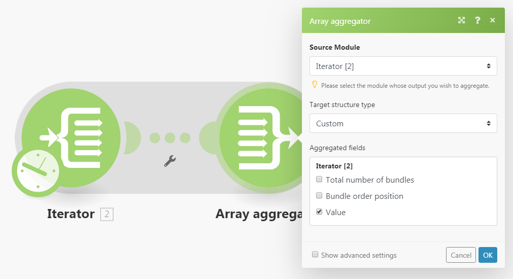
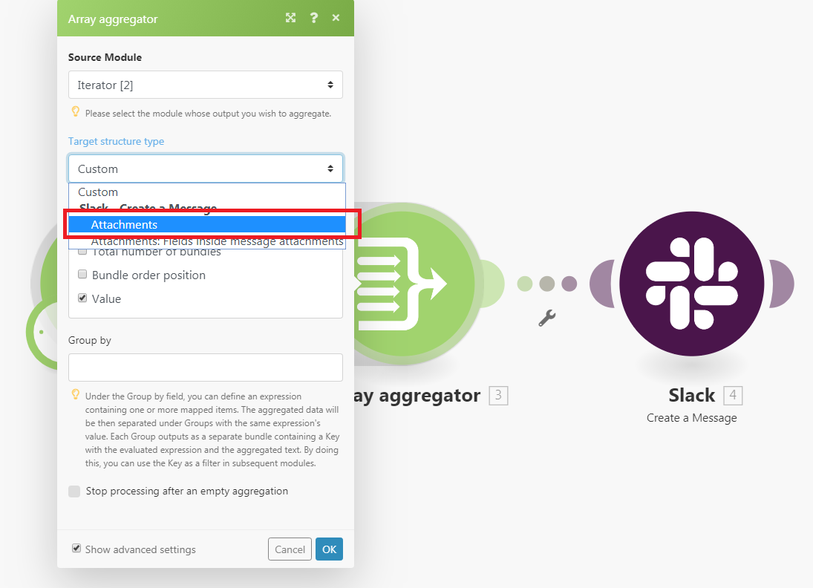
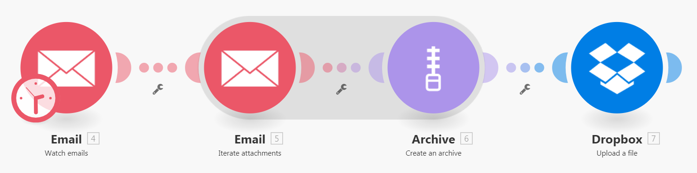
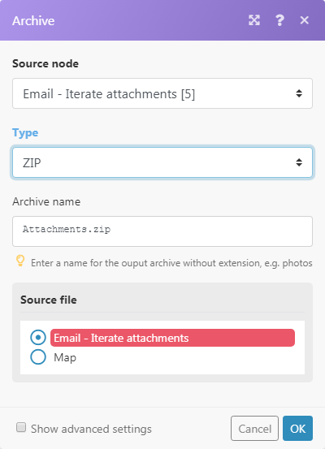

# [!UICONTROL Aggregator] module in [!DNL Adobe Workfront Fusion]

An aggregator module is a type of module designed to merge several bundles of data into a single bundle.

For more information about module types, see [Types of modules](../../workfront-fusion/modules/module-types.md).

## Access requirements

+++ Expand to view access requirements for the functionality in this article.

You must have the following access to use the functionality in this article:

<table style="table-layout:auto">
 <col> 
 <col> 
 <tbody> 
  <tr> 
    <td role="rowheader">[!DNL Adobe Workfront] plan*</td> 
   <td> 
[!DNL Pro] or higher
 </td> 
  </tr> 
  <tr data-mc-conditions=""> 
   <td role="rowheader">[!DNL Adobe Workfront] license*</td> 
   <td> 
[!UICONTROL Plan], [!UICONTROL Work]
 </td> 
  </tr> 
  <tr> 
   <td role="rowheader">[!UICONTROL Adobe Workfront Fusion] license**</td> 
   <td>
   
Current license requirement: No [!DNL Workfront Fusion] license requirement.

   
Or

   
Legacy license requirement: [!UICONTROL [!DNL Workfront Fusion] for Work Automation and Integration] 

   </td> 
  </tr> 
  <tr> 
   <td role="rowheader">Product</td> 
   <td>
   
Current product requirement: If you have the [!UICONTROL Select] or [!UICONTROL Prime] [!DNL Adobe Workfront] Plan, your organization must purchase [!DNL Adobe Workfront Fusion] as well as [!DNL Adobe Workfront] to use functionality described in this article. [!DNL Workfront Fusion] is included in the [!UICONTROL Ultimate] [!DNL Workfront] plan.

   
Or

   
Legacy product requirement: Your organization must purchase [!DNL Adobe Workfront Fusion] as well as [!DNL Adobe Workfront] to use functionality described in this article.

   </td> 
  </tr> 
 </tbody> 
</table>

To find out what plan, license type, or access you have, contact your [!DNL Workfront] administrator.

For information on [!DNL Adobe Workfront Fusion] licenses, see [[!DNL Adobe Workfront Fusion] licenses](../../workfront-fusion/get-started/license-automation-vs-integration.md).

+++

## [!UICONTROL Aggregator] module

When an [!UICONTROL Aggregator] module executes, it does the following:

* Accumulates all the bundles it receives during a single source module's operation.
* Outputs a single bundle with an array containing one item per each accumulated bundle. The content of the array's items depends on particular [!UICONTROL Aggregator] module and its setup.

The following image shows a typical setup of the [!UICONTROL Aggregator] module :

<table style="table-layout:auto">
 <col> 
 <col> 
 <tbody> 
  <tr> 
   <td> 
[!UICONTROL Source Module]
 </td> 
   <td> 
The module where the bundle aggregation starts. The source module is usually an iterator or a search module that outputs a series of bundles.

When you setup the aggregator's source module (and close the aggregator's setup), the route between the source module and the aggregator module are wrapped in a grey area so that you can see clearly the start and the end of the aggregation. 
   
 
For more information on iterators, see <a href="../../workfront-fusion/modules/iterator-module.md" class="MCXref xref">[!UICONTROL Iterator] module in [!DNL Adobe Workfront Fusion]</a>
 
For more information on search modules see search modules in <a href="../../workfront-fusion/modules/module-types.md" class="MCXref xref">Types of modules</a>.
 </td> 
  </tr> 
  <tr> 
   <td> 
[!UICONTROL Target structure type]
 </td> 
   <td> 
(Applicable only for the [!UICONTROL Array aggregator] module.) The target structure where the data is aggregated. The default option, [!UICONTROL Custom], enables you to choose items that should be aggregated into the [!UICONTROL Array aggregator]'s output bundle's <code>Array </code>item:
 
  
 
Once you connect more modules after the [!UICONTROL Array aggregator] module and get back to the module's setup, the [!UICONTROL Target] structure type drop-down menu will contain all following modules and their fields that are `Array of Collections` type, as shown in the [!UICONTROL Attachments] field of the [!DNL Slack] >[!UICONTROL Create a Message] module:
 
  
 </td> 
  </tr> 
  <tr> 
   <td>[!UICONTROL Aggregated fields]</td> 
   <td>The fields that you want to include in the aggregator module output.</td> 
  </tr> 
  <tr> 
   <td> 
[!UICONTROL Group by]
 </td> 
   <td> 
The aggregator's output can be split into several groups with the help of the [!UICONTROL Group by] field. The [!UICONTROL Group by] field can contain a formula that is evaluated for each aggregator's input bundle. The aggregator then outputs one bundle per each distinct formula's value. Each bundle contains two items:
 
    <ul> 
     <li><code>Key </code>contains the distinct value.</li> 
     <li><code>Array </code>contains the aggregated data from the bundles for which the formula evaluated to the <code>Key </code>value.</li> 
    </ul> </td> 
  </tr> 
  <tr> 
   <td> 
Stop processing after an empty aggregation
 </td> 
   <td> 
By default, the [!UICONTROL Aggregator] module outputs the result of the aggregation even in case no bundles reached the [!UICONTROL Aggregator] module (for example, because they have been all filtered out on their way). If the option [!UICONTROL Stop processing after an empty aggregation] is enabled, the [!UICONTROL Aggregator] module will not produce any output bundle in this case and the flow will stop.
 </td> 
  </tr> 
 </tbody> 
</table>

>[!NOTE]
>
>Bundles generated by modules between the source module and the [!UICONTROL Aggregator] module are not outputted by the [!UICONTROL Aggregator] module, so they are not accessible by the modules in the flow after the [!UICONTROL Aggregator]. If you need any data from a bundle outputted by a module between the source module and the [!UICONTROL Aggregator] module, make sure to include the given item in the [!UICONTROL Aggregator] module's setup (as in the [!UICONTROL Aggregated fields] field in the setup of the [!UICONTROL Array aggregator] module).

>[!INFO]
>
>**Example:** Use Case: Zipping all email attachments and uploading the ZIP to [!DNL Dropbox]
>
>The scenario below shows how to:
>
>* Watch a mailbox for incoming emails: [!UICONTROL Email] >[!UICONTROL Watch emails] trigger will output a bundle with item `Attachments[]`, which is an array containing all the email's attachments.
>
>* Iterate the email's attachments: [!UICONTROL Email] >[!UICONTROL Iterate attachments] iterator takes the items from the `Attachments[]` array one by one and sends them further as separate bundles.
>
>* Aggregate the bundles outputted by the [!UICONTROL Email] >[!UICONTROL Iterate attachments] module: [!UICONTROL Archive] >[!UICONTROL Create an archive aggregator] accumulates all the bundles it receives and outputs a single bundle containing the ZIP file.
>
>* Upload the resulting ZIP file to [!DNL Dropbox]: [!DNL Dropbox] > [!UICONTROL Upload a file] obtains the ZIP file from the [!UICONTROL Archive] > [!UICONTROL Create an archive] module and uploads it to [!DNL Dropbox].
>
>
>
>Below is a sample setup of the [!UICONTROL Archive] > [!UICONTROL Create an archive] aggregator:
>
>
