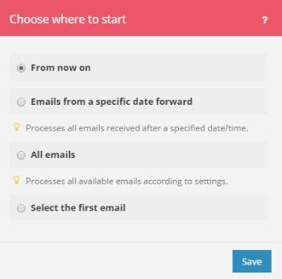

# Choose where a trigger module starts in [!DNL Adobe Workfront Fusion]

Some trigger modules allow you to select the first bundle from which you want the retrieving of bundles to start.

You can also specify whether you want to retrieve all bundles or just the bundles from after a specific date.

For more information about trigger modules, see the section [Trigger modules](../../workfront-fusion/modules/module-types.md#triggers) in the article [Types of modules](../../workfront-fusion/modules/module-types.md).

## Access requirements

+++ Expand to view access requirements for the functionality in this article.

You must have the following access to use the functionality in this article:

<table style="table-layout:auto">
 <col> 
 <col> 
 <tbody> 
  <tr> 
    <td role="rowheader">[!DNL Adobe Workfront] plan*</td> 
   <td> 
[!DNL Pro] or higher
 </td> 
  </tr> 
  <tr data-mc-conditions=""> 
   <td role="rowheader">[!DNL Adobe Workfront] license*</td> 
   <td> 
[!UICONTROL Plan], [!UICONTROL Work]
 </td> 
  </tr> 
  <tr> 
   <td role="rowheader">[!UICONTROL Adobe Workfront Fusion] license**</td> 
   <td>
   
Current license requirement: No [!DNL Workfront Fusion] license requirement.

   
Or

   
Legacy license requirement: [!UICONTROL [!DNL Workfront Fusion] for Work Automation and Integration] 

   </td> 
  </tr> 
  <tr> 
   <td role="rowheader">Product</td> 
   <td>
   
Current product requirement: If you have the [!UICONTROL Select] or [!UICONTROL Prime] [!DNL Adobe Workfront] Plan, your organization must purchase [!DNL Adobe Workfront Fusion] as well as [!DNL Adobe Workfront] to use functionality described in this article. [!DNL Workfront Fusion] is included in the [!UICONTROL Ultimate] [!DNL Workfront] plan.

   
Or

   
Legacy product requirement: Your organization must purchase [!DNL Adobe Workfront Fusion] as well as [!DNL Adobe Workfront] to use functionality described in this article.

   </td> 
  </tr> 
 </tbody> 
</table>

To find out what plan, license type, or access you have, contact your [!DNL Workfront] administrator.

For information on [!DNL Adobe Workfront Fusion] licenses, see [[!DNL Adobe Workfront Fusion] licenses](../../workfront-fusion/get-started/license-automation-vs-integration.md).

+++

## Choose where a trigger module starts

1. Save a trigger module.

   Or

   Change the trigger module's settings as described in [Configure a module's settings in [!UICONTROL Adobe Workfront Fusion]](../../workfront-fusion/modules/configure-a-modules-settings.md).

   Or

   Right-click the icon for the trigger module in the [!UICONTROL Scenario editor], as described in [Create a scenario in [!DNL Adobe Workfront Fusion]](../../workfront-fusion/scenarios/create-a-scenario.md).

1. Select an option in the **[!UICONTROL Choose where to start]** box that appears.

   

   The options displayed depend on the possibilities of a given service. They may include the following:

   <table style="table-layout:auto">
        <tr>
            <td>[!UICONTROL From now on] (default)</td>
            <td>Retrieves all bundles added or updated (depending on settings) from now on</td>
        </tr>
        <tr>
            <td>[!UICONTROL From after a specific date]</td>
            <td>Retrieves all bundles added or updated (depending on settings) after a specified date/time</td>
        </tr>
        <tr>
            <td>[!UICONTROL With ID greater than or equal to a specific value]</td>
            <td>Retrieves all bundles with an ID greater than or equal to a specified ID</td> 
        </tr>
        <tr>
            <td>[!UICONTROL All bundles]</td>
            <td>Retrieves all available bundles</td>
        </tr>
        <tr>
            <td>[!UICONTROL Select the first bundle]</td>
            <td>Allows you to select the first bundle from which the retrieval of bundles is to start</td>
        </tr>
   </table>
