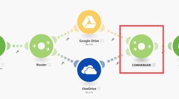
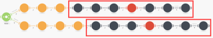
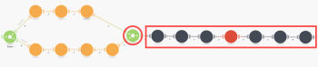
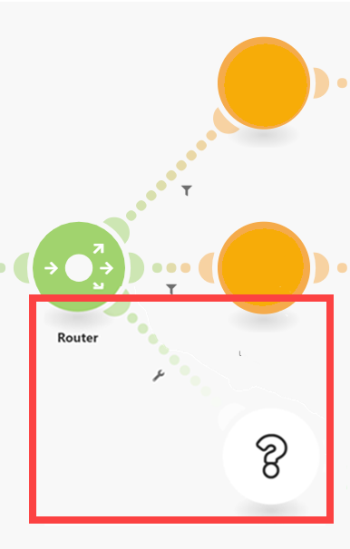
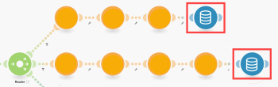
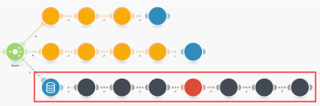

# Converger module

>[!NOTE]
>
>Status: >
>```>
>PLANNED
>```>
>- see the [Workarounds](#workarou) section below.

A converger module is a counterpart of the Router module. It enables you to merge multiple routes into one:

 

<!--
later replace with a full scenario like in original Alloy article
-->

## Usage

In some cases, the routes after the router module might contain completely identical sequences of modules - a common sequence:



In this case, you could use the converger module to merge the two (or more) routes into one and connect the common sequence after it:



## Workarounds

Until the converger module is released, you may use one of the following workarounds to avoid the duplication of the common sequence.

### Data store

1. Add an extra filter-free route to the router module to connect the common sequence (the one you would put after the converger module).

   

1. Add `Data store` > `Add/replace a record` modules at the end of each router module's route (except the new extra route) to store the data outputted by the modules on the route that should be passed to the common sequence.

   

   The Data store would contain just one record. The record's key could be, for example, "MyKey".

1. Add `Data store` > `Get a record module` at the beginning of the common sequence to obtain the previously stored data.

   

### JSON

If you want to avoid the use of the Data Store you can:

1. Instead of the `Data store` > `Get a record` module use `JSON` > `Create JSON` module followed by `Tools` > `Set variable` to store the resulting JSON in a variable (for example, "MyBundle").

1. Instead of the `Data store` > `Get a record` module use `Tools` > `Get variable` to obtain the previously stored variable followed by `JSON` > `Parse JSON`.

### A variable

If it is just a single value that you need to pass to the common sequence (for example, ID), you can employ only the `Tools` > `Set variable` and `Get variable` modules.

### A separate new scenario

You can also place the common sequence to a separate new scenario and then:

1. Employ `HTTP` > `Make a request` module at the end of each route to pass the data to the new scenario.

1. Employ `Webhooks` > `Custom webhook` module at the beginning of the new scenario to receive the data.

For more information, see [HTTP](http-modules.md) and [Webhooks](../../workfront-fusion/apps-and-their-modules/webhooks-updated.md).
