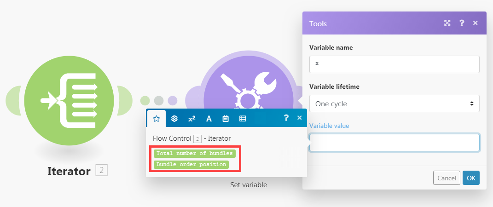
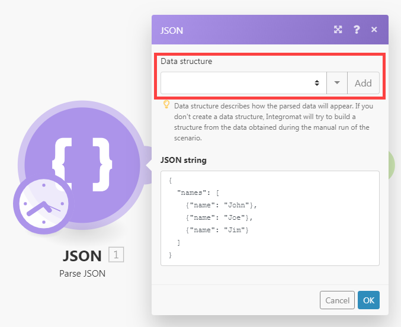
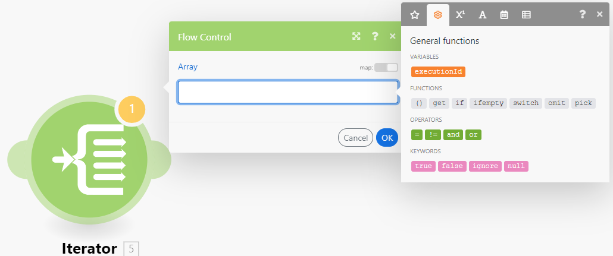
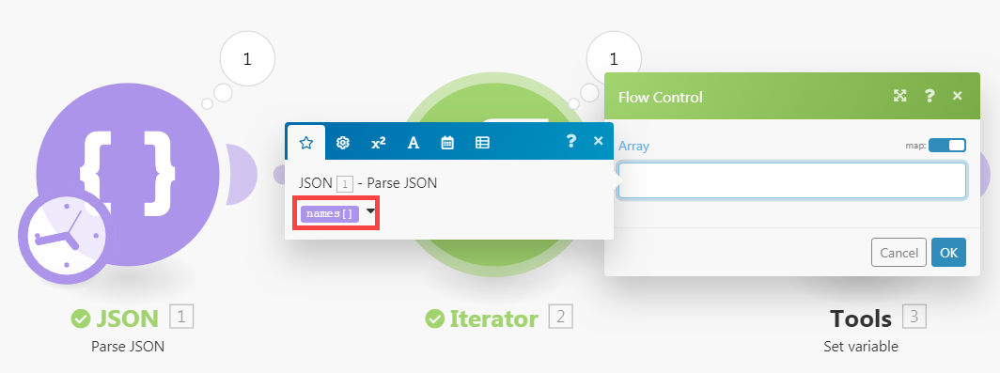
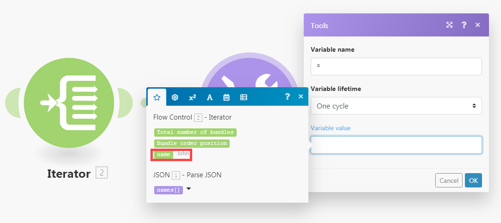

# [!UICONTROL Iterator] module in [!DNL Adobe Workfront Fusion]

An [!UICONTROL Iterator] module is a special type of module that converts an array into a series of bundles. Each array item is outputted as a separate bundle.

For more information, see [Types of modules](../../workfront-fusion/modules/module-types.md) and [Map an array in Adobe Workfront Fusion](../../workfront-fusion/mapping/map-an-array.md).

## Access requirements

You must have the following access to use the functionality in this article:

<table style="table-layout:auto">
 <col> 
 <col> 
 <tbody> 
  <tr> 
    <td role="rowheader">[!DNL Adobe Workfront] plan*</td> 
   <td> 
[!DNL Pro] or higher
 </td> 
  </tr> 
  <tr data-mc-conditions=""> 
   <td role="rowheader">[!DNL Adobe Workfront] license*</td> 
   <td> 
[!UICONTROL Plan], [!UICONTROL Work]
 </td> 
  </tr> 
  <tr> 
   <td role="rowheader">[!UICONTROL Adobe Workfront Fusion] license**</td> 
   <td>
   
Current license requirement: No [!DNL Workfront Fusion] license requirement.

   
Or

   
Legacy license requirement: [!UICONTROL [!DNL Workfront Fusion] for Work Automation and Integration] 

   </td> 
  </tr> 
  <tr> 
   <td role="rowheader">Product</td> 
   <td>Your organization must purchase Adobe Workfront Fusion as well as Adobe Workfront to use functionality described in this article.</td> 
  </tr> 
 </tbody> 
</table>

To find out what plan, license type, or access you have, contact your Workfront administrator.

For information on [!DNL Adobe Workfront Fusion] licenses, see [[!DNL Adobe Workfront Fusion] licenses](../../workfront-fusion/get-started/license-automation-vs-integration.md).

## [!UICONTROL Iterator] module configuration

You set up an [!UICONTROL Iterator] module the same you set up any other module. The [!UICONTROL Array] field contains the array to be converted or split into separate bundles.

For more information, see [Configure a module's settings in Adobe Workfront Fusion](../../workfront-fusion/modules/configure-a-modules-settings.md).

>[!INFO]
>
>**Examples:** 
>
>* The below scenario shows how to retrieve emails with attachments and save the attachments as single files in a selected [!DNL Dropbox] folder.
>
>   Emails can contain an array of attachments. The [!UICONTROL Iterator] module inserted after the first module will enable you to handle each attachment separately. The [!UICONTROL Iterator] module splits the array of attachments into single bundles. Each bundle, with one attachment, is then saved one at a time in a selected [!DNL Dropbox] folder. The [!UICONTROL Iterator] module set-up is shown above: the [!UICONTROL Array] field should contain the `Attachments` array.
>
>   
>
>* For your convenience, many [!DNL Workfront Fusion] apps offer specialized [!UICONTROL Iterator] modules with a simplified setup. For example, the [!UICONTROL Email] app contains the special [!UICONTROL Iterator] module [!UICONTROL Email] > [!UICONTROL Iterate attachments] that will produce the same results as the general [!UICONTROL Iterator] module.
>
>   

## Troubleshooting: Mapping panel does not display mappable items under [!UICONTROL Iterator] module

When an [!UICONTROL Iterator] module does not have information about the structure of the array's items, the mapping panel in the modules following the [!UICONTROL Iterator] module display only 2 items under the [!UICONTROL Iterator] module :`Total number of bundles` and `Bundle order position`:

This because each module is responsible for providing information about items it outputs so that these items can be properly displayed in the mapping panel in the subsequent modules. However, several modules might be unable to provide this information in some cases; for example, [!UICONTROL JSON] > [!UICONTROL Parse JSON] or [!UICONTROL Webhooks] > [!UICONTROL Custom Webhook] modules with missing Data structure.

The solution is to manually execute the scenario to make the module learn about the items it outputs so it can provide the information to the following modules.

For example, if you have a [!UICONTROL JSON] > [!UICONTROL Parse JSON] module without a Data structure as below:

And then if you connect an [!UICONTROL Iterator] module to it, you will not be able to map the output of the module to the Array field in the setup panel of the [!UICONTROL Iterator] module :

To resolve this, manually start the scenario in the scenario editor. You can un-link the modules after the [!UICONTROL JSON] > [!UICONTROL Parse JSON] module to prevent the flow from proceeding further. Or you can right-click the [!UICONTROL JSON] > [!UICONTROL Parse JSON] module and choose **[!UICONTROL Run this module only]** from the context menu to execute only the [!UICONTROL JSON] > [!UICONTROL Parse JSON] module.

When the [!UICONTROL JSON] > [!UICONTROL Parse JSON] executes, it learns about the items that it outputs and provides this information to all the subsequent modules, including the Iterator module. The mapping panel in the Iterator's setup then displays the items:

Moreover, the mapping panel in the modules that are connected after the [!UICONTROL Iterator] module display the items contained in the array's items:

If you cannot see some items in a module's mapping panel, run the scenario once so all the modules can learn about the items they output and provide this information to the following modules.
