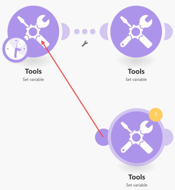
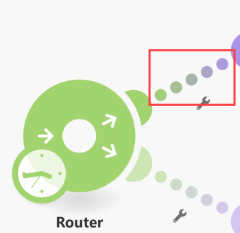
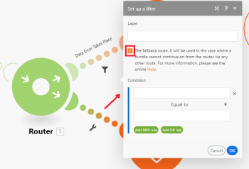

# [!UICONTROL Router] module in [!DNL Adobe Workfront Fusion]

The [!UICONTROL Router] module allows you to branch your flow into several routes and process the data within each route differently. Once a [!UICONTROL Router] module receives a bundle, it forwards it to each connected route in the order the routes were attached to the [!UICONTROL Router] module.

>[!NOTE]
>
>* To verify the order of the routes, you can click the [!UICONTROL Auto-align] icon, which will arrange the routes according to the order from top to bottom.
>
>  To change the order, remove the [!UICONTROL Router] module and re-connect the routes in the desired order.
>
>* Routes are processed sequentially, not in parallel. A bundle is not sent to the next route until it has been completely processed by the previous route.
>

## Access requirements

You must have the following access to use the functionality in this article:

<table style="table-layout:auto">
 <col> 
 <col> 
 <tbody> 
  <tr> 
    <td role="rowheader">[!DNL Adobe Workfront] plan*</td> 
   <td> 
[!DNL Pro] or higher
 </td> 
  </tr> 
  <tr data-mc-conditions=""> 
   <td role="rowheader">[!DNL Adobe Workfront] license*</td> 
   <td> 
[!UICONTROL Plan], [!UICONTROL Work]
 </td> 
  </tr> 
  <tr> 
   <td role="rowheader">[!UICONTROL Adobe Workfront Fusion] license**</td> 
   <td>
   
Current license requirement: No [!DNL Workfront Fusion] license requirement.

   
Or

   
Legacy license requirement: [!UICONTROL [!DNL Workfront Fusion] for Work Automation and Integration] 

   </td> 
  </tr> 
  <tr> 
   <td role="rowheader">Product</td> 
   <td>
   
Current product requirement: If you have the [!UICONTROL Select] or [!UICONTROL Prime] [!DNL Adobe Workfront] Plan, your organization must purchase [!DNL Adobe Workfront Fusion] as well as [!DNL Adobe Workfront] to use functionality described in this article. [!DNL Workfront Fusion] is included in the [!UICONTROL Ultimate] [!DNL Workfront] plan.

   
Or

   
Legacy product requirement: Your organization must purchase [!DNL Adobe Workfront Fusion] as well as [!DNL Adobe Workfront] to use functionality described in this article.

   </td> 
  </tr> 
 </tbody> 
</table>

To find out what plan, license type, or access you have, contact your [!DNL Workfront] administrator.

For information on [!DNL Adobe Workfront Fusion] licenses, see [[!DNL Adobe Workfront Fusion] licenses](../../workfront-fusion/get-started/license-automation-vs-integration.md).

## Adding a [!UICONTROL Router] module to a scenario

A [!UICONTROL Router] can be added to a scenario in one of the following ways:

* If you want to connect the [!UICONTROL Router] module after a module, click on the module's right handle, start typing **[!UICONTROL router]** to search for it, then choose **[!UICONTROL Flow Control]** > **[!UICONTROL Router]** in the list of modules that displays.

   

* If you want to insert the [!UICONTROL Router] module between two modules, click on the wrench icon below the route connecting the two modules (or right-click the route) and choose **[!UICONTROL Add a router]** from the menu.

   

* You can insert a [!UICONTROL Router] module automatically. For example, in the image below, to connect the module in the lower-right corner to the one in the upper-left corner (which is already connected to the one in the upper-right corner), drag the left handle of the lower-right module and drop it onto the upper-left module.

   

## Filters

You can put a filter on a route after the [!UICONTROL Router] module to filter bundles as on any other route:

1. Click one of the dots in the route.

   

1. In the **[!UICONTROL Set up a filter]** box that displays, add conditions, then click **[!UICONTROL OK]** to save the filter setup.

   

For more information, see [Add a filter to a scenario in [!DNL Adobe Workfront Fusion]](../../workfront-fusion/scenarios/add-a-filter-to-a-scenario.md).

## The fallback route

The filter setup on a route after a [!UICONTROL Router] module contains a special option: The fallback route:

When enabled, this route is used in the case when a bundle cannot continue on from the [!UICONTROL Router] module via any other route because the filters on the other routes filtered it out.

The Fallback route is distinguished with a different arrow sign inside the [!UICONTROL Router] module:

## If/Else

A typical use case of the fallback route is to continue the flow with one route if the condition is met and with another route if it is not, as in the following steps:

1. Insert a [!UICONTROL Router] module in your scenario.
1. Connect both routes to the [!UICONTROL Router] module .
1. Click on the first route and specify a condition:

   

1. Click on the second route and enable the [!UICONTROL fallback route] option:

   
