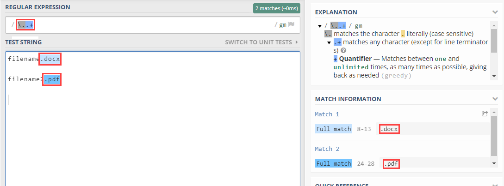
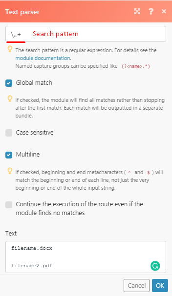
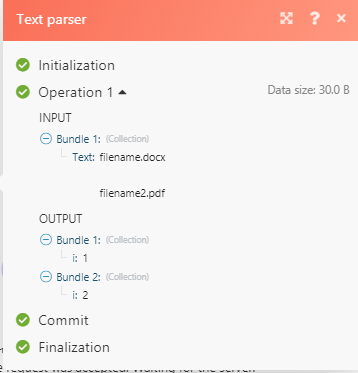
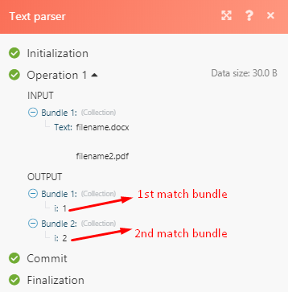
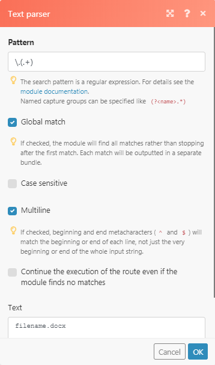
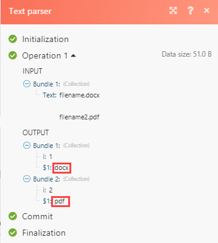

# Text parser troubleshooting in [!DNL Adobe Workfront Fusion]

Use this information if you can not get a text parser to produce any output.

## Access requirements

You must have the following access to use the functionality in this article:

<table style="table-layout:auto">
 <col> 
 <col> 
 <tbody> 
  <tr> 
    <td role="rowheader">[!DNL Adobe Workfront] plan*</td> 
   <td> 
[!DNL Pro] or higher
 </td> 
  </tr> 
  <tr data-mc-conditions=""> 
   <td role="rowheader">[!DNL Adobe Workfront] license*</td> 
   <td> 
[!UICONTROL Plan], [!UICONTROL Work]
 </td> 
  </tr> 
  <tr> 
   <td role="rowheader">[!UICONTROL Adobe Workfront Fusion] license**</td> 
   <td>
   
Current license requirement: No [!DNL Workfront Fusion] license requirement.

   
Or

   
Legacy license requirement: [!UICONTROL [!DNL Workfront Fusion] for Work Automation and Integration] 

   </td> 
  </tr> 
  <tr> 
   <td role="rowheader">Product</td> 
   <td>
   
Current product requirement: If you have the [!UICONTROL Select] or [!UICONTROL Prime] [!DNL Adobe Workfront] Plan, your organization must purchase [!DNL Adobe Workfront Fusion] as well as [!DNL Adobe Workfront] to use functionality described in this article. [!DNL Workfront Fusion] is included in the [!UICONTROL Ultimate] [!DNL Workfront] plan.

   
Or

   
Legacy product requirement: Your organization must purchase [!DNL Adobe Workfront Fusion] as well as [!DNL Adobe Workfront] to use functionality described in this article.

   </td> 
  </tr> 
 </tbody> 
</table>

To find out what plan, license type, or access you have, contact your [!DNL Workfront] administrator.

For information on [!DNL Adobe Workfront Fusion] licenses, see [[!DNL Adobe Workfront Fusion] licenses](../../workfront-fusion/get-started/license-automation-vs-integration.md).

## Troubleshooting

Case scenario example, you would like to parse the filetype of a file document "filename.docx" and the extension of the filename always varies from DOCX to PDF to CSV.

The expression that you may choose to use in this case is [!DNL \..+]

If you were to use this on regex expression on regex101.com you will get a full match.

On the image above, the file extension was correctly matched. If you take this and try to implement it in your text parser:

you will not get a match:

The reason for this is that the "i" shows only the number of matches per match so in this case, we have 2 matches, threfore after the "i" there is a numerical value 1 and 2. The use case for this is that should you ever need to match or pass data through a filter only the second matched value you can specify which value that is represented by the numerical value.

To be able to get the match values that you require to add brackets to the part that you want to parse (for example, to extract from "filename.docx" - "docx" only), then, according to the regex expression we are using for this case scenario, the brackets should be applied on &#92;.(.+)

This captures the DOCX, places it in a group, and leave the "." out of it.

In the output shown in the picture below, the capturing group will match any character (except for line terminators).

Another workaround that also incorporates regex is using the replace function

`{{replace("abcdefghijklmno pqr stuvw xyz.docx"; "/.\./"; ".")}}`

Then replace `abcdefghijklmno pqr stuvw xyz.docx` with your actual filename variable.
