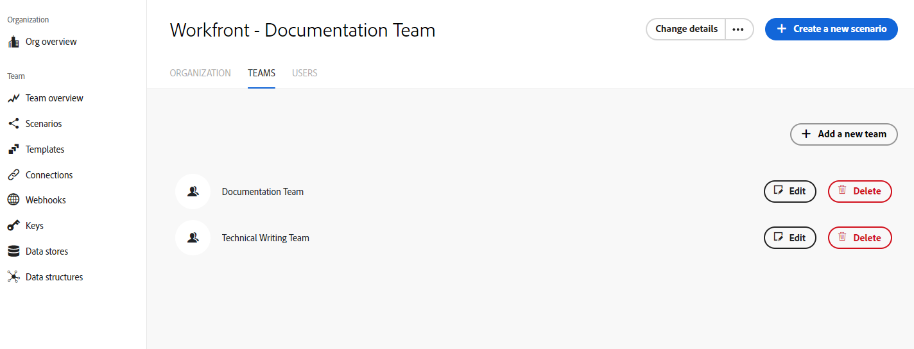

# [!DNL Adobe Workfront Fusion] organizations and teams

[!DNL Adobe Workfront Fusion]'s Organization and Teams features make it possible for enterprises to control access to scenarios and other features within Fusion.

## Access requirements

You must have the following access to use the functionality in this article:

<table style="table-layout:auto"> 
 <col> 
 <col> 
 <tbody> 
  <tr> 
    <td role="rowheader">[!DNL Adobe Workfront] plan*</td> 
   <td> 
[!DNL Pro] or higher
 </td> 
  </tr> 
  <tr> 
   <td role="rowheader">[!UICONTROL Adobe Workfront Fusion] license**</td> 
   <td>
   
Current license requirement: No [!DNL Workfront Fusion] license requirement.

   
Or

   
Legacy license requirement: [!UICONTROL [!DNL Workfront Fusion] for Work Automation and Integration],  [!UICONTROL [!DNL Workfront Fusion] for Work Automation]

   </td> 
  </tr> 
  <tr> 
   <td role="rowheader">Product</td> 
   <td>
   
Current product requirement: If you have the [!UICONTROL Select] or [!UICONTROL Prime] [!DNL Adobe Workfront] Plan, your organization must purchase [!DNL Adobe Workfront Fusion] as well as [!DNL Adobe Workfront] to use functionality described in this article. [!DNL Workfront Fusion] is included in the [!UICONTROL Ultimate] [!DNL Workfront] plan.

   
Or

   
Legacy product requirement: Your organization must purchase [!DNL Adobe Workfront Fusion] as well as [!DNL Adobe Workfront] to use functionality described in this article.

   </td> 
  </tr> 
  <tr data-mc-conditions=""> 
   <td role="rowheader">Access level configurations*</td> 
   <td> 
     
You must be a [!DNL Workfront Fusion] administrator for your organization.

     
You must be a [!DNL Workfront Fusion] administrator for your team.

   </td> 
  </tr> 
 </tbody> 
</table>

To find out what plan, license type, or access you have, contact your [!DNL Workfront] administrator.

**For information on [!DNL Adobe Workfront Fusion] licenses, see <a href="../../workfront-fusion/get-started/license-automation-vs-integration.md" class="MCXref xref">[!DNL Adobe Workfront Fusion] licenses</a>

## Organizations

[!DNL Workfront Fusion] users belong to an organization.

* [Organization roles](#organization-roles)
* [Inviting users to an organization](#inviting-users-to-an-organization)
* [Switch between organizations](#switch-between-organizations)

### Organization roles

A user has one of the following roles in an organization:

* **[!UICONTROL Owner]**: The owner has all permissions available in the organization.
* **[!UICONTROL Admin]**: The admin role enables a user to create and manage teams and users for the organization.
* **[!UICONTROL Member]**: Members are able to use [!DNL Workfront Fusion] but unable to make organizational changes.
* **[!UICONTROL Accountant]**: An accountant role only allows users to see license information on the organization dashboard.
* **[!UICONTROL App Developer]**: Functionality for this role is currently unavailable, and will be made available in the near future. We do not recommend assigning users to this role at this time.

For information on specific actions available to users in each organization role, see [Organization and team roles](/help/quicksilver/workfront-fusion/organizations/organization-roles.md).

### Inviting users to an organization

By default, an organization owner (or authorized user) can invite another person to join their organization.

To invite a user to join an organization:

1. Click **[!UICONTROL Change details]** in the upper-right corner of the screen.
1. Select **[!UICONTROL Invite a new user]**.

   

1. Fill in the user's email address and name.
1. Select a role for the user. For more information on roles, see [Organization roles](#organization-roles) in this document.
1. (Optional) Add a note. This note appears in the invitation email that the user receives.
1. Click **[!UICONTROL Save]**.

[!DNL Fusion] sends an email with an invitation to the specific organization and an [!UICONTROL Accept The Role] button.

When the recipient clicks the button, they are redirected to the invitation page, where they can accept the invitation.

The invitation will expire in a day.

>[!NOTE]
>
>If the user is new to [!DNL Fusion], [!DNL Fusion] automatically creates an account for them and sends an email with a temporary password, directing the new user to log in and change their password.

### Switch between organizations

You may be part of more than one organization in Fusion. Resources are not shared between organizations.

You can switch organizations within the Adobe Unified Experience by clicking the organization name in the upper-right corner and selecting the new organization from the dropdown. Only organizations that have a Fusion account will appear in the dropdown, even if you are a member of other organizations in Adobe.

## Teams

Teams are groups of users that share access to specific resources. These resources may include:

* Scenarios
* Connections
* Webhooks
* Keys
* Data stores
* Data structures
* Email Notification Settings

>[!NOTE]
>
>Since teams control access to resources, it is sometimes useful for a team to have only one member. For example, users in training may create connections to their individual [!DNL Google] accounts. Any team members would also be able to connect to the individual [!DNL Google] account, so in this case it's best that the user be the only member of a training team.

Organizations may have as many teams as they need, and users may belong to one or more teams.

Users can select their team from the dropdown list in the left navigation panel. Users only see teams that they are members of. Selecting a team will allow a user to access that team's resources.

* [Team roles](#team-roles)
* [Team Management](#team-management)

### Team roles

A user has one of the following roles in each of their teams:

* **[!UICONTROL Team Admin]**: In addition to the capabilities of the other team roles, the Admin role allows the user to add, remove, or change the role of a team member.
* **[!UICONTROL Team Member]**: The team member role allows users to create and execute scenarios.
* **[!UICONTROL Team Monitoring]**: The [!UICONTROL monitoring] role allows users to access execution information for scenarios, but they are unable to design scenarios or change their "Active" status.
* **[!UICONTROL Team Operator]**: The [!UICONTROL operator] role allows users to see execution data and change the "Active" status of scenarios.
* **[!UICONTROL Team Restricted Member]**: Functionality for this role is currently unavailable, and will be made available in the near future. We do not recommend assigning users to this role at this time.

For information on specific actions available to users in each team role, see [Organization and team roles](/help/quicksilver/workfront-fusion/organizations/organization-roles.md).

### Team Management

* [Create a team](#create-a-team)
* [Set Team Notification Options](#set-team-notification-options)

#### Create a team 

Organization owners and administrators are able to create teams.

To create a team:

1. In the left navigation panel, click **[!UICONTROL Organization]**
1. Select the **[!UICONTROL Team]** tab.
1. Click **[!UICONTROL Add a new team]** under the list of teams.
1. Enter a name for the new team, and click **Add**.

#### Set Team Notification Options

>[!NOTE] 
>
>If you access [!DNL Fusion] through the [!DNL Adobe Experience Cloud], your notifications are handled in the [!DNL Experience Cloud] notification center.
>
>For more information, see [Access your notifications](/help/quicksilver/workfront-fusion/fusion-in-admin-console/fusion-unified-experience.md#access-your-notifications) in [[!DNL Adobe Unified Experience] for [!DNL Workfront Fusion]](/help/quicksilver/workfront-fusion/fusion-in-admin-console/fusion-unified-experience.md)

Email notification options are set on the team level.

>[!NOTE]
>
>If your organization has been moved to the Unified Shell, you receive notifications through the Adobe Notifications area. You must use the Unified Shell experience to be able to see notifications in the Adobe Notifications area. 
>
>To use the Unified Shell Experience, including the Adobe Notifications area, click the Try New Fusion UI in Unified Experience button near the top of the page. This button is only available if your organization has moved to the Unified Shell.
>
>For more information on locating notifications in the Unified Shell, see [Access your notifications](/help/quicksilver/workfront-fusion/fusion-in-admin-console/fusion-unified-experience.md#access-your-notifications).

1. In the left navigation panel, click **[!UICONTROL Team]**
1. Select the **[!UICONTROL Notification Options]** tab.
1. Enable the notifications that you want the team to receive.

   <table style="table-layout:auto"> 
    <col> 
    <col> 
    <tbody> 
     <tr> 
      <td role="rowheader">'[!UICONTROL Warning in scenario run]'</td> 
      <td> 
Receive an email when there is a warning in a scenario run
 </td> 
     </tr> 
     <tr> 
      <td role="rowheader">[!UICONTROL Errors in scenario run]</td> 
      <td>Receive an email when there is an error in a scenario run.</td> 
     </tr> 
     <tr> 
      <td role="rowheader"> 
[!UICONTROL Scenario deactivation]
 </td> 
      <td>
Receive an email when a scenario deactivates.

<b>Note:</b> You are notified about scenario deactivation only when the scenario has been automatically deactivated due to errors. You do not receive notifications about scenarios that are deactivated manually.

In some cases, a scenario might be deactivated by the [!DNL Workfront Fusion] engineering team because the scenario is causing performance or other issues. In these cases, you do not receive notifications in [!DNL Workfront Fusion]. 
</td>

</tr>
</tbody>
</table>

Changes to notification options save automatically

#### Switch between teams

You may be part of more than one team in Fusion. Since teams do not share resources, you may need to switch teams to access specific scenarios or other resources.

If your organization is not on the Adobe Unified Experience, you can switch teams by clicking the team name in the left navigation, then selecting a team from the dropdown.

If your team is on the Adobe Unified Experience, you can select a new team by clicking on the team name in the header, then selecting a team from the dropdown. This option is available from all pages that are specific to a certain team, such as a scenario page or the Connections page.

<!--

  

-->