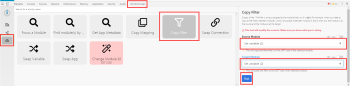

# Add a filter to a scenario in [!DNL Adobe Workfront Fusion]

In some scenarios, you need to work only with bundles that meet specific criteria. Filters allow you to select those bundles.

<!--

For example, you could create a scenario with the [!UICONTROL Watch records] trigger for [!DNL Salesforce] to capture only records containing a specific word written by a specific author.

-->

You can add a filter between two modules and check whether bundles received from the preceding modules fulfill specific filter conditions:

* If they do, the bundles pass on to the next module in the scenario.
* If they don't, processing for the bundles terminates.

## Access requirements

You must have the following access to use the functionality in this article:

<table style="table-layout:auto">
 <col> 
 <col> 
 <tbody> 
  <tr> 
    <td role="rowheader">[!DNL Adobe Workfront] plan*</td> 
   <td> 
[!DNL Pro] or higher
 </td> 
  </tr> 
  <tr data-mc-conditions=""> 
   <td role="rowheader">[!DNL Adobe Workfront] license*</td> 
   <td> 
[!UICONTROL Plan], [!UICONTROL Work]
 </td> 
  </tr> 
  <tr> 
   <td role="rowheader">[!UICONTROL Adobe Workfront Fusion] license**</td> 
  <td>
   
Current license requirement: No [!DNL Workfront Fusion] license requirement.

   
Or

   
Legacy license requirement: [!UICONTROL [!DNL Workfront Fusion] for Work Automation and Integration],  [!UICONTROL [!DNL Workfront Fusion] for Work Automation]

   </td>    </tr> 
  </tr> 
  <tr> 
   <td role="rowheader">Product</td> 
   <td>
   
Current product requirement: If you have the [!UICONTROL Select] or [!UICONTROL Prime] [!DNL Adobe Workfront] Plan, your organization must purchase [!DNL Adobe Workfront Fusion] as well as [!DNL Adobe Workfront] to use functionality described in this article. [!DNL Workfront Fusion] is included in the [!UICONTROL Ultimate] [!DNL Workfront] plan.

   
Or

   
Legacy product requirement: Your organization must purchase [!DNL Adobe Workfront Fusion] as well as [!DNL Adobe Workfront] to use functionality described in this article.

   </td> 
  </tr> 
 </tbody> 
</table>

To find out what plan, license type, or access you have, contact your [!DNL Workfront] administrator.

For information on [!DNL Adobe Workfront Fusion] licenses, see [[!DNL Adobe Workfront Fusion] licenses](../../workfront-fusion/get-started/license-automation-vs-integration.md).

## Prerequisites

You must add both modules to a scenario before you can add a filter between them.

## Add a filter between two modules:

1. Click **[!UICONTROL Scenarios]**  in the left panel, then select the scenario to open it.
1. In the upper-right corner of the window, click **[!UICONTROL Edit]**.
1. Click the connecting line between the modules.
1. In the box that displays, type a **[!UICONTROL Label]** for the filter.
1. Define a filter **[!UICONTROL Condition]**.

   You can enter one or two operands in the two boxes. If you enter operands in both boxes, you can select an operator in the drop-down menu between them to specify the relation between them.

   >[!TIP]
   >
   >In the operand fields, you can enter values in the same way as you would map them, as described in [Map information from one module to another in [!DNL Adobe Workfront Fusion]](../../workfront-fusion/mapping/map-information-between-modules.md).

   For example, if you wanted the filter to find files in [!DNL Adobe Workfront] ending with XML and pass them on to [!DNL Dropbox], you would enter **[!UICONTROL File name]** in the first box and .**[!UICONTROL xml]** in the second box. In the drop-down menu between them, you would select **[!UICONTROL Ends with (case insensitive)]**. This filter would apply to incoming bundles from the first module (Workfront). Only bundles containing XML files would pass on to the next module ([!DNL Dropbox]).

   

1. Click **[!DNL OK]**.

## Copy a filter

Currently, the scenario editor doesn't include a feature for copying a filter.

>[!NOTE]
>
>If you copy the modules on either side of the filter, the filter is also copied.
>
>For more information on copying modules, see [Copy modules or scenarios in [!DNL Adobe Workfront Fusion]](../../workfront-fusion/scenarios/copy-modules-or-scenarios.md)

To copy a filter without copying modules, you can use [!DNL Google] Chrome for the following workaround:

1. Install the [!UICONTROL [!DNL Adobe Workfront Fusion] DevTool Chrome] extension.
1. In [!DNL Workfront Fusion], open the scenario.
1. Click the Chrome three-dot menu, then click **[!UICONTROL More tools*]* > **[!UICONTROL Developer tools]**.

1. In the [!UICONTROL Developer tools] panel that displays, on the menu bar across the top, click the [!UICONTROL Workfront Fusion] tab.

   

1. Click the **[!UICONTROL Tools]** icon  in the left side bar.

1. Click **[!UICONTROL Copy Filter]**, then configure the **[!UICONTROL Copy Filter]** tool in the right side panel:

   1. Set the **[!UICONTROL Source Module]** as the module right after the filter you want to copy.
   1. Set the **[!UICONTROL Target Module]** as the module right before the filter you want to copy.

1. Click **[!UICONTROL Run]**.
