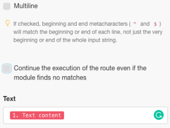
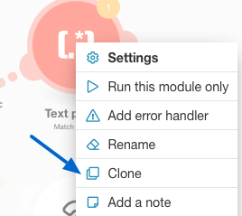
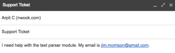
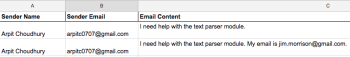

# [!DNL Adobe Workfront Fusion] scenario example: Connect email, [!UICONTROL Text Parser], and [!DNL Google Sheets]

This scenario helps you create a log of all email messages and tag them for further action in a spreadsheet. It captures an email body in two separate tables in a spreadsheet using Regular Expressions (Regex) as search patterns. The first pattern searches for a phrase and the second searches for the same phrase and an email address.

## Access requirements

You must have the following access to use the functionality in this article:

<table style="table-layout:auto"> 
 <col> 
 <col> 
 <tbody> 
  <tr> 
    <td role="rowheader">[!DNL Adobe Workfront] plan*</td> 
   <td> 
[!DNL Pro] or higher
 </td> 
  </tr> 
  <tr data-mc-conditions=""> 
   <td role="rowheader">[!DNL Adobe Workfront] license*</td> 
   <td> 
[!UICONTROL Plan], [!UICONTROL Work]
 </td> 
  </tr> 
  <tr> 
   <td role="rowheader">[!UICONTROL Adobe Workfront Fusion] license**</td> 
   <td>
   
Current license requirement: No [!DNL Workfront Fusion] license requirement.

   
Or

   
Legacy license requirement: [!UICONTROL [!DNL Workfront Fusion] for Work Automation and Integration] 

   </td> 
  </tr> 
  <tr> 
   <td role="rowheader">Product</td> 
   <td>
   
Current product requirement: If you have the [!UICONTROL Select] or [!UICONTROL Prime] [!DNL Adobe Workfront] Plan, your organization must purchase [!DNL Adobe Workfront Fusion] as well as [!DNL Adobe Workfront] to use functionality described in this article. [!DNL Workfront Fusion] is included in the [!UICONTROL Ultimate] [!DNL Workfront] plan.

   
Or

   
Legacy product requirement: Your organization must purchase [!DNL Adobe Workfront Fusion] as well as [!DNL Adobe Workfront] to use functionality described in this article.

   </td> 
  </tr> 
 </tbody> 
</table>

To find out what plan, license type, or access you have, contact your [!DNL Workfront] administrator.

For information on [!DNL Adobe Workfront Fusion] licenses, see [[!DNL Adobe Workfront Fusion] licenses](../../workfront-fusion/get-started/license-automation-vs-integration.md).

## Prerequisites

This tutorial requires basic knowledge of regular expressions. To learn about Regex, visit [https://regexone.com](https://regexone.com/).

Add the first module and configure it

1. Search for Email and choose **[!UICONTROL Watch emails]** as the Trigger.

   >[!NOTE]
   >
   >While you can connect a [!DNL Google] account using the E[!UICONTROL ]mail module, you can also use a [!DNL Gmail] module.

1. Connect either a [!DNL Google] account or any other IMAP based email client (such as [!DNL Outlook]).
1. Once connected, select a Folder whose incoming emails you want to watch, such as [!UICONTROL Inbox].
1. Under [!UICONTROL Criteria], choose **[!UICONTROL All email]** (or narrow it down to read or unread emails).

   You can also choose to mark fetched emails as read or unread.

1. Set the [!UICONTROL Maximum number of results] to 1.

   

   You can change this based on the volume of messages you receive. However, it's recommended to set a low value and run the scenario more often.

1. Click **[!UICONTROL Show advanced settings]** at the bottom.

   

1. Filter emails by the [!UICONTROL Sender address], [!UICONTROL Subject] and [!UICONTROL Phrase].

   This gives you the ability to watch only relevant emails. In this example, we have added only a Subject filter and left the other 2 blank.

   >[!NOTE]
   >
   >We will add a router to look for phrases in an email using the [!UICONTROL Match Pattern] iterator and a Regular Expression (Regex) as a search pattern. This also enables us to build a multi-utility scenario.

1. Once the configuration is done, and you are prompted to specify where to start watching your emails, click **[!DNL From now on]**.

   

1. Continue to [Search for [!UICONTROL Flow Control] and add a [!UICONTROL Router]](#search-for-flow-control-and-add-a-router)

## Search for [!UICONTROL Flow Control] and add a [!UICONTROL Router] 

1. Add a router after any module to split or duplicate the data before sending it to the next module.

   Here, we have used a [!UICONTROL Router] to send the Email body text to 2 separate tables in a [!DNL Google Sheet].

   

## Use the [!UICONTROL Text Parser] Module

1. Add a [!UICONTROL Match Pattern] transformer to search for a phrase in an email.

   We will search for the phrase "[!UICONTROL text parser module]" in all incoming emails to capture the body text and sender's name of the ones that match that phrase.

   1. Write the Pattern as a Regular Expression:

      text\sparser\smodule

   1. (Optional) Use any of the other Pattern options.

      

      Multiline is useful if your text contains several lines and you need to search for the pattern in each line. For this tutorial we need to search for the pattern in the entire email body text, hence we will leave it unchecked.

   1. In the [!UICONTROL Text] field, click the attribute **Text content** in the list.

      

      This is the attribute that stores the text from the email body in which we will search for the pattern.

1. Add another [!UICONTROL Match Pattern] that searches for the same phrase and an email address.

   This is particularly useful if you have customer accounts with multiple users. To save time, you can clone the [!UICONTROL Text Parser] module you just created and link it to the Router.

   

1. Edit the pattern as follows:

   text\sparser\smodule.+\s([\w.-]+@[\w.-]+)

   

   This pattern searches for the phrase "[!UICONTROL text parser module]" and an email address like john.doe@gmail.com and returns only the email address.

   >[!NOTE]
   >
   >It's important to write your regex in accordance with the specification of the email addresses you accept, but the one above takes care of most standard email addresses.

   * If you'd like to search only for email address, you can use the regex below:

      ([\w.-]+@[\w.-]+)

   * You may also search only for phone numbers using the regex below:

      ^[+]?\(?(\d{1,3})\)?[\s-]?\(?(\d{3})\)?[\s-]?\d{3}[\s-]?\d{3,4}
   The above pattern covers most common formats in which a phone number is written.

   To test your patterns, we recommend using [[!DNL https://regex101.com]](https://regex101.com/) with [!DNL javascript] as the Flavor.

   The rest of the configuration remains the same as the one before.

## Add the [!DNL Google Sheets] modules

 For [!DNL Sheets], we need to first create a spreadsheet with the requisite headers.

1. Create a spreadsheet with the columns under which you'd like to capture the user data. (Feel free to use an existing file too).

   For example, create one called "Email Data: Support Ticket" with Sender Name, Sender Email and Email Content as columns. Name the worksheet "contains: text parser module."

1. Add the [!UICONTROL Google Sheets] module with **[!UICONTROL Add a row]** as the action.

   

1. Connect your [!DNL Google] account (if you haven't already). Choose the File you created earlier, followed by choosing the Worksheet in which you're capturing the data.

   Your setup should look like this:

   

1. Map the attributes in the relevant fields (columns) to finish the module setup.

   

1. Clone the module you just created and link it to the second [!UICONTROL Text Parser] module.

   1. Go to your Spreadsheet, duplicate the worksheet you created earlier and give it a name.

      For example, name it "contains: text parser module and email."

   1. Add another column to store the email address that the email body contains.

      For example, name it "Email Address Shared."

   1. Click the cloned [!DNL Google Sheets] module to configure the setup.
   1. Change the worksheet to the new one you just created.
   1. Map the output from the [!UICONTROL Match Pattern] module ($1) to the column where you want to store the email address (Email Address Shared).

      

      

   1. Click **[!UICONTROL OK]**, save the scenario, and take it for a test run.

      You will need to send two separate emails to the connected email address as follows:

      * Containing the phrase "[!UICONTROL text parser module]" (and no email address)

         

      * Containing the above phrase and an email address

         

         If there are no errors in your setup, you will see that the first worksheet captures all emails containing the phrase "[!UICONTROL text parser module]" while the second worksheet captures only those that contain the phrase "[!UICONTROL text parser module]" and an email address. You may refer to the screenshots below.

         Worksheet 1:

         

         Worksheet 2:

         

## Resources

* [Free exercises](https://regexone.com/) to learn about Regular Expressions
* [Learn about Phone Number Matching](https://regexone.com/problem/matching_phone_numbers) using Regex
* [Learn about Email Matching](https://regexone.com/problem/matching_emails) using Regex
* [Test your Regular Expressions](https://regex101.com/)
