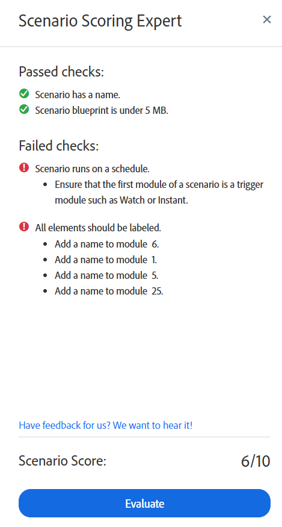

# Run the Scenario Scoring Expert in Adobe Workfront Fusion

The Scenario Scoring Expert can help you ensure that your scenario is configured in a way that follows best practices. It checks your scenario and gives recommendations for its structure and organization.

## Access requirements

You must have the following access to use the functionality in this article:

<table style="table-layout:auto">  
 <col> 
 <col> 
 <tbody> 
  <tr> 
    <td role="rowheader">[!DNL Adobe Workfront] plan*</td> 
   <td> 
[!DNL Pro] or higher
 </td> 
  </tr> 
  <tr data-mc-conditions=""> 
   <td role="rowheader">[!DNL Adobe Workfront] license*</td> 
   <td> 
[!UICONTROL Plan], [!UICONTROL Work]
 </td> 
  </tr> 
  <tr> 
   <td role="rowheader">[!UICONTROL Adobe Workfront Fusion] license**</td> 
  <td> 
[!UICONTROL [!DNL Workfront Fusion] for Work Automation and Integration] 

[!UICONTROL [!DNL Workfront Fusion] for Work Automation] 
  </td>    </tr> 
  </tr> 
  <tr> 
   <td role="rowheader">Product</td> 
   <td>Your organization must purchase [!DNL Adobe Workfront Fusion] as well as [!DNL Adobe Workfront] to use functionality described in this article.</td> 
  </tr> 
 </tbody> 
</table>

To find out what plan, license type, or access you have, contact your [!DNL Workfront] administrator.

For information on [!DNL Adobe Workfront Fusion] licenses, see [[!DNL Adobe Workfront Fusion] licenses](../../workfront-fusion/get-started/license-automation-vs-integration.md).

Run the Scenario Scoring Expert

1. Click the **[!UICONTROL Scenario]** tab in the left panel.
1. Select the scenario where you want to run the Scenario Scoring Expert.
1. Click anywhere on the scenario to enter the Scenario editor.
1. Click the Scenario Scoring Expert icon  near the bottom of the screen.

   The Scenario Scoring Expert panel opens.
1. Click **Evaluate**.

The Scenario Scoring Expert returns a score out of 10, and shows which checks have passed or failed. If a check has failed, the Scenario Scoring Expert gives recommendations for how to ensure that the scenario meets these checks.

