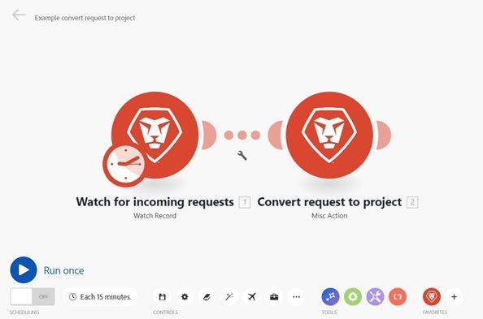

# The scenario editor in [!DNL Adobe Workfront Fusion]

The scenario editor allows you to create and edit scenarios in a visual interface.

## Access requirements

You must have the following access to use the functionality in this article:

<table style="table-layout:auto"> 
 <col> 
 <col> 
 <tbody> 
  <tr> 
    <td role="rowheader">[!DNL Adobe Workfront] plan*</td> 
   <td> 
[!DNL Pro] or higher
 </td> 
  </tr> 
  <tr data-mc-conditions=""> 
   <td role="rowheader">[!DNL Adobe Workfront] license*</td> 
   <td> 
[!UICONTROL Plan], [!UICONTROL Work]
 </td> 
  </tr> 
  <tr> 
   <td role="rowheader">[!UICONTROL Adobe Workfront Fusion] license**</td> 
   <td>
   
Current license requirement: No [!DNL Workfront Fusion] license requirement.

   
Or

   
Legacy license requirement: [!UICONTROL [!DNL Workfront Fusion] for Work Automation and Integration] 

   </td> 
  </tr> 
  <tr> 
   <td role="rowheader">Product</td> 
   <td>
   
Current product requirement: If you have the [!UICONTROL Select] or [!UICONTROL Prime] [!DNL Adobe Workfront] Plan, your organization must purchase [!DNL Adobe Workfront Fusion] as well as [!DNL Adobe Workfront] to use functionality described in this article. [!DNL Workfront Fusion] is included in the [!UICONTROL Ultimate] [!DNL Workfront] plan.

   
Or

   
Legacy product requirement: Your organization must purchase [!DNL Adobe Workfront Fusion] as well as [!DNL Adobe Workfront] to use functionality described in this article.

   </td> 
  </tr> 
 </tbody> 
</table>

To find out what plan, license type, or access you have, contact your [!DNL Workfront] administrator.

For information on [!DNL Adobe Workfront Fusion] licenses, see [[!DNL Adobe Workfront Fusion] licenses](../../workfront-fusion/get-started/license-automation-vs-integration.md).

## Open the scenario editor:

1. Click **[!UICONTROL Scenarios]**  in the left panel.

1. If you want to create a scenario, click **[!UICONTROL Create a new scenario]** in the upper-right corner of the page.

   Or

   If you want to edit an existing scenario, click the scenario.

   In the scenario editor that displays, you can do everything listed in the table below. For more information, see [Create a scenario in [!DNL Adobe Workfront Fusion]](../../workfront-fusion/scenarios/create-a-scenario.md).

1. When you finish editing a scenario (or at any time while you are editing), click the [!UICONTROL Save] icon. 

   >[!NOTE]
   >
   >After saving your scenario, a new version will be available under the three-dot menu in case you need to access it in the future. Previously saved scenario versions are only available for 60 days.

## Available scenario editor actions

The following actions are available in the Scenario editor:

<table style="table-layout:auto"> 
<tbody>
  <tr>
     <td role="rowheader">Add the first module</td>
     <td> 
Click the question mark icon. 
 
 Then find and click the app or service that you want to start with. If you selected any apps in step 2, they appear here for easy access (and in the <strong>[!UICONTROL Favorites]</strong> section at the bottom of the screen).
 </td>
  </tr>
  <tr>
     <td role="rowheader">Add a module</td>
     <td>Hover over a module, click the plus icon that appears to the right, then click the module you want in the menu that appears.</td>
  </tr>  
  <tr>   
     <td role="rowheader">Specify when and how often the scenario will execute</td>  
      <td> 
Click the clock icon. 
 
  
 
For more information, see <a href="../../workfront-fusion/scenarios/schedule-a-scenario.md" class="MCXref xref">Schedule a scenario in [!DNL Adobe Workfront Fusion]</a>.
 </td>
  </tr>  
  <tr>
     <td role="rowheader">Set up a route</td>   
     <td> 
Click the [!UICONTROL wrench] icon  between the two modules and use any of the following options:
    
       <ul>
         <li><strong>[!UICONTROL Set up a filter]</strong>: Control which bundles are used at certain points in the scenario. For more information, see <a href="../../workfront-fusion/scenarios/add-a-filter-to-a-scenario.md" class="MCXref xref">Add a filter to a scenario in [!DNL Adobe Workfront Fusion]</a>.</li>     
         <li><strong>[!UICONTROL Unlink]</strong>: Removes a route.</li>     
         <li><strong>[!UICONTROL Add a router]</strong>: Adds a router between modules. </li>     
         <li><strong>[!UICONTROL Add a module]</strong>: Adds a new module between modules.</li>     
         <li><strong>[!UICONTROL Add a note]</strong>: Adds a note to the route.</li>   
       </ul> 
     </td>  
  </tr>  
  <tr>  
     <td role="rowheader">Remove a module</td>   
     <td>Right-click the module, then click <strong>[!UICONTROL Delete module]</strong>.</td>  
   </tr>  
   <tr> 
     <td role="rowheader">View a log of events that occurs is a scenario</td>     
     <td> 
       
Run a scenario. When the scenario finishes running, the log appears in the lower-right corner of the [!UICONTROL Scenario Editor]. 
 
  
 
Depending on the scenario, the log can contain information about the difficulty of each phase and any errors encountered during the execution of the scenario.
 
     </td>  
   </tr>  
   <tr>   
     <td role="rowheader">Configure the scenario settings</td>   
     <td>Click the [!UICONTROL Scenario settings] icon.  These settings are intended primarily for advanced users.</td>  
   </tr>  
   <tr>   
     <td role="rowheader">Type or view notes about the scenario</td>   
     <td>Click the [!UICONTROL Notes] icon. </td>  
   </tr>  
   <tr> 
     <td role="rowheader">Auto-align the layout of the modules </td>   
     <td>Click the [!UICONTROL Auto-align] icon. </td>  </tr>  <tr>   <td role="rowheader">View an animation showing how data flows through the scenario</td>   <td>Click the [!UICONTROL Explain Flow] icon. </td>  
   </tr>  
   <tr> 
     <td role="rowheader">Export the scenario to your computer as a blueprint</td>   
     <td>Click the [!UICONTROL More] menu , then click [!UICONTROL Export Blueprint].</td>  
   </tr>  
   <tr>   
     <td role="rowheader">Import a scenario blueprint from your computer</td>   
     <td>Click the [!UICONTROL More] menu , then click [!UICONTROL Import Blueprint].</td>  
   </tr>  
   <tr>   
     <td role="rowheader">Restore a previous version of the scenario</td>   
     <td>See the article <a href="../../workfront-fusion/scenarios/restore-a-scenario-version.md" class="MCXref xref">Restore a scenario version in [!DNL Adobe Workfront Fusion]</a>.</td>  
   </tr>  
   <tr> 
     <td role="rowheader">Configure [!UICONTROL Flow Control] settings</td>   
     <td> 
Click the [!UICONTROL Flow Control] icon.  You can set a task to repeat a given number of times, convert an array into a series of bundles, and merge several bundles into one single bundle. For more information, see <a href="../../workfront-fusion/apps-and-their-modules/flow-control.md" class="MCXref xref">Flow control in [!DNL Adobe Workfront Fusion]</a>.
 </td>  
   </tr>  
   <tr> 
     <td role="rowheader">Enhance the scenario using advanced tools</td>   
     <td>Click the [!UICONTROL Tools] icon.  You can create triggers, actions, aggregators, and transformers. For more information, see <a href="../../workfront-fusion/apps-and-their-modules/tools-modules.md" class="MCXref xref">Tools</a>.</td>  
   </tr>  
   <tr> 
     <td role="rowheader">Use text parsing tools</td>   
     <td>Click the [!UICONTROL Text parser] icon.  You can retrieve elements from HTML code, find and extract string elements matching a search pattern, search and replace text, and "scrape" data from a website. For more information, see <a href="../../workfront-fusion/apps-and-their-modules/tools-modules.md" class="MCXref xref">Tools</a>.</td>  
   </tr>  
   <tr> 
     <td role="rowheader">Access your most commonly used apps and services</td>   
     <td> Click an icon in the <strong>[!UICONTROL Favorites]</strong> section at the bottom of the screen. Icons display in this section automatically as you add apps and services to your scenario. You can also click the Add icon  to add apps and services to this area manually.</td>  
   </tr>  
   <tr> 
     <td role="rowheader">Test-run the scenario</td>   
     <td>Click <strong>[!UICONTROL Run once]</strong> to verify that the scenario runs as you expect before you activate it. Once activated, the scenario will execute according to its schedule. If everything does not run as expected, you can visit our error handling section to learn how to handle errors.</td> 
   </tr> 
   <tr> 
     <td role="rowheader">Use the Devtool to debug the scenario</td>   
     <td>For information, see For more information, see <a href="../../workfront-fusion/scenarios/debug-scenarios-with-dev-tool.md" class="MCXref xref">Debug scenarios with the [!DNL Adobe Workfront Fusion] Devtool</a>.
</td> 
   </tr> 
<tr>
<td>Check the scenario's status</td>
<td>Scenarios can be active or inactive. You can change the scenario status by clicking the On/Off button in the scenario detail.

See the following articles for more information:
<ul>
<li><a href="../../workfront-fusion/scenarios/activate-or-inactivate-scenario.md">Activate or deactivate a scenario in Adobe Workfront Fusion</a></li>
<li><a href="../../workfront-fusion/scenarios/scenario-detail.md">Scenario details in Adobe Workfront Fusion</a></li>
</ul>
</td>
</tr>
<tr>
<td>Change the scenario's schedule</td>
<td>Active scenarios are executed according to a schedule. By default, a scenario runs every 15 minutes. You can change this by defining when and how often an activated scenario runs. Fusion scenarios can be scheduled to run as often as every 5 minutes.

For more information see <a href="../../workfront-fusion/scenarios/schedule-a-scenario.md">Schedule a scenario in Adobe Workfront Fusion</a>.
</td>
</tr>
<tr>
<td>Rename the scenario</td>
<td>To rename a scenario, open the scenario, click on the scenario's name in the top left corner and edit it. Press Enter or click outside the edited field to save the scenario name.</td>
</tr>
<tr>
<td>Select the first bundle</td>
<td>Some trigger modules allow you to select the first bundle from which you want the retrieving of bundles to start.

For more information, see <a href="../../workfront-fusion/modules/choose-where-trigger-module-starts.md">Choose where a trigger module starts in Adobe Workfront Fusion</a>.</td>
</tr>
<tr>
<td>Set the number of returned bundles</td>
<td>Modules, by default, always return two bundles only. This can be changed in the module settings in the field [!UICONTROL Maximum number of returned bundles].</td>
</tr>
<tr>
<td>Configure advanced scenario settings</td>
<td>[!DNL Adobe Workfront Fusion] gives you the possibility to configure a number of other advanced settings.

For more information, see <a href="../../workfront-fusion/scenarios/scenario-settings-panel.md">The scenario settings panel in Adobe Workfront Fusion</a>.</td>
</tr>
</tbody>
</table>
