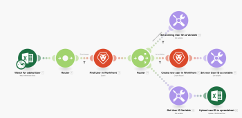

# [!DNL Adobe Workfront Fusion] scenario overview

>[!NOTE]
>
>[!DNL Adobe Workfront Fusion] requires an [!DNL Adobe Workfront Fusion] license in addition to an [!DNL Adobe Workfront license].

>[!IMPORTANT]
>
>[!DNL Workfront Fusion] scenarios should not be confused with [!DNL Workfront Scenario Planner] scenarios. For information about [!DNL Workfront Scenario Planner] scenarios, see [The [!DNL Scenario Planner] overview](../../scenario-planner/scenario-planner-overview.md).

The role of [!DNL Adobe Workfront Fusion] is to automate your processes so that you can concentrate on new tasks rather than repeating the same tasks again and again. It works by linking actions within and between apps and services to create a scenario that transfers and transforms your data automatically. The scenario you create watches for data in an app or service and processes that data to provide the result you want.

A scenario is comprised of a series of modules that indicate how data should be transformed within an app or transferred between apps and web services.

## Example: Automating processes within [!DNL Adobe Workfront]

>[!NOTE]
>
>This functionality is available for the following licenses:
>
>* [!UICONTROL [!DNL Workfront Fusion] for Work Automation] 
>* [!UICONTROL [!DNL Workfront Fusion] for Work Automation and Integration]

[!DNL Workfront Fusion] enables you to automate simple or complex workflows within [!DNL Workfront], saving time and ensuring that the process is executed consistently.

In this example, the scenario triggers when a specified field changes in a Task or Issue in [!DNL Workfront]. When triggered, the scenario gets information in the related project and creates a tailored update for a person assigned to a specific role on the project.

## Example: Connecting [!DNL Workfront] to another app or web service

>[!NOTE]
>
>This functionality is available for the following license:
>
>* [!UICONTROL [!DNL Workfront Fusion] for Work Automation and Integration] 
>

[!DNL Workfront Fusion] can also connect to other apps and web services. You can access, import, manipulate, or export data from other applications, integrating them with Workfront or with each other. Many applications have dedicated [!DNL Workfront Fusion] connectors. If there is no dedicated connector for the application you want to access, you can use [!DNL Workfront Fusion]'s [!UICONTROL HTTP] or [!UICONTROL SOAP] modules to connect to the application through its API.

In this example, the scenario triggers when a user is added to an [!DNL Excel] spreadsheet. The scenario checks whether the user is in [!DNL Workfront]. If not, the scenario creates the user in [!DNL Workfront] and adds their Workfront user ID back to the spreadsheet.

For a list of dedicated connectors, see [Apps and their modules](../../workfront-fusion/apps-and-their-modules/apps-and-their-modules.md).

>[!IMPORTANT]
>
>[!DNL Adobe Workfront Fusion] can connect to almost any web service. If the app you want to work with does not have a dedicated [!DNL Workfront Fusion] connector, you can use the following modules to connect directly to the web service:
>
>* [[!UICONTROL HTTP] modules](../../workfront-fusion/apps-and-their-modules/http-modules/http-modules-1.md) 
>* [[!UICONTROL SOAP] module](../../workfront-fusion/apps-and-their-modules/soap-module.md) 
>* [[!UICONTROL JSON] modules](../../workfront-fusion/apps-and-their-modules/json-modules.md) 
>
