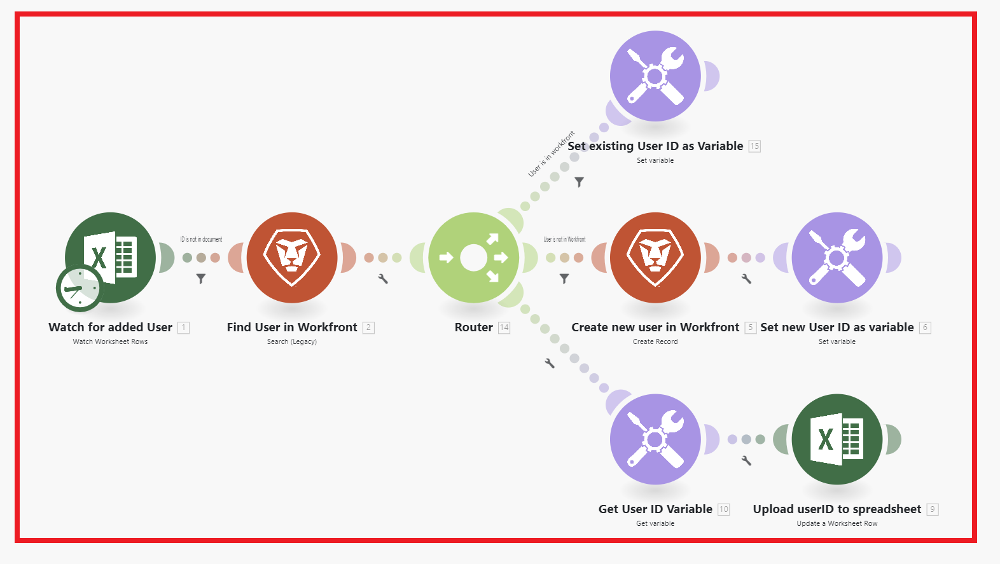
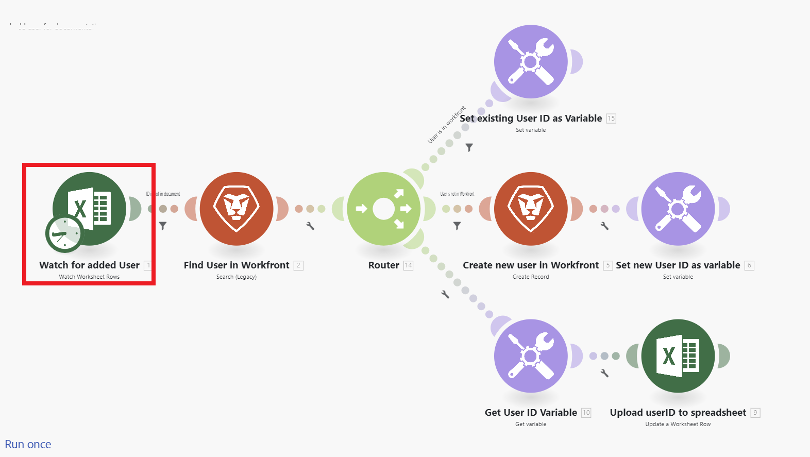
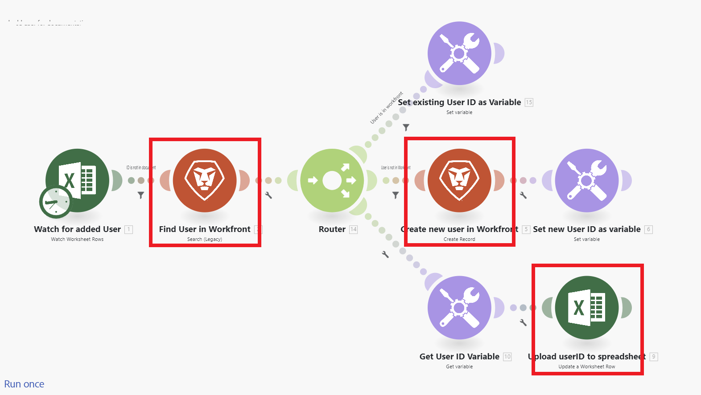
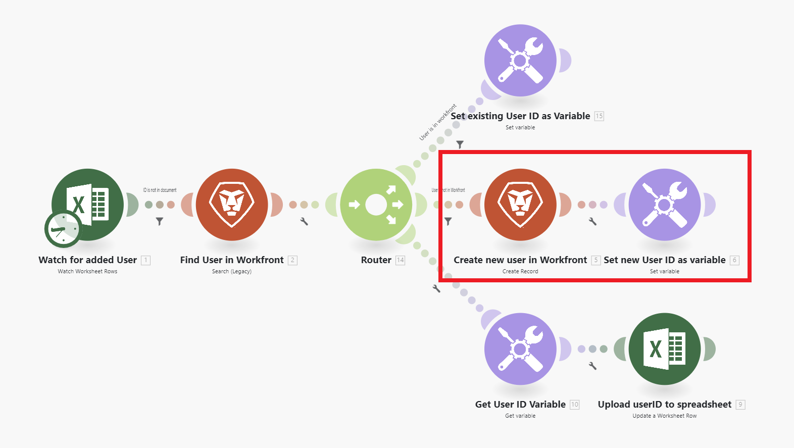
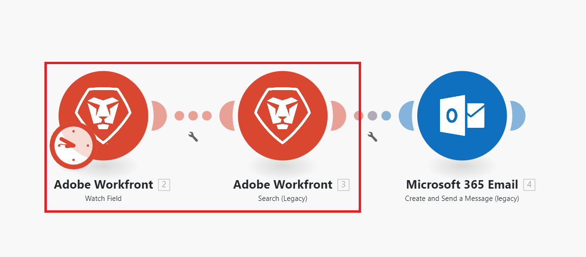
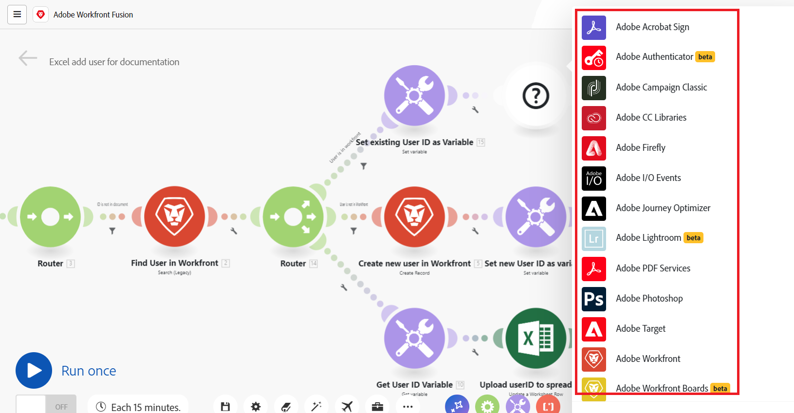

# [!DNL Adobe Workfront Fusion] scenario overview

>[!IMPORTANT]
>
>The Adobe Workfront Fusion documentation has moved to a new location. 
>
>The information in this article can now be found in the article:
>
>* [Scenario overview](https://experienceleague.adobe.com/docs/workfront-fusion/using/get-started-with-fusion/understand-workfront-fusion/scenario-overview.html)
>
>Please update any bookmarks.
>
>This article is no longer being updated, and will be removed in the near future.

>[!NOTE]
>
>[!DNL Adobe Workfront Fusion] requires an [!DNL Adobe Workfront Fusion] license in addition to an [!DNL Adobe Workfront license].

>[!IMPORTANT]
>
>[!DNL Workfront Fusion] scenarios should not be confused with [!DNL Workfront Scenario Planner] scenarios. For information about [!DNL Workfront Scenario Planner] scenarios, see [The [!DNL Scenario Planner] overview](../../scenario-planner/scenario-planner-overview.md).

The role of [!DNL Adobe Workfront Fusion] is to automate your processes so that you can concentrate on new tasks rather than repeating the same tasks again and again. It works by linking actions within and between apps and services to create a scenario that transfers and transforms your data automatically. The scenario you create watches for data in an app or service and processes that data to provide the result you want.

A scenario is comprised of a series of modules that indicate how data should be transformed within an app or transferred between apps and web services.

## Scenario elements overview

A scenario is built of different elements. Understanding the terminology of those elements makes it easier to use the documentation.

### Scenario

A **scenario** is a user-created series of automated steps, created to move and manipulate data. The term "scenario" refers to the entire group of connected steps.

### Trigger

A scenario begins with a **trigger**. The trigger watches for new and updated data, and starts the scenario when certain conditions configured in the module apply. Triggers can be configured to start a scenario on a schedule (polling), or whenever data changes occur (instant). 

### Module

The trigger is followed by a number of **modules**. A module represents single step in a scenario that performs a specific action. Modules are configured and chained together to create scenarios.

### Route

A scenario may be divided into **routes**. A route is a section of the scenario that may or may not be used for a given bundle of data. Routes are set up using a router module and filters.

### Scenario segment

A scenario segment is a section of a scenario that consists of a series of contiguous modules that all connect to the same application. Scenario segments often represent a short workflow in the application.

### Connector

A connector is the set of modules for a given application. Workfront Fusion offers connectors to many common work applications, such as Workfront, Salesforce, and Jira, as well as generic connectors that can be used for any web service.

## Example: Automating processes within [!DNL Adobe Workfront]

>[!NOTE]
>
>This functionality is available for the following licenses:
>
>* [!UICONTROL [!DNL Workfront Fusion] for Work Automation] 
>* [!UICONTROL [!DNL Workfront Fusion] for Work Automation and Integration]

[!DNL Workfront Fusion] enables you to automate simple or complex workflows within [!DNL Workfront], saving time and ensuring that the process is executed consistently.

In this example, the scenario triggers when a specified field changes in a Task or Issue in [!DNL Workfront]. When triggered, the scenario gets information in the related project and creates a tailored update for a person assigned to a specific role on the project.

## Example: Connecting [!DNL Workfront] to another app or web service

>[!NOTE]
>
>This functionality is available for the following license:
>
>* [!UICONTROL [!DNL Workfront Fusion] for Work Automation and Integration] 
>

[!DNL Workfront Fusion] can also connect to other apps and web services. You can access, import, manipulate, or export data from other applications, integrating them with Workfront or with each other. Many applications have dedicated [!DNL Workfront Fusion] connectors. If there is no dedicated connector for the application you want to access, you can use [!DNL Workfront Fusion]'s [!UICONTROL HTTP] or [!UICONTROL SOAP] modules to connect to the application through its API.

In this example, the scenario triggers when a user is added to an [!DNL Excel] spreadsheet. The scenario checks whether the user is in [!DNL Workfront]. If not, the scenario creates the user in [!DNL Workfront] and adds their Workfront user ID back to the spreadsheet.

For a list of dedicated connectors, see [Apps and their modules](../../workfront-fusion/apps-and-their-modules/apps-and-their-modules.md).

>[!IMPORTANT]
>
>[!DNL Adobe Workfront Fusion] can connect to almost any web service. If the app you want to work with does not have a dedicated [!DNL Workfront Fusion] connector, you can use the following modules to connect directly to the web service:
>
>* [[!UICONTROL HTTP] modules](../../workfront-fusion/apps-and-their-modules/http-modules/http-modules-1.md) 
>* [[!UICONTROL SOAP] module](../../workfront-fusion/apps-and-their-modules/soap-module.md) 
>* [[!UICONTROL JSON] modules](../../workfront-fusion/apps-and-their-modules/json-modules.md) 
>
